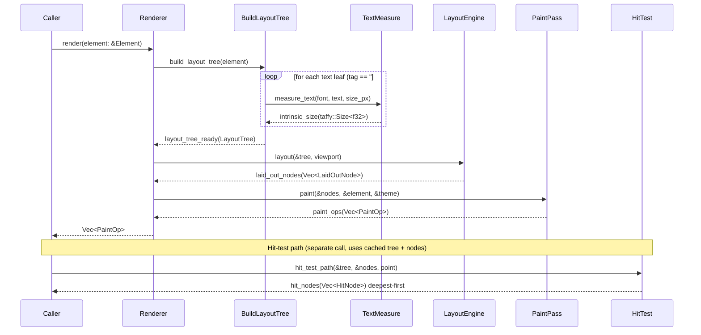
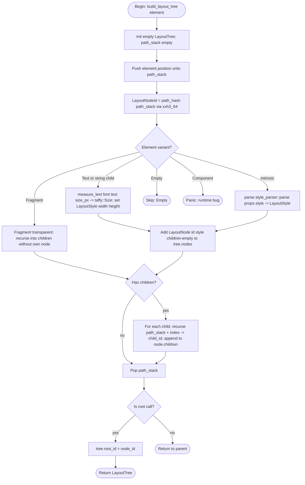

## Type Hierarchy

```mermaid
---
id: layout-bridge-type-graph
refs:
  - $ref: "layout-runtime#LayoutTree"
  - $ref: "layout-runtime#LaidOutNode"
  - $ref: "layout-runtime#LayoutNodeId"
  - $ref: "paint-runtime#PaintOp"
  - $ref: "paint-runtime#Theme"
  - $ref: "text-shaping#ShapeFunctions"
  - $ref: "event-pipeline#HitNode"
types:
  Element:
    kind: enum
  Props:
    kind: struct
  LayoutNodeId:
    kind: struct
  LayoutTree:
    kind: struct
  LaidOutNode:
    kind: struct
  Viewport:
    kind: struct
  PaintOp:
    kind: enum
  Theme:
    kind: struct
  HitNode:
    kind: struct
  Point:
    kind: struct
  Renderer:
    kind: struct
  BuildLayoutTreeFn:
    kind: struct
  PaintFn:
    kind: struct
  HitTestPathFn:
    kind: struct
edges:
  - from: Renderer
    to: LayoutTree
    kind: owns
    label: "cached_tree: Option<LayoutTree>"
  - from: Renderer
    to: Viewport
    kind: owns
    label: "viewport"
  - from: Renderer
    to: Theme
    kind: owns
    label: "theme"
  - from: BuildLayoutTreeFn
    to: Element
    kind: references
    label: "element: &Element (in)"
  - from: BuildLayoutTreeFn
    to: LayoutTree
    kind: references
    label: "-> LayoutTree (out)"
  - from: BuildLayoutTreeFn
    to: LayoutNodeId
    kind: references
    label: "assigns stable LayoutNodeId"
  - from: PaintFn
    to: LaidOutNode
    kind: references
    label: "nodes: &[LaidOutNode] (in)"
  - from: PaintFn
    to: Element
    kind: references
    label: "root: &Element (in)"
  - from: PaintFn
    to: Theme
    kind: references
    label: "theme: &Theme (in)"
  - from: PaintFn
    to: PaintOp
    kind: references
    label: "-> Vec<PaintOp> (out)"
  - from: HitTestPathFn
    to: LayoutTree
    kind: references
    label: "tree: &LayoutTree (in)"
  - from: HitTestPathFn
    to: LaidOutNode
    kind: references
    label: "nodes: &[LaidOutNode] (in)"
  - from: HitTestPathFn
    to: Point
    kind: references
    label: "point: Point (in)"
  - from: HitTestPathFn
    to: HitNode
    kind: references
    label: "-> Vec<HitNode> (out)"
  - from: LaidOutNode
    to: LayoutNodeId
    kind: owns
    label: "node_id"
  - from: HitNode
    to: LayoutNodeId
    kind: references
    label: "node_id"
---
classDiagram
    class Element {
      <<enum>>
      Intrinsic~tag,props,children~
      Text~s~
      Fragment~children~
      Component~fn~
      Empty
    }
    class Props {
      style: Option~String~
      class_name: Option~String~
      on_click: Option~EventCallback~
    }
    class LayoutNodeId {
      value: String
    }
    class LayoutTree {
      root_id: LayoutNodeId
      nodes: HashMap~LayoutNodeId LayoutNode~
      dirty_nodes: Vec~LayoutNodeId~
    }
    class LaidOutNode {
      node_id: LayoutNodeId
      rect: Rect
    }
    class Viewport {
      width: f32
      height: f32
      dpr: f32
    }
    class PaintOp {
      <<enum>>
      FillRect
      StrokeRect
      Text
      PushClip
      PopClip
    }
    class Theme {
      bg: Color
      text_color: Color
      default_font: FontSpec
      button_bg: Color
      button_border: BorderSpec
    }
    class HitNode {
      node_id: LayoutNodeId
      layout_index: usize
      on_click: Option~EventCallback~
    }
    class Point {
      x: f32
      y: f32
    }
    class Renderer {
      viewport: Viewport
      theme: Theme
      cached_tree: Option~LayoutTree~
      render(element: &Element) Vec~PaintOp~
    }
    class BuildLayoutTreeFn {
      build_layout_tree(element: &Element) LayoutTree
    }
    class PaintFn {
      paint(nodes: &[LaidOutNode], root: &Element, theme: &Theme) Vec~PaintOp~
    }
    class HitTestPathFn {
      hit_test_path(tree: &LayoutTree, nodes: &[LaidOutNode], point: Point) Vec~HitNode~
    }

    Renderer --> LayoutTree : cached_tree
    Renderer --> Viewport : viewport
    Renderer --> Theme : theme
    BuildLayoutTreeFn --> Element : in
    BuildLayoutTreeFn --> LayoutTree : out
    BuildLayoutTreeFn --> LayoutNodeId : assigns
    PaintFn --> LaidOutNode : in
    PaintFn --> Element : in
    PaintFn --> Theme : in
    PaintFn --> PaintOp : out
    HitTestPathFn --> LayoutTree : in
    HitTestPathFn --> LaidOutNode : in
    HitTestPathFn --> Point : in
    HitTestPathFn --> HitNode : out
    LaidOutNode --> LayoutNodeId : node_id
    HitNode --> LayoutNodeId : node_id
```

<!-- type: dependency lang: mermaid -->


## Render Pipeline Interaction
<!-- type: interaction lang: mermaid -->


## Build Layout Tree Logic
<!-- type: logic lang: mermaid -->


## Bridge Types
<!-- type: schema lang: yaml -->

```yaml
$schema: "https://json-schema.org/draft/2020-12/schema"
$id: jet-wasm-layout-bridge-types
title: "jet-wasm layout bridge public API types"
description: |
  Types and function signatures for the layout bridge adapter layer (R1–R7).
  All functions live in crates/jet-wasm/src/renderer/layout/mod.rs except
  paint() which lives in renderer/mod.rs. The bridge retires the legacy
  LayoutTree / layout() / paint() stack in renderer/mod.rs and replaces
  it with calls into the renderer::layout module.

  LayoutNodeId derivation rule (R2):
    path_stack is a Vec<String> of node positions accumulated during the
    depth-first walk: each Intrinsic/Text element contributes its child
    index as a decimal string. The LayoutNodeId value is the hex-encoded
    xxh3_64 of the UTF-8 bytes of path_stack.join("/"). Example:
      root Intrinsic -> path_stack = [] -> id = xxh3_64("") = "ef46db3751d8e999"
      first child of root -> path_stack = ["0"] -> id = xxh3_64("0")
      second child -> path_stack = ["1"] -> id = xxh3_64("1")
      first child of first child -> path_stack = ["0", "0"] -> id = xxh3_64("0/0")
    Fragment nodes do not push to path_stack (transparent). Text leaf
    inherits its parent's path + its own child index.

  paint() Theme arg (R3):
    Theme remains a separate arg to paint() — it is NOT stored on Element.
    Rationale: Theme is a renderer-global concern; storing it on Element
    would require every JSX element to carry theme state, violating the
    data-first design (paint-runtime.md P2). Renderer::render passes
    &self.theme.

  Open questions documented at the bottom of this schema.

definitions:
  BridgeFunctions:
    $id: "#BridgeFunctions"
    type: object
    description: |
      Public function contracts for the bridge layer. All are
      language-neutral signatures; Rust source is generated from this
      section. impl_mode is hand-written for all (no section-type
      generator exists yet for integration glue).
    properties:
      build_layout_tree:
        type: object
        description: |
          Adapter that walks the Element tree and produces a taffy-ready
          LayoutTree with stable LayoutNodeId values (R2). For text leaves
          (tag == "#text" or string children), calls measure_text to
          derive a fixed width/height LayoutStyle (R6). Passes all other
          elements through style_parser::parse for LayoutStyle (R2).
        required: [params, returns, stability]
        properties:
          params:
            type: array
            items:
              type: object
              required: [name, type]
              properties:
                name: { type: string }
                type: { type: string }
            default:
              - name: element
                type: "&Element"
              - name: font
                type: "&FontFace"
              - name: font_size_px
                type: f32
          returns:
            type: string
            const: "layout::LayoutTree"
          stability:
            type: string
            const: stable-id
            description: |
              Same element at same position in fiber tree always gets the
              same LayoutNodeId across re-renders (R2). Enables dirty-set
              membership to survive re-render without tree diffing.
        additionalProperties: false

      paint:
        type: object
        description: |
          Replaces the legacy paint(tree: &LayoutTree, theme: &Theme).
          Accepts the flat laid-out slice + the original element tree for
          tag/props/style lookup. Emits byte-equivalent PaintOps to the
          legacy path for the trivial-styling baseline (R3). Theme is a
          separate arg — not stored on Element (see schema description).
        required: [params, returns]
        properties:
          params:
            type: array
            items:
              type: object
              required: [name, type]
              properties:
                name: { type: string }
                type: { type: string }
            default:
              - name: nodes
                type: "&[layout::LaidOutNode]"
              - name: root
                type: "&Element"
              - name: theme
                type: "&Theme"
          returns:
            type: string
            const: "Vec<PaintOp>"
        additionalProperties: false

      hit_test_path:
        type: object
        description: |
          Returns the deepest-first hit path for a point against the laid-out
          rects (R4). Walks LaidOutNode rects in reverse order (child-on-top
          z-order), collecting every node whose rect contains point. For each
          hit, looks up the corresponding Element via node_id -> element tree
          walk to attach on_click. Returns Vec<HitNode> deepest first.
          canvas_app.rs lines 168-204 call this signature unchanged (R4).
        required: [params, returns]
        properties:
          params:
            type: array
            items:
              type: object
              required: [name, type]
              properties:
                name: { type: string }
                type: { type: string }
            default:
              - name: tree
                type: "&layout::LayoutTree"
              - name: nodes
                type: "&[layout::LaidOutNode]"
              - name: point
                type: "Point"
          returns:
            type: string
            const: "Vec<HitNode>"
        additionalProperties: false

      renderer_render:
        type: object
        description: |
          Public signature of Renderer::render — unchanged from paint-runtime.md
          P5 (R7). Internals pivot from the legacy path to
          build_layout_tree -> layout::layout(viewport) -> paint(nodes, element, theme).
          Caches the LayoutTree in Renderer.cached_tree for hit-test queries
          between renders and for dirty-set propagation on the next render.
        required: [receiver, params, returns]
        properties:
          receiver:
            type: string
            const: "&mut self"
          params:
            type: array
            items:
              type: object
              required: [name, type]
              properties:
                name: { type: string }
                type: { type: string }
            default:
              - name: element
                type: "&Element"
          returns:
            type: string
            const: "Vec<PaintOp>"
        additionalProperties: false

  LayoutNodeIdDerivation:
    $id: "#LayoutNodeIdDerivation"
    type: object
    description: |
      Formal contract for LayoutNodeId derivation (R2). Ensures the same
      element at the same position in the fiber tree gets the same id across
      re-renders, enabling dirty-set membership to survive without tree diffing.
    required: [algorithm, stability_invariant, collision_risk]
    properties:
      algorithm:
        type: string
        const: "xxh3_64(path_stack.join('/').as_bytes())"
        description: |
          path_stack is a Vec<String> of decimal child indices accumulated
          during the depth-first walk. Fragment nodes do not push; Empty and
          Component short-circuit before pushing. The root element's path_stack
          is empty; its id = xxh3_64(b"") = "ef46db3751d8e999" (hex-encoded).
      stability_invariant:
        type: string
        const: "same-position-same-id"
        description: |
          If element A and element A' appear at the same depth/index path
          across two render calls, LayoutNodeId(A) == LayoutNodeId(A').
          Conditional branches that change child count break stability for
          siblings after the branch — this is expected and acceptable (the
          dirty set handles it).
      collision_risk:
        type: string
        const: "negligible"
        description: |
          xxh3_64 has < 2^-64 collision probability for distinct paths.
          A typical React component tree has < 10^4 nodes; expected
          collisions across the lifetime of a session are effectively zero.
    additionalProperties: false

  OpenQuestions:
    $id: "#OpenQuestions"
    type: object
    description: |
      Pre-emptive open questions for the reviewer. These do NOT block
      implementation; they record design decisions made here that may
      warrant future revisiting.
    properties:
      q1_theme_on_element:
        type: object
        properties:
          question:
            type: string
            const: "Does paint() keep &Theme as a separate arg or is theme stored on Element?"
          decision:
            type: string
            const: "Theme stays as a separate arg to paint()."
          rationale:
            type: string
            const: |
              Theme is renderer-global, not per-element. Storing theme on Element
              violates the data-first design (paint-runtime.md P2) and would
              require every transpiled JSX element to carry theme state. Renderer::render
              passes &self.theme unchanged.
      q2_node_id_derivation:
        type: object
        properties:
          question:
            type: string
            const: "LayoutNodeId derivation: hash of element path string vs interned counter?"
          decision:
            type: string
            const: "Path-hash (xxh3_64 of joined path segments)."
          rationale:
            type: string
            const: |
              Interned counters require a global mutable table that is either
              not stable across renders (counter resets) or requires an explicit
              diffing pass to reuse old ids. Path-hash is stateless: the same
              path always produces the same id without any cross-render bookkeeping,
              which is the key invariant for dirty-set membership (R2). xxh3_64
              is already used in text-shaping.md for font_id derivation, so the
              dependency is already in Cargo.toml.
      q3_legacy_tree_alias:
        type: object
        properties:
          question:
            type: string
            const: "Should the legacy renderer::LayoutTree type be deleted entirely or kept as a deprecated alias?"
          decision:
            type: string
            const: "Delete entirely (no alias)."
          rationale:
            type: string
            const: |
              R1 requires the new taffy-backed module to be the single source of
              truth. A deprecated alias creates dual-maintenance burden and tempts
              callers back to the old path. canvas_app.rs is the only external
              caller of hit_test_path and it uses the new signature (R4); no other
              caller references the old LayoutTree directly. Clean deletion is safe.
    additionalProperties: false
```
## Test Scenarios
<!-- type: scenarios lang: yaml -->

```yaml
$schema: "https://json-schema.org/draft/2020-12/schema"
$id: jet-wasm-layout-bridge-scenarios
title: "Layout bridge BDD test scenarios (R8)"
description: |
  Five required test scenarios from R8. All map to conformance tier L0
  (pure-Rust unit tests; no browser, no WASM target required). Each scenario
  exercises a distinct bridge code path end-to-end: Element -> LayoutTree ->
  LaidOutNodes -> PaintOps or HitNodes.

scenarios:
  - id: S1
    name: "trivial_div_paint_ops_byte_equivalent_to_legacy_baseline"
    tier: L0
    tier_reason: |
      Pure Rust — hand-built Element tree passed to build_layout_tree then
      layout::layout then paint; result compared to a frozen baseline snapshot
      of the legacy layout+paint output for the same Element.
    given:
      - "A single Intrinsic Element { tag: 'div', props: Props { style: None, on_click: None }, children: [] }."
      - "Viewport { width: 400.0, height: 300.0, dpr: 1.0 }."
      - "A default Theme (matching paint-runtime.md P3 defaults)."
      - "A legacy baseline Vec<PaintOp> produced by the pre-bridge renderer for the same Element and Viewport."
    when:
      - "build_layout_tree(&element, &font, 14.0) produces a LayoutTree."
      - "layout::layout(&tree, viewport) produces Vec<LaidOutNode>."
      - "paint(&nodes, &element, &theme) produces Vec<PaintOp>."
    then:
      - "The resulting Vec<PaintOp> is byte-equivalent to the legacy baseline (R3)."
      - "The single LaidOutNode has rect { x: 0.0, y: 0.0, w: 400.0, h: 0.0 } (no height specified, no children)."

  - id: S2
    name: "flexbox_row_justify_content_space_between"
    tier: L0
    tier_reason: |
      Pure Rust — flex container + 3 children constructed by hand via
      build_layout_tree from an Element tree with inline style props.
    given:
      - "An Intrinsic Element { tag: 'div', props: Props { style: Some('display:flex;flex-direction:row;justify-content:space-between;width:300px;height:100px'), on_click: None }, children: [child_a, child_b, child_c] } where each child is Intrinsic { tag: 'div', props: Props { style: Some('width:50px;height:100px'), on_click: None }, children: [] }."
      - "Viewport { width: 800.0, height: 600.0, dpr: 1.0 }."
    when:
      - "build_layout_tree(&element, &font, 14.0) produces a LayoutTree."
      - "layout::layout(&tree, viewport) produces Vec<LaidOutNode>."
    then:
      - "The LaidOutNodes list contains exactly 4 entries: root + 3 children."
      - "child_a.rect.x == 0.0 (within 1px float tolerance)."
      - "child_b.rect.x == 125.0 (within 1px): (300 - 3*50) / 2 gap = 75; second child at 50+75=125."
      - "child_c.rect.x == 250.0 (within 1px): last child at 300-50=250."
      - "All children have rect.y == 0.0 and rect.h == 100.0."
      - "No child rects overlap (child[i].rect.x + child[i].rect.w <= child[i+1].rect.x)."

  - id: S3
    name: "dirty_subtree_relayout_does_not_recompute_clean_sibling"
    tier: L0
    tier_reason: |
      Pure Rust — two subtrees A and B under a root; only subtree A is marked
      dirty via LayoutTree.dirty_nodes; verifies B rects are unchanged.
    given:
      - "A LayoutTree with root (display:flex, flex-direction:column) containing two Intrinsic children A (height:50px) and B (height:60px)."
      - "layout::layout(&tree, viewport) called once — baseline rects: A { y:0 }, B { y:50 }."
      - "LayoutTree.dirty_nodes = [ layout_node_id_of_A ] — only A marked dirty (A height changed to 80px via style update)."
    when:
      - "layout::layout(&tree, viewport) called again."
    then:
      - "LayoutTree.dirty_nodes is empty after the call."
      - "A's LaidOutNode rect reflects the updated height (h: 80.0)."
      - "B's LaidOutNode rect.y == 80.0 (shifted down by A's new height)."
      - "B's LaidOutNode rect.h == 60.0 (unchanged)."
      - "The full tree has only 3 nodes in the output (root + A + B)."

  - id: S4
    name: "hit_test_path_deepest_first_3_level_nested_click"
    tier: L0
    tier_reason: |
      Pure Rust — 3-level nested Element tree with on_click on the root and
      innermost node; verifies deepest-first ordering and correct HitNode ids.
    given:
      - "An Element tree: outer (100x100, on_click=Some(cb_outer)) > middle (80x80, on_click=None) > inner (40x40, on_click=Some(cb_inner)), all top-left at (0,0)."
      - "A LayoutTree + Vec<LaidOutNode> produced by build_layout_tree + layout::layout for this tree."
      - "Click point: Point { x: 10.0, y: 10.0 } (inside all three)."
    when:
      - "hit_test_path(&tree, &nodes, point) is called."
    then:
      - "The result Vec<HitNode> has exactly 3 entries."
      - "result[0].node_id == inner's LayoutNodeId (deepest)."
      - "result[0].on_click == Some(&cb_inner)."
      - "result[1].node_id == middle's LayoutNodeId."
      - "result[1].on_click == None."
      - "result[2].node_id == outer's LayoutNodeId (shallowest)."
      - "result[2].on_click == Some(&cb_outer)."
      - "This matches the legacy hit_test_path contract from event-pipeline.md E6 (R4)."

  - id: S5
    name: "text_leaf_intrinsic_size_from_measure_text"
    tier: L0
    tier_reason: |
      Pure Rust — Element tree with a text leaf child; verifies that the
      LayoutStyle width/height assigned to the text node matches the output
      of measure_text for the same string.
    given:
      - "An Intrinsic Element { tag: 'span', props: Props { style: None }, children: [ Text('Hello') ] }."
      - "A FontFace loaded from TEST_FONT_BYTES with known glyph metrics."
      - "font_size_px = 16.0."
      - "Expected intrinsic size = measure_text(&font, 'Hello', 16.0) = taffy::Size { width: W, height: H } for some known W > 0 and H > 0."
    when:
      - "build_layout_tree(&element, &font, 16.0) is called."
    then:
      - "The LayoutTree contains a LayoutNode for the text leaf."
      - "The text leaf's LayoutStyle.width == Dimension::Length(W) where W == measure_text output width."
      - "The text leaf's LayoutStyle.height == Dimension::Length(H) where H == measure_text output height."
      - "No measure logic internal to build_layout_tree was used — the values came directly from text::measure_text (R6)."
      - "layout::layout produces a LaidOutNode for the text leaf with rect.w == W and rect.h == H."
```
## Test Plan
<!-- type: test-plan lang: mermaid -->

```mermaid
---
id: layout-bridge-test-plan
nodes:
  R1_legacy_retired:
    kind: requirement
    label: "R1: Legacy LayoutTree fully replaced by taffy module"
  R2_stable_ids:
    kind: requirement
    label: "R2: Stable LayoutNodeIds via path-hash across re-renders"
  R3_paint_byte_equiv:
    kind: requirement
    label: "R3: paint() consumes LaidOutNodes; trivial baseline byte-equivalent"
  R4_hit_test_path:
    kind: requirement
    label: "R4: hit_test_path deepest-first; canvas_app.rs unchanged"
  R5_dirty_subtree:
    kind: requirement
    label: "R5: Dirty subtree re-layout; clean siblings untouched"
  R6_text_intrinsic:
    kind: requirement
    label: "R6: Text leaves use measure_text for intrinsic size"
  R7_renderer_signature:
    kind: requirement
    label: "R7: Renderer::render signature unchanged"
  S1_trivial_paint:
    kind: test
    label: "S1: trivial_div_paint_ops_byte_equivalent_to_legacy_baseline"
  S2_flexbox_row:
    kind: test
    label: "S2: flexbox_row_justify_content_space_between"
  S3_dirty_subtree:
    kind: test
    label: "S3: dirty_subtree_relayout_does_not_recompute_clean_sibling"
  S4_hit_test:
    kind: test
    label: "S4: hit_test_path_deepest_first_3_level_nested_click"
  S5_text_intrinsic:
    kind: test
    label: "S5: text_leaf_intrinsic_size_from_measure_text"
  TC_compile:
    kind: test
    label: "TC: cargo build jet-wasm -- no legacy LayoutTree refs"
  TC_canvas_app:
    kind: test
    label: "TC: canvas_app.rs compiles unchanged (no call-site edits)"
edges:
  - from: S1_trivial_paint
    to: R1_legacy_retired
  - from: S1_trivial_paint
    to: R3_paint_byte_equiv
  - from: S2_flexbox_row
    to: R1_legacy_retired
  - from: S2_flexbox_row
    to: R2_stable_ids
  - from: S3_dirty_subtree
    to: R5_dirty_subtree
  - from: S4_hit_test
    to: R4_hit_test_path
  - from: S5_text_intrinsic
    to: R6_text_intrinsic
  - from: S5_text_intrinsic
    to: R2_stable_ids
  - from: TC_compile
    to: R1_legacy_retired
  - from: TC_compile
    to: R7_renderer_signature
  - from: TC_canvas_app
    to: R4_hit_test_path
  - from: TC_canvas_app
    to: R7_renderer_signature
---
requirementDiagram
    requirement R1_legacy_retired {
      id: R1
      text: "Legacy LayoutTree fully replaced"
      risk: High
      verifymethod: Test
    }
    requirement R2_stable_ids {
      id: R2
      text: "Stable LayoutNodeIds via path-hash"
      risk: High
      verifymethod: Test
    }
    requirement R3_paint_byte_equiv {
      id: R3
      text: "paint consumes LaidOutNodes; baseline byte-equivalent"
      risk: High
      verifymethod: Test
    }
    requirement R4_hit_test_path {
      id: R4
      text: "hit_test_path deepest-first; canvas_app.rs unchanged"
      risk: High
      verifymethod: Test
    }
    requirement R5_dirty_subtree {
      id: R5
      text: "Dirty subtree re-layout; clean siblings untouched"
      risk: High
      verifymethod: Test
    }
    requirement R6_text_intrinsic {
      id: R6
      text: "Text leaves use measure_text for intrinsic size"
      risk: High
      verifymethod: Test
    }
    requirement R7_renderer_signature {
      id: R7
      text: "Renderer::render signature unchanged"
      risk: High
      verifymethod: Test
    }
    testCase S1_trivial_paint {
      id: S1
      text: "trivial div paint ops byte-equivalent to legacy"
    }
    testCase S2_flexbox_row {
      id: S2
      text: "flexbox row justify-content space-between"
    }
    testCase S3_dirty_subtree {
      id: S3
      text: "dirty subtree relayout does not recompute clean sibling"
    }
    testCase S4_hit_test {
      id: S4
      text: "hit_test_path deepest-first 3-level nested click"
    }
    testCase S5_text_intrinsic {
      id: S5
      text: "text leaf intrinsic size from measure_text"
    }
    testCase TC_compile {
      id: TC1
      text: "cargo build jet-wasm no legacy refs"
    }
    testCase TC_canvas_app {
      id: TC2
      text: "canvas_app.rs compiles unchanged"
    }

    S1_trivial_paint - verifies -> R1_legacy_retired
    S1_trivial_paint - verifies -> R3_paint_byte_equiv
    S2_flexbox_row - verifies -> R1_legacy_retired
    S2_flexbox_row - verifies -> R2_stable_ids
    S3_dirty_subtree - verifies -> R5_dirty_subtree
    S4_hit_test - verifies -> R4_hit_test_path
    S5_text_intrinsic - verifies -> R6_text_intrinsic
    S5_text_intrinsic - verifies -> R2_stable_ids
    TC_compile - verifies -> R1_legacy_retired
    TC_compile - verifies -> R7_renderer_signature
    TC_canvas_app - verifies -> R4_hit_test_path
    TC_canvas_app - verifies -> R7_renderer_signature
```
## Changes
<!-- type: changes lang: yaml -->

```yaml
_sdd:
  id: jet-wasm-layout-bridge
  refs:
    - $ref: "layout-runtime#jet-wasm-layout-runtime"
    - $ref: "paint-runtime#jet-react-wasm-renderer-v0"
    - $ref: "text-shaping#jet-wasm-text-shaping"
    - $ref: "event-pipeline"
changes:
  - path: .aw/tech-design/crates/jet/logic/wasm-renderer-layout-bridge.md
    action: create
    section: logic
    impl_mode: hand-written
    description: "This spec — the deliverable of this issue."

  - path: crates/jet-wasm/src/renderer/layout/mod.rs
    action: modify
    section: logic
    impl_mode: hand-written
    description: |
      Add pub fn build_layout_tree(element: &Element, font: &FontFace, font_size_px: f32) -> LayoutTree.
      Add pub fn hit_test_path(tree: &LayoutTree, nodes: &[LaidOutNode], point: Point) -> Vec<HitNode>.
      Both are integration-glue functions with no current section-type generator.
      HANDWRITE-BEGIN reason: no codegen section type covers Element-tree-walk adapters.
      Gap blocker: a future 'adapter' section type would cover this pattern.

  - path: crates/jet-wasm/src/renderer/mod.rs
    action: modify
    section: logic
    impl_mode: hand-written
    description: |
      Remove legacy LayoutTree struct, layout() function, and paint(tree: &LayoutTree, theme: &Theme).
      Replace Renderer::render internals with:
        build_layout_tree(&element, &self.font, self.font_size_px) ->
        layout::layout(&tree, self.viewport) ->
        paint(&nodes, &element, &self.theme).
      Cache LayoutTree in Renderer.cached_tree for dirty-set propagation and hit-test queries.
      Add paint(nodes: &[LaidOutNode], root: &Element, theme: &Theme) -> Vec<PaintOp> new overload.
      HANDWRITE-BEGIN reason: retiring legacy integration code and wiring new pipeline is
      integration glue with no section-type generator. Gap: same 'adapter' section type as above.

  - path: crates/jet-wasm/src/react/canvas_app.rs
    action: verify
    section: logic
    impl_mode: hand-written
    description: |
      No source edits. Verify compiles unchanged (lines 168-204 hit_test_path call site).
      If the old LayoutTree import is removed, a use statement may need updating — but no
      logic changes are permitted (R4).

  - path: crates/jet-wasm/tests/bridge_s1_trivial_paint.rs
    action: create
    section: unit-test
    impl_mode: hand-written
    description: |
      L0 pure-Rust test for S1: trivial single-div renders byte-equivalent paint ops
      to legacy baseline (R3, R8a). Hand-built Element, calls build_layout_tree +
      layout::layout + paint, compares to frozen legacy snapshot.
      HANDWRITE-BEGIN reason: test orchestration glue; no test-section-type generator
      covers cross-function pipeline integration tests.

  - path: crates/jet-wasm/tests/bridge_s2_flexbox_row.rs
    action: create
    section: unit-test
    impl_mode: hand-written
    description: |
      L0 pure-Rust test for S2: flexbox row + justify-content:space-between via
      build_layout_tree from an Element with inline style prop (R8b).
      HANDWRITE-BEGIN reason: same as bridge_s1_trivial_paint.rs.

  - path: crates/jet-wasm/tests/bridge_s3_dirty_subtree.rs
    action: create
    section: unit-test
    impl_mode: hand-written
    description: |
      L0 pure-Rust test for S3: dirty mark on a leaf triggers ancestor-propagated
      re-layout for that subtree only; clean sibling rects unchanged (R5, R8c).
      HANDWRITE-BEGIN reason: same as bridge_s1_trivial_paint.rs.

  - path: crates/jet-wasm/tests/bridge_s4_hit_test_path.rs
    action: create
    section: unit-test
    impl_mode: hand-written
    description: |
      L0 pure-Rust test for S4: hit_test_path returns deepest-first chain identical
      to legacy on a 3-level nested click (R4, R8d).
      HANDWRITE-BEGIN reason: same as bridge_s1_trivial_paint.rs.

  - path: crates/jet-wasm/tests/bridge_s5_text_intrinsic.rs
    action: create
    section: unit-test
    impl_mode: hand-written
    description: |
      L0 pure-Rust test for S5: text leaf intrinsic size pulled from measure_text
      matches shaper output; verifies bridge calls text::measure_text not its own
      measurement logic (R6, R8e).
      HANDWRITE-BEGIN reason: same as bridge_s1_trivial_paint.rs.

  - path: .aw/tech-design/crates/jet/logic/wasm-renderer-layout-runtime.md
    action: modify
    section: logic
    impl_mode: hand-written
    description: |
      Update the Changes section status entry for 'bridge-to-paint-pipeline' to
      mark the item complete once this spec is merged.
  - path: ".aw/tech-design/projects/jet/logic/wasm-renderer-layout-bridge.md"
    action: verify
    section: dependency
    impl_mode: hand-written
    description: |
      Traceability repair: hand-written TD section retained as the implementation edge during AW standardization.

  - path: ".aw/tech-design/projects/jet/logic/wasm-renderer-layout-bridge.md"
    action: verify
    section: interaction
    impl_mode: hand-written
    description: |
      Traceability repair: hand-written TD section retained as the implementation edge during AW standardization.

  - path: ".aw/tech-design/projects/jet/logic/wasm-renderer-layout-bridge.md"
    action: verify
    section: scenarios
    impl_mode: hand-written
    description: |
      Traceability repair: hand-written TD section retained as the implementation edge during AW standardization.

  - path: ".aw/tech-design/projects/jet/logic/wasm-renderer-layout-bridge.md"
    action: verify
    section: schema
    impl_mode: hand-written
    description: |
      Traceability repair: hand-written TD section retained as the implementation edge during AW standardization.

```

# Reviews

### Review 1
**Verdict:** approved

- [dependency] Type hierarchy is consistent with sibling specs: all `$ref` targets (layout-runtime#LayoutTree, layout-runtime#LaidOutNode, layout-runtime#LayoutNodeId, paint-runtime#PaintOp, paint-runtime#Theme, text-shaping#ShapeFunctions, event-pipeline#HitNode) exist and are correctly typed. classDiagram reflects the full bridge surface.
- [interaction] sequenceDiagram accurately separates the render path (Caller→Renderer→BuildLayoutTree→TextMeasure→LayoutEngine→PaintPass→Caller) from the hit-test path (Caller→HitTest→Caller); both flow correctly match R4 and R7.
- [logic] All five Element variants (Intrinsic, Text, Fragment, Empty, Component) are handled. Fragment transparency and Component panic are correctly modeled. The path-hash derivation rule (xxh3_64 of path_stack.join("/")) is precise and consistent with the schema's LayoutNodeIdDerivation contract.
- [schema] All four public function signatures (build_layout_tree, paint, hit_test_path, renderer_render) carry fully-typed params and return types. OpenQuestions documents three design decisions inline (theme-on-element, node-id derivation, legacy-type deletion), removing ambiguity for the implementer.
- [scenarios] R1–R8 fully covered: S1=R1+R3, S2=R1+R2, S3=R5, S4=R4, S5=R2+R6, TC1=R1+R7, TC2=R4+R7. No requirement is left without a test case.
- [test-plan] requirementDiagram maps all seven requirements to at least one test case. No orphaned requirements or dangling test nodes.
- [changes] All ten entries explicitly declare `impl_mode: hand-written` with a named gap ("no codegen section type covers Element-tree-walk adapters" / "no test-section-type generator covers cross-function pipeline integration tests") and a gap-blocker reference ("future 'adapter' section type"). Satisfies codegen policy 1/2-1/2-2. The `canvas_app.rs` entry correctly uses `action: verify` to enforce R4's no-source-edits constraint.
