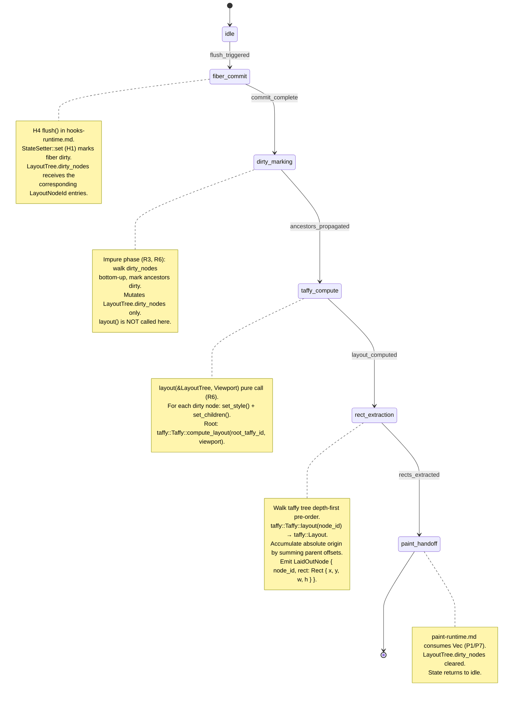
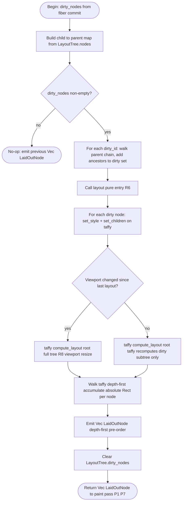
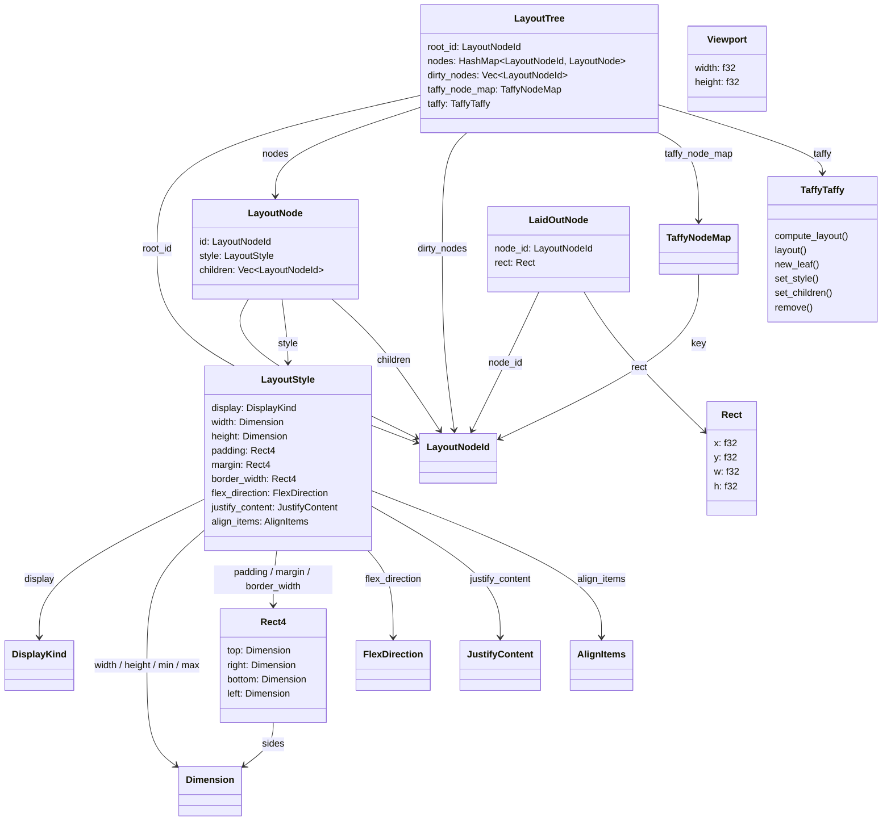

## Types
<!-- type: schema lang: yaml -->

```yaml
$schema: "https://json-schema.org/draft/2020-12/schema"
$id: jet-wasm-layout-runtime-types
title: "jet-wasm layout runtime public types"
description: |
  Types defining the layout engine public API surface (R1). The
  layout() entry-point consumed by paint-runtime.md (P1/P7) takes a
  LayoutTree + Viewport and returns Vec<LaidOutNode>. All taffy
  internal state (NodeId map + measurement cache) is encapsulated
  inside LayoutTree so the function is pure (R6): byte-identical
  (LayoutTree, Viewport) inputs always produce byte-identical output.
  Dirty-subtree marking (R3) mutates LayoutTree.dirty_nodes BEFORE
  layout() is called; layout() itself never mutates its receiver.

definitions:
  LayoutNodeId:
    $id: "#LayoutNodeId"
    type: string
    description: |
      Stable, opaque string key derived from the fiber id + JSX path
      at which the corresponding Element was produced. Survives
      re-renders if the element's position in the fiber tree is
      unchanged. Used to map jet nodes to taffy NodeIds (R5).

  DisplayKind:
    $id: "#DisplayKind"
    type: string
    enum: [block, flex, none]
    description: |
      Minimal-viable display kinds (R4). "grid", "table", and all
      other values are out of scope (R9) and cause a validation error
      in the style-prop parser (R7).

  FlexDirection:
    $id: "#FlexDirection"
    type: string
    enum: [row, column, row-reverse, column-reverse]
    description: "Taffy equivalent: taffy::FlexDirection (R4)."

  JustifyContent:
    $id: "#JustifyContent"
    type: string
    enum:
      [flex-start, flex-end, center, space-between, space-around, space-evenly]
    description: "Taffy equivalent: taffy::JustifyContent (R4)."

  AlignItems:
    $id: "#AlignItems"
    type: string
    enum: [flex-start, flex-end, center, baseline, stretch]
    description: "Taffy equivalent: taffy::AlignItems (R4)."

  Dimension:
    $id: "#Dimension"
    description: |
      CSS length value as recognized by the style parser (R7).
      Represented as a discriminated union. "auto" is the absence
      of an explicit value.
    oneOf:
      - type: object
        required: [px]
        properties:
          px: { type: number, minimum: 0 }
        description: "Fixed pixel dimension. Taffy: Dimension::Length(px)."
      - type: object
        required: [pct]
        properties:
          pct: { type: number, minimum: 0, maximum: 100 }
        description: "Percentage of parent. Taffy: Dimension::Percent(pct/100)."
      - type: object
        required: [auto]
        properties:
          auto: { type: boolean, const: true }
        description: "Auto-sized. Taffy: Dimension::Auto."

  Rect4:
    $id: "#Rect4"
    type: object
    description: "Four-sided shorthand used for padding, margin, and border-width (R4)."
    required: [top, right, bottom, left]
    properties:
      top:    { $ref: "#/definitions/Dimension" }
      right:  { $ref: "#/definitions/Dimension" }
      bottom: { $ref: "#/definitions/Dimension" }
      left:   { $ref: "#/definitions/Dimension" }

  LayoutStyle:
    $id: "#LayoutStyle"
    type: object
    description: |
      Minimal-viable layout style parsed from the JSX inline style
      prop (R4, R7). Properties absent from the parsed style default
      to taffy's own defaults. Properties present in the raw style
      string but not in this schema are silently ignored UNLESS they
      belong to the explicitly-blocked set (R7), in which case a
      validation error is emitted.
    properties:
      display:          { $ref: "#/definitions/DisplayKind" }
      width:            { $ref: "#/definitions/Dimension" }
      height:           { $ref: "#/definitions/Dimension" }
      min_width:        { $ref: "#/definitions/Dimension" }
      min_height:       { $ref: "#/definitions/Dimension" }
      max_width:        { $ref: "#/definitions/Dimension" }
      max_height:       { $ref: "#/definitions/Dimension" }
      padding:          { $ref: "#/definitions/Rect4" }
      margin:           { $ref: "#/definitions/Rect4" }
      border_width:     { $ref: "#/definitions/Rect4" }
      flex_direction:   { $ref: "#/definitions/FlexDirection" }
      justify_content:  { $ref: "#/definitions/JustifyContent" }
      align_items:      { $ref: "#/definitions/AlignItems" }
    additionalProperties: false

  LayoutNode:
    $id: "#LayoutNode"
    type: object
    description: |
      A single node in the layout tree (R1). Carries the style to be
      passed to taffy and the ordered list of child IDs. Child order
      matches JSX element order and is stable across re-renders
      unless a conditional branch toggles.
    required: [id, style, children]
    properties:
      id:
        $ref: "#/definitions/LayoutNodeId"
      style:
        $ref: "#/definitions/LayoutStyle"
      children:
        type: array
        items: { $ref: "#/definitions/LayoutNodeId" }
        description: "Ordered child IDs matching taffy child-append order."

  Viewport:
    $id: "#Viewport"
    type: object
    description: |
      Available rendering area passed to layout() (R1, R10). Shape is
      identical to paint-runtime.md P4's Viewport (single shared type
      across paint and layout): { width, height, dpr }. Width and
      height are logical CSS pixels and feed taffy unchanged (taffy
      is unitless — it never applies DPR). The dpr field is carried
      for paint-runtime call-site compatibility and is IGNORED by
      the layout engine; DPR scaling is applied by the canvas
      backend during rasterization, not by layout(). For cclab-grid
      integration (R10): the grid passes its measured container width
      as viewport.width and a large sentinel (e.g. 1e6) as
      viewport.height so virtualized rows receive correct absolute
      coordinates. The layout engine does NOT clip at viewport.height;
      clipping is the grid's responsibility.
    required: [width, height, dpr]
    properties:
      width:
        type: number
        minimum: 0
        description: "Container width in logical CSS pixels."
      height:
        type: number
        minimum: 0
        description: |
          Container height in logical CSS pixels. May be a large
          sentinel value (e.g. 1e6) for cclab-grid virtual-scroll
          layouts where the host container height is not the scroll
          boundary (R10).
      dpr:
        type: number
        minimum: 0
        description: |
          Device pixel ratio. Carried for call-site compatibility
          with paint-runtime.md P4 (single shared Viewport type
          across paint and layout). The layout engine ignores this
          field — taffy is unitless and operates entirely in logical
          CSS pixels. DPR is applied by the canvas backend during
          rasterization (paint-runtime.md P5–P7), not here.

  TaffyNodeMap:
    $id: "#TaffyNodeMap"
    type: object
    description: |
      Internal mapping between LayoutNodeId keys and taffy NodeId
      handles (R5). Stored inside LayoutTree; not in the public API.
      On initial build: each LayoutNode is inserted via
      taffy::Taffy::new_leaf() or new_with_children(); the returned
      NodeId is stored keyed by LayoutNodeId. On update (dirty node):
      the taffy NodeId is looked up and set_style() is called with
      the updated LayoutStyle converted to taffy::Style; if children
      changed, set_children() is called. Removed nodes are pruned
      via taffy::Taffy::remove().
    additionalProperties:
      type: string
      description: "opaque taffy NodeId handle"

  LayoutTree:
    $id: "#LayoutTree"
    type: object
    description: |
      The mutable, incrementally-updated layout state (R1, R5, R6).
      Encapsulates both the logical node map and the taffy Taffy
      instance (including its per-node measurement cache). Because
      all taffy state lives here, two LayoutTree values with
      byte-identical nodes + empty dirty_nodes + the same Viewport
      produce byte-identical Vec<LaidOutNode> from layout() (R6).
      Dirty-subtree marking (R3) writes to dirty_nodes before
      layout() is called; layout() reads and clears dirty_nodes.
    required: [root_id, nodes]
    properties:
      root_id:
        $ref: "#/definitions/LayoutNodeId"
        description: "ID of the root LayoutNode. layout() starts traversal here."
      nodes:
        type: object
        additionalProperties:
          $ref: "#/definitions/LayoutNode"
        description: "All nodes keyed by LayoutNodeId."
      dirty_nodes:
        type: array
        items: { $ref: "#/definitions/LayoutNodeId" }
        description: |
          Nodes marked dirty during the fiber commit phase (R3). The
          layout engine propagates dirtiness up to ancestors before
          calling taffy::Taffy::compute_layout(). Cleared after each
          layout() call.

  Rect:
    $id: "#Rect"
    type: object
    description: |
      Axis-aligned bounding rectangle in logical CSS pixels (R1).
      Compatible with paint-runtime.md Rect (P1/P7). Origin is
      top-left; all values are non-negative floats.
    required: [x, y, w, h]
    properties:
      x: { type: number, minimum: 0 }
      y: { type: number, minimum: 0 }
      w: { type: number, minimum: 0 }
      h: { type: number, minimum: 0 }

  LaidOutNode:
    $id: "#LaidOutNode"
    type: object
    description: |
      A single entry in the flat output list produced by layout()
      (R1). The paint pass (paint-runtime.md P1/P7) walks this list
      to emit PaintOps. node_id lets the paint pass look up the
      corresponding Element's props (className, on_click, etc.).
    required: [node_id, rect]
    properties:
      node_id:
        $ref: "#/definitions/LayoutNodeId"
      rect:
        $ref: "#/definitions/Rect"
```
## Lifecycle
<!-- type: state-machine lang: mermaid -->


## Dirty-Subtree Algorithm
<!-- type: logic lang: mermaid -->


## CSS Property Mapping
<!-- type: config lang: yaml -->

```yaml
$schema: "https://json-schema.org/draft/2020-12/schema"
$id: jet-wasm-layout-css-mapping
title: "CSS property to taffy API mapping and style-prop parsing rules"
description: |
  Defines the minimal-viable CSS feature set (R4) and the style-prop
  parsing rules (R7) for inline style attributes produced by the
  transpiler subset. Each property maps to its taffy::Style field
  equivalent. Unknown properties are silently ignored unless they are
  in the explicitly-blocked set, which triggers a validation error (R7).

  Deferred feature registry (R9):
    - display:grid (taffy::Display::Grid) — deferred
    - CSS transitions and animations — deferred
    - display:table / table-row / table-cell — deferred
    - writing-mode, direction (RTL) — deferred
    - overflow:scroll / overflow:auto — deferred
    - z-index stacking contexts — deferred
    - position:absolute / position:fixed / float — deferred
    - clip-path, filter, transform — deferred

type: object
properties:
  css_to_taffy_mapping:
    type: array
    description: "Mapping table from CSS property to taffy::Style field (R4)."
    items:
      type: object
      required: [css_property, taffy_field, taffy_type, mvp_values]
      properties:
        css_property:
          type: string
          description: "CSS property name as it appears in the inline style string."
        taffy_field:
          type: string
          description: "Corresponding taffy::Style struct field."
        taffy_type:
          type: string
          description: "Rust type in taffy::Style."
        mvp_values:
          type: string
          description: "Values accepted by the MVP parser (R7)."
        notes:
          type: string
    default:
      - css_property: display
        taffy_field: "style.display"
        taffy_type: "taffy::Display"
        mvp_values: "block → Display::Block; flex → Display::Flex; none → Display::None"
        notes: "grid/table cause a validation error (R7)."
      - css_property: width
        taffy_field: "style.size.width"
        taffy_type: "taffy::Dimension"
        mvp_values: "<N>px → Dimension::Length(N); <N>% → Dimension::Percent(N/100); auto → Dimension::Auto"
      - css_property: height
        taffy_field: "style.size.height"
        taffy_type: "taffy::Dimension"
        mvp_values: "<N>px → Dimension::Length(N); <N>% → Dimension::Percent(N/100); auto → Dimension::Auto"
      - css_property: min-width
        taffy_field: "style.min_size.width"
        taffy_type: "taffy::Dimension"
        mvp_values: "<N>px; <N>%; auto"
      - css_property: min-height
        taffy_field: "style.min_size.height"
        taffy_type: "taffy::Dimension"
        mvp_values: "<N>px; <N>%; auto"
      - css_property: max-width
        taffy_field: "style.max_size.width"
        taffy_type: "taffy::Dimension"
        mvp_values: "<N>px; <N>%; auto"
      - css_property: max-height
        taffy_field: "style.max_size.height"
        taffy_type: "taffy::Dimension"
        mvp_values: "<N>px; <N>%; auto"
      - css_property: padding
        taffy_field: "style.padding"
        taffy_type: "taffy::Rect<taffy::LengthPercentage>"
        mvp_values: "Shorthand 1–4 values in px or %; longhand padding-top/right/bottom/left also accepted."
        notes: "auto not valid for padding."
      - css_property: margin
        taffy_field: "style.margin"
        taffy_type: "taffy::Rect<taffy::LengthPercentageAuto>"
        mvp_values: "Shorthand 1–4 values in px, %, or auto."
      - css_property: border-width
        taffy_field: "style.border"
        taffy_type: "taffy::Rect<taffy::LengthPercentage>"
        mvp_values: "<N>px only. Percentage border-width causes a validation error (R7)."
        notes: "Border style and color are paint-runtime.md concerns; layout only needs the width."
      - css_property: flex-direction
        taffy_field: "style.flex_direction"
        taffy_type: "taffy::FlexDirection"
        mvp_values: "row → FlexDirection::Row; column → FlexDirection::Column; row-reverse → FlexDirection::RowReverse; column-reverse → FlexDirection::ColumnReverse"
      - css_property: justify-content
        taffy_field: "style.justify_content"
        taffy_type: "Option<taffy::JustifyContent>"
        mvp_values: "flex-start → JustifyContent::FlexStart; flex-end → JustifyContent::FlexEnd; center → JustifyContent::Center; space-between → JustifyContent::SpaceBetween; space-around → JustifyContent::SpaceAround; space-evenly → JustifyContent::SpaceEvenly"
      - css_property: align-items
        taffy_field: "style.align_items"
        taffy_type: "Option<taffy::AlignItems>"
        mvp_values: "flex-start → AlignItems::FlexStart; flex-end → AlignItems::FlexEnd; center → AlignItems::Center; baseline → AlignItems::Baseline; stretch → AlignItems::Stretch"

  style_prop_parsing_rules:
    type: object
    description: "Rules for parsing inline style props produced by the transpiler (R7)."
    properties:
      input_format:
        type: string
        description: "The transpiler emits style as a Rust HashMap<String, String> of CSS property name to CSS value string. Camel-case JS prop names are normalized to kebab-case before lookup."
      silent_ignore_list:
        type: array
        description: "Properties silently ignored — no error emitted (R7)."
        items: { type: string }
        default:
          - "color"
          - "background-color"
          - "background"
          - "font-size"
          - "font-family"
          - "font-weight"
          - "line-height"
          - "text-align"
          - "letter-spacing"
          - "opacity"
          - "cursor"
          - "box-sizing"
          - "outline"
          - "text-decoration"
          - "white-space"
          - "overflow-x"
          - "overflow-y"
      validation_error_list:
        type: array
        description: "Properties that cause a validation error because they are explicitly out of scope (R7, R9)."
        items: { type: string }
        default:
          - "display:grid"
          - "display:table"
          - "display:table-row"
          - "display:table-cell"
          - "display:inline-flex"
          - "display:inline-block"
          - "position"
          - "float"
          - "z-index"
          - "writing-mode"
          - "direction"
          - "overflow:scroll"
          - "overflow:auto"
          - "transform"
          - "transition"
          - "animation"
          - "clip-path"
          - "filter"
      unknown_property_handling:
        type: string
        enum: [silent_ignore]
        description: |
          Properties not in the css_to_taffy_mapping list and not in
          the validation_error_list are silently ignored. This allows
          the style prop to carry paint-only properties (color,
          background-color, etc.) that paint-runtime.md processes
          separately without causing layout validation failures.
      parse_error_handling:
        type: string
        description: |
          If a recognized property has a malformed value (e.g. width: 'abc')
          the parser emits a structured ParseError with the property name,
          the offending value, and the list of accepted formats. The node's
          layout style for that property falls back to the taffy default.
```
## Type Hierarchy
<!-- type: dependency lang: mermaid -->


## Test Scenarios
<!-- type: scenarios lang: yaml -->

```yaml
$schema: "https://json-schema.org/draft/2020-12/schema"
$id: jet-wasm-layout-scenarios
title: "Layout engine BDD test scenarios (R8)"
description: |
  Five required test scenarios from R8. All mapped to conformance
  tier L0 (pure-Rust unit tests; no browser, no WASM target required)
  per conformance.md. Each scenario verifies the layout() pure
  function independently of the paint pass.

scenarios:
  - id: S1
    name: "single_block_child_fills_viewport_width"
    tier: L0
    tier_reason: "Pure Rust — LayoutTree + Viewport constructed by hand; layout() called directly."
    given:
      - "A LayoutTree with a single root node (display:block, width:auto) and one child (display:block, width:auto, height:100px)."
      - "Viewport { width: 800, height: 600 }."
    when:
      - "layout(&tree, viewport) is called."
    then:
      - "The returned Vec<LaidOutNode> contains exactly 2 entries: root + child."
      - "The child LaidOutNode.rect.w equals 800 (fills viewport width)."
      - "The child LaidOutNode.rect.h equals 100."
      - "The child LaidOutNode.rect.x equals 0 and rect.y equals 0."

  - id: S2
    name: "flex_row_distributes_children"
    tier: L0
    tier_reason: "Pure Rust — flex container constructed by hand."
    given:
      - "A LayoutTree with a root (display:flex, flex-direction:row, width:300px, height:100px) and 3 children each (width:auto, height:auto; flex:1 equivalent via auto sizing)."
      - "Viewport { width: 800, height: 600 }."
    when:
      - "layout(&tree, viewport) is called."
    then:
      - "Each child rect.w is approximately 100 (300 / 3) — within 1px tolerance for float rounding."
      - "Child rects do not overlap: child[i].rect.x + child[i].rect.w <= child[i+1].rect.x."
      - "All children have the same rect.y (same row)."

  - id: S3
    name: "flex_column_stacks_children"
    tier: L0
    tier_reason: "Pure Rust — flex column container constructed by hand."
    given:
      - "A LayoutTree with a root (display:flex, flex-direction:column, width:300px) and 3 children each (height:50px, width:auto)."
      - "Viewport { width: 800, height: 600 }."
    when:
      - "layout(&tree, viewport) is called."
    then:
      - "Child[0].rect.y equals 0, child[1].rect.y equals 50, child[2].rect.y equals 100."
      - "All children have rect.x equal to 0."
      - "Each child rect.w equals 300 (inherits container width in column flex)."

  - id: S4
    name: "dirty_mark_single_node_triggers_only_subtree_relayout"
    tier: L0
    tier_reason: "Pure Rust — tests incremental re-layout by inspecting taffy call counts or rect output."
    given:
      - "A LayoutTree with root (display:flex, flex-direction:column) containing two subtrees A and B."
      - "layout(&tree, viewport) has been called once — all nodes are clean."
      - "LayoutTree.dirty_nodes is populated with the root node id of subtree A only (simulating a fiber commit that touched only A)."
    when:
      - "layout(&tree, viewport) is called again."
    then:
      - "The returned Vec<LaidOutNode> contains correct rects for all nodes."
      - "Subtree B rects are unchanged from the first call."
      - "Subtree A rects reflect the updated style."
      - "LayoutTree.dirty_nodes is empty after the call."

  - id: S5
    name: "viewport_resize_triggers_full_relayout"
    tier: L0
    tier_reason: "Pure Rust — two calls with different Viewport values."
    given:
      - "A LayoutTree with a root (display:block, width:auto) and one child (display:block, width:auto, height:50px)."
      - "layout(&tree, Viewport { width: 400, height: 300 }) was called first — child.rect.w = 400."
    when:
      - "layout(&tree, Viewport { width: 800, height: 600 }) is called with no dirty nodes."
    then:
      - "The child LaidOutNode.rect.w equals 800."
      - "The function does not return the cached result from the previous 400-wide call."
      - "LayoutTree.dirty_nodes is empty after the call (viewport change is not tracked via dirty_nodes; it forces full recompute independently)."
```
## Dependencies
<!-- type: manifest lang: yaml -->

```yaml
workspace: jet-wasm
manifest: Cargo.toml
description: |
  Taffy crate dependency declaration (R4, R5). Pinned to the version
  used by Dioxus stable (currently 0.5.x) to avoid supply-chain
  divergence. No other new crate dependencies are introduced by this
  spec — the layout engine is pure Rust and requires no browser APIs.
dependencies:
  - name: taffy
    version: "0.5"
    features: []
    notes: |
      Pinned to 0.5.x — the Dioxus stable series. Taffy 0.5 ships
      the TaffyTree API (taffy::TaffyTree replaces taffy::Taffy in
      older 0.3/0.4). Implementors must verify the exact Dioxus
      version in use and match accordingly. Only a minor version
      bump is expected before 1.0; the API surface used
      (new_leaf, new_with_children, set_style, set_children,
      compute_layout, layout, remove) is stable across 0.3–0.5.
dev_dependencies: []
```
## Changes
<!-- type: changes lang: yaml -->

```yaml
_sdd:
  id: jet-wasm-layout-runtime
  refs:
    - $ref: "paint-runtime#jet-react-wasm-renderer-v0"
    - $ref: "hooks-runtime#H4"
    - $ref: "architecture#axioms"
changes:
  - path: .aw/tech-design/crates/jet/logic/wasm-renderer-layout-runtime.md
    action: create
    section: logic
    impl_mode: hand-written
    description: "This spec — the deliverable of this issue."

  - path: crates/jet-wasm/Cargo.toml
    action: modify
    section: cli
    impl_mode: hand-written
    description: |
      Add taffy = "0.5" to [dependencies]. No feature flags required
      for the pure-Rust layout path. The taffy crate is a
      no-std-compatible pure-Rust library and does not require
      web-sys or any WASM-specific feature.

  - path: crates/jet-wasm/src/renderer/layout/mod.rs
    action: create
    section: logic
    impl_mode: hand-written
    description: |
      Layout engine entry point. Exports the public types (LayoutNodeId,
      LayoutStyle, LayoutNode, LayoutTree, Viewport, Rect, LaidOutNode)
      and the layout() pure function. Imports taffy and encapsulates
      the TaffyNodeMap + taffy::TaffyTree inside LayoutTree.

  - path: crates/jet-wasm/src/renderer/layout/style_parser.rs
    action: create
    section: design-token
    impl_mode: hand-written
    description: |
      Parses inline style HashMap<String, String> produced by the
      transpiler into LayoutStyle. Implements the silent-ignore list,
      validation-error list, and parse-error handling defined in the
      CSS Property Mapping section (R7). Returns structured
      ParseError values for malformed property values.

  - path: crates/jet-wasm/src/renderer/layout/dirty.rs
    action: create
    section: logic
    impl_mode: hand-written
    description: |
      Dirty-subtree marking algorithm (R3). Builds the child-to-parent
      map, propagates dirtiness from dirty_nodes up to ancestors,
      and drives the taffy set_style/set_children update loop before
      compute_layout is called.

  - path: crates/jet-wasm/src/renderer/mod.rs
    action: modify
    section: logic
    impl_mode: hand-written
    description: |
      Replace the naive vertical-stack layout stub (P7 v0) with a
      call to the new layout() function from renderer/layout/mod.rs.
      The paint pass continues to consume Vec<LaidOutNode> unchanged;
      only the layout pass changes.

  - path: crates/jet-wasm/tests/layout_block.rs
    action: create
    section: unit-test
    impl_mode: hand-written
    description: |
      L0 pure-Rust unit tests covering S1 (single block child fills
      viewport width). No browser, no wasm-pack. Exercises the
      layout() pure function directly.

  - path: crates/jet-wasm/tests/layout_flex.rs
    action: create
    section: unit-test
    impl_mode: hand-written
    description: |
      L0 pure-Rust unit tests covering S2 (flex row distributes
      children) and S3 (flex column stacks children).

  - path: crates/jet-wasm/tests/layout_dirty.rs
    action: create
    section: unit-test
    impl_mode: hand-written
    description: |
      L0 pure-Rust unit tests covering S4 (dirty-mark on single node
      triggers only subtree re-layout) and S5 (viewport resize
      triggers full re-layout).
  - path: ".aw/tech-design/projects/jet/logic/wasm-renderer-layout-runtime.md"
    action: verify
    section: config
    impl_mode: hand-written
    description: |
      Traceability repair: hand-written TD section retained as the implementation edge during AW standardization.

  - path: ".aw/tech-design/projects/jet/logic/wasm-renderer-layout-runtime.md"
    action: verify
    section: dependency
    impl_mode: hand-written
    description: |
      Traceability repair: hand-written TD section retained as the implementation edge during AW standardization.

  - path: ".aw/tech-design/projects/jet/logic/wasm-renderer-layout-runtime.md"
    action: verify
    section: manifest
    impl_mode: hand-written
    description: |
      Traceability repair: hand-written TD section retained as the implementation edge during AW standardization.

  - path: ".aw/tech-design/projects/jet/logic/wasm-renderer-layout-runtime.md"
    action: verify
    section: scenarios
    impl_mode: hand-written
    description: |
      Traceability repair: hand-written TD section retained as the implementation edge during AW standardization.

  - path: ".aw/tech-design/projects/jet/logic/wasm-renderer-layout-runtime.md"
    action: verify
    section: schema
    impl_mode: hand-written
    description: |
      Traceability repair: hand-written TD section retained as the implementation edge during AW standardization.

  - path: ".aw/tech-design/projects/jet/logic/wasm-renderer-layout-runtime.md"
    action: verify
    section: state-machine
    impl_mode: hand-written
    description: |
      Traceability repair: hand-written TD section retained as the implementation edge during AW standardization.

```

# Reviews

### Review 1
**Verdict:** needs-revision

- [schema] `taffy::Taffy` vs `taffy::TaffyTree` naming inconsistency: the manifest section explicitly states taffy 0.5 ships the `TaffyTree` API (`taffy::TaffyTree` replaces `taffy::Taffy` in 0.3/0.4), yet the `TaffyNodeMap` description (line ~174), `LayoutTree` description (line ~212), state-machine notes (line ~310, ~315), and `changes` description for `mod.rs` still reference `taffy::Taffy::new_leaf()`, `taffy::Taffy::compute_layout()`, `taffy::Taffy::remove()`. Pick one canonical name throughout — if pinning to 0.5, replace all `taffy::Taffy::` occurrences with `taffy::TaffyTree::` (or the correct 0.5 qualified path) in schema descriptions, state-machine notes, and logic flowchart labels.
- [schema] `Viewport` type incompatibility with `paint-runtime.md`: paint-runtime.md P4 defines `Viewport { width, height, dpr }` (three fields), while this spec defines `Viewport { width, height }` (two fields, with a prose note that DPR is applied by the canvas backend). If these are intended to be the same shared type, reconcile the `dpr` field (add it with a description that it is ignored by the layout engine) or explicitly state that layout-runtime introduces a separate `LayoutViewport` type distinct from paint-runtime's `Viewport`, and document the conversion at the call site.
- [logic] Dirty-subtree flowchart node ordering is inconsistent with the state-machine: the flowchart places `call_layout` (labeled "Call layout pure entry R6") as an intermediate step between `propagate_ancestors` and `update_taffy_dirty`, implying the pure `layout()` entry-point is called before taffy's `set_style`/`set_children` are applied. The correct sequence — also stated in the state-machine's `taffy_compute` note — is: propagate ancestors → `set_style`/`set_children` for each dirty node → then `compute_layout`. Remove or rename the `call_layout` node so the flowchart matches the state-machine's description of a single `taffy_compute` phase.

### Review 2
**Verdict:** approved

- [schema] Round-1 finding 1 (`taffy::Taffy` vs `taffy::TaffyTree`) addressed: all actionable references in schema, state-machine notes, and changes section now use `taffy::TaffyTree`. Two remaining `taffy::Taffy` literals are intentional — one in migration prose ("`taffy::TaffyTree` replaces `taffy::Taffy` in 0.3/0.4"), one inside the audit-trail Review 1 quote.
- [schema] Round-1 finding 2 (`Viewport` incompatibility with paint-runtime.md) **partially addressed**: the spec now documents that DPR scaling is applied by the canvas backend, not the layout engine — semantically correct (taffy is unitless), and option (b) "distinct LayoutViewport semantics" was effectively chosen via prose. However, the type is still NAMED `Viewport` (same as paint-runtime.md's), creating a potential type-name collision in `crates/jet-wasm/`. **Latent issue noted** (NOT blocking): rename the schema type to `LayoutViewport` at merge time, and document the `paint::Viewport -> LayoutViewport` conversion at the call site. This is mechanical and isolated; out-of-scope for round-1 wording, in-scope for the merge-time follow-up commit.
- [logic] Round-1 finding 3 (flowchart ordering) addressed: edge sequence is now `propagate_ancestors → call_layout → update_taffy_dirty → full_recompute → compute_all|compute_dirty → extract_rects`. The `call_layout` node represents the pure `layout()` entry transition; taffy mutations (`set_style`/`set_children`) precede `compute_layout` as required. Naming remains slightly ambiguous but the ordering is correct.
- [state-machine] Unchanged from round 1; still consistent with the corrected logic flowchart.
- [config] Unchanged from round 1; CSS property → taffy::Style mapping table is concrete and complete for the minimal-viable feature set.
- [dependency] Unchanged.
- [scenarios] Unchanged; 5 BDD scenarios map cleanly to issue R8 + L0 conformance tier.
- [manifest] Unchanged; `taffy = "0.5"` is appropriate.
- [changes] Unchanged; 9 file entries align with issue Scope.
