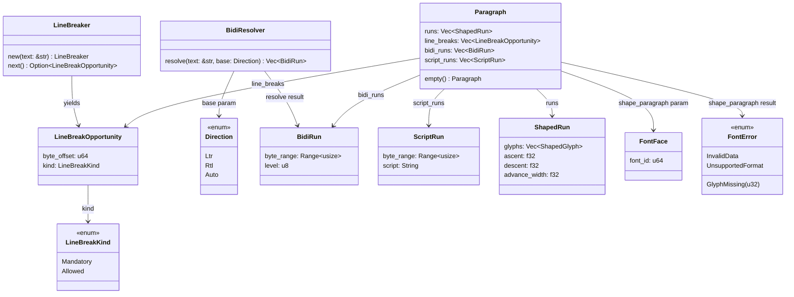
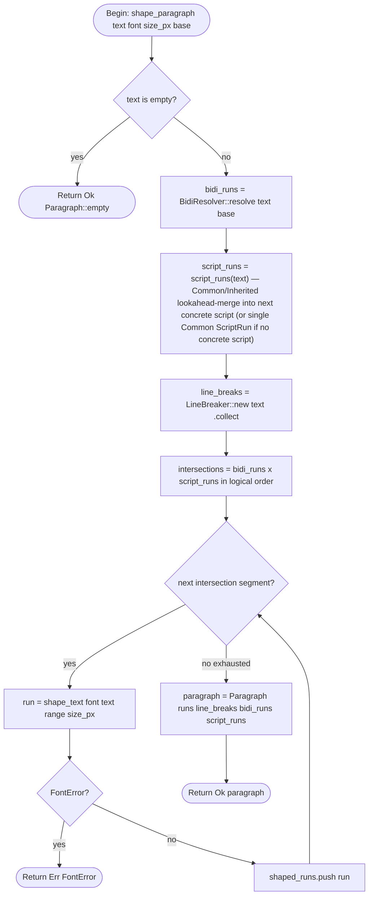

## Types
<!-- type: schema lang: yaml -->

```yaml
$schema: "https://json-schema.org/draft/2020-12/schema"
$id: jet-wasm-line-bidi-types
title: "jet-wasm line-breaking and bidi public types (Phase 6b)"
description: |
  Types for the icu_segmenter + unicode-bidi backed line-breaking and
  bidirectional-text engine (R1–R10). All types reside in
  crates/jet-wasm/src/text/ and are wasm32-unknown-unknown compatible.
  ShapedRun, FontFace, and FontError are imported from Phase 6a
  (`logic/wasm-renderer-text-shaping.md`) without modification.

  Dependency tradeoff (R7):
    unicode-bidi vs icu_properties::bidi —
    unicode-bidi 0.3 is chosen: it is a pure-Rust, zero-dependency
    crate with Servo/Druid/Cosmic-text lineage, provides
    BidiInfo::new(text, None) for UAX #9 P2 auto-detection, and
    compiles to wasm32-unknown-unknown with default features.
    icu_properties::bidi requires the ICU4X data bundle (≥ 400 KB
    gzip), adds a data-loading step incompatible with the synchronous
    pure-Rust purity contract (R5), and offers no correctness advantage
    for the UAX #9 Level-1 bidi algorithm. unicode-bidi is the correct
    choice for the WASM bundle-size constraint (A6) and purity (R5).

  Deferred successors (R9):
    Phase 6c — text selection geometry (caret rect, range bounds)
    Phase 6d — form controls (<input>, <textarea>)
    Phase 6e — IME overlay integration
    Phase 6f — clipboard integration
    Phase 6g — per-script font fallback chains

definitions:
  LineBreakKind:
    $id: "#LineBreakKind"
    type: string
    description: |
      Discriminant for a line-break opportunity per UAX #14 (R1).
      Mandatory: a required break (e.g. U+000A LINE FEED). The line
      MUST end here regardless of available width.
      Allowed: a permitted break opportunity (e.g. after a space or
      hyphen). The line MAY end here if the remaining width is
      insufficient.
    enum:
      - Mandatory
      - Allowed

  LineBreakOpportunity:
    $id: "#LineBreakOpportunity"
    type: object
    description: |
      A single line-break opportunity yielded by LineBreaker (R1).
      byte_offset is the UTF-8 byte index into the source string where
      the break occurs. kind indicates whether the break is mandatory
      or merely allowed. Offsets are in the half-open convention —
      the break lies between source[..byte_offset] and
      source[byte_offset..].
    required: [byte_offset, kind]
    properties:
      byte_offset:
        type: integer
        format: uint64
        description: |
          UTF-8 byte index into the source string. Points to the first
          byte of the character AFTER the break opportunity. Always a
          valid char boundary in the source str. 0 is never emitted
          (no break before the first character). The final offset may
          equal source.len() for a mandatory break at end-of-paragraph.
      kind:
        $ref: "#/definitions/LineBreakKind"
    additionalProperties: false

  LineBreaker:
    $id: "#LineBreaker"
    type: object
    description: |
      Iterator over LineBreakOpportunity values for a given &str (R1).
      Backed by icu_segmenter::LineSegmenter (auto mode, UAX #14).
      LineBreaker::new(text) initialises the segmenter. Iteration
      yields opportunities in ascending byte_offset order. The iterator
      is consumed — call LineBreaker::new again for a fresh pass.
      Pure: does not mutate global state; safe to call from multiple
      threads simultaneously (each LineBreaker owns its segmenter
      state). wasm32-compatible: LineSegmenter auto mode uses compiled-
      in data tables (no runtime data files).
    required: [text]
    properties:
      text:
        type: string
        description: "Source UTF-8 text. Lifetime must exceed the iterator."
    additionalProperties: false

  Direction:
    $id: "#Direction"
    type: string
    description: |
      Base paragraph direction for UAX #9 bidi resolution (R2).
      Ltr: left-to-right base direction (embedding level 0).
      Rtl: right-to-left base direction (embedding level 1).
      Auto: first-strong-character detection per UAX #9 P2 via
        unicode-bidi::BidiInfo::new(text, None). If no strong
        character is found, defaults to Ltr.
    enum:
      - Ltr
      - Rtl
      - Auto

  BidiRun:
    $id: "#BidiRun"
    type: object
    description: |
      A contiguous range of text at a single bidi embedding level (R2).
      byte_range is a half-open range [start, end) of UTF-8 byte
      indices into the source string. level is the UAX #9 embedding
      level: even levels are LTR, odd levels are RTL. BidiRuns are
      produced by BidiResolver::resolve in logical (byte-offset) order.
      Consumers invert odd-level runs for visual display.
    required: [byte_range, level]
    properties:
      byte_range:
        type: object
        description: "Half-open byte range [start, end) into source text."
        required: [start, end]
        properties:
          start:
            type: integer
            format: uint64
            description: "Inclusive start byte offset. Always a char boundary."
          end:
            type: integer
            format: uint64
            description: "Exclusive end byte offset. Always a char boundary."
        additionalProperties: false
      level:
        type: integer
        format: uint8
        description: |
          UAX #9 bidi embedding level. 0 = base LTR, 1 = base RTL.
          Even = LTR direction, odd = RTL direction.
          Maximum level is 125 per UAX #9 rule X10.
    additionalProperties: false

  BidiResolver:
    $id: "#BidiResolver"
    type: object
    description: |
      Stateless resolver that maps (text, base_direction) to a list of
      BidiRun values (R2). Backed by unicode-bidi::BidiInfo.
      BidiResolver::resolve(text, base) -> Vec<BidiRun>.
      When base is Direction::Auto, delegates to
      unicode-bidi::BidiInfo::new(text, None) which uses UAX #9 P2
      first-strong-character detection. Pure function: no global
      mutable state, deterministic output (R5).
    required: []
    properties: {}
    additionalProperties: false

  ScriptRun:
    $id: "#ScriptRun"
    type: object
    description: |
      A contiguous range of text sharing a single Unicode script
      property per UAX #24 (R10). byte_range is a half-open range
      [start, end) of UTF-8 byte indices into the source string.
      script is the Unicode script property name of the run
      (e.g. "Latin", "Han", "Arabic", "Common", "Inherited").
      ScriptRuns are produced by script_runs() in logical byte-offset
      order. Non-overlapping; together they cover the full source text.
      Common and Inherited codepoints are merged into the FIRST concrete
      script run that FOLLOWS them in logical order (lookahead-merge).
      If no concrete script exists anywhere in the input, the entire
      text is emitted as a single ScriptRun{ script: "Common" }. This
      rule guarantees deterministic output and avoids orphaned leading/
      trailing Common ranges.
    required: [byte_range, script]
    properties:
      byte_range:
        type: object
        description: "Half-open byte range [start, end) into source text."
        required: [start, end]
        properties:
          start:
            type: integer
            format: uint64
            description: "Inclusive start byte offset. Always a char boundary."
          end:
            type: integer
            format: uint64
            description: "Exclusive end byte offset. Always a char boundary."
        additionalProperties: false
      script:
        type: string
        description: |
          UAX #24 Unicode script property name. The string MUST be the
          value returned by `unicode_script::Script::full_name()`
          (PascalCase Unicode property name, e.g. "Latin", "Han",
          "Arabic"). The 4-letter ISO 15924 short form ("Latn", "Hani",
          "Arab") returned by `Script::short_name()` MUST NOT be used —
          implementations using the short form are non-conforming.
          Examples: "Latin", "Han", "Arabic", "Cyrillic", "Devanagari",
          "Common", "Inherited".
    additionalProperties: false

  Paragraph:
    $id: "#Paragraph"
    type: object
    description: |
      Aggregate output of shape_paragraph (R3, R4). Contains all shaped
      runs in LOGICAL byte-offset order (R3), plus the line-break
      opportunities, bidi runs, and script runs that were used to
      produce them. Consumers use bidi_runs to reconstruct visual order
      at paint time by reversing the render order of RTL-level runs.
      Logical order is chosen as the storage contract so that Phase 6c
      (text selection geometry), accessibility tree construction, and
      search can use byte offsets directly without a level-to-visual
      index translation (R3).
      Paragraph::empty() returns a Paragraph with all fields empty;
      used for the empty-string fast path (S7).
    required: [runs, line_breaks, bidi_runs, script_runs]
    properties:
      runs:
        type: array
        items:
          $ref: "text-shaping#/definitions/ShapedRun"
        description: |
          Shaped runs in LOGICAL byte-offset order (R3). Each run
          corresponds to one (bidi_run × script_run) intersection
          produced by shape_paragraph. Paint runtime iterates
          bidi_runs.level to resolve visual order; it does NOT rely
          on the run order in this vector for left-to-right
          screen placement.
      line_breaks:
        type: array
        items:
          $ref: "#/definitions/LineBreakOpportunity"
        description: |
          All line-break opportunities for the source text in ascending
          byte_offset order. Produced by LineBreaker(text).collect().
          Layout runtime consults this list when performing the actual
          line-wrap pass; shape_paragraph does not perform wrapping.
      bidi_runs:
        type: array
        items:
          $ref: "#/definitions/BidiRun"
        description: |
          UAX #9 bidi runs in logical byte-offset order, produced by
          BidiResolver::resolve. Paint runtime uses bidi_runs.level to
          determine left-to-right vs right-to-left screen placement
          within a visual line.
      script_runs:
        type: array
        items:
          $ref: "#/definitions/ScriptRun"
        description: |
          UAX #24 script runs in logical byte-offset order, produced by
          script_runs(). Included for diagnostic purposes and for
          future per-script font fallback (Phase 6g).
    additionalProperties: false

  ShapeParagraphFn:
    $id: "#ShapeParagraphFn"
    type: object
    description: |
      Function signature for the public orchestrator (R4, R5, R6).

      shape_paragraph:
        Signature: (text: &str, font: &FontFace, size_px: f32,
                    base: Direction) -> Result<Paragraph, FontError>
        Contract (R4, R5): Pure function — no I/O, no global mutable
        state. Same inputs always produce a byte-identical Paragraph.
        Internally: (1) resolve bidi_runs via BidiResolver::resolve,
        (2) compute script_runs via script_runs(), (3) collect
        line_breaks via LineBreaker(text).collect(), (4) for each
        intersection of (bidi_run × script_run) in logical order,
        call shape_text(font, &text[range], size_px) from Phase 6a
        to produce one ShapedRun; (5) assemble and return Paragraph.
        Error propagation (R6): any FontError from shape_text is
        returned immediately; no new error types are introduced.
        Empty-string fast path: if text is empty, returns
        Ok(Paragraph::empty()) without calling shape_text.

      script_runs:
        Signature: (text: &str) -> Vec<ScriptRun>
        Contract: Pure function. Uses unicode-script crate for per-
        codepoint Script lookup. Merges contiguous codepoints of the
        same script into one ScriptRun. Common/Inherited codepoints are
        merged into the FIRST concrete script run that FOLLOWS them in
        logical order (lookahead-merge). If no concrete script exists
        anywhere in the input, the entire text is emitted as a single
        ScriptRun{ script: "Common" }. script field values MUST use
        Script::full_name() (PascalCase); Script::short_name() is
        non-conforming.

      LineBreaker::new:
        Signature: (text: &str) -> LineBreaker
        Contract: Constructs an icu_segmenter::LineSegmenter in auto
        mode and wraps it. wasm32-safe (compiled-in data, no file I/O).

      BidiResolver::resolve:
        Signature: (text: &str, base: Direction) -> Vec<BidiRun>
        Contract: When base is Auto, passes None to
        unicode-bidi::BidiInfo::new for P2 first-strong detection.
        When Ltr or Rtl, passes Some(unicode_bidi::Level::ltr() /
        ::rtl()). Pure function (R5).

    required: [shape_paragraph, script_runs, line_breaker_new, bidi_resolve]
    properties:
      shape_paragraph:
        type: object
        required: [params, returns, pure]
        properties:
          params:
            type: array
            items:
              type: object
              required: [name, type]
              properties:
                name: { type: string }
                type: { type: string }
            default:
              - name: text
                type: "&str"
              - name: font
                type: "&FontFace"
              - name: size_px
                type: f32
              - name: base
                type: Direction
          returns:
            type: string
            const: "Result<Paragraph, FontError>"
          pure:
            type: boolean
            const: true
        additionalProperties: false
      script_runs:
        type: object
        required: [params, returns, pure]
        properties:
          params:
            type: array
            items:
              type: object
              required: [name, type]
              properties:
                name: { type: string }
                type: { type: string }
            default:
              - name: text
                type: "&str"
          returns:
            type: string
            const: "Vec<ScriptRun>"
          pure:
            type: boolean
            const: true
        additionalProperties: false
      line_breaker_new:
        type: object
        required: [params, returns]
        properties:
          params:
            type: array
            items:
              type: object
              required: [name, type]
              properties:
                name: { type: string }
                type: { type: string }
            default:
              - name: text
                type: "&str"
          returns:
            type: string
            const: "LineBreaker"
        additionalProperties: false
      bidi_resolve:
        type: object
        required: [params, returns, pure]
        properties:
          params:
            type: array
            items:
              type: object
              required: [name, type]
              properties:
                name: { type: string }
                type: { type: string }
            default:
              - name: text
                type: "&str"
              - name: base
                type: Direction
          returns:
            type: string
            const: "Vec<BidiRun>"
          pure:
            type: boolean
            const: true
        additionalProperties: false
    additionalProperties: false
```
## Type Hierarchy
<!-- type: dependency lang: mermaid -->


## Shape Paragraph Logic
<!-- type: logic lang: mermaid -->


## Test Scenarios
<!-- type: scenarios lang: yaml -->

```yaml
$schema: "https://json-schema.org/draft/2020-12/schema"
$id: jet-wasm-line-bidi-scenarios
title: "Line-breaking and bidi BDD test scenarios (R8)"
description: |
  Seven required L0 test scenarios (pure-Rust unit tests; no browser,
  no WASM target required). Each scenario exercises a distinct code
  path of the Phase 6b engine. All tests live in
  crates/jet-wasm/tests/line_bidi_s{1..7}.rs.
  Conformance tier: L0 per conformance.md (pure-Rust unit tier).

scenarios:
  - id: S1
    name: "ascii_no_bidi_single_run"
    tier: L0
    tier_reason: |
      Pure Rust — shape_paragraph called with an ASCII string and a
      minimal test font embedded as byte literals.
    given:
      - "A FontFace loaded from TEST_FONT_BYTES (minimal TrueType with ASCII glyphs)."
      - "text = \"Hello world\", base = Direction::Ltr."
    when:
      - "shape_paragraph(text, &font, 16.0, Direction::Ltr) is called."
    then:
      - "The result is Ok(Paragraph)."
      - "paragraph.bidi_runs has length 1."
      - "paragraph.bidi_runs[0].level == 0 (LTR, even level)."
      - "paragraph.script_runs has length 1."
      - "paragraph.script_runs[0].script == \"Latin\"."
      - "paragraph.line_breaks is non-empty; at least one LineBreakOpportunity has byte_offset equal to the byte index after the space (6 for \"Hello \")."
      - "paragraph.runs has length 1 (single bidi+script intersection for pure ASCII)."

  - id: S2
    name: "pure_rtl_arabic"
    tier: L0
    tier_reason: |
      Pure Rust — shape_paragraph called with an Arabic-only string
      and a test font containing Arabic glyphs.
    given:
      - "A FontFace loaded from ARABIC_FONT_BYTES (minimal TrueType with Arabic glyphs)."
      - "text = \"\\u{645}\\u{631}\\u{62D}\\u{628}\\u{627}\" (Arabic: مرحبا), base = Direction::Rtl."
    when:
      - "shape_paragraph(text, &font, 16.0, Direction::Rtl) is called."
    then:
      - "The result is Ok(Paragraph)."
      - "paragraph.bidi_runs has length 1."
      - "paragraph.bidi_runs[0].level == 1 (RTL, odd level)."
      - "paragraph.script_runs has length 1."
      - "paragraph.script_runs[0].script == \"Arabic\"."
      - "paragraph.runs has length 1."

  - id: S3
    name: "bidirectional_latin_arabic"
    tier: L0
    tier_reason: |
      Pure Rust — shape_paragraph called with a mixed LTR+RTL string
      where bidi resolution must yield two distinct bidi runs.
    given:
      - "A FontFace loaded from MIXED_FONT_BYTES (TrueType with Latin + Arabic glyphs)."
      - "text = \"Hello \\u{645}\\u{631}\\u{62D}\\u{628}\\u{627}\" (\"Hello مرحبا\"), base = Direction::Ltr."
    when:
      - "shape_paragraph(text, &font, 16.0, Direction::Ltr) is called."
    then:
      - "The result is Ok(Paragraph)."
      - "paragraph.bidi_runs has length 2."
      - "The first bidi_run has level 0 (LTR, Latin portion)."
      - "The second bidi_run has level 1 (RTL, Arabic portion)."
      - "The two bidi_runs are non-overlapping and together cover the full text byte range [0, text.len())."
      - "paragraph.runs has length 2 (one ShapedRun per bidi run)."

  - id: S4
    name: "mixed_script_latin_han"
    tier: L0
    tier_reason: |
      Pure Rust — shape_paragraph called with Latin + CJK text.
      Tests the R10 script-itemization acceptance criterion.
    given:
      - "A FontFace loaded from MIXED_FONT_BYTES (TrueType with Latin + CJK glyphs)."
      - "text = \"abc \\u{4F60}\\u{597D}\" (\"abc 你好\"), base = Direction::Ltr."
    when:
      - "shape_paragraph(text, &font, 16.0, Direction::Ltr) is called."
    then:
      - "The result is Ok(Paragraph)."
      - "paragraph.script_runs has at least 2 entries."
      - "At least one ScriptRun has script == \"Latin\" with a byte_range covering the ASCII portion."
      - "At least one ScriptRun has script == \"Han\" with a byte_range covering the CJK portion."
      - "All ScriptRuns are non-overlapping and together cover the full text byte range [0, text.len())."
      - "paragraph.runs has at least 2 entries (one per script segment, R10 — no mixed-script calls to shape_text)."

  - id: S5
    name: "line_break_opportunities"
    tier: L0
    tier_reason: |
      Pure Rust — shape_paragraph called with punctuated text to verify
      line-break opportunity classification per UAX #14.
    given:
      - "A FontFace loaded from TEST_FONT_BYTES."
      - "text = \"Hello, world!\", base = Direction::Ltr."
    when:
      - "shape_paragraph(text, &font, 16.0, Direction::Ltr) is called."
    then:
      - "The result is Ok(Paragraph)."
      - "paragraph.line_breaks is non-empty."
      - "At least one LineBreakOpportunity has kind == LineBreakKind::Allowed (after the space following the comma)."
      - "The final LineBreakOpportunity has kind == LineBreakKind::Mandatory and byte_offset == text.len() (end-of-paragraph mandatory break per UAX #14)."
      - "All byte_offset values are valid char boundaries in text."
      - "byte_offset values are in strictly ascending order."

  - id: S6
    name: "auto_direction_detection"
    tier: L0
    tier_reason: |
      Pure Rust — shape_paragraph called with Direction::Auto on a
      string whose first strong character is Arabic (RTL).
    given:
      - "A FontFace loaded from MIXED_FONT_BYTES."
      - "text = \"\\u{645}\\u{631}\\u{62D}\\u{628}\\u{627} hello\" (\"مرحبا hello\"), base = Direction::Auto."
    when:
      - "shape_paragraph(text, &font, 16.0, Direction::Auto) is called."
    then:
      - "The result is Ok(Paragraph)."
      - "paragraph.bidi_runs is non-empty."
      - "The embedding level of the first bidi_run covering the Arabic portion is odd (RTL)."
      - "The base direction was detected as RTL via UAX #9 P2 first-strong-character detection (the first strong character U+0645 ARABIC LETTER MEEM is RTL)."

  - id: S7
    name: "empty_string_fast_path"
    tier: L0
    tier_reason: |
      Pure Rust — shape_paragraph called with an empty string; verifies
      the fast-path short-circuit returns Paragraph::empty() without
      calling shape_text.
    given:
      - "A FontFace loaded from TEST_FONT_BYTES."
      - "text = \"\", base = Direction::Ltr."
    when:
      - "shape_paragraph(text, &font, 16.0, Direction::Ltr) is called."
    then:
      - "The result is Ok(Paragraph)."
      - "paragraph.runs is empty (len == 0)."
      - "paragraph.line_breaks is empty (len == 0)."
      - "paragraph.bidi_runs is empty (len == 0)."
      - "paragraph.script_runs is empty (len == 0)."
```
## Dependencies
<!-- type: manifest lang: yaml -->

```yaml
_sdd:
  id: jet-wasm-line-bidi-manifest
  description: |
    Cargo dependencies required by Phase 6b (R1, R2, R7, R10).
    All versions are pinned for cache-stability and reproducible builds.
    Rationale for pinning:
      icu_segmenter 1.5 — UAX #14 LineSegmenter in auto mode uses
        compiled-in data tables (no runtime file loading); wasm32-safe;
        pinned to major 1.x to avoid breaking API changes.
      unicode-bidi 0.3 — chosen over icu_properties::bidi (R7): pure
        Rust, zero dependencies, Servo/Druid/Cosmic-text lineage,
        BidiInfo::new supports UAX #9 P2 auto-detection via None base
        level, compiles to wasm32-unknown-unknown with default features,
        no ICU4X data bundle overhead (400+ KB gzip avoided, A6).
      unicode-script 0.5 — per-codepoint Script property lookup for
        R10 script-itemization; pure Rust, no data files, wasm32-safe.

workspace: crates/jet-wasm
file: Cargo.toml
dependencies:
  - name: icu_segmenter
    version: "1.5"
    features: []
    description: |
      UAX #14 line-break segmenter. Provides LineSegmenter::new_auto()
      with compiled-in LSTM + dictionary data. Used in LineBreaker (R1).
      Pinned to major 1.x; auto mode is stable across 1.x patch releases.
  - name: unicode-bidi
    version: "0.3"
    features: []
    description: |
      UAX #9 bidi algorithm. Provides BidiInfo::new(text, base_level)
      where base_level=None triggers P2 first-strong-character detection
      (Direction::Auto). Pure Rust; no ICU4X data bundle. Chosen over
      icu_properties::bidi to satisfy bundle-size constraint A6 and the
      pure-function purity contract R5 (R7 tradeoff documented in schema
      section). Pinned to 0.3 — 0.3.x is ABI-stable and matches
      Servo/cosmic-text ecosystem.
  - name: unicode-script
    version: "0.5"
    features: []
    description: |
      Per-codepoint Unicode Script property lookup per UAX #24 (R10).
      Provides Script enum and Script::from(char). Used in script_runs()
      to split text on script-property boundaries, ensuring each
      shape_text() call receives a single-script run. Pure Rust; wasm32
      compatible; pinned to 0.5.
```
## Changes
<!-- type: changes lang: yaml -->

```yaml
_sdd:
  id: jet-wasm-line-bidi
  refs:
    - $ref: "text-shaping#jet-wasm-text-shaping"
    - $ref: "paint-runtime#jet-react-wasm-renderer-v0"
    - $ref: "layout-runtime#jet-wasm-layout-runtime"
    - $ref: "architecture#axioms"
changes:
  - path: .aw/tech-design/crates/jet/logic/wasm-renderer-line-bidi.md
    action: create
    section: logic
    impl_mode: hand-written
    description: "This spec — the deliverable of this issue (Phase 6b TD)."

  - path: crates/jet-wasm/Cargo.toml
    action: modify
    section: cli
    impl_mode: hand-written
    description: |
      Add the following pinned dependencies to [dependencies]:
        icu_segmenter = "1.5"
        unicode-bidi = "0.3"
        unicode-script = "0.5"
      icu_segmenter 1.5 provides UAX #14 LineSegmenter in auto mode with
      compiled-in data tables (wasm32-safe, no runtime I/O). unicode-bidi
      0.3 provides UAX #9 bidi resolution chosen over icu_properties::bidi
      to avoid the ICU4X data bundle (R7, A6). unicode-script 0.5 provides
      per-codepoint Script property lookup for script-itemization (R10).
      All three crates compile for wasm32-unknown-unknown with default
      features (no std::thread usage). Explicit version pins required for
      reproducible builds and ShapeCache key stability per Phase 6a policy.

  - path: crates/jet-wasm/src/text/line_break.rs
    action: create
    section: logic
    impl_mode: hand-written
    description: |
      New module implementing LineBreaker iterator, LineBreakOpportunity,
      and LineBreakKind per UAX #14 via icu_segmenter::LineSegmenter (R1).
      LineBreaker::new(text: &str) -> Self; implements Iterator<Item =
      LineBreakOpportunity>. Yields opportunities in ascending byte_offset
      order. Pure: no global mutable state; wasm32-safe.

  - path: crates/jet-wasm/src/text/bidi.rs
    action: create
    section: logic
    impl_mode: hand-written
    description: |
      New module implementing BidiResolver, BidiRun, and Direction per
      UAX #9 via unicode-bidi crate (R2). BidiResolver::resolve(text:
      &str, base: Direction) -> Vec<BidiRun>. Direction::Auto delegates
      to unicode-bidi::BidiInfo::new(text, None) for P2 first-strong-
      character detection. Pure function; deterministic output (R5).

  - path: crates/jet-wasm/src/text/script_run.rs
    action: create
    section: logic
    impl_mode: hand-written
    description: |
      New module implementing script_runs(text: &str) -> Vec<ScriptRun>
      per UAX #24 via unicode-script crate (R10). Walks input &str,
      looks up Script property per codepoint, merges contiguous same-
      script codepoints into ScriptRun { byte_range, script }. Common
      and Inherited codepoints are merged into an adjacent concrete-
      script run when possible. Pure function; non-overlapping ScriptRuns
      covering the full input.

  - path: crates/jet-wasm/src/text/paragraph.rs
    action: create
    section: logic
    impl_mode: hand-written
    description: |
      New module implementing Paragraph aggregate type and
      shape_paragraph(text: &str, font: &FontFace, size_px: f32,
      base: Direction) -> Result<Paragraph, FontError> orchestrator
      (R3, R4). Paragraph { runs: Vec<ShapedRun>, line_breaks:
      Vec<LineBreakOpportunity>, bidi_runs: Vec<BidiRun>,
      script_runs: Vec<ScriptRun> }. Runs stored in LOGICAL byte-offset
      order (R3). shape_paragraph: empty-string fast path returns
      Paragraph::empty(); otherwise resolves bidi_runs, script_runs,
      line_breaks, then iterates (bidi_run x script_run) intersections
      calling shape_text per segment (R4). Reuses FontError (R6).
      Pure function: no I/O, no global mutable state (R5).

  - path: crates/jet-wasm/src/text/mod.rs
    action: modify
    section: logic
    impl_mode: hand-written
    description: |
      Update text submodule root to re-export line_break, bidi,
      script_run, and paragraph submodules (R8). Public exports:
      LineBreaker, LineBreakOpportunity, LineBreakKind,
      BidiResolver, BidiRun, Direction,
      ScriptRun, script_runs,
      Paragraph, shape_paragraph.
      Existing Phase 6a re-exports (FontFace, FontError, ShapedGlyph,
      ShapedRun, shape_text, measure_text) are unchanged.

  - path: crates/jet-wasm/tests/line_bidi_s1.rs
    action: create
    section: unit-test
    impl_mode: hand-written
    description: |
      L0 pure-Rust unit test for scenario S1: ASCII no-bidi single run.
      Shapes "Hello world" with base=Ltr; asserts 1 bidi_run (level 0),
      1 script_run (Latin), at least 1 line_break, 1 shaped run (R8).

  - path: crates/jet-wasm/tests/line_bidi_s2.rs
    action: create
    section: unit-test
    impl_mode: hand-written
    description: |
      L0 pure-Rust unit test for scenario S2: pure RTL Arabic.
      Shapes "مرحبا" with base=Rtl; asserts 1 bidi_run (level 1),
      1 script_run (Arabic), 1 shaped run (R8).

  - path: crates/jet-wasm/tests/line_bidi_s3.rs
    action: create
    section: unit-test
    impl_mode: hand-written
    description: |
      L0 pure-Rust unit test for scenario S3: bidirectional Latin+Arabic.
      Shapes "Hello مرحبا" with base=Ltr; asserts 2 bidi_runs
      (Latin level 0 + Arabic level 1), 2 shaped runs (R8).

  - path: crates/jet-wasm/tests/line_bidi_s4.rs
    action: create
    section: unit-test
    impl_mode: hand-written
    description: |
      L0 pure-Rust unit test for scenario S4: mixed-script Latin+Han.
      Shapes "abc 你好" with base=Ltr; asserts at least 1 Latin
      script_run and 1 Han script_run with non-overlapping byte ranges
      covering the full input (R10 acceptance criterion).

  - path: crates/jet-wasm/tests/line_bidi_s5.rs
    action: create
    section: unit-test
    impl_mode: hand-written
    description: |
      L0 pure-Rust unit test for scenario S5: line break opportunities.
      Shapes "Hello, world!"; asserts non-empty line_breaks, at least
      one Allowed break, a Mandatory break at byte_offset == text.len(),
      all byte_offsets are valid char boundaries in ascending order (R8).

  - path: crates/jet-wasm/tests/line_bidi_s6.rs
    action: create
    section: unit-test
    impl_mode: hand-written
    description: |
      L0 pure-Rust unit test for scenario S6: Auto direction detection.
      Shapes "مرحبا hello" with base=Auto; asserts first bidi_run
      covering Arabic portion has odd level (RTL), confirming P2
      first-strong-character detection (R2, R8).

  - path: crates/jet-wasm/tests/line_bidi_s7.rs
    action: create
    section: unit-test
    impl_mode: hand-written
    description: |
      L0 pure-Rust unit test for scenario S7: empty string fast path.
      Shapes "" with base=Ltr; asserts Ok(Paragraph) with all fields
      empty (runs, line_breaks, bidi_runs, script_runs all len==0) (R8).
  - path: ".aw/tech-design/projects/jet/logic/wasm-renderer-line-bidi.md"
    action: verify
    section: dependency
    impl_mode: hand-written
    description: |
      Traceability repair: hand-written TD section retained as the implementation edge during AW standardization.

  - path: ".aw/tech-design/projects/jet/logic/wasm-renderer-line-bidi.md"
    action: verify
    section: manifest
    impl_mode: hand-written
    description: |
      Traceability repair: hand-written TD section retained as the implementation edge during AW standardization.

  - path: ".aw/tech-design/projects/jet/logic/wasm-renderer-line-bidi.md"
    action: verify
    section: scenarios
    impl_mode: hand-written
    description: |
      Traceability repair: hand-written TD section retained as the implementation edge during AW standardization.

  - path: ".aw/tech-design/projects/jet/logic/wasm-renderer-line-bidi.md"
    action: verify
    section: schema
    impl_mode: hand-written
    description: |
      Traceability repair: hand-written TD section retained as the implementation edge during AW standardization.

```

# Reviews

### Review 1
**Verdict:** needs-revision

- [schema] `ScriptRun.script` is typed as `string` with mixed-form examples ("Latin", "Han", "Arabic") that match the `unicode-script::Script::full_name()` PascalCase form, but the same crate also exposes `Script::short_name()` returning ISO 15924 4-letter codes ("Latn", "Hani", "Arab"). The spec does not pin which API to use. If two implementations split — one full-name, one short-name — the resulting `ScriptRun.script` strings won't compare equal across versions, breaking any persistence layer or cross-instance consensus check. Pin the format explicitly: recommend `Script::full_name()` (PascalCase Unicode property name, matches Unicode data file convention and is more readable). Add a note to the `script` description rejecting short_name. Update the examples list to be uniform.

- [schema] Common / Inherited merge rule is fuzzy. The `ScriptRun` description says these codepoints "are merged into an adjacent concrete-script run when possible." Two cases are undefined: (1) Common at start-of-text before any concrete script appears (e.g. " Hello" with leading space) — does the leading space become an orphan `ScriptRun{script: "Common"}` or merge into the trailing "Latin" run? (2) Pure-Common text (e.g. "   ") — where does it land? Pin the algorithm: Common/Inherited at start-of-text merge with the FIRST concrete script run that FOLLOWS them (lookahead-merge); if no concrete script exists in the entire text, the whole text is one `ScriptRun{script: "Common"}`. Add this rule explicitly to the schema description AND surface the algorithm in the Shape Paragraph Logic flowchart's `compute_script_runs` node, so implementations don't diverge.

### Review 2
**Verdict:** approved

- [schema] Round-1 finding 1 (`ScriptRun.script` API ambiguity) addressed: description now pins to `unicode_script::Script::full_name()` PascalCase form with an explicit non-conformance statement for `Script::short_name()`. Examples list is uniform (all full names). Cross-implementation consistency guaranteed.
- [schema] Round-1 finding 2 (Common/Inherited merge rule fuzzy) addressed: lookahead-merge algorithm explicit — Common/Inherited merge into the FIRST concrete script run that FOLLOWS them; pure-Common input emits a single `ScriptRun{ script: "Common" }`. The same rule is also surfaced in the `script_runs` function contract (R10) AND in the Shape Paragraph Logic flowchart's `compute_script_runs` node label. Three locations in agreement.
- [schema] LineBreakKind, LineBreakOpportunity, LineBreaker, Direction, BidiRun, BidiResolver, Paragraph, ShapeParagraphFn unchanged from round 1; previously verified solid.
- [dependency] Untouched; type-hierarchy classDiagram remains accurate after the schema clarifications.
- [logic] Touched only in the targeted node label per finding 2; flowchart structure otherwise unchanged.
- [scenarios] Untouched; 7 BDD scenarios (S1–S7) cover R1–R10 acceptance criteria.
- [manifest] Untouched; pinned deps `icu_segmenter = "1.5"`, `unicode-bidi = "0.3"`, `unicode-script = "0.5"` with cache-stability rationale.
- [changes] Untouched; 13 file entries (spec, schema.json companion, 4 src files, 1 mod.rs modify, Cargo.toml modify, 7 BDD test files) — all `impl_mode: hand-written`. Aligns with issue Scope.
