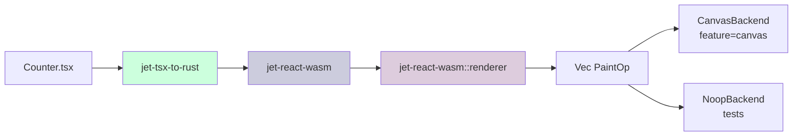
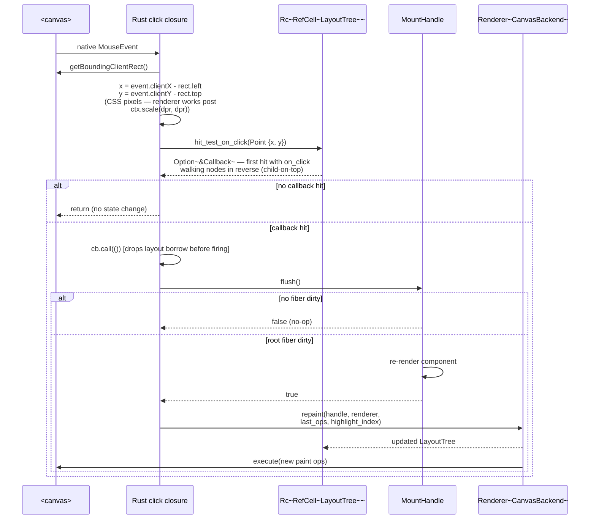

# Paint runtime — Element tree → canvas paint ops

## Changes
<!-- type: changes lang: yaml -->

```yaml
changes:
  - path: ".aw/tech-design/projects/jet/logic/wasm-renderer-paint-runtime.md"
    action: modify
    section: doc
    impl_mode: hand-written
    description: |
      Legacy Jet TD content retained as notes during AW standardization.
      Rewrite this file into semantic TD sections before promoting source to CODEGEN.
```

## Legacy notes
<!-- type: doc lang: markdown -->

# Paint runtime — Element tree → canvas paint ops

### Overview

Takes the `Element` tree produced by `jet-react-wasm` and
turns it into a sequence of **paint operations** a canvas can draw.
Splits cleanly into two passes:

1. **Layout** — walk the Element tree and produce a flat list of
   `LaidOutNode { element, rect }`. For v0 the layout is a naive
   row-stacking pass (no flexbox yet — that lands when `taffy` is
   integrated). Enough to render the Counter / Toggle fixtures.
2. **Paint** — walk the laid-out list and emit `PaintOp`s. For v0
   the ops cover rect fill, rect stroke, text, and intrinsic-tag
   styling (button focus ring, etc.).

The renderer sits between "React committed a new tree" and "Chromium
paints it": runtime → `Element` → **Layout** → laid-out nodes →
**Paint** → ops → canvas. Between runs the laid-out tree is cached
so subsequent paints can be diffed (v1).

The design is **data-first**: every pass returns a pure value. This
makes the pipeline testable in pure Rust (no browser required).
A real canvas backend is a thin `PaintBackend` trait impl that
executes the op list.

Parent: `logic/wasm-renderer-architecture.md`.
Module: `crates/jet-react-wasm/src/renderer/` (lives alongside the
runtime half; see `logic/wasm-renderer-hooks-runtime.md`).

### Design Contract

```mermaid
---
id: jet-wasm-renderer-paint-requirements
entry: P1
---
requirementDiagram
    requirement P1 { id: P1 text: layout is pure and deterministic risk: high verifymethod: test }
    requirement P2 { id: P2 text: paint is pure and deterministic risk: high verifymethod: test }
    requirement P3 { id: P3 text: Theme controls default colors fonts and borders risk: medium verifymethod: test }
    requirement P4 { id: P4 text: Viewport controls layout region and DPR risk: high verifymethod: test }
    requirement P5 { id: P5 text: Renderer drives layout paint and backend execution risk: high verifymethod: test }
    requirement P6 { id: P6 text: CanvasBackend is feature gated behind web sys risk: medium verifymethod: build }
    requirement P7 { id: P7 text: Layout v0 is flat vertical stack of block intrinsics risk: medium verifymethod: test }
    requirement P8 { id: P8 text: PaintOp set grows monotonically after v0 risk: medium verifymethod: review }
```

| id | Requirement | Verifies |
|----|-------------|----------|
| P1 | `layout(&Element, Viewport) -> LayoutTree` is a pure function. Same input → same output. No thread-local state, no RNG. | Unit test over handcrafted Element. |
| P2 | `paint(&LayoutTree, &Theme) -> Vec<PaintOp>` is a pure function. | Unit test. |
| P3 | `Theme` is the knob for default colours / fonts / borders. Defaults match the POC's "grid-ish" look. The transpiler never emits theme values — only components via `className` / inline styles (future). | Test with two themes yields different op streams. |
| P4 | `Viewport { width, height, dpr }` controls the layout region. Width is a hard clamp — children exceeding it are clipped in v0 (overflow handling is v1). | Unit test: wide child → clipped. |
| P5 | `Renderer<B: PaintBackend>` drives the pipeline end-to-end: `Renderer::render(&Element) -> Vec<PaintOp>` runs layout + paint + backend.execute(ops). `B = NoopBackend` for tests. | Integration test: render Counter returns N+ ops. |
| P6 | `CanvasBackend` (feature-gated, requires `web-sys`) executes the op list against a `CanvasRenderingContext2d`. Not on the default build — the bulk of this crate's logic is tested without it. | `cargo test` passes without wasm target; `wasm-pack build --features canvas` produces a working module. |
| P7 | Layout v0 scheme: flat vertical stack of block-level intrinsics. Each root child gets the full viewport width; children stack with zero margin. `<button>` gets a fixed pixel height (24 px). Text nodes inherit their parent's box. **Not production-shaped** — v1 adds flexbox via `taffy`. | Unit test: 3 children produce 3 non-overlapping rects stacked vertically. |
| P8 | Paint op types stay minimal in v0 (`FillRect`, `StrokeRect`, `Text`, `Clip`, `PushClip`, `PopClip`). The set grows strictly monotonically — removing ops needs the same deprecation window as the transpiler subset (major version). | Enum definition; snapshot tests over Counter / Toggle outputs. |

### Paint op model

```rust
#[derive(Debug, Clone, PartialEq)]
pub enum PaintOp {
    FillRect { rect: Rect, color: Color },
    StrokeRect { rect: Rect, color: Color, width: f32 },
    Text {
        origin: Point,
        content: String,
        font: FontSpec,
        color: Color,
    },
    /// Clip subsequent ops to this rect.
    PushClip { rect: Rect },
    PopClip,
}

#[derive(Debug, Clone, Copy, PartialEq)]
pub struct Rect { pub x: f32, pub y: f32, pub w: f32, pub h: f32 }

#[derive(Debug, Clone, Copy, PartialEq)]
pub struct Point { pub x: f32, pub y: f32 }

#[derive(Debug, Clone, Copy, PartialEq)]
pub struct Color { pub r: u8, pub g: u8, pub b: u8, pub a: u8 }

#[derive(Debug, Clone, PartialEq)]
pub struct FontSpec {
    pub family: String,
    pub size_px: f32,
    pub weight: u16,
}
```

Op semantics are the same as the HTML Canvas 2D spec equivalents.
The backend is free to collapse / reorder ops as long as the final
pixel output matches.

### Layout v0 algorithm

Pseudocode:

```
layout(element, viewport):
  visitor state: cursor_y = 0, laid = []
  recurse(element, Rect { x: 0, y: 0, w: viewport.w, h: viewport.h })
  return LayoutTree { root_rect, nodes: laid }

recurse(element, box):
  match element:
    Empty:
      return
    Text(s):
      laid.push((Text(s), box))
    Intrinsic { tag, props, children }:
      # tag-specific default height
      inner_box = match tag:
        "button" => box.with_height(24),
        "input" | "textarea" => box.with_height(28),
        _ => box
      laid.push((Intrinsic { tag, props }, inner_box))
      # stack children vertically inside this box
      cursor = inner_box.y
      for child in children:
        child_box = inner_box.with_y(cursor)
        recurse(child, child_box)
        cursor += measure_block_height(child)
    Component(_):
      panic!("layout given unrendered component — runtime bug")
```

`measure_block_height` today is another fixed-height lookup based
on tag. v1 will integrate `taffy` and produce a real flexbox layout.

### Paint v0 algorithm

```
paint(layout_tree, theme):
  ops = []
  for (element_ref, rect) in layout_tree.nodes:
    match element_ref:
      Intrinsic { tag, props }:
        # Background fill based on theme + className lookup.
        if let Some(bg) = theme.bg_for(tag, props):
          ops.push(FillRect { rect, color: bg })
        # Border.
        if let Some(border) = theme.border_for(tag, props):
          ops.push(StrokeRect { rect, color: border.color, width: border.width })
      Text(content):
        ops.push(Text {
          origin: rect.top_left() + theme.text_padding(),
          content,
          font: theme.default_font.clone(),
          color: theme.text_color,
        })
      _: pass
  return ops
```

v1 will fold in:

- Per-tag visual chrome (focus ring on `<button>`, caret on `<input>`).
- className-driven styling (a className map in `Theme` until the
  binding-manifest-driven CSS subset lands).
- Hover / active pseudo-states (via the event dispatch crate).

### Renderer API

```rust
pub struct Renderer<B: PaintBackend> {
    pub viewport: Viewport,
    pub theme: Theme,
    pub backend: B,
}

impl<B: PaintBackend> Renderer<B> {
    pub fn new(viewport: Viewport, theme: Theme, backend: B) -> Self { ... }

    /// Layout + paint + backend.execute(ops). Returns the ops for
    /// test observation.
    pub fn render(&mut self, element: &Element) -> Vec<PaintOp> { ... }
}

pub trait PaintBackend {
    fn execute(&mut self, ops: &[PaintOp]);
}

pub struct NoopBackend;
impl PaintBackend for NoopBackend {
    fn execute(&mut self, _ops: &[PaintOp]) {}
}

#[cfg(feature = "canvas")]
pub struct CanvasBackend {
    ctx: web_sys::CanvasRenderingContext2d,
}
#[cfg(feature = "canvas")]
impl PaintBackend for CanvasBackend { ... }
```

`NoopBackend` is the default for tests; `CanvasBackend` lives
behind a feature flag so the crate compiles for `cargo test` on a
host with no `web-sys` target.

### Invalidation

v0 rebuilds the op list from scratch on every `render`. This is
correct but wasteful — a fiber flush that touches one node still
repaints every node.

v1 lands two deltas:

1. Layout nodes get a **stable key** derived from fiber id + path.
   Re-layout reuses entries whose key is unchanged.
2. Paint ops get a dirty-region union: for each changed node's
   bounding rect, the backend pushes a clip and repaints inside.

Neither is required for the MVP test harness. Snapshot tests assert
full op lists, which is the stricter comparison.

### Theme

```rust
pub struct Theme {
    pub bg: Color,
    pub text_color: Color,
    pub default_font: FontSpec,
    pub button_bg: Color,
    pub button_border: BorderSpec,
    pub border_default: BorderSpec,
}

pub struct BorderSpec {
    pub color: Color,
    pub width: f32,
}

impl Default for Theme {
    // Matches the POC's grid-ish look.
}
```

v1 extends `Theme` with a `classNameMap: HashMap<String, StyleSheet>`
for className-driven styling. Today the transpiler rejects any
className whose value isn't a string literal, so the renderer can
assume literal class names.

### Test strategy

1. **Pure-Rust unit tests over hand-built Elements.** Layout /
   paint / `Renderer::render` all testable without a browser.
2. **Integration tests against `jet-react-wasm`**. A test
   mounts the Counter from the runtime's integration suite and
   asserts the renderer's op list shape.
3. **Snapshot tests.** Freeze the expected `Vec<PaintOp>` output
   for Counter and Toggle. Any accidental change to layout /
   paint perturbs the snapshot and forces review.
4. **WASM smoke** (future). Once `CanvasBackend` exists + the
   bench POC is promoted into this crate, wire a jet-test that
   loads the compiled module + asserts canvas pixels via the
   `toHaveScreenshot` matcher.

Snapshot discipline: snapshots live as Rust `&[PaintOp]` arrays in
the test file (not a separate snapshot file) so diffs show up as
normal Rust code review. Each snapshot has a comment anchoring it
to the visual intent ("Counter at n=0: button centred, label 'count: 0'").

### Interaction with the rest of the pipeline



The Renderer **does not** know about fibers, hooks, or state. It
takes an `Element` tree and produces ops. The runtime owns the
commit phase; the renderer runs after.

### Fragment — transparent layout + paint

`Element::Fragment(Vec<Element>)` has no layout box of its own. The
recursive walk treats it as if its children were inlined into the
parent's child list:

```rust
match element {
    ...
    Element::Fragment(children) => {
        for child in children {
            recurse(child, parent_box, cursor, out);
        }
    }
}
```

`measure_block_height` sums the inner children's heights the same
way — no per-Fragment overhead, no spurious laid-out node emitted.
`paint` is unaffected (it walks `LayoutTree.nodes`, which by then
is already flattened).

Today the only source of `Fragment` is the transpiler's
`{[...Array(n)].map(...)}` lowering — see
`logic/wasm-renderer-transpiler.md`. Future
sources include JSX `<>…</>` and array literals in JSX interp
children.

### Click event loop



> **Synthetic event upgrade**: the deepest-only single-callback path
> documented above is the v0 shape. The v1 path replaces
> `hit_test_on_click` with a deepest-first hit path, walks it in bubble
> order, fires each handler with a fresh `SyntheticMouseEvent`, and
> halts on `e.stop_propagation()`. See
> `logic/wasm-renderer-event-pipeline.md` for the dispatcher contract,
> the `SyntheticMouseEvent` shape, and the `EventCallback<E>` type that
> replaces `Callback<()>` for click.

Key invariants:

- **Layout is captured in an `Rc<RefCell<LayoutTree>>`** so both the
  click listener and the (feature-gated) `JetDebug` handle share
  the same live view. `hit_test_on_click` borrows immutably; the
  callback fires after the borrow is dropped because the callback
  itself calls `setN.set(...)` which may mutate runtime state
  that the next `repaint` immutably borrows.
- **`hit_test_on_click` walks `nodes` in reverse** so child-on-top
  z-order resolves correctly — a text leaf painted atop its parent
  button is returned first. `pick_at` (debug surface) uses the
  same direction for the same reason.
- **DPR-aware coord math** is done once at mount time via
  `ctx.scale(dpr, dpr)`; the closure itself always works in CSS
  pixels.
- **Closure ownership transfers to JS.** `Closure::forget()` is
  called after `add_event_listener_with_callback` so the closure
  outlives the enclosing `run()` fn. Rust-side closures reference
  the shared `Rc`s — no cross-thread concerns since this is
  single-threaded WASM.

### CaptureBackend — debug-only op cache

When the `debug` feature is enabled on `jet-wasm`, `canvas_app::run`
additionally stores each frame's `Vec<PaintOp>` in an
`Rc<RefCell<Option<Vec<PaintOp>>>>` before calling
`backend.execute(&ops)`. The shared cell is the same one the
`JetDebug::paintOps()` method reads, so external tooling sees
exactly the ops that hit the canvas on the last frame.

No separate wrapping backend type is introduced — the caching is a
single `*last_ops.borrow_mut() = Some(ops);` line inside the
`repaint` fn, conditional on the shared cell being present (which
it always is when built with `debug` on, since `canvas_app::run`
constructs it unconditionally — cheap when unused).

### Highlight overlay

`Rc<RefCell<Option<usize>>>` — the highlight index — is read at the
end of `repaint` immediately after `renderer::paint(...)` returns
but before `backend.execute(&ops)`. When set, a single extra
`PaintOp::StrokeRect` is pushed with color `(255, 51, 51, 255)` +
width `2.0` targeting `layout.nodes[idx].rect`. Out-of-range
indices (common after a re-layout shifted nodes) are no-ops — no
panic.

The overlay is part of the main ops list, so it shows up in
`paintOps()` and any future screenshot-diff tooling sees exactly
what the canvas received. Not a separate layer.

### Growth path

| Area | v0 (this change) | v1 | v2 |
|---|---|---|---|
| Layout | fixed vertical stack + Fragment flatten | taffy flexbox | + scroll regions, zoom |
| Text | canvas `fillText` via backend | rustybuzz glyph shaping | + bidi, selection |
| Styling | hardcoded theme + className literal lookup | CSS subset from `className` / `style` | + Tailwind compile |
| Invalidation | full repaint per click | per-fiber dirty rects | composited layers |
| Events | click + hit-test via LayoutTree | onChange + onInput + onKeyDown | + gesture recognition |
| A11y | — | shadow DOM tree | + screen-reader live regions |

v0 isn't production-shaped; it's the smallest thing that **renders a
recognisable Counter** so we can assert the pipeline shape.

### Changes

```yaml
_sdd:
  id: jet-react-wasm-renderer-v0
  refs:
    - $ref: "logic/wasm-renderer-architecture#axioms"
    - $ref: "logic/wasm-renderer-hooks-runtime#element-tree"
changes:
  - path: crates/jet-react-wasm/Cargo.toml
    action: modify
    section: doc
    impl_mode: hand-written
    purpose: |
      Add `web-sys` + `wasm-bindgen` as optional deps, feature
      `canvas` gating the renderer's Canvas backend.
  - path: crates/jet-react-wasm/src/renderer/mod.rs
    action: create
    section: doc
    impl_mode: hand-written
    purpose: |
      PaintOp / Rect / Point / Color / FontSpec types. Layout +
      Paint passes. Renderer + PaintBackend + Noop / Recording.
      Theme with a sensible default.
  - path: crates/jet-react-wasm/src/renderer/canvas.rs
    action: create
    section: doc
    impl_mode: hand-written
    purpose: |
      `#[cfg(feature = "canvas")]` CanvasBackend executing
      PaintOps against a web_sys CanvasRenderingContext2d.
  - path: crates/jet-react-wasm/tests/renderer_layout.rs
    action: create
    section: doc
    impl_mode: hand-written
    purpose: |
      Hand-built Element trees → expected LayoutTree shapes.
      Vertical stacking, tag-height overrides, Empty skip,
      Component panic path.
  - path: crates/jet-react-wasm/tests/renderer_paint.rs
    action: create
    section: doc
    impl_mode: hand-written
    purpose: |
      Hand-built LayoutTrees → expected PaintOp snapshots.
      Counter + Toggle shapes frozen as `[PaintOp]` arrays.
  - path: crates/jet-react-wasm/tests/renderer_integration_counter.rs
    action: create
    section: doc
    impl_mode: hand-written
    purpose: |
      End-to-end: mount Counter from jet-react-wasm's runtime,
      run the renderer, assert op list shape + key ops present.
  - path: .aw/tech-design/crates/jet/logic/wasm-renderer-paint-runtime.md
    action: create
    section: doc
    impl_mode: hand-written
    purpose: "This spec."
```
