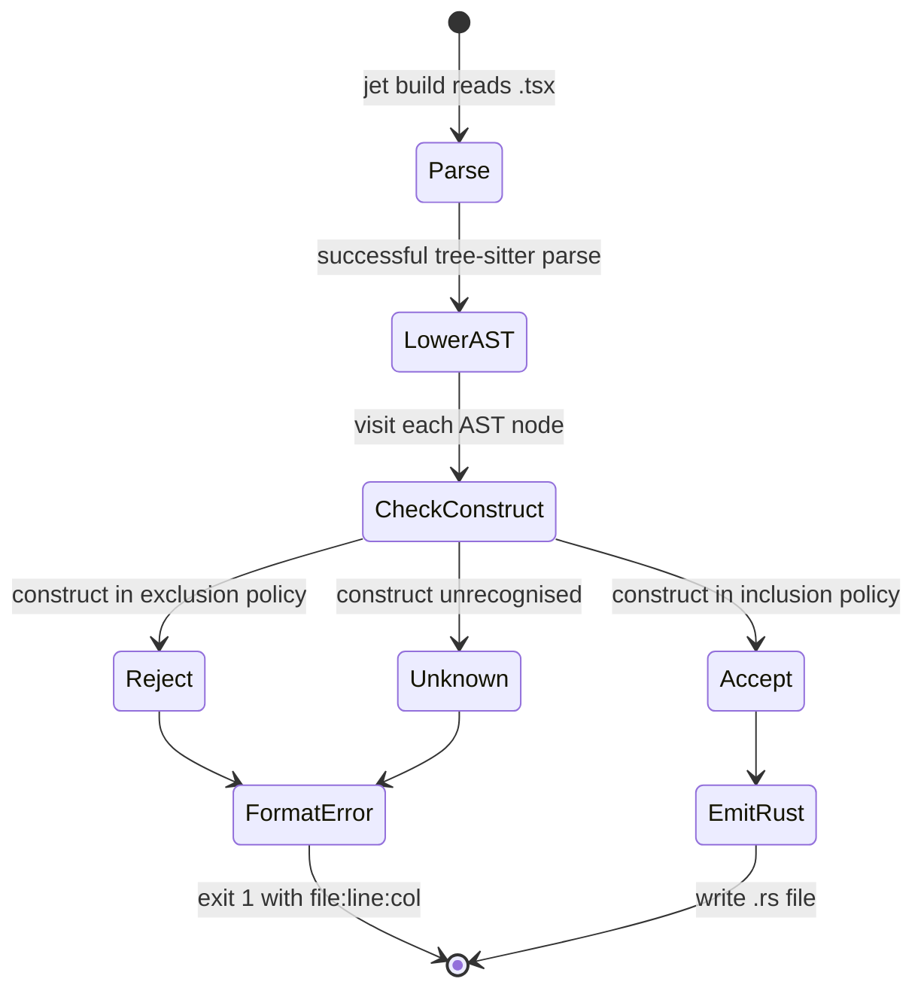

# React-compat subset

## Changes
<!-- type: changes lang: yaml -->

```yaml
changes:
  - path: ".aw/tech-design/projects/jet/logic/wasm-renderer-subset.md"
    action: modify
    section: doc
    impl_mode: hand-written
    description: |
      Legacy Jet TD content retained as notes during AW standardization.
      Rewrite this file into semantic TD sections before promoting source to CODEGEN.
```

## Legacy notes
<!-- type: doc lang: markdown -->

# React-compat subset

### Overview

Defines the subset of TSX the transpiler accepts. Source that
falls outside the subset **must fail at build time** with a
precise error: file:line:col, the offending construct kind,
and (where feasible) a suggested rewrite.

This policy document is referenced by every transpiler lowering
rule. It is **the contract** with developers: anything here is
allowed, anything not here isn't.

Parent: `logic/wasm-renderer-architecture.md`.

Related: `logic/wasm-renderer-transpiler.md` (implements enforcement).

### Why a subset

Full React + TypeScript semantics cannot be compiled to
fully-statically-linked WASM:

- `eval` / `new Function(...)` require a JS engine at runtime.
- Arbitrary class-based prototype manipulation can't be
  type-checked at build.
- Most third-party libraries that reach into DOM / globals /
  prototype chains need wrapping on a case-by-case basis.
- JS `this`-dynamic semantics don't map to Rust without runtime
  reflection overhead.

The subset excludes these. What remains is a **statically-typed,
pure-functional React dialect** that compiles 1:1 to Rust. The
audience is products that are:

- Written in modern React idioms (function components + hooks),
- Willing to stay inside the subset in exchange for
  WASM-native execution,
- Ready to author binding manifests for any non-compliant npm
  package (see `binding-manifest.md`, future).

### Inclusion policy

```mermaid
---
id: jet-wasm-renderer-subset-inclusion
entry: S1
---
requirementDiagram
    requirement S1 { id: S1 text: Function components are accepted risk: high verifymethod: test }
    requirement S2 { id: S2 text: Runtime hooks are accepted risk: high verifymethod: test }
    requirement S3 { id: S3 text: Pure JSX data forms are accepted risk: high verifymethod: test }
    requirement S4 { id: S4 text: TypeScript primitives interfaces unions and simple generics are accepted risk: medium verifymethod: test }
    requirement S5 { id: S5 text: async await inside useEffect callbacks is accepted risk: medium verifymethod: test }
    requirement S6 { id: S6 text: Suspense and ErrorBoundary are accepted risk: medium verifymethod: test }
    requirement S7 { id: S7 text: createContext and useContext are accepted risk: medium verifymethod: test }
    requirement S8 { id: S8 text: memo forwardRef and Fragment are accepted risk: medium verifymethod: test }
    requirement S9 { id: S9 text: Imports declared in binding manifests are accepted risk: high verifymethod: test }
    requirement S10 { id: S10 text: Bounded destructuring spread optional chaining nullish coalescing and template literal forms are accepted risk: medium verifymethod: test }
```

| id | Accepted | Rationale |
|----|----------|-----------|
| S1 | Function components | Pure functional; maps cleanly to Rust fns |
| S2 | Hooks from the runtime surface (`useState`, `useEffect`, `useMemo`, `useCallback`, `useRef`, `useContext`, `useReducer`, `useId`, `useTransition`, `useDeferredValue`, `useSyncExternalStore`) | Positional, per-fiber — see `hooks-runtime.md` |
| S3 | JSX: elements, text, `{expr}` interpolation, conditional `{cond && <X/>}`, `{items.map(...)}` | All pure-data, no runtime JS reflection |
| S4 | TypeScript types (primitives, interfaces, unions over primitives, simple generics) | Used to pick Rust target types during lowering |
| S5 | `async` / `await` inside `useEffect` callbacks | Maps to Rust async via the runtime's executor |
| S6 | `Suspense` + `ErrorBoundary` | Implemented in the runtime |
| S7 | `createContext` / `useContext` | Runtime-supported |
| S8 | `memo`, `forwardRef`, `Fragment` | Runtime-supported |
| S9 | Import from whitelisted binding manifests (`jet.declare.d.ts` entries) | Declared surface is WASM-bridged |
| S10 | Destructuring, spread, optional-chain, nullish-coalescing, template literals — bounded forms | Syntactic sugar with Rust equivalents |

### Inclusion AST node kinds (machine-readable)

SWC AST node kinds (`swc_ecma_ast` / `@swc/types`) that trigger each
inclusion rule. Where a node kind is shared across rules, the entry
carries a `disambiguation_predicate`. Validated by
`cclab check-conformance-manifest` against `conformance.yaml`.

```yaml
inclusion_ast_kinds:
  S1:
    ast_node_kinds: [FunctionDeclaration, ArrowFunctionExpression]
    disambiguation_predicate: >-
      Top-level export whose body returns JSX; not a class.
  S2:
    ast_node_kinds: [CallExpression]
    disambiguation_predicate: >-
      CallExpression where callee is an Identifier resolving to a hook
      name in {useState, useEffect, useMemo, useCallback, useRef,
      useContext, useReducer, useId, useTransition, useDeferredValue,
      useSyncExternalStore}.
  S3:
    ast_node_kinds:
      - JSXElement
      - JSXOpeningElement
      - JSXText
      - JSXExpressionContainer
      - JSXAttribute
      - LogicalExpression       # for `cond && <X/>`
      - MemberExpression        # for `items.map(...)`
      - SpreadElement           # for `[...Array(n)]`
    disambiguation_predicate: >-
      LogicalExpression matches S3 only inside JSXExpressionContainer
      with `&&` operator + JSXElement RHS. MemberExpression matches S3
      only when the property name is `map` and callee object resolves
      to a list-typed value. SpreadElement matches S3 only inside an
      ArrayExpression spreading `Array(n)`.
  S4:
    ast_node_kinds:
      - TsTypeAliasDeclaration
      - TsInterfaceDeclaration
      - TsKeywordType           # number / boolean / string
      - TsArrayType             # T[]
      - TsTypeReference         # named generics
      - TsUnionType             # unions over primitives
  S5:
    ast_node_kinds: [AwaitExpression]
    disambiguation_predicate: >-
      AwaitExpression must be inside the body of an
      ArrowFunctionExpression that is the first argument to a
      CallExpression with callee resolving to `useEffect`.
  S6:
    ast_node_kinds: [JSXElement]
    disambiguation_predicate: >-
      JSXElement whose JSXOpeningElement.name resolves to `Suspense`
      or `ErrorBoundary` from React.
  S7:
    ast_node_kinds: [CallExpression]
    disambiguation_predicate: >-
      CallExpression where callee resolves to `createContext` or
      `useContext` from React.
  S8:
    ast_node_kinds: [CallExpression, JSXElement]
    disambiguation_predicate: >-
      CallExpression where callee resolves to `memo` or `forwardRef`
      from React; JSXElement whose name resolves to `Fragment`
      (or `<>`).
  S9:
    ast_node_kinds: [ImportDeclaration]
    disambiguation_predicate: >-
      ImportDeclaration whose `source` resolves to a module declared
      in a `jet.declare.d.ts` binding manifest.
  S10:
    ast_node_kinds:
      - ObjectPattern           # destructuring
      - ArrayPattern
      - SpreadElement
      - OptionalChainExpression
      - LogicalExpression       # for `??`
      - TemplateLiteral
    disambiguation_predicate: >-
      LogicalExpression matches S10 only with operator `??`. SpreadElement
      matches S10 only outside the S3 array-spread form.
```

### Exclusion policy

```mermaid
---
id: jet-wasm-renderer-subset-exclusion
entry: X1
---
requirementDiagram
    requirement X1 { id: X1 text: Class components are rejected risk: high verifymethod: test }
    requirement X2 { id: X2 text: eval and Function constructor are rejected risk: high verifymethod: test }
    requirement X3 { id: X3 text: Prototype reflection and Proxy constructs are rejected risk: high verifymethod: test }
    requirement X4 { id: X4 text: this references outside safe arrow method contexts are rejected risk: medium verifymethod: test }
    requirement X5 { id: X5 text: Dynamic import to non TSX modules is rejected risk: medium verifymethod: test }
    requirement X6 { id: X6 text: Undeclared imports without binding manifest entries are rejected risk: high verifymethod: test }
    requirement X7 { id: X7 text: Module scope side effects requiring JS event loop semantics are rejected risk: medium verifymethod: test }
    requirement X8 { id: X8 text: Arbitrary function prototype usage is rejected risk: medium verifymethod: test }
    requirement X9 { id: X9 text: with statements are rejected risk: low verifymethod: test }
    requirement X10 { id: X10 text: debugger statements are rejected risk: low verifymethod: test }
    requirement X11 { id: X11 text: Untyped props and any are rejected risk: high verifymethod: test }
    requirement X12 { id: X12 text: Generic components are rejected in v0 risk: medium verifymethod: test }
```

The build rejects any TSX source that uses these constructs. For
each rejection, the error includes:

1. The file:line:col of the offending node.
2. The short name of the construct.
3. A **suggested rewrite** wherever one exists.

| id | Rejected | Error name | Suggested rewrite |
|----|----------|-----------|-------------------|
| X1 | Class components (`class Foo extends Component`) | `class-component` | Convert to a function component with hooks. `componentDidMount` → `useEffect(() => ..., [])`; `this.state` → `useState`; `this.setState` → setter. |
| X2 | `eval` / `new Function(...)` | `dynamic-code` | Not supported. Move the computation to build time or static Rust. |
| X3 | `Object.defineProperty`, `Reflect.*`, `Proxy` | `prototype-manipulation` | Not supported. Use a plain struct + explicit accessor. |
| X4 | `this` inside functions (outside arrow-function-in-method contexts) | `this-reference` | Lift state to a closure variable or use a hook. |
| X5 | Dynamic `import()` to non-TSX modules | `dynamic-import-non-tsx` | Declare the module in a `jet.declare.d.ts` binding manifest. |
| X6 | `import X from 'some-untyped-lib'` where no binding manifest exists | `undeclared-import` | Add a `jet.declare.d.ts` binding OR remove the import. |
| X7 | Module-scope side effects requiring JS event-loop semantics (e.g. top-level `setTimeout`) | `module-scope-side-effect` | Wrap in `useEffect` inside a component. |
| X8 | Arbitrary prototypes (function prototypes, constructors) | `function-prototype` | Use a struct. |
| X9 | `with` statements | `with-statement` | Rewrite with explicit scope. |
| X10 | `debugger` | `debugger-statement` | Remove. Use jet's Inspector (`jet test --debug`). |
| X11 | Untyped props / `any` | `untyped-props` | Add a TypeScript interface for the component's props. |
| X12 | Generic components (`function Counter<T>({...}: P<T>)`) — v0 | `generic-component` | Specialise the component per type until generics land. |

### Exclusion AST node kinds (machine-readable)

SWC AST node kinds that trigger each exclusion rule. Where a kind is
shared with an inclusion rule, the disambiguation_predicate states the
sub-condition that distinguishes the X-rule trigger.

```yaml
exclusion_ast_kinds:
  X1:
    ast_node_kinds: [ClassDeclaration, ClassExpression]
    disambiguation_predicate: >-
      ClassDeclaration where `superClass` is non-null (`extends Component`
      or any superclass).
  X2:
    ast_node_kinds: [CallExpression, NewExpression]
    disambiguation_predicate: >-
      CallExpression where callee is the Identifier `eval`, OR
      NewExpression where callee is the Identifier `Function`.
  X3:
    ast_node_kinds: [CallExpression, NewExpression]
    disambiguation_predicate: >-
      CallExpression where callee is a MemberExpression on `Object` with
      property `defineProperty`, OR any access to `Reflect.*`, OR
      NewExpression of `Proxy`.
  X4:
    ast_node_kinds: [ThisExpression]
    disambiguation_predicate: >-
      ThisExpression outside the body of an arrow-function-in-method
      context (i.e. inside any function that re-binds `this`).
  X5:
    ast_node_kinds: [CallExpression]
    disambiguation_predicate: >-
      CallExpression with callee `import` (dynamic import) where the
      argument resolves to a non-TSX module path.
  X6:
    ast_node_kinds: [ImportDeclaration]
    disambiguation_predicate: >-
      ImportDeclaration whose `source` is absent from any
      jet.declare.d.ts binding-manifest entry.
  X7:
    ast_node_kinds: [CallExpression, ExpressionStatement]
    disambiguation_predicate: >-
      Module-scope CallExpression where callee resolves to a
      JS-event-loop function (e.g. `setTimeout`, `setInterval`,
      `queueMicrotask`) outside any function or component body.
  X8:
    ast_node_kinds: [FunctionDeclaration, FunctionExpression]
    disambiguation_predicate: >-
      Function used as a constructor (NewExpression callee) or with
      explicit `prototype` mutation, distinguishing it from S1
      function-component shape.
  X9:
    ast_node_kinds: [WithStatement]
  X10:
    ast_node_kinds: [DebuggerStatement]
  X11:
    ast_node_kinds: [TsKeywordType]
    disambiguation_predicate: >-
      TsKeywordType with `kind: "any"` used in a component-prop type
      position. Distinguishes from S4 keyword-type usage.
  X12:
    ast_node_kinds: [FunctionDeclaration, ArrowFunctionExpression]
    disambiguation_predicate: >-
      Function/ArrowFunctionExpression with non-empty `typeParameters`
      whose return type is JSX (i.e. a generic component). Distinguishes
      from S1 function components by the presence of TS generics.
```

### Error shape

```
out-of-subset: <kind>
  at <file>:<line>:<col>
  <source snippet ±1 line>

Suggested rewrite:
  <actionable hint>

See: subset.md#<X-id> for the rationale.
```

Example (fabricated):

```
out-of-subset: dynamic-code
  at src/components/Counter.tsx:12:9

  10 | export function Counter() {
  11 |   const [fn] = useState(() =>
  12 |     new Function('x', 'return x + 1')
           ^^^^^^^^^^^^
  13 |   );
  14 | }

Suggested rewrite:
  Replace `new Function(...)` with a plain Rust function — move the
  logic to a `.ts` helper file or inline it as a TSX expression.

See: subset.md#X2 for the rationale.
```

### Enforcement pipeline



The default for **unrecognised** constructs (Unknown branch) is
**reject, not accept**. A TSX file that uses something the
transpiler hasn't learned about yet fails with a message that
distinguishes it from the "intentionally rejected" branch:

```
unrecognised-construct: <kind>
  at <file>:<line>:<col>

This is probably a transpiler gap — please open a ticket at
<repo>/issues with the TSX snippet.
```

This keeps the subset's boundary sharp: nothing slips through
silently.

### Growth policy

The subset grows over time. Each addition is a PR that:

1. Adds a row to the **inclusion policy** table AND the
   **inclusion AST node kinds** YAML block (with
   `disambiguation_predicate` if the kind is shared).
2. Adds a corresponding entry in
   [`conformance.yaml`](./conformance.yaml) — with `status: pending`
   if the integration test ships in a later PR, or `status: verified`
   if the test ships in the same PR. The `cclab check-conformance-manifest`
   CI check (see `conformance.md` § CI Validation) validates the
   schema and path existence on every push.
3. Adds the lowering rule to `transpiler.md` and
   `src/emit.rs` with tests.
4. Cross-references the hooks-runtime or renderer change if any
   new runtime surface was needed.
5. Updates the **Error name** table in the exclusion list if a
   previously-rejected construct is now accepted.

Shrinking the subset (removing previously-accepted constructs) is
allowed but requires a deprecation window:

1. One minor release emits a **warning** on use.
2. Next minor release becomes an error.
3. Never break a major-version contract mid-major.

### Binding manifests (forward reference)

`jet.declare.d.ts` extends the subset per-project: a manifest
declares which npm packages are safe to import, what functions they
expose, and how to bridge them into WASM. Without a manifest entry,
every non-TSX import is an X6 error.

The manifest format + codegen lives in
`interfaces/wasm-renderer/binding-manifest.md`. Rough shape:

```ts
// jet.declare.d.ts
declare module "lodash/get" {
  // Flag: reimplemented in Rust, not bridged.
  export default function(obj: unknown, path: string): unknown;
  declare const __jet_impl: "rust:lodash_get";
}

declare module "@tanstack/react-query" {
  export function useQuery<T>(opts: UseQueryOpts): UseQueryResult<T>;
  declare const __jet_impl: "bridge:@tanstack/react-query";
}
```

The transpiler consults the manifest during `import` resolution and
emits either a Rust `use` statement (rust: path) or a bridge call
through wasm-bindgen (bridge: path).

### Verified features

The authoritative list of verified features is the machine-readable
manifest at [`conformance.yaml`](./conformance.yaml). Each entry there
binds a feature to its inclusion rule (S/X/B), the SWC AST node kinds
that trigger it, the demo directory under `examples/`, the integration
test file under `crates/jet/tests/`, and a verification status
(`verified` / `unit_only` / `pending`).

The manifest is validated on every PR by
`cclab check-conformance-manifest` (see `conformance.md` § CI Validation
and `crates/jet-conformance-cli/`):

- structural fields per [`conformance.yaml.schema.json`](./conformance.yaml.schema.json),
- `ast_node_kinds` is required for every S/X entry,
- non-pending entries' `demo_dir` and `test_file` paths must exist on disk.

Each verified feature is exercised end-to-end by a `#[ignore]`d
integration test under `crates/jet/tests/` that builds an
`examples/<name>-demo/` app with `jet build --wasm --debug`, mounts it
in Chromium, and asserts behaviour through the `window.__jet_debug`
bridge.

Features in S2 / S3 **not yet runtime-tested** (unit tests may
exist but no in-browser verification):

- `useEffect`, `useCallback`, `useRef`, `useContext`,
  `useReducer`, `useId` — runtime surface exists in
  `jet_wasm::react`; transpiler doesn't emit them yet.
  (`useMemo` shipped in the usememo-demo / `usememo_debug.rs`
  pair.)
- Method-chain list renders (`items.filter(...).map(...)`) — only
  the two specific `.map()` shapes (range + direct iter-map) are
  recognized today.
- Event attrs beyond `onClick` — `onChange`, `onInput`,
  `onKeyDown`, `onBlur`, `onFocus` etc. (runtime callback slots
  exist for `on_change`; transpiler doesn't emit the attribute
  match yet).
- `style={{...}}` object syntax; only the flat `style: Option<String>`
  prop lands through the current pipeline.
- Multi-dim TS prop types (`string[][]`) — `ts_type_to_rust`
  handles them recursively (`Vec<Vec<String>>`) but no test
  exercises it yet.

New features graduate to `status: verified` in `conformance.yaml`
when they acquire a Level-1 integration test — see
`scenarios-verification-harness.md` (future).

### FAQ

- **"Can I incrementally adopt this in an existing React app?"** — Yes via `<WasmView>` boundary (see architecture doc); but inside a boundary the whole subtree must satisfy the subset.
- **"What happens to my Redux store?"** — Declared in a binding manifest. Redux itself isn't in the subset; a Rust port (or a JS-bridged version) is.
- **"Can I call a plain fetch?"** — Yes. `fetch` is a first-party binding; `useEffect(() => { const r = await fetch('/api'); ... }, [])` works.
- **"Does `this` ever work?"** — No. The subset has no `this`. If TSX code relies on `this` dynamics, it's class-component-shaped and falls under X1.
- **"What about JSX from imported component libraries?"** — That library needs to also be in-subset (ideally the library is also WASM-compiled via jet) OR be declared as a bridge. Libraries that render to DOM imperatively (e.g. via refs + `document.createElement`) cannot be bridged.
- **"Does it support new React features (Server Components, use hook)?"** — Not in v1. Track via runtime roadmap (`hooks-runtime.md`).
