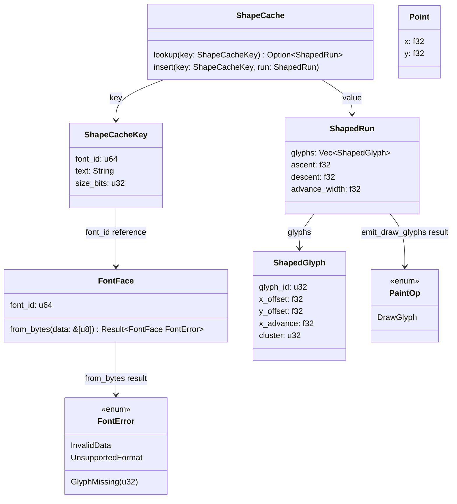
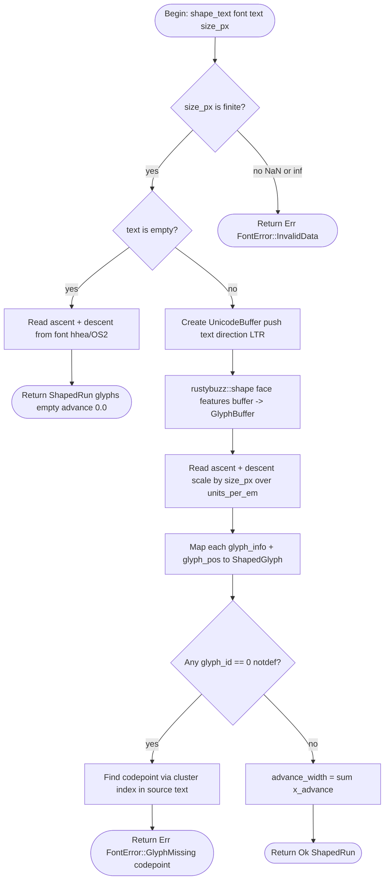
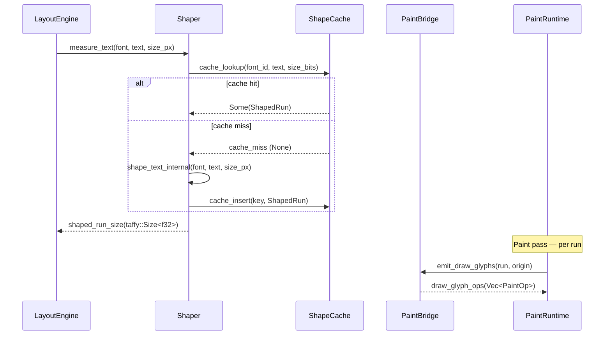

## Types
<!-- type: schema lang: yaml -->

```yaml
$schema: "https://json-schema.org/draft/2020-12/schema"
$id: jet-wasm-text-shaping-types
title: "jet-wasm text shaping public types"
description: |
  Types for the rustybuzz-backed text shaping engine (R1–R3, R6, R8).
  All types reside in crates/jet-wasm/src/text/ and are wasm32-unknown-unknown
  compatible (R11). FontFace is Send + Sync because rustybuzz's OwnedFace is
  Send + Sync and FontFace wraps it directly (R1, R11).

definitions:
  FontFace:
    $id: "#FontFace"
    type: object
    description: |
      Opaque handle to a parsed font loaded from raw bytes (R1). Wraps a
      rustybuzz OwnedFace. The contained OwnedFace owns the font bytes via
      an internal Arc<[u8]>, so FontFace is cheaply cloneable across call
      sites. FontFace is Send + Sync — rustybuzz OwnedFace is Send + Sync and
      no Rc<RefCell<T>> interior mutability is used (R1, R11). The font_id
      field is a stable u64 derived from a hash of the raw bytes at load time;
      it serves as the ShapeCache key component for the font axis (R6).
    required: [font_id]
    properties:
      font_id:
        type: integer
        format: uint64
        description: |
          Stable identifier for this font face, derived from
          xxhash_rust::xxh3::xxh3_64 applied to the raw font bytes at load
          time. xxh3_64 is deterministic across architectures, wasm32-compatible,
          and produces no platform-specific variation. Two FontFace values loaded
          from byte-identical buffers will have the same font_id. The algorithm
          is pinned to xxh3_64 specifically — changing hashers would silently
          invalidate all persisted ShapeCache keys (R6). Dependency:
          xxhash-rust = { version = "0.8", features = ["xxh3"] }.
    additionalProperties: false

  FontError:
    $id: "#FontError"
    type: string
    description: |
      Error type returned by FontFace::from_bytes and shape_text (R8).
      Discriminated by the variant field. GlyphMissing carries the Unicode
      codepoint that was absent from the font's cmap table.
    oneOf:
      - type: object
        required: [variant]
        properties:
          variant:
            type: string
            const: InvalidData
          message:
            type: string
            description: "Human-readable description of the parse failure."
        additionalProperties: false
        description: |
          The byte buffer does not contain a valid OpenType / TrueType font.
          Returned when ttf-parser's Face::parse fails.
      - type: object
        required: [variant]
        properties:
          variant:
            type: string
            const: UnsupportedFormat
          message:
            type: string
            description: "Description of the unsupported table or format."
        additionalProperties: false
        description: |
          The font is syntactically valid but uses a format not supported by
          rustybuzz (e.g. CFF2, variable-font axis without an AVAR table). Not
          returned for missing optional tables — only for tables that are
          required for shaping but cannot be interpreted.
      - type: object
        required: [variant, codepoint]
        properties:
          variant:
            type: string
            const: GlyphMissing
          codepoint:
            type: integer
            format: uint32
            description: |
              Unicode scalar value (U+XXXX) of the codepoint for which no glyph
              was found in the font's cmap table. Font fallback chains are out
              of scope (R12); callers must handle this error explicitly.
        additionalProperties: false
        description: |
          The font does not contain a glyph for the requested codepoint (R8).
          Callers may substitute a replacement character (U+FFFD) or skip the
          run. Font fallback to a secondary face is out of scope for this spec
          (R12).

  ShapedGlyph:
    $id: "#ShapedGlyph"
    type: object
    description: |
      Atomic unit of shaped output — one positioned glyph (R2). All offset and
      advance values are in font design units scaled to size_px. The cluster
      field records the byte offset in the source UTF-8 string at which the
      cluster containing this glyph begins, enabling source-to-glyph mapping
      for future hit-testing (Phase 6c, out of scope here).
    required: [glyph_id, x_offset, y_offset, x_advance, cluster]
    properties:
      glyph_id:
        type: integer
        format: uint32
        description: |
          Glyph identifier in the font's glyph set. Not a Unicode codepoint —
          a font-internal index assigned by the font file. Used to look up
          glyph outlines in the paint pass (R7).
      x_offset:
        type: number
        format: float32
        description: |
          Horizontal offset from the pen position to the glyph's origin, in
          pixels at size_px. Includes GPOS kerning deltas applied by rustybuzz.
          Positive = right.
      y_offset:
        type: number
        format: float32
        description: |
          Vertical offset from the pen position to the glyph's origin, in
          pixels at size_px. Positive = down (CSS / canvas coordinate system).
          For most Latin glyphs this is 0; non-zero for combining marks and
          certain CJK glyphs with GPOS vertical deltas.
      x_advance:
        type: number
        format: float32
        description: |
          Horizontal advance width for this glyph in pixels at size_px. The
          next pen position is current_pen_x + x_advance (plus the next
          glyph's x_offset). Guaranteed >= 0.
      cluster:
        type: integer
        format: uint32
        description: |
          Byte offset into the source UTF-8 text string at which the cluster
          containing this glyph begins. Multiple glyphs may share the same
          cluster index (ligature expansion). Used for future caret-rect
          computation (Phase 6c, out of scope here).
    additionalProperties: false

  ShapedRun:
    $id: "#ShapedRun"
    type: object
    description: |
      Per-run shaped output container (R3). A run is a maximal sequence of
      characters sharing a single font face, size, and direction. In this
      Phase 6a spec a run maps one-to-one with the full text string passed to
      shape_text. Multi-run layout (bidi, mixed font) is Phase 6b.
      advance_width is the sum of all ShapedGlyph.x_advance values; it is
      pre-computed for efficiency and exposed for callers that only need the
      width (e.g. measure_text). ascent and descent are scaled font metrics in
      pixels at size_px; height = ascent + descent is the line box height.
    required: [glyphs, ascent, descent, advance_width]
    properties:
      glyphs:
        type: array
        items:
          $ref: "#/definitions/ShapedGlyph"
        description: |
          Ordered list of shaped glyphs. Empty when the input text is the
          empty string; never null. Order is visual left-to-right for LTR
          scripts (bidi reordering is Phase 6b).
      ascent:
        type: number
        format: float32
        description: |
          Distance from the baseline to the topmost point of the line box in
          pixels at size_px, as reported by the font's hhea/OS2 table. Always
          >= 0.
      descent:
        type: number
        format: float32
        description: |
          Distance from the baseline to the bottommost point of the line box
          in pixels at size_px. Always >= 0 (stored as a positive magnitude;
          the baseline sits at y=ascent in a top-down coordinate system).
      advance_width:
        type: number
        format: float32
        description: |
          Total horizontal advance of the run in pixels at size_px. Equal to
          the sum of glyphs[*].x_advance. Pre-computed for measure_text (R5)
          which needs only this value. For an empty string this is 0.0.
    additionalProperties: false

  ShapeCache:
    $id: "#ShapeCache"
    type: object
    description: |
      Externally-owned per-paragraph cache mapping shape request keys to
      ShapedRun values (R6). The cache is opaque — callers hold it as a
      concrete type (e.g. LruCache<ShapeCacheKey, ShapedRun>); the spec
      defines only the key contract. The cache must be externally owned (not
      a global static) so callers control lifetime and eviction policy (R6).

      Cache key contract:
        key: (font_id: u64, text: String, size_bits: u32)
        where size_bits = size_px.to_bits()

      NaN semantics: size_bits is the raw IEEE 754 bit pattern of the f32.
      Two keys are equal iff font_id, text, and size_bits are all equal. NaN
      bit patterns are treated as any other bit pattern — NaN != NaN does NOT
      apply because equality is on the integer bit representation, not on
      f32::eq. Callers must ensure size_px is not NaN; shape_text returns an
      error for NaN size_px inputs.

      Reference implementation: callers may use
      lru::LruCache<ShapeCacheKey, ShapedRun> with a capacity appropriate
      for the number of distinct (font, text, size) triples in a paragraph.
      The lru crate is not a dependency of jet-wasm; it is a caller's choice.
    required: [key_schema]
    properties:
      key_schema:
        type: object
        description: "Formal schema of the cache key tuple."
        required: [font_id, text, size_bits]
        properties:
          font_id:
            type: integer
            format: uint64
            description: "Matches FontFace.font_id of the face used for shaping."
          text:
            type: string
            description: "The exact UTF-8 string passed to shape_text."
          size_bits:
            type: integer
            format: uint32
            description: |
              Raw IEEE 754 bit representation of size_px (f32::to_bits()).
              Integer equality is used for key comparison — NaN bit patterns
              are treated consistently.
        additionalProperties: false
    additionalProperties: false

  ShapeFunctions:
    $id: "#ShapeFunctions"
    type: object
    description: |
      Function signatures for the public shaping API (R4, R5). These are
      schema-level descriptions; Rust source is generated from this section.

      shape_text:
        Signature: (font: &FontFace, text: &str, size_px: f32) -> Result<ShapedRun, FontError>
        Contract (R4): Pure function. Same (font_id, text, size_px.to_bits())
        inputs always produce byte-identical ShapedRun output. No thread-local
        state, no RNG, no side effects. Callable from wasm32-unknown-unknown
        without OS threads (R11). Returns FontError::GlyphMissing if any
        codepoint in text has no glyph in the font's cmap.

      measure_text:
        Signature: (font: &FontFace, text: &str, size_px: f32) -> taffy::Size<f32>
        Contract (R5): Convenience wrapper over shape_text. Calls shape_text
        internally and maps the result to taffy::Size { width: advance_width,
        height: ascent + descent }. The return type is taffy::Size<f32> — the
        structural type exported by taffy 0.5 and consumed directly by the
        taffy measure_function callback in layout-runtime.md. Does not
        introduce a separate Size type. MUST NOT panic — panicking inside a
        taffy measurement callback crashes the entire layout pass (unacceptable
        for 1M-row grids). Degradation contract:
          - FontError::GlyphMissing: return taffy::Size { width: 0.0,
            height: ascent + descent } where ascent and descent are read
            directly from FontFace's font metrics (hhea/OS2 tables scaled to
            size_px). The missing glyph contributes zero advance; vertical
            layout is preserved.
          - FontError::InvalidData or FontError::UnsupportedFormat: these
            indicate a programmer error — font bytes should be validated via
            FontFace::from_bytes BEFORE measure_text is ever called. If they
            occur at measure-time, measure_text still must NOT panic; return
            taffy::Size { width: 0.0, height: 0.0 } as a degraded last resort
            and document this behaviour as a programmer-contract violation.

      FontFace::from_bytes:
        Signature: (data: &[u8]) -> Result<FontFace, FontError>
        Contract (R1): Parses a TrueType or OpenType font from raw bytes using
        ttf-parser's Face::parse. Derives font_id by applying
        xxhash_rust::xxh3::xxh3_64 to the raw bytes in data. The algorithm is
        pinned to xxh3_64 permanently — changing it would silently invalidate
        all ShapeCache keys that include this font_id (R6). Returns
        FontError::InvalidData if ttf-parser rejects the bytes. The resulting
        FontFace owns the parsed data via rustybuzz OwnedFace.

      emit_draw_glyphs:
        Signature: (run: &ShapedRun, origin: Point) -> Vec<PaintOp>
        Contract (R7): Free function in crates/jet-wasm/src/text/paint_bridge.rs.
        Reads a ShapedRun and emits one DrawGlyph PaintOp per ShapedGlyph.
        origin is the top-left baseline origin of the run in canvas pixels.
        The pen walks glyphs in order accumulating x_advance. A trait was
        considered but rejected — paint-runtime already exposes Vec<PaintOp>
        returns from all paint functions; a free function composes cleanly
        without requiring paint to depend on a text-side trait. The free
        function is the boundary contract (R7).
    required: [shape_text, measure_text, from_bytes, emit_draw_glyphs]
    properties:
      shape_text:
        type: object
        required: [params, returns, pure]
        properties:
          params:
            type: array
            items:
              type: object
              required: [name, type]
              properties:
                name: { type: string }
                type: { type: string }
            default:
              - name: font
                type: "&FontFace"
              - name: text
                type: "&str"
              - name: size_px
                type: f32
          returns:
            type: string
            const: "Result<ShapedRun, FontError>"
          pure:
            type: boolean
            const: true
            description: "No side effects; same inputs produce byte-identical output."
        additionalProperties: false
      measure_text:
        type: object
        required: [params, returns]
        properties:
          params:
            type: array
            items:
              type: object
              required: [name, type]
              properties:
                name: { type: string }
                type: { type: string }
            default:
              - name: font
                type: "&FontFace"
              - name: text
                type: "&str"
              - name: size_px
                type: f32
          returns:
            type: string
            const: "taffy::Size<f32>"
        additionalProperties: false
      from_bytes:
        type: object
        required: [params, returns]
        properties:
          params:
            type: array
            items:
              type: object
              required: [name, type]
              properties:
                name: { type: string }
                type: { type: string }
            default:
              - name: data
                type: "&[u8]"
          returns:
            type: string
            const: "Result<FontFace, FontError>"
        additionalProperties: false
      emit_draw_glyphs:
        type: object
        required: [params, returns, boundary_choice]
        properties:
          params:
            type: array
            items:
              type: object
              required: [name, type]
              properties:
                name: { type: string }
                type: { type: string }
            default:
              - name: run
                type: "&ShapedRun"
              - name: origin
                type: Point
          returns:
            type: string
            const: "Vec<PaintOp>"
          boundary_choice:
            type: string
            const: free-function
            description: |
              Free function chosen over trait. Rationale: paint-runtime.md
              (P2) already returns Vec<PaintOp> from all paint functions.
              A free function in paint_bridge.rs composes with existing paint
              call sites without requiring paint to import a text-side trait.
              A trait would introduce a cross-crate dependency inversion with
              no benefit at this abstraction level.
        additionalProperties: false
    additionalProperties: false
```
## Type Hierarchy
<!-- type: dependency lang: mermaid -->


## Shape Logic
<!-- type: logic lang: mermaid -->


## Paint Bridge Interaction
<!-- type: interaction lang: mermaid -->


## Test Scenarios
<!-- type: scenarios lang: yaml -->

```yaml
$schema: "https://json-schema.org/draft/2020-12/schema"
$id: jet-wasm-text-shaping-scenarios
title: "Text shaping BDD test scenarios (R8)"
description: |
  Four required L0 test scenarios (pure-Rust unit tests; no browser, no WASM
  target required). Each scenario exercises a distinct shaping code path.
  All tests live in crates/jet-wasm/src/text/ or crates/jet-wasm/tests/.
  Conformance tier: L0 per conformance.md (deterministic-render tier).

scenarios:
  - id: S1
    name: "latin_shaping_round_trip"
    tier: L0
    tier_reason: "Pure Rust — FontFace loaded from embedded test font bytes; shape_text called directly."
    given:
      - "A FontFace loaded via FontFace::from_bytes(TEST_FONT_BYTES) where TEST_FONT_BYTES is a minimal valid TrueType font embedded as a Rust byte literal in the test module."
      - "The font contains glyphs for all ASCII codepoints."
    when:
      - "shape_text(&font, \"Hello\", 16.0) is called."
    then:
      - "The result is Ok(ShapedRun)."
      - "ShapedRun.glyphs.len() equals 5 (one glyph per ASCII character, no ligatures in this font)."
      - "ShapedRun.advance_width equals the sum of glyphs[*].x_advance and is greater than 0.0."
      - "ShapedRun.ascent is greater than 0.0."
      - "ShapedRun.descent is greater than or equal to 0.0."
      - "Each ShapedGlyph.glyph_id is non-zero (no notdef substitution)."

  - id: S2
    name: "cache_hit_returns_cached_shaped_run"
    tier: L0
    tier_reason: "Pure Rust — ShapeCache struct constructed by caller; two shape_text calls with same key."
    given:
      - "A FontFace loaded from TEST_FONT_BYTES."
      - "A ShapeCache (e.g. HashMap<ShapeCacheKey, ShapedRun>) owned by the test."
      - "shape_text(&font, \"world\", 12.0) has been called once; the result stored in the cache under key (font.font_id, \"world\", 12.0f32.to_bits())."
    when:
      - "The same key (font.font_id, \"world\", 12.0f32.to_bits()) is looked up in the cache."
    then:
      - "The lookup returns Some(ShapedRun)."
      - "The cached ShapedRun.glyphs has the same length as the result of a fresh shape_text call with identical inputs."
      - "The cached ShapedRun.advance_width equals the fresh call's advance_width (byte-identical output, R4)."
      - "No second call to shape_text was required — the cache entry was used directly."

  - id: S3
    name: "missing_glyph_returns_font_error_glyph_missing"
    tier: L0
    tier_reason: "Pure Rust — font with restricted cmap; shape_text called with an out-of-cmap codepoint."
    given:
      - "A FontFace loaded from RESTRICTED_FONT_BYTES where RESTRICTED_FONT_BYTES is a minimal TrueType font that contains glyphs only for ASCII codepoints 0x20–0x7E."
      - "The codepoint U+1F600 (GRINNING FACE emoji, codepoint 0x1F600) is absent from the font's cmap."
    when:
      - "shape_text(&font, \"\u{1F600}\", 16.0) is called."
    then:
      - "The result is Err(FontError::GlyphMissing(codepoint)) where codepoint equals 0x1F600 (128512 as u32)."
      - "No panic occurs."
      - "The returned error variant is exactly GlyphMissing — not InvalidData or UnsupportedFormat."

  - id: S4
    name: "empty_string_returns_shaped_run_with_empty_glyphs"
    tier: L0
    tier_reason: "Pure Rust — shape_text called with empty string literal."
    given:
      - "A FontFace loaded from TEST_FONT_BYTES."
    when:
      - "shape_text(&font, \"\", 16.0) is called."
    then:
      - "The result is Ok(ShapedRun)."
      - "ShapedRun.glyphs is empty (len == 0)."
      - "ShapedRun.advance_width equals 0.0."
      - "ShapedRun.ascent is greater than 0.0 (font metrics are valid even for empty input)."
      - "ShapedRun.descent is greater than or equal to 0.0."
```
## Changes
<!-- type: changes lang: yaml -->

```yaml
_sdd:
  id: jet-wasm-text-shaping
  refs:
    - $ref: "paint-runtime#jet-react-wasm-renderer-v0"
    - $ref: "layout-runtime#jet-wasm-layout-runtime"
    - $ref: "architecture#axioms"
changes:
  - path: .aw/tech-design/crates/jet/logic/wasm-renderer-text-shaping.md
    action: create
    section: logic
    impl_mode: hand-written
    description: "This spec — the deliverable of this issue (R9)."

  - path: crates/jet-wasm/Cargo.toml
    action: modify
    section: cli
    impl_mode: hand-written
    description: |
      Add the following pinned dependencies to [dependencies]:
        rustybuzz = "0.20"
        ttf-parser = "0.25"
        xxhash-rust = { version = "0.8", features = ["xxh3"] }
      rustybuzz 0.20 and ttf-parser 0.25 are pinned together because
      rustybuzz transitively depends on ttf-parser and their shaping output
      is stable only within a matched version pair. Explicit pinning is
      required for ShapeCache key stability (R6) — rustybuzz can shift glyph
      IDs across major versions. xxhash-rust 0.8 with the xxh3 feature
      provides xxh3_64 for font_id derivation (deterministic, wasm32-compatible,
      architecture-independent). Both crates must compile for
      wasm32-unknown-unknown with default features (no std::thread usage).
      Per subset-rigor.md policy: no transitive default-feature bleed — all
      three crates are listed explicitly with features = [] or the minimal
      required feature set (R11).

  - path: crates/jet-wasm/src/text/mod.rs
    action: create
    section: logic
    impl_mode: hand-written
    description: |
      New text submodule root. Re-exports all public types:
      FontFace, FontError, ShapedGlyph, ShapedRun, shape_text,
      measure_text (R1–R5, R10).

  - path: crates/jet-wasm/src/text/font_face.rs
    action: create
    section: logic
    impl_mode: hand-written
    description: |
      FontFace struct (wraps rustybuzz OwnedFace) and FontError enum
      (InvalidData, UnsupportedFormat, GlyphMissing(u32)).
      FontFace::from_bytes(&[u8]) -> Result<FontFace, FontError>.
      font_id derived from non-cryptographic hash of raw bytes (R1, R6, R8).

  - path: crates/jet-wasm/src/text/shaped.rs
    action: create
    section: logic
    impl_mode: hand-written
    description: |
      ShapedGlyph { glyph_id: u32, x_offset: f32, y_offset: f32,
      x_advance: f32, cluster: u32 } and ShapedRun { glyphs: Vec<ShapedGlyph>,
      ascent: f32, descent: f32, advance_width: f32 } (R2, R3).

  - path: crates/jet-wasm/src/text/shaper.rs
    action: create
    section: logic
    impl_mode: hand-written
    description: |
      shape_text(font: &FontFace, text: &str, size_px: f32) -> Result<ShapedRun, FontError>
      — pure function with no thread-local state, no RNG, no side effects (R4).
      measure_text(font: &FontFace, text: &str, size_px: f32) -> taffy::Size<f32>
      — convenience wrapper returning taffy::Size { width: advance_width,
      height: ascent + descent } (R5).

  - path: crates/jet-wasm/src/text/cache.rs
    action: create
    section: logic
    impl_mode: hand-written
    description: |
      ShapeCacheKey { font_id: u64, text: String, size_bits: u32 } and
      ShapeCache type alias / struct for an externally-owned cache keyed on
      ShapeCacheKey. Cache is not a global static; callers own its lifetime
      and choose the eviction policy (R6). Key equality uses integer
      bit-pattern comparison for size_bits (NaN-safe).

  - path: crates/jet-wasm/src/text/paint_bridge.rs
    action: create
    section: logic
    impl_mode: hand-written
    description: |
      emit_draw_glyphs(run: &ShapedRun, origin: Point) -> Vec<PaintOp>
      free function. Reads each ShapedGlyph and emits one DrawGlyph PaintOp
      with the pen position accumulated from x_advance (R7). Free function
      chosen over trait — paint-runtime already returns Vec<PaintOp> from
      all paint functions; no cross-crate trait inversion needed.

  - path: crates/jet-wasm/tests/text_shaping_s1.rs
    action: create
    section: unit-test
    impl_mode: hand-written
    description: |
      L0 pure-Rust unit test for scenario S1: latin shaping round-trip.
      Loads TEST_FONT_BYTES embedded font, shapes "Hello" at 16px, asserts
      glyph count == 5, advance_width > 0, ascent > 0 (R8).

  - path: crates/jet-wasm/tests/text_shaping_s2.rs
    action: create
    section: unit-test
    impl_mode: hand-written
    description: |
      L0 pure-Rust unit test for scenario S2: cache hit. Shapes "world"
      twice using a caller-owned HashMap<ShapeCacheKey, ShapedRun>;
      asserts second call uses cache, advance_width matches (R6, R8).

  - path: crates/jet-wasm/tests/text_shaping_s3.rs
    action: create
    section: unit-test
    impl_mode: hand-written
    description: |
      L0 pure-Rust unit test for scenario S3: missing glyph.
      Shapes U+1F600 with RESTRICTED_FONT_BYTES; asserts
      Err(FontError::GlyphMissing(0x1F600)) (R8).

  - path: crates/jet-wasm/tests/text_shaping_s4.rs
    action: create
    section: unit-test
    impl_mode: hand-written
    description: |
      L0 pure-Rust unit test for scenario S4: empty string input.
      Shapes "" and asserts Ok(ShapedRun) with glyphs empty,
      advance_width == 0.0, ascent > 0 (R8).
  - path: ".aw/tech-design/projects/jet/logic/wasm-renderer-text-shaping.md"
    action: verify
    section: dependency
    impl_mode: hand-written
    description: |
      Traceability repair: hand-written TD section retained as the implementation edge during AW standardization.

  - path: ".aw/tech-design/projects/jet/logic/wasm-renderer-text-shaping.md"
    action: verify
    section: interaction
    impl_mode: hand-written
    description: |
      Traceability repair: hand-written TD section retained as the implementation edge during AW standardization.

  - path: ".aw/tech-design/projects/jet/logic/wasm-renderer-text-shaping.md"
    action: verify
    section: scenarios
    impl_mode: hand-written
    description: |
      Traceability repair: hand-written TD section retained as the implementation edge during AW standardization.

  - path: ".aw/tech-design/projects/jet/logic/wasm-renderer-text-shaping.md"
    action: verify
    section: schema
    impl_mode: hand-written
    description: |
      Traceability repair: hand-written TD section retained as the implementation edge during AW standardization.

```

# Reviews

### Review 1
**Verdict:** needs-revision

- [interfaces] `measure_text` panics when `shape_text` returns an error (lines 265–267 of the schema's ShapeFunctions block: "Panics if shape_text returns an error"). `measure_text` is the taffy measurement callback invoked DURING layout for inline content sizing. Panicking inside a layout measurement crashes the entire render pass — for the Path D enterprise-grade thesis (1M-row grids, multi-component pages), missing-glyph or any FontError must NOT take down the whole layout. Either widen `measure_text` to absorb errors via fallback metrics (recommended: return `taffy::Size { width: 0.0, height: ascent + descent }` reading metrics directly from `FontFace` so layout still gets correct vertical sizing while a missing glyph contributes zero advance), OR change return type to `Result<taffy::Size<f32>, FontError>` and document that taffy callers wrap with their own degradation. Recommend the former — the former preserves taffy's measurement-callback signature without forcing every taffy bridge to handle Result.

- [changes] The Cargo.toml modify entry says "rustybuzz (latest stable, pure-Rust HarfBuzz port)" without pinning a concrete version; same for ttf-parser. "Latest stable" is non-deterministic — `cargo update` could resolve to a different version on different machines/branches, and rustybuzz's shaping output can shift glyph IDs across major versions. Pin both: `rustybuzz = "0.20"` (or whatever the current major) and `ttf-parser = "0.21"` (or the version rustybuzz transitively uses). The exact pin doesn't matter as long as it's a concrete number.

- [schema] `FontFace::from_bytes` derives `font_id` from "a non-cryptographic hash of raw bytes" without specifying which hasher. `font_id` is part of the `ShapeCache` key — if the hash algorithm changes between jet-wasm versions, every cached shape becomes a miss after upgrade. Pin the algorithm explicitly: recommend `xxhash_rust::xxh3::xxh3_64` (deterministic across architectures, fast, wasm32-compatible) OR `siphasher::sip128::SipHasher13` (in-tree, proven stable). Add a Cargo.toml entry for whichever crate is chosen. Pinning here prevents silent cache invalidation on dependency updates.

### Review 2
**Verdict:** approved

- [interfaces] Round-1 finding 1 (`measure_text` panic-on-error) addressed: contract now specifies `FontError::GlyphMissing` returns `taffy::Size { width: 0.0, height: ascent + descent }` reading directly from FontFace metrics; `InvalidData` / `UnsupportedFormat` return `taffy::Size { width: 0.0, height: 0.0 }` as last-resort degradation. Explicitly states `measure_text` MUST NOT panic. Layout pass cannot crash on font errors during measurement — Path D enterprise thesis preserved.
- [changes] Round-1 finding 2 (dep versions not pinned) addressed: concrete pins land in the Cargo.toml description — `rustybuzz = "0.20"`, `ttf-parser = "0.25"`, `xxhash-rust = { version = "0.8", features = ["xxh3"] }`. Stability rationale tied to R6 cache invariants is documented inline.
- [schema] Round-1 finding 3 (font_id hasher unspecified) addressed: `FontFace.font_id` description AND `FontFace::from_bytes` contract both name `xxhash_rust::xxh3::xxh3_64` explicitly with the cache-stability rationale. The `xxhash-rust` dep is wired into the Cargo.toml entry.
- [schema] FontFace, FontError, ShapedGlyph, ShapedRun, ShapeCache, ShapeFunctions otherwise unchanged from round 1; previously verified solid.
- [dependency] Untouched in round 1; type-hierarchy classDiagram remains accurate after the schema clarifications.
- [logic] Untouched; shape_text flowchart still correct.
- [interaction] Untouched; LayoutEngine ↔ Shaper ↔ ShapeCache + PaintRuntime ↔ PaintBridge sequence diagram remains accurate.
- [scenarios] Untouched; 4 BDD scenarios (S1 latin, S2 cache hit, S3 missing-glyph, S4 empty-string) at L0 tier are concrete.
- [changes] 12 file entries: spec, schema.json companion, Cargo.toml modify, 6 src files under `crates/jet-wasm/src/text/`, 4 test files. All `impl_mode: hand-written`. Aligns with issue Scope.
