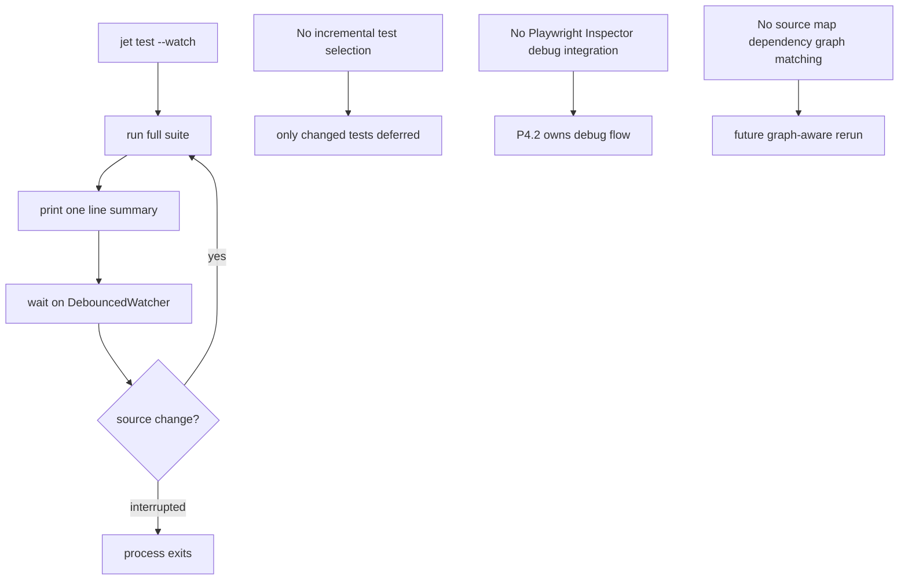

# jet `--watch` mode (P4.1)

## Changes
<!-- type: changes lang: yaml -->

```yaml
changes:
  - path: ".aw/tech-design/projects/jet/logic/watch-mode.md"
    action: modify
    section: doc
    impl_mode: hand-written
    description: |
      Legacy Jet TD content retained as notes during AW standardization.
      Rewrite this file into semantic TD sections before promoting source to CODEGEN.
```

## Legacy notes
<!-- type: doc lang: markdown -->

# jet `--watch` mode (P4.1)

### Overview

Phase 7 P4.1. `jet test --watch` reruns the suite on every source-file
change until interrupted (Ctrl-C). Reuses the existing
`runner::watcher::DebouncedWatcher` (notify-backed) — same component that
drives the JIT watch runner.

### Design Contract

```mermaid
---
id: jet-watch-mode-requirements
entry: W1
---
requirementDiagram
    requirement W1 {
        id: W1
        text: jet test watch loops by running the suite printing a summary waiting for change and rerunning
        risk: high
        verifymethod: test
    }
    requirement W2 {
        id: W2
        text: Watch mode uses a 300 ms debounce so rapid saves collapse to one rerun
        risk: medium
        verifymethod: test
    }
    requirement W3 {
        id: W3
        text: Only JS TS and TSX source files trigger a rerun
        risk: medium
        verifymethod: test
    }
    requirement W4 {
        id: W4
        text: Ctrl C exits the watch process with the normal interrupted exit path
        risk: low
        verifymethod: manual
    }
    requirement W5 {
        id: W5
        text: Watch mode remains compatible with other jet test flags
        risk: medium
        verifymethod: test
    }
```

### Non-Goals



### Changes

```yaml
_sdd:
  id: watch-mode-changes
  refs:
    - $ref: "test-runner"
changes:
  - path: crates/jet/src/cli.rs
    action: modify
    section: doc
    impl_mode: hand-written
    purpose: |
      Add `--watch` ArgAction::SetTrue to the test subcommand. In the
      handler, when --watch is set, loop: run(cfg.clone()), print
      summary, block on a freshly-constructed DebouncedWatcher
      (via spawn_blocking since wait_for_change is sync mpsc-backed),
      and restart.
  - path: .aw/tech-design/crates/jet/logic/watch-mode.md
    action: create
    impl_mode: hand-written
    purpose: "This spec."
```
