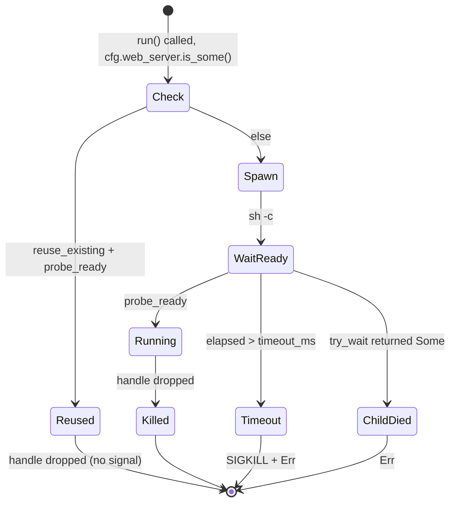

# jet `webServer` — test-runner fixture subprocess

## Changes
<!-- type: changes lang: yaml -->

```yaml
changes:
  - path: ".aw/tech-design/projects/jet/logic/web-server.md"
    action: modify
    section: doc
    impl_mode: hand-written
    description: |
      Legacy Jet TD content retained as notes during AW standardization.
      Rewrite this file into semantic TD sections before promoting source to CODEGEN.
```

## Legacy notes
<!-- type: doc lang: markdown -->

# jet `webServer` — test-runner fixture subprocess

### Overview

Implements Phase 6 P3.1 of the Playwright-replacement epic: let `jet test`
boot an external server (usually the project's dev server) before
dispatching any spec, then kill it when the runner exits. Matches
Playwright's `webServer: { command, port, url, timeout, reuseExistingServer }`
config-file knob.

Scope of this change:
- New `[test.web_server]` section in `jet.config.toml`.
- New `crates/jet/src/test_runner/web_server.rs` — `WebServerHandle` RAII
  guard with `boot(cfg, root) -> Result<WebServerHandle>`.
- Wire `web_server::boot` at the very top of `test_runner::run`. Drop of
  the handle at end-of-run SIGKILLs the child.

Non-goals (tracked separately):
- Multi-server lists (Playwright allows an array). Single-server MVP.
- HTTPS probes — the in-house probe is raw HTTP only.
- Global-setup hook.

### Design Contract

```mermaid
---
id: jet-web-server-requirements
entry: W1
---
requirementDiagram
    requirement W1 {
        id: W1
        text: jet config accepts test web server command port url timeout reuse existing and cwd fields
        risk: high
        verifymethod: test
    }
    requirement W2 {
        id: W2
        text: test runner boots the web server before spec partitioning and aborts before workers on boot failure
        risk: high
        verifymethod: test
    }
    requirement W3 {
        id: W3
        text: WebServerHandle drop kills owned children and is no op for reused servers
        risk: high
        verifymethod: test
    }
    requirement W4 {
        id: W4
        text: spawn uses shell command with null stdin and line prefixed stderr forwarding
        risk: medium
        verifymethod: test
    }
    requirement W5 {
        id: W5
        text: readiness probe supports url tcp port and optimistic no probe paths
        risk: high
        verifymethod: test
    }
    requirement W6 {
        id: W6
        text: timeout kills child and early child exit fails without waiting full timeout
        risk: high
        verifymethod: test
    }
    requirement W7 {
        id: W7
        text: cwd resolves relative to project root and defaults to project root
        risk: medium
        verifymethod: test
    }
    requirement W8 {
        id: W8
        text: reuse existing skips spawn when readiness probe already succeeds
        risk: medium
        verifymethod: test
    }
```

### Config Shape

```toml
# jet.config.toml
[test.web_server]
command = "npm run dev"          # required
port = 3000                      # optional, probed if url is absent
url = "http://localhost:3000/"   # optional, takes precedence over port
timeout_ms = 120000              # optional, default 60000
reuse_existing = true            # optional, default true
cwd = "."                        # optional, default project root
```

Omit `[test.web_server]` to keep today's behaviour (no subprocess).

### Lifecycle



### Test Plan

Location: `crates/jet/tests/web_server_tests.rs` (new). No Chromium
required — tests use a tiny in-process TCP listener or a `sh` command.

| id | Test | Covers |
|----|------|--------|
| W_parse_full | Parse TOML with all fields set. | W1 |
| W_parse_minimal | Parse TOML with only `command`. | W1 defaults |
| W_boot_with_tcp_probe | Spawn `python3 -m http.server <port>` on a free port, boot, verify ready. | W2 W5 port |
| W_boot_with_http_probe | Same spawn, but probe via `url` instead of `port`. | W5 url |
| W_boot_fails_fast_on_bad_command | `command = "false"` (exits immediately) → `boot` returns `Err` in <1s. | W6 child-died |
| W_boot_times_out | `command = "sleep 10"` with `port = <unused>` and `timeout_ms = 500` → `Err`. | W6 timeout |
| W_reuse_existing | Open a listener on port N, set `reuse_existing=true` with `command="false"` (would fail if spawned) → `boot` succeeds; handle drops without touching it. | W3 W8 |

Integration tests skip gracefully if `python3` is unavailable (`python3 -m
http.server` is the test spawn).

### Changes

```yaml
_sdd:
  id: web-server-changes
  refs:
    - $ref: "test-runner#R2"
changes:
  - path: crates/jet/src/task_runner/config.rs
    action: modify
    section: doc
    impl_mode: hand-written
    purpose: |
      Add TestConfig + WebServerConfig (+ default_web_server_timeout)
      and thread a [test] field into JetConfig.
  - path: crates/jet/src/test_runner/config.rs
    action: modify
    section: doc
    impl_mode: hand-written
    purpose: "Add web_server: Option<WebServerConfig> to RunnerConfig."
  - path: crates/jet/src/test_runner/web_server.rs
    action: create
    section: doc
    impl_mode: hand-written
    purpose: |
      WebServerHandle (RAII kill on drop), boot(cfg, root) spawns under
      sh -c, probe_ready handles URL/TCP/no-probe, logs piped to stderr.
  - path: crates/jet/src/test_runner/mod.rs
    action: modify
    section: doc
    impl_mode: hand-written
    purpose: "Boot web_server at top of run(); hold handle for the run."
  - path: crates/jet/src/cli.rs
    action: modify
    section: doc
    impl_mode: hand-written
    purpose: |
      Load [test.web_server] from jet.config.toml into RunnerConfig when
      handling `jet test`.
  - path: crates/jet/tests/web_server_tests.rs
    action: create
    section: doc
    impl_mode: hand-written
    purpose: "Integration coverage for W_parse_*, W_boot_*, W_reuse_existing."
  - path: .aw/tech-design/crates/jet/logic/web-server.md
    action: create
    section: doc
    impl_mode: hand-written
    purpose: "This spec."
```
