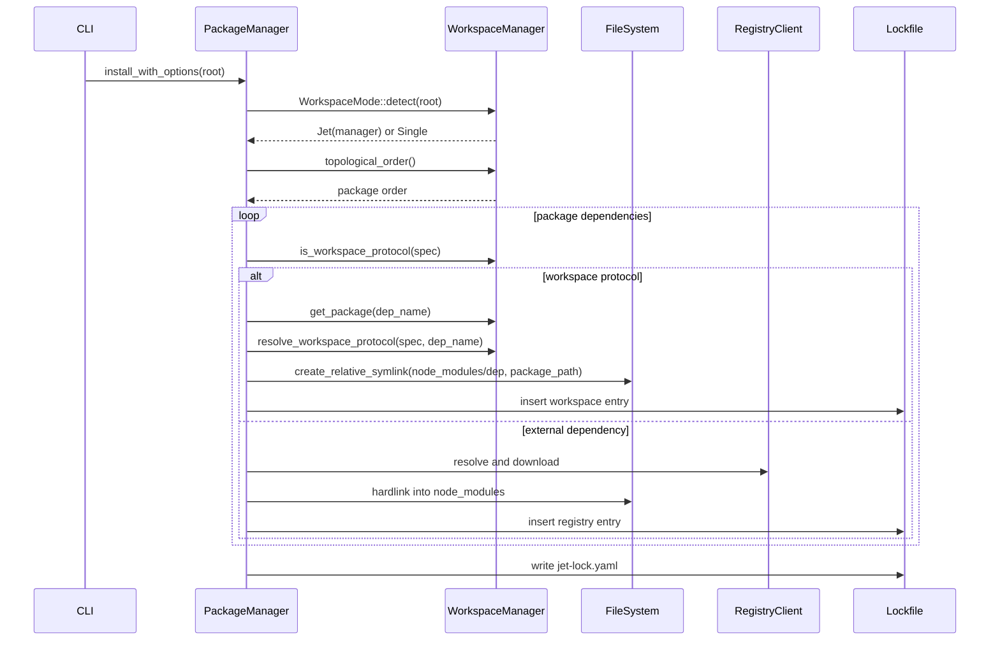
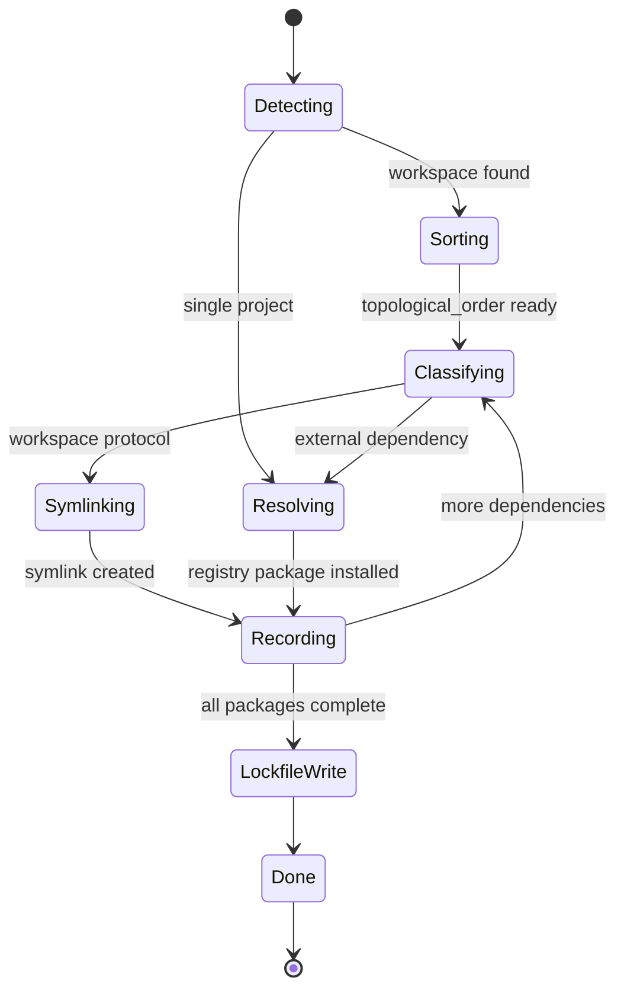
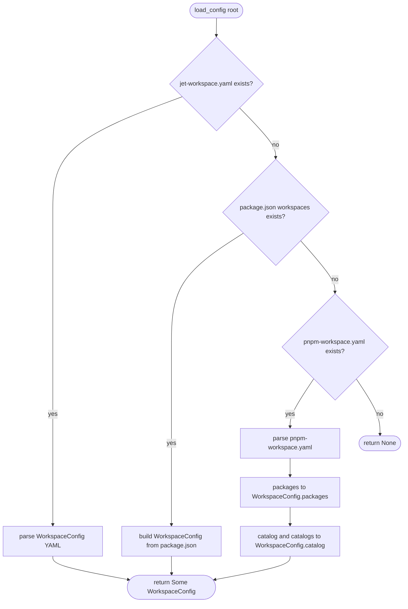
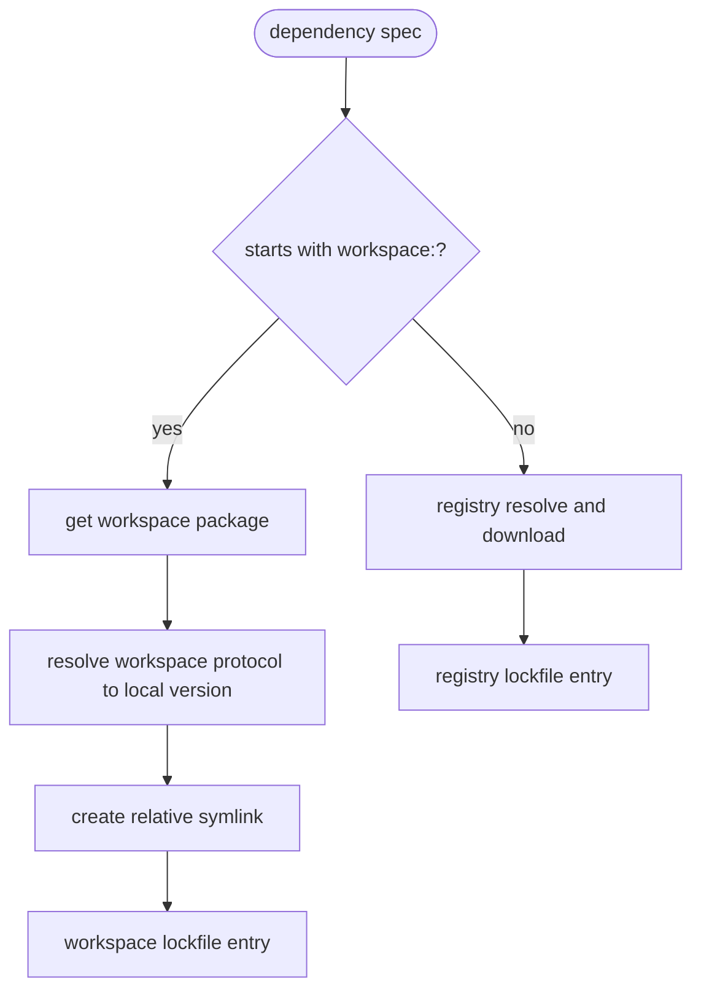

# Jet Workspace Protocol

## Changes
<!-- type: changes lang: yaml -->

```yaml
changes:
  - path: ".aw/tech-design/projects/jet/logic/workspace-protocol.md"
    action: modify
    section: doc
    impl_mode: hand-written
    description: |
      Legacy Jet TD content retained as notes during AW standardization.
      Rewrite this file into semantic TD sections before promoting source to CODEGEN.
```

## Legacy notes
<!-- type: doc lang: markdown -->

# Jet Workspace Protocol

### Overview

This spec defines Jet's pnpm-style workspace support in the package manager.
The implemented flow spans workspace config discovery, workspace protocol
classification, relative symlink creation, recursive workspace install, and
workspace-aware lockfile entries.

Current implementation surfaces:

| Concern | Source |
|---------|--------|
| Workspace config, packages, protocol helpers | `crates/jet/src/pkg_manager/workspace.rs` |
| Install orchestration and symlink path | `crates/jet/src/pkg_manager/mod.rs` |
| Lockfile workspace fields | `crates/jet/src/pkg_manager/lockfile.rs` |
| Resolved package workspace metadata | `crates/jet/src/pkg_manager/resolver.rs` |
| Integration coverage | `crates/jet/tests/workspace_protocol.rs` |

### Requirements

```yaml
requirements:
  - id: R1
    title: pnpm workspace discovery
    priority: must
    statement: "WorkspaceManager::load_config must support pnpm-workspace.yaml as the third-priority config source."
    implementation:
      - "Detection order is jet-workspace.yaml, then package.json workspaces, then pnpm-workspace.yaml."
      - "A higher-priority source prevents reading lower-priority sources."
  - id: R2
    title: pnpm workspace parsing
    priority: must
    statement: "Selected pnpm-workspace.yaml files must populate WorkspaceConfig."
    implementation:
      - "packages maps to WorkspaceConfig.packages."
      - "catalog maps to WorkspaceConfig.catalog."
      - "catalogs entries are flattened into catalog with '<catalog_name>:' prefixes."
  - id: R3
    title: workspace protocol classification
    priority: must
    statement: "Package installs must split workspace: dependencies from external dependencies."
    implementation:
      - "WorkspaceManager::is_workspace_protocol returns true for specs beginning with workspace:."
      - "External dependencies continue through registry resolution."
  - id: R4
    title: relative symlink installation
    priority: must
    statement: "Workspace dependencies must install as relative symlinks instead of tarball downloads."
    implementation:
      - "The target package is found with WorkspaceManager::get_package(dep_name)."
      - "node_modules/<dep> points to the workspace package directory using a relative symlink."
      - "Correct existing symlinks are idempotent."
  - id: R5
    title: recursive workspace install
    priority: must
    statement: "A root workspace install must cover all workspace packages in topological order."
    implementation:
      - "WorkspaceManager::topological_order computes package install order."
      - "Each package install handles workspace deps through symlinks and external deps through the registry path."
  - id: R6
    title: lockfile traceability
    priority: must
    statement: "Workspace packages must be traceable in jet-lock.yaml."
    implementation:
      - "LockfileEntry.workspace is true for workspace entries."
      - "LockfileEntry.localPath stores the package path relative to the lockfile root."
      - "Lockfile::is_valid skips store-presence checks when workspace is true."
```

### Scenarios

```yaml
scenarios:
  - name: pnpm workspace discovery fallback
    covers: [R1, R2]
    given:
      - "A root containing pnpm-workspace.yaml and no higher-priority workspace config."
    when:
      - "WorkspaceManager::discover(root) runs."
    then:
      - "Workspace packages are discovered from pnpm-workspace.yaml packages globs."
  - name: higher priority source wins
    covers: [R1]
    given:
      - "A root containing both jet-workspace.yaml and pnpm-workspace.yaml."
    when:
      - "WorkspaceManager::discover(root) runs."
    then:
      - "jet-workspace.yaml is used."
      - "pnpm-workspace.yaml is not selected."
  - name: catalog version from pnpm workspace
    covers: [R2]
    given:
      - "pnpm-workspace.yaml contains catalog.react = ^18.0.0."
    when:
      - "WorkspaceManager::catalog_version('react') is called."
    then:
      - "The result is ^18.0.0."
  - name: workspace star creates relative symlink
    covers: [R3, R4, R6]
    given:
      - "apps/web depends on packages/ui through workspace:*."
    when:
      - "jet install runs at the workspace root."
    then:
      - "apps/web/node_modules/ui is a relative symlink to the workspace package."
      - "No registry tarball is downloaded for ui."
      - "jet-lock.yaml records workspace=true and localPath."
  - name: recursive install covers all packages
    covers: [R3, R4, R5]
    given:
      - "A workspace has apps/web, packages/ui, and packages/utils."
    when:
      - "jet install runs at the workspace root."
    then:
      - "Each package is processed in topological order."
      - "Workspace deps are symlinked."
      - "External deps use the registry install path."
```

### Interaction



### State Machine



### Logic

### Config Source Detection



### Dependency Classification



### Schema

```yaml
types:
  PnpmWorkspaceYaml:
    source: pnpm-workspace.yaml
    fields:
      packages:
        type: "Vec<String>"
        maps_to: "WorkspaceConfig.packages"
      catalog:
        type: "BTreeMap<String, String>"
        maps_to: "WorkspaceConfig.catalog"
      catalogs:
        type: "BTreeMap<String, BTreeMap<String, String>>"
        maps_to: "WorkspaceConfig.catalog with '<catalog_name>:' key prefix"
  LockfileEntry:
    source: crates/jet/src/pkg_manager/lockfile.rs
    workspace_fields:
      workspace:
        type: bool
        default: false
      localPath:
        rust_field: local_path
        type: "Option<String>"
        meaning: "workspace package path relative to lockfile root"
  ResolvedPackage:
    source: crates/jet/src/pkg_manager/resolver.rs
    workspace_fields:
      workspace:
        type: bool
      local_path:
        type: "Option<String>"
```

### Test Plan

| ID | Covers | Test |
|----|--------|------|
| T1 | R1, R2 | `test_pnpm_workspace_yaml_discovery` validates pnpm-only discovery. |
| T2 | R1 | `test_jet_workspace_yaml_priority` validates priority over pnpm config. |
| T3 | R2 | Catalog tests validate default and named catalog flattening. |
| T4 | R3, R4 | Workspace protocol symlink tests validate `workspace:*`, `workspace:^`, and `workspace:~`. |
| T5 | R5 | Recursive install test validates root install covers all packages. |
| T6 | R6 | Lockfile tests validate `workspace`, `localPath`, and `is_valid` store-check bypass. |

### Changes

```yaml
changes:
  - path: .aw/tech-design/crates/jet/workspace-protocol.md
    action: delete
    impl_mode: hand-written
    description: "Remove the old root loose spec with placeholder sections."
  - path: .aw/tech-design/crates/jet/logic/workspace-protocol.md
    action: add
    impl_mode: hand-written
    description: "Rehome and normalize the workspace protocol spec under logic/ with typed sections."
  - path: crates/jet/src/pkg_manager/workspace.rs
    action: reference
    impl_mode: hand-written
    description: "Defines workspace config loading, package discovery, topological order, and workspace protocol helpers."
  - path: crates/jet/src/pkg_manager/mod.rs
    action: reference
    impl_mode: hand-written
    description: "Defines workspace-aware install flow and relative symlink creation."
  - path: crates/jet/src/pkg_manager/lockfile.rs
    action: reference
    impl_mode: hand-written
    description: "Defines workspace lockfile fields and validation behavior."
```
