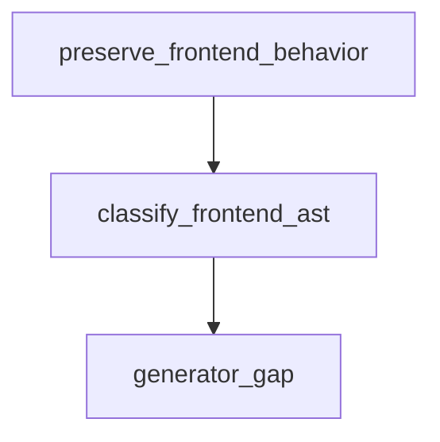

# Semantic TD: jet/assets/trace-viewer

## Design Token
<!-- type: design-token lang: yaml -->

```yaml
frontend_semantic:
  section_type: "design-token"
  key: "jet/assets/trace-viewer"
  source_group: "projects/jet/assets/trace-viewer"
  coverage_kind: semantic
  evidence:
    source_units:
      - path: "projects/jet/assets/trace-viewer/viewer.css"
        language: "stylesheet"
        ownership_state: "codegen"
        generator_primitives: ["frontend_style-surface", "td_section_design_token"]
        source_evidence_node:
          layer: "frontend"
          ecosystem: "style"
          role: "style"
          section_type: "design-token"
          domain: "projects/jet/assets/trace-viewer"
          workspace_root: "projects/jet/assets/trace-viewer"
        frontend_node:
          workspace_root: "projects/jet/assets/trace-viewer"
          role: "style"
          section_type: "design-token"
          artifact_kind: "style-surface"
  frontend_ast:
    nodes:
      - path: "projects/jet/assets/trace-viewer/viewer.css"
        workspace_root: "projects/jet/assets/trace-viewer"
        role: "style"
        artifact_kind: "style-surface"
        section_type: "design-token"
```

## Logic
<!-- type: logic lang: mermaid -->



<!-- frontend_source_evidence
- projects/jet/assets/trace-viewer/viewer.js
-->

## Changes
<!-- type: changes lang: yaml -->

```yaml
coverage_kind: semantic
changes:
  - path: "projects/jet/assets/trace-viewer/viewer.js"
    action: modify
    section: logic
    description: |
      Existing source behavior is covered by this feature/domain semantic TD.
    impl_mode: hand-written
  - path: "projects/jet/assets/trace-viewer/viewer.css"
    action: modify
    section: design-token
    description: |
      Existing source behavior is covered by this feature/domain semantic TD.
    impl_mode: hand-written
```
