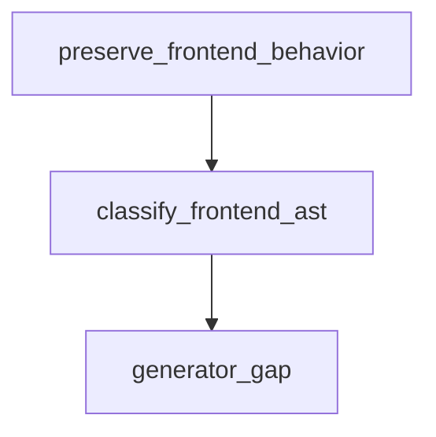

# Semantic TD: jet/parity/oracle/fixtures/__shell__

## Logic
<!-- type: logic lang: mermaid -->



<!-- frontend_source_evidence
- projects/jet/parity/oracle/fixtures/__shell__/build.mjs
-->

## Changes
<!-- type: changes lang: yaml -->

```yaml
coverage_kind: semantic
changes:
  - path: "projects/jet/parity/oracle/fixtures/__shell__/build.mjs"
    action: modify
    section: logic
    description: |
      Existing source behavior is covered by this feature/domain semantic TD.
    impl_mode: hand-written
```
