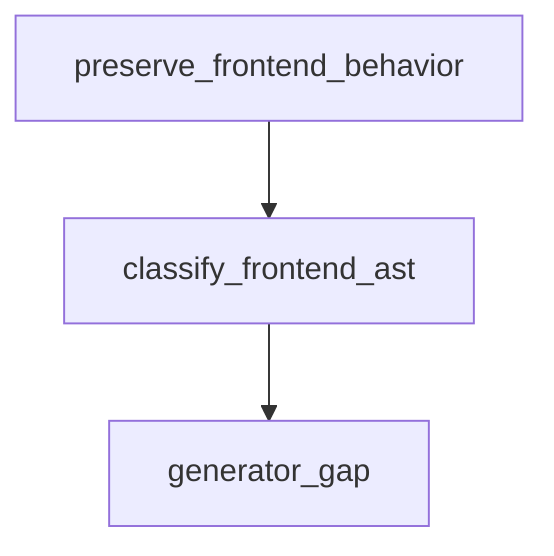

# Semantic TD: jet/scripts

## Logic
<!-- type: logic lang: mermaid -->



<!-- frontend_source_evidence
- projects/jet/scripts/compare-basic-builds.mjs
- projects/jet/scripts/compare-dom-build-corpus.mjs
- projects/jet/scripts/compare-prod-static-serve.mjs
- projects/jet/scripts/compare-pkg-management.mjs
- projects/jet/scripts/verify-browser-bridge-replacement.mjs
-->

## Changes
<!-- type: changes lang: yaml -->

```yaml
coverage_kind: semantic
changes:
  - path: "projects/jet/scripts/compare-basic-builds.mjs"
    action: modify
    section: logic
    description: |
      Existing source behavior is covered by this feature/domain semantic TD.
    impl_mode: hand-written
    replaces:
      - "<handwrite-tracker:projects-jet-scripts-compare-basic-builds-mjs>"
  - path: "projects/jet/scripts/compare-dom-build-corpus.mjs"
    action: modify
    section: logic
    description: |
      Existing source behavior is covered by this feature/domain semantic TD.
    impl_mode: hand-written
    replaces:
      - "<handwrite-tracker:projects-jet-scripts-compare-dom-build-corpus-mjs>"
  - path: "projects/jet/scripts/compare-prod-static-serve.mjs"
    action: modify
    section: logic
    description: |
      Existing source behavior is covered by this feature/domain semantic TD.
    impl_mode: hand-written
    replaces:
      - "<handwrite-tracker:projects-jet-scripts-compare-prod-static-serve-mjs>"
  - path: "projects/jet/scripts/compare-pkg-management.mjs"
    action: modify
    section: logic
    description: |
      Existing source behavior is covered by this feature/domain semantic TD.
    impl_mode: hand-written
    replaces:
      - "<handwrite-tracker:projects-jet-scripts-compare-pkg-management-mjs>"
  - path: "projects/jet/scripts/verify-browser-bridge-replacement.mjs"
    action: modify
    section: logic
    description: |
      Existing source behavior is covered by this feature/domain semantic TD.
    impl_mode: hand-written
    replaces:
      - "<handwrite-tracker:projects-jet-scripts-verify-browser-bridge-replacement-mjs>"
```
