# Semantic TD: jet/tests/browser-bridge

## Schema
<!-- type: schema lang: yaml -->

```yaml
semantic_domain:
  key: "jet/tests/browser-bridge"
  source_group: "projects/jet/tests/browser-bridge"
  coverage_kind: semantic
  evidence:
    source_units:
      - path: "projects/jet/tests/browser-bridge/bb_semantic_surface.rs"
        language: "rust"
        ownership_state: "handwrite"
        generator_primitives: ["config_surface", "service_method", "test_case"]
        symbols:
          - name: "chromium_available"
            kind: "function"
            public: false
          - name: "PAGE_ONE"
            kind: "constant"
            public: false
          - name: "PAGE_TWO"
            kind: "constant"
            public: false
          - name: "semantic_surface_drives_a_real_page_end_to_end"
            kind: "function"
            public: false
        source_evidence_node:
          layer: "backend"
          ecosystem: "rust"
          role: "test"
          section_type: "unit-test"
          domain: "projects/jet/tests/browser-bridge"
      - path: "projects/jet/tests/browser-bridge/pm_report_acceptance.rs"
        language: "rust"
        ownership_state: "codegen"
        generator_primitives: ["service_method", "test_case"]
        symbols:
          - name: "pm_fixture_bundle"
            kind: "function"
            public: false
          - name: "setup_source_with_screenshot"
            kind: "function"
            public: false
          - name: "pm_report_hides_pause_next_replay_dev_controls"
            kind: "function"
            public: false
          - name: "pm_report_preserves_failure_screenshot_assertion_and_step_context"
            kind: "function"
            public: false
          - name: "pm_report_works_from_static_files_without_runner_process"
            kind: "function"
            public: false
          - name: "pm_report_carries_no_open_control_protocol"
            kind: "function"
            public: false
        source_evidence_node:
          layer: "backend"
          ecosystem: "rust"
          role: "test"
          section_type: "unit-test"
          domain: "projects/jet/tests/browser-bridge"
      - path: "projects/jet/tests/browser-bridge/browser_cli_smoke.rs"
        language: "rust"
        ownership_state: "codegen"
        generator_primitives: ["service_method", "test_case"]
        symbols:
          - name: "common"
            kind: "module"
            public: false
          - name: "assert_gpu_timing_status_observable"
            kind: "function"
            public: false
          - name: "free_port"
            kind: "function"
            public: false
          - name: "browser_cli_drives_debug_bridge_end_to_end"
            kind: "function"
            public: false
        source_evidence_node:
          layer: "backend"
          ecosystem: "rust"
          role: "test"
          section_type: "unit-test"
          domain: "projects/jet/tests/browser-bridge"
      - path: "projects/jet/tests/browser-bridge/storage_state_tests.rs"
        language: "rust"
        ownership_state: "codegen"
        generator_primitives: ["service_method", "test_case"]
        symbols:
          - name: "node_available"
            kind: "function"
            public: false
          - name: "chromium_available"
            kind: "function"
            public: false
          - name: "run_spec_str"
            kind: "function"
            public: false
          - name: "skip"
            kind: "function"
            public: false
          - name: "s_t1_add_cookies_roundtrip"
            kind: "function"
            public: false
          - name: "s_t2_clear_cookies"
            kind: "function"
            public: false
          - name: "s_t3_storage_state_shape"
            kind: "function"
            public: false
          - name: "s_t4_set_storage_state"
            kind: "function"
            public: false
          - name: "s_t5_file_roundtrip"
            kind: "function"
            public: false
          - name: "s_t6_unknown_context_error"
            kind: "function"
            public: false
        source_evidence_node:
          layer: "backend"
          ecosystem: "rust"
          role: "test"
          section_type: "unit-test"
          domain: "projects/jet/tests/browser-bridge"
      - path: "projects/jet/tests/browser-bridge/page_api_parity.rs"
        language: "rust"
        ownership_state: "codegen"
        generator_primitives: ["service_method", "test_case"]
        symbols:
          - name: "node_available"
            kind: "function"
            public: false
          - name: "chromium_available"
            kind: "function"
            public: false
          - name: "run_spec_str"
            kind: "function"
            public: false
          - name: "parity_test_module_compiles"
            kind: "function"
            public: false
          - name: "page_request_title_serializes"
            kind: "function"
            public: false
          - name: "page_request_set_viewport_size_serializes"
            kind: "function"
            public: false
          - name: "page_request_screenshot_serializes"
            kind: "function"
            public: false
          - name: "page_response_screenshot_result_serializes"
            kind: "function"
            public: false
          - name: "page_request_navigation_variants_serialize"
            kind: "function"
            public: false
          - name: "page_request_keyboard_variants_serialize"
            kind: "function"
            public: false
          - name: "page_request_mouse_event_serializes"
            kind: "function"
            public: false
          - name: "page_request_set_content_serializes"
            kind: "function"
            public: false
          - name: "page_request_content_serializes"
            kind: "function"
            public: false
          - name: "page_request_bounding_box_serializes"
            kind: "function"
            public: false
          - name: "page_response_bounding_box_result_serializes"
            kind: "function"
            public: false
          - name: "page_request_hover_serializes"
            kind: "function"
            public: false
          - name: "page_request_locator_press_serializes"
            kind: "function"
            public: false
          - name: "page_request_event_subscription_variants_serialize"
            kind: "function"
            public: false
          - name: "parse_page_request_new_variants"
            kind: "function"
            public: false
          - name: "test_t1_page_title"
            kind: "function"
            public: false
          - name: "test_t2_set_viewport_size"
            kind: "function"
            public: false
          - name: "test_t3_wait_for_timeout"
            kind: "function"
            public: false
          - name: "test_t4_screenshot"
            kind: "function"
            public: false
          - name: "test_t5_page_on_console_api_surface"
            kind: "function"
            public: false
          - name: "test_t6_page_on_pageerror_api_surface"
            kind: "function"
            public: false
          - name: "test_t7_go_back"
            kind: "function"
            public: false
          - name: "test_t8_reload"
            kind: "function"
            public: false
          - name: "test_t9_keyboard_press"
            kind: "function"
            public: false
          - name: "test_t10_keyboard_type"
            kind: "function"
            public: false
          - name: "test_t11_mouse_click"
            kind: "function"
            public: false
          - name: "test_t12_set_content"
            kind: "function"
            public: false
          - name: "test_t13_content"
            kind: "function"
            public: false
          - name: "test_t14_bounding_box"
            kind: "function"
            public: false
          - name: "test_t15_is_visible_is_hidden"
            kind: "function"
            public: false
          - name: "test_t16_is_enabled"
            kind: "function"
            public: false
          - name: "test_t17_hover"
            kind: "function"
            public: false
          - name: "test_t18_locator_press"
            kind: "function"
            public: false
          - name: "test_t19_select_option"
            kind: "function"
            public: false
          - name: "test_t20_count"
            kind: "function"
            public: false
          - name: "test_t21_nth"
            kind: "function"
            public: false
        source_evidence_node:
          layer: "backend"
          ecosystem: "rust"
          role: "test"
          section_type: "unit-test"
          domain: "projects/jet/tests/browser-bridge"
      - path: "projects/jet/tests/browser-bridge/trace_viewer.rs"
        language: "rust"
        ownership_state: "codegen"
        generator_primitives: ["service_method", "test_case"]
        symbols:
          - name: "tempdir"
            kind: "function"
            public: false
          - name: "sample_zip"
            kind: "function"
            public: false
          - name: "test_http_server_binds_loopback"
            kind: "function"
            public: false
          - name: "test_trace_json_endpoint_matches_manifest"
            kind: "function"
            public: false
          - name: "test_asset_endpoint_returns_bytes"
            kind: "function"
            public: false
        source_evidence_node:
          layer: "backend"
          ecosystem: "rust"
          role: "test"
          section_type: "unit-test"
          domain: "projects/jet/tests/browser-bridge"
      - path: "projects/jet/tests/browser-bridge/locator_js_api.rs"
        language: "rust"
        ownership_state: "codegen"
        generator_primitives: ["service_method", "test_case"]
        symbols:
          - name: "node_available"
            kind: "function"
            public: false
          - name: "chromium_available"
            kind: "function"
            public: false
          - name: "run_spec_str"
            kind: "function"
            public: false
          - name: "skip_if_no_browser"
            kind: "function"
            public: false
          - name: "test_t1_sub_locator_css_concat"
            kind: "function"
            public: false
          - name: "test_t2_sub_locator_pseudo_scope"
            kind: "function"
            public: false
          - name: "test_t3_filter_has_text_click"
            kind: "function"
            public: false
          - name: "test_t4_filter_regex"
            kind: "function"
            public: false
          - name: "test_t5_auto_wait_late_mount"
            kind: "function"
            public: false
          - name: "test_t6_auto_wait_timeout_hidden"
            kind: "function"
            public: false
          - name: "test_t7_stability_static"
            kind: "function"
            public: false
          - name: "test_t8_nth_click_indexed"
            kind: "function"
            public: false
          - name: "test_t9_nth_reads_indexed"
            kind: "function"
            public: false
          - name: "test_t10_chained_fill"
            kind: "function"
            public: false
        source_evidence_node:
          layer: "backend"
          ecosystem: "rust"
          role: "test"
          section_type: "unit-test"
          domain: "projects/jet/tests/browser-bridge"
      - path: "projects/jet/tests/browser-bridge/trace_capture.rs"
        language: "rust"
        ownership_state: "codegen"
        generator_primitives: ["service_method", "test_case"]
        symbols:
          - name: "tempdir"
            kind: "function"
            public: false
          - name: "test_trace_buffer_append_flush"
            kind: "function"
            public: false
          - name: "test_trace_zip_roundtrip"
            kind: "function"
            public: false
          - name: "test_retain_on_failure_discard_passing"
            kind: "function"
            public: false
          - name: "test_retain_on_failure_write_failing"
            kind: "function"
            public: false
          - name: "test_trace_off_no_cdp_calls"
            kind: "function"
            public: false
          - name: "test_trace_path_in_test_results_json"
            kind: "function"
            public: false
          - name: "test_all_event_types_captured"
            kind: "function"
            public: false
        source_evidence_node:
          layer: "backend"
          ecosystem: "rust"
          role: "test"
          section_type: "unit-test"
          domain: "projects/jet/tests/browser-bridge"
      - path: "projects/jet/tests/browser-bridge/matchers_state_value_a11y.rs"
        language: "rust"
        ownership_state: "codegen"
        generator_primitives: ["service_method", "test_case"]
        symbols:
          - name: "node_available"
            kind: "function"
            public: false
          - name: "chromium_available"
            kind: "function"
            public: false
          - name: "run_spec_str"
            kind: "function"
            public: false
          - name: "skip"
            kind: "function"
            public: false
          - name: "test_m1a_to_be_checked_pass"
            kind: "function"
            public: false
          - name: "test_m1b_to_be_checked_timeout"
            kind: "function"
            public: false
          - name: "test_m2_m3_disabled_enabled"
            kind: "function"
            public: false
          - name: "test_m4_focused"
            kind: "function"
            public: false
          - name: "test_m5_css"
            kind: "function"
            public: false
          - name: "test_m6_accessible_name"
            kind: "function"
            public: false
          - name: "test_m7_role"
            kind: "function"
            public: false
          - name: "test_m8_match_object"
            kind: "function"
            public: false
        source_evidence_node:
          layer: "backend"
          ecosystem: "rust"
          role: "test"
          section_type: "unit-test"
          domain: "projects/jet/tests/browser-bridge"
      - path: "projects/jet/tests/browser-bridge/to_have_screenshot_tests.rs"
        language: "rust"
        ownership_state: "codegen"
        generator_primitives: ["service_method", "test_case"]
        symbols:
          - name: "node_available"
            kind: "function"
            public: false
          - name: "chromium_available"
            kind: "function"
            public: false
          - name: "run_spec_in_dir"
            kind: "function"
            public: false
          - name: "skip"
            kind: "function"
            public: false
          - name: "ts1_first_run_writes_second_matches"
            kind: "function"
            public: false
          - name: "ts2_named_baseline"
            kind: "function"
            public: false
          - name: "ts3_locator_rejected"
            kind: "function"
            public: false
        source_evidence_node:
          layer: "backend"
          ecosystem: "rust"
          role: "test"
          section_type: "unit-test"
          domain: "projects/jet/tests/browser-bridge"
      - path: "projects/jet/tests/browser-bridge/playwright_compat_tests.rs"
        language: "rust"
        ownership_state: "codegen"
        generator_primitives: ["test_case"]
        symbols:
          - name: "test_playwright_flag_delegates_to_playwright_runner"
            kind: "function"
            public: false
          - name: "test_playwright_test_import_routed_to_subprocess"
            kind: "function"
            public: false
          - name: "test_playwright_test_import_double_quotes"
            kind: "function"
            public: false
          - name: "test_non_playwright_import_not_detected"
            kind: "function"
            public: false
          - name: "test_deprecation_warning_printed_on_stderr"
            kind: "function"
            public: false
          - name: "test_suppress_warning_env_var"
            kind: "function"
            public: false
          - name: "test_suppress_warning_non_one_value_does_not_suppress"
            kind: "function"
            public: false
          - name: "test_reporter_flag_conflict_exits_2"
            kind: "function"
            public: false
          - name: "test_trace_flag_conflict_exits_2"
            kind: "function"
            public: false
          - name: "test_workers_flag_conflict_exits_2"
            kind: "function"
            public: false
          - name: "test_shard_flag_conflict_exits_2"
            kind: "function"
            public: false
          - name: "test_report_dir_flag_conflict_exits_2"
            kind: "function"
            public: false
          - name: "test_no_native_flag_conflict_ok"
            kind: "function"
            public: false
          - name: "test_native_runner_unaffected_without_playwright_flag"
            kind: "function"
            public: false
          - name: "test_migration_guide_exists_and_complete"
            kind: "function"
            public: false
          - name: "test_e2e_playwright_fixture_spec_exit_0"
            kind: "function"
            public: false
        source_evidence_node:
          layer: "backend"
          ecosystem: "rust"
          role: "test"
          section_type: "unit-test"
          domain: "projects/jet/tests/browser-bridge"
      - path: "projects/jet/tests/browser-bridge/bb_mcp_server.rs"
        language: "rust"
        ownership_state: "handwrite"
        generator_primitives: ["data_model", "service_method", "test_case"]
        symbols:
          - name: "McpClient"
            kind: "struct"
            public: false
          - name: "spawn"
            kind: "function"
            public: false
          - name: "send"
            kind: "function"
            public: false
          - name: "recv"
            kind: "function"
            public: false
          - name: "request"
            kind: "function"
            public: false
          - name: "drop"
            kind: "function"
            public: false
          - name: "handshake"
            kind: "function"
            public: false
          - name: "mcp_handshake_advertises_bb_tool_surface"
            kind: "function"
            public: false
          - name: "tool_failures_are_mcp_tool_errors_not_protocol_errors"
            kind: "function"
            public: false
        source_evidence_node:
          layer: "backend"
          ecosystem: "rust"
          role: "test"
          section_type: "unit-test"
          domain: "projects/jet/tests/browser-bridge"
      - path: "projects/jet/tests/browser-bridge/e2e_playwright_residue.rs"
        language: "rust"
        ownership_state: "codegen"
        generator_primitives: ["service_method", "test_case"]
        symbols:
          - name: "e2e_playwright_residue_absent"
            kind: "function"
            public: false
          - name: "walk"
            kind: "function"
            public: false
        source_evidence_node:
          layer: "backend"
          ecosystem: "rust"
          role: "test"
          section_type: "unit-test"
          domain: "projects/jet/tests/browser-bridge"
      - path: "projects/jet/tests/browser-bridge/auto_artifacts_tests.rs"
        language: "rust"
        ownership_state: "codegen"
        generator_primitives: ["config_surface", "service_method", "test_case"]
        symbols:
          - name: "RUNNER_HARD_TIMEOUT"
            kind: "constant"
            public: false
          - name: "node_available"
            kind: "function"
            public: false
          - name: "chromium_available"
            kind: "function"
            public: false
          - name: "run_spec"
            kind: "function"
            public: false
          - name: "skip"
            kind: "function"
            public: false
          - name: "aa1_failing_test_produces_artifact"
            kind: "function"
            public: false
          - name: "aa2_disabled_produces_empty"
            kind: "function"
            public: false
          - name: "aa3_multi_page_capture"
            kind: "function"
            public: false
          - name: "aa4_passing_test_no_artifacts"
            kind: "function"
            public: false
        source_evidence_node:
          layer: "backend"
          ecosystem: "rust"
          role: "test"
          section_type: "unit-test"
          domain: "projects/jet/tests/browser-bridge"
      - path: "projects/jet/tests/browser-bridge/route_intercept_tests.rs"
        language: "rust"
        ownership_state: "codegen"
        generator_primitives: ["service_method", "test_case"]
        symbols:
          - name: "node_available"
            kind: "function"
            public: false
          - name: "chromium_available"
            kind: "function"
            public: false
          - name: "run_spec"
            kind: "function"
            public: false
          - name: "skip"
            kind: "function"
            public: false
          - name: "ri1_fetch_glob_mock"
            kind: "function"
            public: false
          - name: "ri2_fetch_regex_mock"
            kind: "function"
            public: false
          - name: "ri3_unmatched_fetch_passthrough"
            kind: "function"
            public: false
          - name: "ri4_fetch_abort_rejects"
            kind: "function"
            public: false
          - name: "ri5_ri6_unroute_and_unroute_all"
            kind: "function"
            public: false
          - name: "ri7_xhr_mock"
            kind: "function"
            public: false
          - name: "ri8_xhr_abort_onerror"
            kind: "function"
            public: false
          - name: "ri9_first_match_wins"
            kind: "function"
            public: false
        source_evidence_node:
          layer: "backend"
          ecosystem: "rust"
          role: "test"
          section_type: "unit-test"
          domain: "projects/jet/tests/browser-bridge"
      - path: "projects/jet/tests/browser-bridge/browser_install.rs"
        language: "rust"
        ownership_state: "codegen"
        generator_primitives: ["service_method", "test_case"]
        symbols:
          - name: "install_chromium_downloads_and_is_launchable"
            kind: "function"
            public: false
          - name: "find_chrome_prefers_cache"
            kind: "function"
            public: false
          - name: "unsupported_platform_returns_clear_error"
            kind: "function"
            public: false
        source_evidence_node:
          layer: "backend"
          ecosystem: "rust"
          role: "test"
          section_type: "unit-test"
          domain: "projects/jet/tests/browser-bridge"
      - path: "projects/jet/tests/browser-bridge/page_fixture_auto_inject.rs"
        language: "rust"
        ownership_state: "codegen"
        generator_primitives: ["service_method", "test_case"]
        symbols:
          - name: "node_available"
            kind: "function"
            public: false
          - name: "chromium_available"
            kind: "function"
            public: false
          - name: "glob_first"
            kind: "function"
            public: false
          - name: "run_spec_str"
            kind: "function"
            public: false
          - name: "test_runner_config_default_for_root_constructs"
            kind: "function"
            public: false
          - name: "test_page_fixture_auto_injected_into_test_body"
            kind: "function"
            public: false
          - name: "test_page_auto_closed_after_test"
            kind: "function"
            public: false
          - name: "test_page_auto_closed_on_test_failure"
            kind: "function"
            public: false
          - name: "test_browser_shared_across_tests_in_worker"
            kind: "function"
            public: false
          - name: "test_baseurl_resolution_relative_path"
            kind: "function"
            public: false
          - name: "test_user_extend_page_overrides_default"
            kind: "function"
            public: false
          - name: "test_user_fixture_receives_cdp_page_as_dependency"
            kind: "function"
            public: false
          - name: "test_no_page_no_injection"
            kind: "function"
            public: false
          - name: "test_cdp_launch_failure_error_message"
            kind: "function"
            public: false
        source_evidence_node:
          layer: "backend"
          ecosystem: "rust"
          role: "test"
          section_type: "unit-test"
          domain: "projects/jet/tests/browser-bridge"
      - path: "projects/jet/tests/browser-bridge/product_step_timeline.rs"
        language: "rust"
        ownership_state: "codegen"
        generator_primitives: ["service_method", "test_case"]
        symbols:
          - name: "cue_step"
            kind: "function"
            public: false
          - name: "cue_artifact_studio_bundle"
            kind: "function"
            public: false
          - name: "dogfood_case_uses_named_product_steps"
            kind: "function"
            public: false
          - name: "evidence_carries_ordered_step_records"
            kind: "function"
            public: false
          - name: "open_mode_timeline_consumes_same_step_records_as_run_mode"
            kind: "function"
            public: false
          - name: "step_events_carry_start_end_duration_and_failure_context"
            kind: "function"
            public: false
          - name: "kind"
            kind: "function"
            public: false
        source_evidence_node:
          layer: "backend"
          ecosystem: "rust"
          role: "test"
          section_type: "unit-test"
          domain: "projects/jet/tests/browser-bridge"
      - path: "projects/jet/tests/browser-bridge/pm_report_static_smoke.rs"
        language: "rust"
        ownership_state: "codegen"
        generator_primitives: ["service_method", "test_case"]
        symbols:
          - name: "fixture_with_artifacts"
            kind: "function"
            public: false
          - name: "setup_source_root"
            kind: "function"
            public: false
          - name: "static_report_directory_is_self_contained"
            kind: "function"
            public: false
          - name: "static_report_html_embeds_no_runner_endpoints"
            kind: "function"
            public: false
          - name: "static_report_renders_failure_artifacts_from_relative_paths"
            kind: "function"
            public: false
          - name: "static_report_can_load_without_running_jet_services"
            kind: "function"
            public: false
        source_evidence_node:
          layer: "backend"
          ecosystem: "rust"
          role: "test"
          section_type: "unit-test"
          domain: "projects/jet/tests/browser-bridge"
      - path: "projects/jet/tests/browser-bridge/cue_artifact_studio_dogfood.rs"
        language: "rust"
        ownership_state: "codegen"
        generator_primitives: ["service_method", "test_case"]
        symbols:
          - name: "fixture_spec_path"
            kind: "function"
            public: false
          - name: "cue_summary_with"
            kind: "function"
            public: false
          - name: "report"
            kind: "function"
            public: false
          - name: "assert_bundle_shape"
            kind: "function"
            public: false
          - name: "fixture_is_present_and_self_contained"
            kind: "function"
            public: false
          - name: "run_mode_evidence_carries_product_steps_for_cue_flow"
            kind: "function"
            public: false
          - name: "open_mode_evidence_inspects_same_flow"
            kind: "function"
            public: false
          - name: "failure_path_carries_assertion_context"
            kind: "function"
            public: false
          - name: "fixture_path_resolves_relative_to_jet_crate"
            kind: "function"
            public: false
        source_evidence_node:
          layer: "backend"
          ecosystem: "rust"
          role: "test"
          section_type: "unit-test"
          domain: "projects/jet/tests/browser-bridge"
      - path: "projects/jet/tests/browser-bridge/playwright_compat_shim_tests.rs"
        language: "rust"
        ownership_state: "codegen"
        generator_primitives: ["service_method", "test_case"]
        symbols:
          - name: "node_available"
            kind: "function"
            public: false
          - name: "chromium_available"
            kind: "function"
            public: false
          - name: "run_spec"
            kind: "function"
            public: false
          - name: "pc1_named_imports"
            kind: "function"
            public: false
          - name: "pc2_browser_namespace"
            kind: "function"
            public: false
          - name: "pc3_default_namespace"
            kind: "function"
            public: false
        source_evidence_node:
          layer: "backend"
          ecosystem: "rust"
          role: "test"
          section_type: "unit-test"
          domain: "projects/jet/tests/browser-bridge"
      - path: "projects/jet/tests/browser-bridge/browser_context.rs"
        language: "rust"
        ownership_state: "codegen"
        generator_primitives: ["service_method", "test_case"]
        symbols:
          - name: "chromium_available"
            kind: "function"
            public: false
          - name: "new_context_request_serializes"
            kind: "function"
            public: false
          - name: "close_context_request_serializes"
            kind: "function"
            public: false
          - name: "context_new_page_request_serializes"
            kind: "function"
            public: false
          - name: "context_result_response_serializes"
            kind: "function"
            public: false
          - name: "context_variants_round_trip_serde"
            kind: "function"
            public: false
          - name: "browser_launch_exposes_default_and_new_context"
            kind: "function"
            public: false
          - name: "pages_carry_context_id_only_for_user_contexts"
            kind: "function"
            public: false
          - name: "two_contexts_are_isolated_by_target_listing"
            kind: "function"
            public: false
          - name: "closed_context_rejects_new_page"
            kind: "function"
            public: false
        source_evidence_node:
          layer: "backend"
          ecosystem: "rust"
          role: "test"
          section_type: "unit-test"
          domain: "projects/jet/tests/browser-bridge"
```

## Unit Test

```mermaid
---
id: unit-test
coverage_kind: semantic
strategy: preserve observed source behavior while semantic coverage is promoted toward generator primitives
evidence:
  source_tests:
    - path: "projects/jet/tests/browser-bridge/bb_semantic_surface.rs"
    - path: "projects/jet/tests/browser-bridge/pm_report_acceptance.rs"
    - path: "projects/jet/tests/browser-bridge/browser_cli_smoke.rs"
    - path: "projects/jet/tests/browser-bridge/storage_state_tests.rs"
    - path: "projects/jet/tests/browser-bridge/page_api_parity.rs"
    - path: "projects/jet/tests/browser-bridge/trace_viewer.rs"
    - path: "projects/jet/tests/browser-bridge/locator_js_api.rs"
    - path: "projects/jet/tests/browser-bridge/trace_capture.rs"
    - path: "projects/jet/tests/browser-bridge/matchers_state_value_a11y.rs"
    - path: "projects/jet/tests/browser-bridge/to_have_screenshot_tests.rs"
    - path: "projects/jet/tests/browser-bridge/playwright_compat_tests.rs"
    - path: "projects/jet/tests/browser-bridge/bb_mcp_server.rs"
    - path: "projects/jet/tests/browser-bridge/e2e_playwright_residue.rs"
    - path: "projects/jet/tests/browser-bridge/auto_artifacts_tests.rs"
    - path: "projects/jet/tests/browser-bridge/route_intercept_tests.rs"
    - path: "projects/jet/tests/browser-bridge/browser_install.rs"
    - path: "projects/jet/tests/browser-bridge/page_fixture_auto_inject.rs"
    - path: "projects/jet/tests/browser-bridge/product_step_timeline.rs"
    - path: "projects/jet/tests/browser-bridge/pm_report_static_smoke.rs"
    - path: "projects/jet/tests/browser-bridge/cue_artifact_studio_dogfood.rs"
    - path: "projects/jet/tests/browser-bridge/playwright_compat_shim_tests.rs"
    - path: "projects/jet/tests/browser-bridge/browser_context.rs"
---
requirementDiagram

element UT_SOURCE_TESTS {
  type: "TestEvidence"
}
```

<!-- type: unit-test lang: mermaid -->



## Changes
<!-- type: changes lang: yaml -->

```yaml
coverage_kind: semantic
changes:
  - path: "projects/jet/tests/browser-bridge/bb_semantic_surface.rs"
    action: modify
    section: schema
    description: |
      Existing source behavior is covered by this feature/domain semantic TD.
    impl_mode: hand-written
    replaces:
      - "<handwrite-tracker:jet-bb-semantic-surface>"
  - path: "projects/jet/tests/browser-bridge/pm_report_acceptance.rs"
    action: modify
    section: schema
    description: |
      Existing source behavior is covered by this feature/domain semantic TD.
    impl_mode: hand-written
  - path: "projects/jet/tests/browser-bridge/browser_cli_smoke.rs"
    action: modify
    section: schema
    description: |
      Existing source behavior is covered by this feature/domain semantic TD.
    impl_mode: hand-written
  - path: "projects/jet/tests/browser-bridge/storage_state_tests.rs"
    action: modify
    section: schema
    description: |
      Existing source behavior is covered by this feature/domain semantic TD.
    impl_mode: hand-written
  - path: "projects/jet/tests/browser-bridge/page_api_parity.rs"
    action: modify
    section: schema
    description: |
      Existing source behavior is covered by this feature/domain semantic TD.
    impl_mode: hand-written
  - path: "projects/jet/tests/browser-bridge/trace_viewer.rs"
    action: modify
    section: schema
    description: |
      Existing source behavior is covered by this feature/domain semantic TD.
    impl_mode: hand-written
  - path: "projects/jet/tests/browser-bridge/locator_js_api.rs"
    action: modify
    section: schema
    description: |
      Existing source behavior is covered by this feature/domain semantic TD.
    impl_mode: hand-written
  - path: "projects/jet/tests/browser-bridge/trace_capture.rs"
    action: modify
    section: schema
    description: |
      Existing source behavior is covered by this feature/domain semantic TD.
    impl_mode: hand-written
  - path: "projects/jet/tests/browser-bridge/matchers_state_value_a11y.rs"
    action: modify
    section: schema
    description: |
      Existing source behavior is covered by this feature/domain semantic TD.
    impl_mode: hand-written
  - path: "projects/jet/tests/browser-bridge/to_have_screenshot_tests.rs"
    action: modify
    section: schema
    description: |
      Existing source behavior is covered by this feature/domain semantic TD.
    impl_mode: hand-written
  - path: "projects/jet/tests/browser-bridge/playwright_compat_tests.rs"
    action: modify
    section: schema
    description: |
      Existing source behavior is covered by this feature/domain semantic TD.
    impl_mode: hand-written
  - path: "projects/jet/tests/browser-bridge/bb_mcp_server.rs"
    action: modify
    section: schema
    description: |
      Existing source behavior is covered by this feature/domain semantic TD.
    impl_mode: hand-written
    replaces:
      - "<handwrite-tracker:jet-bb-mcp-server>"
  - path: "projects/jet/tests/browser-bridge/e2e_playwright_residue.rs"
    action: modify
    section: schema
    description: |
      Existing source behavior is covered by this feature/domain semantic TD.
    impl_mode: hand-written
  - path: "projects/jet/tests/browser-bridge/auto_artifacts_tests.rs"
    action: modify
    section: schema
    description: |
      Existing source behavior is covered by this feature/domain semantic TD.
    impl_mode: hand-written
  - path: "projects/jet/tests/browser-bridge/route_intercept_tests.rs"
    action: modify
    section: schema
    description: |
      Existing source behavior is covered by this feature/domain semantic TD.
    impl_mode: hand-written
  - path: "projects/jet/tests/browser-bridge/browser_install.rs"
    action: modify
    section: schema
    description: |
      Existing source behavior is covered by this feature/domain semantic TD.
    impl_mode: hand-written
  - path: "projects/jet/tests/browser-bridge/page_fixture_auto_inject.rs"
    action: modify
    section: schema
    description: |
      Existing source behavior is covered by this feature/domain semantic TD.
    impl_mode: hand-written
  - path: "projects/jet/tests/browser-bridge/product_step_timeline.rs"
    action: modify
    section: schema
    description: |
      Existing source behavior is covered by this feature/domain semantic TD.
    impl_mode: hand-written
  - path: "projects/jet/tests/browser-bridge/pm_report_static_smoke.rs"
    action: modify
    section: schema
    description: |
      Existing source behavior is covered by this feature/domain semantic TD.
    impl_mode: hand-written
  - path: "projects/jet/tests/browser-bridge/cue_artifact_studio_dogfood.rs"
    action: modify
    section: schema
    description: |
      Existing source behavior is covered by this feature/domain semantic TD.
    impl_mode: hand-written
  - path: "projects/jet/tests/browser-bridge/playwright_compat_shim_tests.rs"
    action: modify
    section: schema
    description: |
      Existing source behavior is covered by this feature/domain semantic TD.
    impl_mode: hand-written
  - path: "projects/jet/tests/browser-bridge/browser_context.rs"
    action: modify
    section: schema
    description: |
      Existing source behavior is covered by this feature/domain semantic TD.
    impl_mode: hand-written
```
