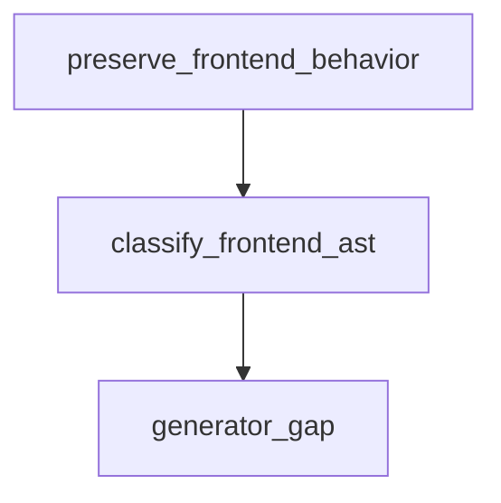

# Semantic TD: jet/tests/fixtures/dom-production-build

## Component
<!-- type: component lang: yaml -->

```yaml
frontend_semantic:
  section_type: "component"
  key: "jet/tests/fixtures/dom-production-build"
  source_group: "projects/jet/tests/fixtures/dom-production-build"
  coverage_kind: semantic
  evidence:
    source_units:
      - path: "projects/jet/tests/fixtures/dom-production-build/styled-components-visual/src/main.tsx"
        language: "typescript"
        ownership_state: "handwrite"
        generator_primitives: ["config_surface", "frontend_component", "td_section_component", "test_case", "ts_component"]
        symbols:
          - name: "GlobalStyle"
            kind: "constant"
            public: true
          - name: "Matrix"
            kind: "constant"
            public: true
          - name: "Surface"
            kind: "constant"
            public: true
          - name: "Card"
            kind: "constant"
            public: true
          - name: "Button"
            kind: "constant"
            public: true
          - name: "Chip"
            kind: "constant"
            public: true
          - name: "TableViewport"
            kind: "constant"
            public: true
          - name: "rows"
            kind: "constant"
            public: true
          - name: "[active, setActive]"
            kind: "constant"
            public: true
        source_evidence_node:
          layer: "frontend"
          ecosystem: "typescript-jsx"
          role: "component"
          section_type: "component"
          domain: "projects/jet/tests/fixtures/dom-production-build"
          workspace_root: "projects/jet/tests/fixtures/dom-production-build/styled-components-visual/src"
          component: "Main"
        frontend_node:
          workspace_root: "projects/jet/tests/fixtures/dom-production-build/styled-components-visual/src"
          role: "component"
          section_type: "component"
          artifact_kind: "component"
          component: "Main"
      - path: "projects/jet/tests/fixtures/dom-production-build/mui-visual/src/main.tsx"
        language: "typescript"
        ownership_state: "handwrite"
        generator_primitives: ["frontend_component", "td_section_component", "test_case", "ts_component"]
        source_evidence_node:
          layer: "frontend"
          ecosystem: "typescript-jsx"
          role: "component"
          section_type: "component"
          domain: "projects/jet/tests/fixtures/dom-production-build"
          workspace_root: "projects/jet/tests/fixtures/dom-production-build/mui-visual/src"
          component: "Main"
        frontend_node:
          workspace_root: "projects/jet/tests/fixtures/dom-production-build/mui-visual/src"
          role: "component"
          section_type: "component"
          artifact_kind: "component"
          component: "Main"
      - path: "projects/jet/tests/fixtures/dom-production-build/mui-visual/src/MuiVisualFixture.tsx"
        language: "typescript"
        ownership_state: "handwrite"
        generator_primitives: ["frontend_component", "service_method", "td_section_component", "test_case", "ts_component"]
        symbols:
          - name: "MuiVisualFixture"
            kind: "function"
            public: true
        source_evidence_node:
          layer: "frontend"
          ecosystem: "typescript-jsx"
          role: "component"
          section_type: "component"
          domain: "projects/jet/tests/fixtures/dom-production-build"
          workspace_root: "projects/jet/tests/fixtures/dom-production-build/mui-visual/src"
          component: "MuiVisualFixture"
        frontend_node:
          workspace_root: "projects/jet/tests/fixtures/dom-production-build/mui-visual/src"
          role: "component"
          section_type: "component"
          artifact_kind: "component"
          component: "MuiVisualFixture"
      - path: "projects/jet/tests/fixtures/dom-production-build/dom-production-assets/src/main.tsx"
        language: "typescript"
        ownership_state: "handwrite"
        generator_primitives: ["frontend_component", "td_section_component", "test_case", "ts_component"]
        source_evidence_node:
          layer: "frontend"
          ecosystem: "typescript-jsx"
          role: "component"
          section_type: "component"
          domain: "projects/jet/tests/fixtures/dom-production-build"
          workspace_root: "projects/jet/tests/fixtures/dom-production-build/dom-production-assets/src"
          component: "Main"
        frontend_node:
          workspace_root: "projects/jet/tests/fixtures/dom-production-build/dom-production-assets/src"
          role: "component"
          section_type: "component"
          artifact_kind: "component"
          component: "Main"
      - path: "projects/jet/tests/fixtures/dom-production-build/antd-visual/src/main.tsx"
        language: "typescript"
        ownership_state: "handwrite"
        generator_primitives: ["frontend_component", "td_section_component", "test_case", "ts_component"]
        source_evidence_node:
          layer: "frontend"
          ecosystem: "typescript-jsx"
          role: "component"
          section_type: "component"
          domain: "projects/jet/tests/fixtures/dom-production-build"
          workspace_root: "projects/jet/tests/fixtures/dom-production-build/antd-visual/src"
          component: "Main"
        frontend_node:
          workspace_root: "projects/jet/tests/fixtures/dom-production-build/antd-visual/src"
          role: "component"
          section_type: "component"
          artifact_kind: "component"
          component: "Main"
      - path: "projects/jet/tests/fixtures/dom-production-build/antd-visual/src/AntdVisualFixture.tsx"
        language: "typescript"
        ownership_state: "handwrite"
        generator_primitives: ["frontend_component", "service_method", "td_section_component", "test_case", "ts_component"]
        symbols:
          - name: "AntdVisualFixture"
            kind: "function"
            public: true
        source_evidence_node:
          layer: "frontend"
          ecosystem: "typescript-jsx"
          role: "component"
          section_type: "component"
          domain: "projects/jet/tests/fixtures/dom-production-build"
          workspace_root: "projects/jet/tests/fixtures/dom-production-build/antd-visual/src"
          component: "AntdVisualFixture"
        frontend_node:
          workspace_root: "projects/jet/tests/fixtures/dom-production-build/antd-visual/src"
          role: "component"
          section_type: "component"
          artifact_kind: "component"
          component: "AntdVisualFixture"
      - path: "projects/jet/tests/fixtures/dom-production-build/tailwind-visual/src/main.tsx"
        language: "typescript"
        ownership_state: "handwrite"
        generator_primitives: ["config_surface", "frontend_component", "td_section_component", "test_case", "ts_component"]
        symbols:
          - name: "rows"
            kind: "constant"
            public: true
          - name: "[active, setActive]"
            kind: "constant"
            public: true
        source_evidence_node:
          layer: "frontend"
          ecosystem: "typescript-jsx"
          role: "component"
          section_type: "component"
          domain: "projects/jet/tests/fixtures/dom-production-build"
          workspace_root: "projects/jet/tests/fixtures/dom-production-build/tailwind-visual/src"
          component: "Main"
        frontend_node:
          workspace_root: "projects/jet/tests/fixtures/dom-production-build/tailwind-visual/src"
          role: "component"
          section_type: "component"
          artifact_kind: "component"
          component: "Main"
      - path: "projects/jet/tests/fixtures/dom-production-build/react-bench/src/App.tsx"
        language: "typescript"
        ownership_state: "handwrite"
        generator_primitives: ["config_surface", "frontend_component", "td_section_component", "test_case", "ts_component"]
        symbols:
          - name: "[page, setPage]"
            kind: "constant"
            public: true
        source_evidence_node:
          layer: "frontend"
          ecosystem: "typescript-jsx"
          role: "component"
          section_type: "component"
          domain: "projects/jet/tests/fixtures/dom-production-build"
          workspace_root: "projects/jet/tests/fixtures/dom-production-build/react-bench/src"
          component: "App"
        frontend_node:
          workspace_root: "projects/jet/tests/fixtures/dom-production-build/react-bench/src"
          role: "component"
          section_type: "component"
          artifact_kind: "component"
          component: "App"
      - path: "projects/jet/tests/fixtures/dom-production-build/react-bench/src/main.tsx"
        language: "typescript"
        ownership_state: "handwrite"
        generator_primitives: ["frontend_component", "td_section_component", "test_case", "ts_component"]
        source_evidence_node:
          layer: "frontend"
          ecosystem: "typescript-jsx"
          role: "component"
          section_type: "component"
          domain: "projects/jet/tests/fixtures/dom-production-build"
          workspace_root: "projects/jet/tests/fixtures/dom-production-build/react-bench/src"
          component: "Main"
        frontend_node:
          workspace_root: "projects/jet/tests/fixtures/dom-production-build/react-bench/src"
          role: "component"
          section_type: "component"
          artifact_kind: "component"
          component: "Main"
      - path: "projects/jet/tests/fixtures/dom-production-build/react-bench/src/components/Counter.tsx"
        language: "typescript"
        ownership_state: "handwrite"
        generator_primitives: ["frontend_component", "service_method", "td_section_component", "test_case", "ts_component"]
        symbols:
          - name: "Counter"
            kind: "function"
            public: true
        source_evidence_node:
          layer: "frontend"
          ecosystem: "typescript-jsx"
          role: "component"
          section_type: "component"
          domain: "projects/jet/tests/fixtures/dom-production-build"
          workspace_root: "projects/jet/tests/fixtures/dom-production-build/react-bench/src/components"
          component: "Counter"
        frontend_node:
          workspace_root: "projects/jet/tests/fixtures/dom-production-build/react-bench/src/components"
          role: "component"
          section_type: "component"
          artifact_kind: "component"
          component: "Counter"
      - path: "projects/jet/tests/fixtures/dom-production-build/react-bench/src/components/TodoList.tsx"
        language: "typescript"
        ownership_state: "handwrite"
        generator_primitives: ["frontend_component", "service_method", "td_section_component", "test_case", "ts_component", "ts_type_surface"]
        symbols:
          - name: "Todo"
            kind: "interface"
            public: true
          - name: "TodoList"
            kind: "function"
            public: true
        source_evidence_node:
          layer: "frontend"
          ecosystem: "typescript-jsx"
          role: "component"
          section_type: "component"
          domain: "projects/jet/tests/fixtures/dom-production-build"
          workspace_root: "projects/jet/tests/fixtures/dom-production-build/react-bench/src/components"
          component: "TodoList"
        frontend_node:
          workspace_root: "projects/jet/tests/fixtures/dom-production-build/react-bench/src/components"
          role: "component"
          section_type: "component"
          artifact_kind: "component"
          component: "TodoList"
  frontend_ast:
    nodes:
      - path: "projects/jet/tests/fixtures/dom-production-build/styled-components-visual/src/main.tsx"
        workspace_root: "projects/jet/tests/fixtures/dom-production-build/styled-components-visual/src"
        role: "component"
        artifact_kind: "component"
        section_type: "component"
        component: "Main"
      - path: "projects/jet/tests/fixtures/dom-production-build/mui-visual/src/main.tsx"
        workspace_root: "projects/jet/tests/fixtures/dom-production-build/mui-visual/src"
        role: "component"
        artifact_kind: "component"
        section_type: "component"
        component: "Main"
      - path: "projects/jet/tests/fixtures/dom-production-build/mui-visual/src/MuiVisualFixture.tsx"
        workspace_root: "projects/jet/tests/fixtures/dom-production-build/mui-visual/src"
        role: "component"
        artifact_kind: "component"
        section_type: "component"
        component: "MuiVisualFixture"
      - path: "projects/jet/tests/fixtures/dom-production-build/dom-production-assets/src/main.tsx"
        workspace_root: "projects/jet/tests/fixtures/dom-production-build/dom-production-assets/src"
        role: "component"
        artifact_kind: "component"
        section_type: "component"
        component: "Main"
      - path: "projects/jet/tests/fixtures/dom-production-build/antd-visual/src/main.tsx"
        workspace_root: "projects/jet/tests/fixtures/dom-production-build/antd-visual/src"
        role: "component"
        artifact_kind: "component"
        section_type: "component"
        component: "Main"
      - path: "projects/jet/tests/fixtures/dom-production-build/antd-visual/src/AntdVisualFixture.tsx"
        workspace_root: "projects/jet/tests/fixtures/dom-production-build/antd-visual/src"
        role: "component"
        artifact_kind: "component"
        section_type: "component"
        component: "AntdVisualFixture"
      - path: "projects/jet/tests/fixtures/dom-production-build/tailwind-visual/src/main.tsx"
        workspace_root: "projects/jet/tests/fixtures/dom-production-build/tailwind-visual/src"
        role: "component"
        artifact_kind: "component"
        section_type: "component"
        component: "Main"
      - path: "projects/jet/tests/fixtures/dom-production-build/react-bench/src/App.tsx"
        workspace_root: "projects/jet/tests/fixtures/dom-production-build/react-bench/src"
        role: "component"
        artifact_kind: "component"
        section_type: "component"
        component: "App"
      - path: "projects/jet/tests/fixtures/dom-production-build/react-bench/src/main.tsx"
        workspace_root: "projects/jet/tests/fixtures/dom-production-build/react-bench/src"
        role: "component"
        artifact_kind: "component"
        section_type: "component"
        component: "Main"
      - path: "projects/jet/tests/fixtures/dom-production-build/react-bench/src/components/Counter.tsx"
        workspace_root: "projects/jet/tests/fixtures/dom-production-build/react-bench/src/components"
        role: "component"
        artifact_kind: "component"
        section_type: "component"
        component: "Counter"
      - path: "projects/jet/tests/fixtures/dom-production-build/react-bench/src/components/TodoList.tsx"
        workspace_root: "projects/jet/tests/fixtures/dom-production-build/react-bench/src/components"
        role: "component"
        artifact_kind: "component"
        section_type: "component"
        component: "TodoList"
```

## Design Token
<!-- type: design-token lang: yaml -->

```yaml
frontend_semantic:
  section_type: "design-token"
  key: "jet/tests/fixtures/dom-production-build"
  source_group: "projects/jet/tests/fixtures/dom-production-build"
  coverage_kind: semantic
  evidence:
    source_units:
      - path: "projects/jet/tests/fixtures/dom-production-build/dom-production-assets/src/main.css"
        language: "stylesheet"
        ownership_state: "handwrite"
        generator_primitives: ["frontend_style-surface", "td_section_design_token", "test_case"]
        source_evidence_node:
          layer: "frontend"
          ecosystem: "style"
          role: "style"
          section_type: "design-token"
          domain: "projects/jet/tests/fixtures/dom-production-build"
          workspace_root: "projects/jet/tests/fixtures/dom-production-build/dom-production-assets/src"
        frontend_node:
          workspace_root: "projects/jet/tests/fixtures/dom-production-build/dom-production-assets/src"
          role: "style"
          section_type: "design-token"
          artifact_kind: "style-surface"
      - path: "projects/jet/tests/fixtures/dom-production-build/tailwind-visual/src/main.css"
        language: "stylesheet"
        ownership_state: "handwrite"
        generator_primitives: ["frontend_style-surface", "td_section_design_token", "test_case"]
        source_evidence_node:
          layer: "frontend"
          ecosystem: "style"
          role: "style"
          section_type: "design-token"
          domain: "projects/jet/tests/fixtures/dom-production-build"
          workspace_root: "projects/jet/tests/fixtures/dom-production-build/tailwind-visual/src"
        frontend_node:
          workspace_root: "projects/jet/tests/fixtures/dom-production-build/tailwind-visual/src"
          role: "style"
          section_type: "design-token"
          artifact_kind: "style-surface"
  frontend_ast:
    nodes:
      - path: "projects/jet/tests/fixtures/dom-production-build/dom-production-assets/src/main.css"
        workspace_root: "projects/jet/tests/fixtures/dom-production-build/dom-production-assets/src"
        role: "style"
        artifact_kind: "style-surface"
        section_type: "design-token"
      - path: "projects/jet/tests/fixtures/dom-production-build/tailwind-visual/src/main.css"
        workspace_root: "projects/jet/tests/fixtures/dom-production-build/tailwind-visual/src"
        role: "style"
        artifact_kind: "style-surface"
        section_type: "design-token"
```

## Schema
<!-- type: schema lang: yaml -->

```yaml
frontend_semantic:
  section_type: "schema"
  key: "jet/tests/fixtures/dom-production-build"
  source_group: "projects/jet/tests/fixtures/dom-production-build"
  coverage_kind: semantic
  evidence:
    source_units:
      - path: "projects/jet/tests/fixtures/dom-production-build/tailwind-visual/postcss.config.cjs"
        language: "javascript"
        ownership_state: "handwrite"
        generator_primitives: ["frontend_source-unit", "td_section_schema", "test_case"]
        source_evidence_node:
          layer: "frontend"
          ecosystem: "javascript"
          role: "source"
          section_type: "schema"
          domain: "projects/jet/tests/fixtures/dom-production-build"
          workspace_root: "projects/jet/tests/fixtures/dom-production-build/tailwind-visual"
        frontend_node:
          workspace_root: "projects/jet/tests/fixtures/dom-production-build/tailwind-visual"
          role: "source"
          section_type: "schema"
          artifact_kind: "source-unit"
  frontend_ast:
    nodes:
      - path: "projects/jet/tests/fixtures/dom-production-build/tailwind-visual/postcss.config.cjs"
        workspace_root: "projects/jet/tests/fixtures/dom-production-build/tailwind-visual"
        role: "source"
        artifact_kind: "source-unit"
        section_type: "schema"
```

## Logic
<!-- type: logic lang: mermaid -->



<!-- frontend_source_evidence
- projects/jet/tests/fixtures/dom-production-build/dom-production-assets/css-inject-loader.cjs
- projects/jet/tests/fixtures/dom-production-build/dom-production-assets/webpack.config.cjs
- projects/jet/tests/fixtures/dom-production-build/react-bench/webpack.config.cjs
-->

## Changes
<!-- type: changes lang: yaml -->

```yaml
coverage_kind: semantic
changes:
  - path: "projects/jet/tests/fixtures/dom-production-build/styled-components-visual/src/main.tsx"
    action: modify
    section: component
    description: |
      Existing source behavior is covered by this feature/domain semantic TD.
    impl_mode: hand-written
    replaces:
      - "<handwrite-tracker:projects-jet-tests-fixtures-dom-production-build-styled-components-visual-src-main-tsx>"
  - path: "projects/jet/tests/fixtures/dom-production-build/mui-visual/src/main.tsx"
    action: modify
    section: component
    description: |
      Existing source behavior is covered by this feature/domain semantic TD.
    impl_mode: hand-written
    replaces:
      - "<handwrite-tracker:projects-jet-tests-fixtures-dom-production-build-mui-visual-src-main-tsx>"
  - path: "projects/jet/tests/fixtures/dom-production-build/mui-visual/src/MuiVisualFixture.tsx"
    action: modify
    section: component
    description: |
      Existing source behavior is covered by this feature/domain semantic TD.
    impl_mode: hand-written
    replaces:
      - "<handwrite-tracker:projects-jet-tests-fixtures-dom-production-build-mui-visual-src-muivisualfixture-tsx>"
  - path: "projects/jet/tests/fixtures/dom-production-build/dom-production-assets/css-inject-loader.cjs"
    action: modify
    section: logic
    description: |
      Existing source behavior is covered by this feature/domain semantic TD.
    impl_mode: hand-written
    replaces:
      - "<handwrite-tracker:projects-jet-tests-fixtures-dom-production-build-dom-production-assets-css-inject-loader-cjs>"
  - path: "projects/jet/tests/fixtures/dom-production-build/dom-production-assets/webpack.config.cjs"
    action: modify
    section: logic
    description: |
      Existing source behavior is covered by this feature/domain semantic TD.
    impl_mode: hand-written
    replaces:
      - "<handwrite-tracker:projects-jet-tests-fixtures-dom-production-build-dom-production-assets-webpack-config-cjs>"
  - path: "projects/jet/tests/fixtures/dom-production-build/dom-production-assets/src/main.tsx"
    action: modify
    section: component
    description: |
      Existing source behavior is covered by this feature/domain semantic TD.
    impl_mode: hand-written
    replaces:
      - "<handwrite-tracker:projects-jet-tests-fixtures-dom-production-build-dom-production-assets-src-main-tsx>"
  - path: "projects/jet/tests/fixtures/dom-production-build/dom-production-assets/src/main.css"
    action: modify
    section: design-token
    description: |
      Existing source behavior is covered by this feature/domain semantic TD.
    impl_mode: hand-written
    replaces:
      - "<handwrite-tracker:projects-jet-tests-fixtures-dom-production-build-dom-production-assets-src-main-css>"
  - path: "projects/jet/tests/fixtures/dom-production-build/antd-visual/src/main.tsx"
    action: modify
    section: component
    description: |
      Existing source behavior is covered by this feature/domain semantic TD.
    impl_mode: hand-written
    replaces:
      - "<handwrite-tracker:projects-jet-tests-fixtures-dom-production-build-antd-visual-src-main-tsx>"
  - path: "projects/jet/tests/fixtures/dom-production-build/antd-visual/src/AntdVisualFixture.tsx"
    action: modify
    section: component
    description: |
      Existing source behavior is covered by this feature/domain semantic TD.
    impl_mode: hand-written
    replaces:
      - "<handwrite-tracker:projects-jet-tests-fixtures-dom-production-build-antd-visual-src-antdvisualfixture-tsx>"
  - path: "projects/jet/tests/fixtures/dom-production-build/tailwind-visual/postcss.config.cjs"
    action: modify
    section: schema
    description: |
      Existing source behavior is covered by this feature/domain semantic TD.
    impl_mode: hand-written
    replaces:
      - "<handwrite-tracker:projects-jet-tests-fixtures-dom-production-build-tailwind-visual-postcss-config-cjs>"
  - path: "projects/jet/tests/fixtures/dom-production-build/tailwind-visual/src/main.tsx"
    action: modify
    section: component
    description: |
      Existing source behavior is covered by this feature/domain semantic TD.
    impl_mode: hand-written
    replaces:
      - "<handwrite-tracker:projects-jet-tests-fixtures-dom-production-build-tailwind-visual-src-main-tsx>"
  - path: "projects/jet/tests/fixtures/dom-production-build/tailwind-visual/src/main.css"
    action: modify
    section: design-token
    description: |
      Existing source behavior is covered by this feature/domain semantic TD.
    impl_mode: hand-written
    replaces:
      - "<handwrite-tracker:projects-jet-tests-fixtures-dom-production-build-tailwind-visual-src-main-css>"
  - path: "projects/jet/tests/fixtures/dom-production-build/react-bench/webpack.config.cjs"
    action: modify
    section: logic
    description: |
      Existing source behavior is covered by this feature/domain semantic TD.
    impl_mode: hand-written
    replaces:
      - "<handwrite-tracker:projects-jet-tests-fixtures-dom-production-build-react-bench-webpack-config-cjs>"
  - path: "projects/jet/tests/fixtures/dom-production-build/react-bench/src/App.tsx"
    action: modify
    section: component
    description: |
      Existing source behavior is covered by this feature/domain semantic TD.
    impl_mode: hand-written
    replaces:
      - "<handwrite-tracker:projects-jet-tests-fixtures-dom-production-build-react-bench-src-app-tsx>"
  - path: "projects/jet/tests/fixtures/dom-production-build/react-bench/src/main.tsx"
    action: modify
    section: component
    description: |
      Existing source behavior is covered by this feature/domain semantic TD.
    impl_mode: hand-written
    replaces:
      - "<handwrite-tracker:projects-jet-tests-fixtures-dom-production-build-react-bench-src-main-tsx>"
  - path: "projects/jet/tests/fixtures/dom-production-build/react-bench/src/components/Counter.tsx"
    action: modify
    section: component
    description: |
      Existing source behavior is covered by this feature/domain semantic TD.
    impl_mode: hand-written
    replaces:
      - "<handwrite-tracker:projects-jet-tests-fixtures-dom-production-build-react-bench-src-components-counter-tsx>"
  - path: "projects/jet/tests/fixtures/dom-production-build/react-bench/src/components/TodoList.tsx"
    action: modify
    section: component
    description: |
      Existing source behavior is covered by this feature/domain semantic TD.
    impl_mode: hand-written
    replaces:
      - "<handwrite-tracker:projects-jet-tests-fixtures-dom-production-build-react-bench-src-components-todolist-tsx>"
```
