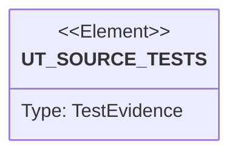

# Semantic TD: jet/tests/pkg-mgmt

## Schema
<!-- type: schema lang: yaml -->

```yaml
semantic_domain:
  key: "jet/tests/pkg-mgmt"
  source_group: "projects/jet/tests/pkg-mgmt"
  coverage_kind: semantic
  evidence:
    source_units:
      - path: "projects/jet/tests/pkg-mgmt/workspace_protocol.rs"
        language: "rust"
        ownership_state: "codegen"
        generator_primitives: ["service_method", "test_case"]
        symbols:
          - name: "write_file"
            kind: "function"
            public: false
          - name: "pkg_json"
            kind: "function"
            public: false
          - name: "test_pnpm_workspace_yaml_discovery"
            kind: "function"
            public: false
          - name: "test_jet_workspace_yaml_priority"
            kind: "function"
            public: false
          - name: "test_catalog_resolution"
            kind: "function"
            public: false
          - name: "test_workspace_mode_jet_detected_for_pnpm_yaml"
            kind: "function"
            public: false
          - name: "make_two_package_workspace"
            kind: "function"
            public: false
          - name: "test_workspace_star_symlink"
            kind: "function"
            public: false
          - name: "test_workspace_caret_resolution"
            kind: "function"
            public: false
          - name: "test_recursive_workspace_install"
            kind: "function"
            public: false
          - name: "test_no_registry_call_for_workspace_dep"
            kind: "function"
            public: false
          - name: "test_lockfile_workspace_fields"
            kind: "function"
            public: false
          - name: "test_idempotent_symlink_creation"
            kind: "function"
            public: false
          - name: "test_workspace_protocol_resolution_variants"
            kind: "function"
            public: false
        source_evidence_node:
          layer: "backend"
          ecosystem: "rust"
          role: "test"
          section_type: "unit-test"
          domain: "projects/jet/tests/pkg-mgmt"
      - path: "projects/jet/tests/pkg-mgmt/pkg_replacement_gate.rs"
        language: "rust"
        ownership_state: "handwrite"
        generator_primitives: ["service_method", "test_case"]
        symbols:
          - name: "harness"
            kind: "module"
            public: false
          - name: "jet_pkg_management_replaces_npm_pnpm_with_bounded_baseline_performance"
            kind: "function"
            public: false
        source_evidence_node:
          layer: "backend"
          ecosystem: "rust"
          role: "test"
          section_type: "unit-test"
          domain: "projects/jet/tests/pkg-mgmt"
```

## Unit Test
<!-- type: unit-test lang: mermaid -->



## Changes
<!-- type: changes lang: yaml -->

```yaml
coverage_kind: semantic
changes:
  - path: "projects/jet/tests/pkg-mgmt/workspace_protocol.rs"
    action: modify
    section: schema
    description: |
      Existing source behavior is covered by this feature/domain semantic TD.
    impl_mode: hand-written
  - path: "projects/jet/tests/pkg-mgmt/pkg_replacement_gate.rs"
    action: modify
    section: schema
    description: |
      Existing source behavior is covered by this feature/domain semantic TD.
    impl_mode: hand-written
    replaces:
      - "<handwrite-tracker:jet-pkg-replacement-gate>"
```
