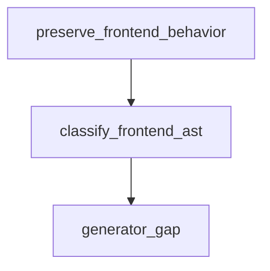

# Semantic TD: jet/tests/__snapshots__/codegen

## Schema
<!-- type: schema lang: yaml -->

```yaml
frontend_semantic:
  section_type: "schema"
  key: "jet/tests/__snapshots__/codegen"
  source_group: "projects/jet/tests/__snapshots__/codegen"
  coverage_kind: semantic
  evidence:
    source_units:
      - path: "projects/jet/tests/__snapshots__/codegen/minimal__types.ts"
        language: "typescript"
        ownership_state: "handwrite"
        generator_primitives: ["frontend_source-unit", "td_section_schema", "test_case", "ts_type_surface"]
        symbols:
          - name: "NewPet"
            kind: "interface"
            public: true
          - name: "Pet"
            kind: "interface"
            public: true
          - name: "ListPetsData"
            kind: "type"
            public: true
          - name: "ListPetsResponse"
            kind: "type"
            public: true
          - name: "CreatePetData"
            kind: "type"
            public: true
          - name: "CreatePetResponse"
            kind: "type"
            public: true
          - name: "GetPetByIdData"
            kind: "type"
            public: true
          - name: "GetPetByIdResponse"
            kind: "type"
            public: true
        source_evidence_node:
          layer: "frontend"
          ecosystem: "typescript-jsx"
          role: "source"
          section_type: "schema"
          domain: "projects/jet/tests/__snapshots__/codegen"
          workspace_root: "projects/jet/tests/__snapshots__/codegen"
        frontend_node:
          workspace_root: "projects/jet/tests/__snapshots__/codegen"
          role: "source"
          section_type: "schema"
          artifact_kind: "source-unit"
      - path: "projects/jet/tests/__snapshots__/codegen/minimal__index.ts"
        language: "typescript"
        ownership_state: "handwrite"
        generator_primitives: ["frontend_source-unit", "td_section_schema", "test_case"]
        source_evidence_node:
          layer: "frontend"
          ecosystem: "typescript-jsx"
          role: "source"
          section_type: "schema"
          domain: "projects/jet/tests/__snapshots__/codegen"
          workspace_root: "projects/jet/tests/__snapshots__/codegen"
        frontend_node:
          workspace_root: "projects/jet/tests/__snapshots__/codegen"
          role: "source"
          section_type: "schema"
          artifact_kind: "source-unit"
  frontend_ast:
    nodes:
      - path: "projects/jet/tests/__snapshots__/codegen/minimal__types.ts"
        workspace_root: "projects/jet/tests/__snapshots__/codegen"
        role: "source"
        artifact_kind: "source-unit"
        section_type: "schema"
      - path: "projects/jet/tests/__snapshots__/codegen/minimal__index.ts"
        workspace_root: "projects/jet/tests/__snapshots__/codegen"
        role: "source"
        artifact_kind: "source-unit"
        section_type: "schema"
```

## Logic
<!-- type: logic lang: mermaid -->



<!-- frontend_source_evidence
- projects/jet/tests/__snapshots__/codegen/minimal__client.ts
- projects/jet/tests/__snapshots__/codegen/minimal__runtime.ts
- projects/jet/tests/__snapshots__/codegen/minimal__hooks.ts
- projects/jet/tests/__snapshots__/codegen/minimal__runtime.axios.ts
-->

## Changes
<!-- type: changes lang: yaml -->

```yaml
coverage_kind: semantic
changes:
  - path: "projects/jet/tests/__snapshots__/codegen/minimal__client.ts"
    action: modify
    section: logic
    description: |
      Existing source behavior is covered by this feature/domain semantic TD.
    impl_mode: hand-written
    replaces:
      - "<handwrite-tracker:projects-jet-tests-snapshots-codegen-minimal-client-ts>"
  - path: "projects/jet/tests/__snapshots__/codegen/minimal__runtime.ts"
    action: modify
    section: logic
    description: |
      Existing source behavior is covered by this feature/domain semantic TD.
    impl_mode: hand-written
    replaces:
      - "<handwrite-tracker:projects-jet-tests-snapshots-codegen-minimal-runtime-ts>"
  - path: "projects/jet/tests/__snapshots__/codegen/minimal__types.ts"
    action: modify
    section: schema
    description: |
      Existing source behavior is covered by this feature/domain semantic TD.
    impl_mode: hand-written
    replaces:
      - "<handwrite-tracker:projects-jet-tests-snapshots-codegen-minimal-types-ts>"
  - path: "projects/jet/tests/__snapshots__/codegen/minimal__hooks.ts"
    action: modify
    section: logic
    description: |
      Existing source behavior is covered by this feature/domain semantic TD.
    impl_mode: hand-written
    replaces:
      - "<handwrite-tracker:projects-jet-tests-snapshots-codegen-minimal-hooks-ts>"
  - path: "projects/jet/tests/__snapshots__/codegen/minimal__runtime.axios.ts"
    action: modify
    section: logic
    description: |
      Existing source behavior is covered by this feature/domain semantic TD.
    impl_mode: hand-written
    replaces:
      - "<handwrite-tracker:projects-jet-tests-snapshots-codegen-minimal-runtime-axios-ts>"
  - path: "projects/jet/tests/__snapshots__/codegen/minimal__index.ts"
    action: modify
    section: schema
    description: |
      Existing source behavior is covered by this feature/domain semantic TD.
    impl_mode: hand-written
    replaces:
      - "<handwrite-tracker:projects-jet-tests-snapshots-codegen-minimal-index-ts>"
```
