# Semantic TD: jet/tests/wasm

## Schema
<!-- type: schema lang: yaml -->

```yaml
semantic_domain:
  key: "jet/tests/wasm"
  source_group: "projects/jet/tests/wasm"
  coverage_kind: semantic
  evidence:
    source_units:
      - path: "projects/jet/tests/wasm/tsx_to_rust_boolean_literal_state.rs"
        language: "rust"
        ownership_state: "codegen"
        generator_primitives: ["config_surface", "service_method", "test_case"]
        symbols:
          - name: "FIXTURE"
            kind: "constant"
            public: false
          - name: "boolean_literal_initializer_yields_bool_turbofish"
            kind: "function"
            public: false
          - name: "numeric_literal_initializer_preserves_i64_default"
            kind: "function"
            public: false
          - name: "string_literal_initializer_yields_string_turbofish"
            kind: "function"
            public: false
          - name: "boolean_state_drives_conditional_render"
            kind: "function"
            public: false
          - name: "boolean_state_setter_lowers_unary_not"
            kind: "function"
            public: false
        source_evidence_node:
          layer: "backend"
          ecosystem: "rust"
          role: "test"
          section_type: "unit-test"
          domain: "projects/jet/tests/wasm"
      - path: "projects/jet/tests/wasm/tsx_to_rust_effect_fetch.rs"
        language: "rust"
        ownership_state: "codegen"
        generator_primitives: ["service_method", "test_case"]
        symbols:
          - name: "use_effect_fetch_lowers_to_wasm_host_bridge"
            kind: "function"
            public: false
          - name: "use_effect_non_empty_deps_fail_loudly"
            kind: "function"
            public: false
        source_evidence_node:
          layer: "backend"
          ecosystem: "rust"
          role: "test"
          section_type: "unit-test"
          domain: "projects/jet/tests/wasm"
      - path: "projects/jet/tests/wasm/list_render_debug.rs"
        language: "rust"
        ownership_state: "codegen"
        generator_primitives: ["service_method", "test_case"]
        symbols:
          - name: "common"
            kind: "module"
            public: false
          - name: "count_spans"
            kind: "function"
            public: false
          - name: "list_render_demo_grows_children_on_click"
            kind: "function"
            public: false
        source_evidence_node:
          layer: "backend"
          ecosystem: "rust"
          role: "test"
          section_type: "unit-test"
          domain: "projects/jet/tests/wasm"
      - path: "projects/jet/tests/wasm/nested_debug.rs"
        language: "rust"
        ownership_state: "codegen"
        generator_primitives: ["service_method", "test_case"]
        symbols:
          - name: "common"
            kind: "module"
            public: false
          - name: "intrinsic_depth"
            kind: "function"
            public: false
          - name: "nested_demo_preserves_tree_depth_and_hit_tests_through_layers"
            kind: "function"
            public: false
        source_evidence_node:
          layer: "backend"
          ecosystem: "rust"
          role: "test"
          section_type: "unit-test"
          domain: "projects/jet/tests/wasm"
      - path: "projects/jet/tests/wasm/big_list_debug.rs"
        language: "rust"
        ownership_state: "codegen"
        generator_primitives: ["service_method", "test_case"]
        symbols:
          - name: "common"
            kind: "module"
            public: false
          - name: "span_texts"
            kind: "function"
            public: false
          - name: "big_list_demo_renders_100_spans_in_order"
            kind: "function"
            public: false
        source_evidence_node:
          layer: "backend"
          ecosystem: "rust"
          role: "test"
          section_type: "unit-test"
          domain: "projects/jet/tests/wasm"
      - path: "projects/jet/tests/wasm/tsx_to_rust_counter.rs"
        language: "rust"
        ownership_state: "codegen"
        generator_primitives: ["config_surface", "service_method", "test_case"]
        symbols:
          - name: "COUNTER_TSX"
            kind: "constant"
            public: false
          - name: "counter_transpiles_without_error"
            kind: "function"
            public: false
          - name: "generated_has_props_struct"
            kind: "function"
            public: false
          - name: "generated_has_render_fn"
            kind: "function"
            public: false
          - name: "generated_calls_use_state_with_i64"
            kind: "function"
            public: false
          - name: "generated_emits_jsx_as_element_intrinsic"
            kind: "function"
            public: false
          - name: "generated_emits_text_and_interpolation"
            kind: "function"
            public: false
          - name: "generated_has_factory_fn"
            kind: "function"
            public: false
          - name: "out_of_subset_fails_loudly"
            kind: "function"
            public: false
        source_evidence_node:
          layer: "backend"
          ecosystem: "rust"
          role: "test"
          section_type: "unit-test"
          domain: "projects/jet/tests/wasm"
      - path: "projects/jet/tests/wasm/react_dom_oracle_conformance.rs"
        language: "rust"
        ownership_state: "codegen"
        generator_primitives: ["config_surface", "data_model", "enum_model", "service_method", "test_case"]
        symbols:
          - name: "common"
            kind: "module"
            public: false
          - name: "live_wasm_e2e_guard"
            kind: "function"
            public: false
          - name: "browser_options"
            kind: "function"
            public: false
          - name: "workspace_root"
            kind: "function"
            public: false
          - name: "FixtureInteraction"
            kind: "struct"
            public: false
          - name: "FixtureParityCase"
            kind: "struct"
            public: false
          - name: "fixture_parity_cases"
            kind: "function"
            public: false
          - name: "LIBRARY_FIXTURE_MANIFEST"
            kind: "constant"
            public: false
          - name: "LIBRARY_PACKAGE_MANIFEST"
            kind: "constant"
            public: false
          - name: "LibraryParityCase"
            kind: "struct"
            public: false
          - name: "LibraryStateProbe"
            kind: "struct"
            public: false
          - name: "LibraryInteraction"
            kind: "struct"
            public: false
          - name: "LibraryInteractionKind"
            kind: "enum"
            public: false
          - name: "library_parity_cases"
            kind: "function"
            public: false
          - name: "assert_fixture_phase"
            kind: "function"
            public: false
          - name: "assert_library_dom_phase"
            kind: "function"
            public: false
          - name: "library_control_state"
            kind: "function"
            public: false
          - name: "library_control_state_expr"
            kind: "function"
            public: false
          - name: "assert_library_state_phase"
            kind: "function"
            public: false
          - name: "replace_library_input_value_expr"
            kind: "function"
            public: false
          - name: "click_library_control_expr"
            kind: "function"
            public: false
          - name: "apply_library_interaction"
            kind: "function"
            public: false
          - name: "assert_fixture_layout_phase"
            kind: "function"
            public: false
          - name: "assert_fixture_canvas_paint_phase"
            kind: "function"
            public: false
          - name: "assert_fixture_screenshot_phase"
            kind: "function"
            public: false
          - name: "CONTROLLED_INPUT_TSX"
            kind: "constant"
            public: false
          - name: "CONTROLLED_TEXTAREA_TSX"
            kind: "constant"
            public: false
          - name: "write_controlled_input_dom_project"
            kind: "function"
            public: false
          - name: "write_controlled_textarea_dom_project"
            kind: "function"
            public: false
          - name: "write_library_dom_project"
            kind: "function"
            public: false
          - name: "controlled_input_dom_state"
            kind: "function"
            public: false
          - name: "controlled_textarea_dom_state"
            kind: "function"
            public: false
          - name: "replace_input_value_expr"
            kind: "function"
            public: false
          - name: "replace_textarea_value_expr"
            kind: "function"
            public: false
          - name: "replace_input_value"
            kind: "function"
            public: false
          - name: "replace_textarea_value"
            kind: "function"
            public: false
          - name: "methods_contain_ordered_subsequence"
            kind: "function"
            public: false
          - name: "webgpu_status"
            kind: "function"
            public: false
          - name: "webgpu_status_matches_expected_paint"
            kind: "function"
            public: false
          - name: "webgpu_visual_screenshot_matches"
            kind: "function"
            public: false
        source_evidence_node:
          layer: "backend"
          ecosystem: "rust"
          role: "test"
          section_type: "unit-test"
          domain: "projects/jet/tests/wasm"
      - path: "projects/jet/tests/wasm/wasm_dom_parity_gate.rs"
        language: "rust"
        ownership_state: "handwrite"
        generator_primitives: ["service_method", "test_case"]
        symbols:
          - name: "harness"
            kind: "module"
            public: false
          - name: "jet_build_wasm_matches_dom_build_behavior"
            kind: "function"
            public: false
        source_evidence_node:
          layer: "backend"
          ecosystem: "rust"
          role: "test"
          section_type: "unit-test"
          domain: "projects/jet/tests/wasm"
      - path: "projects/jet/tests/wasm/parity_oracle_reexport.rs"
        language: "rust"
        ownership_state: "codegen"
        generator_primitives: ["service_method", "test_case"]
        symbols:
          - name: "run_fixture_symbol_resolves"
            kind: "function"
            public: false
        source_evidence_node:
          layer: "backend"
          ecosystem: "rust"
          role: "test"
          section_type: "unit-test"
          domain: "projects/jet/tests/wasm"
      - path: "projects/jet/tests/wasm/usememo_debug.rs"
        language: "rust"
        ownership_state: "codegen"
        generator_primitives: ["service_method", "test_case"]
        symbols:
          - name: "common"
            kind: "module"
            public: false
          - name: "tree_contains_text"
            kind: "function"
            public: false
          - name: "usememo_demo_tracks_state_across_click"
            kind: "function"
            public: false
        source_evidence_node:
          layer: "backend"
          ecosystem: "rust"
          role: "test"
          section_type: "unit-test"
          domain: "projects/jet/tests/wasm"
      - path: "projects/jet/tests/wasm/self_closing_debug.rs"
        language: "rust"
        ownership_state: "codegen"
        generator_primitives: ["service_method", "test_case"]
        symbols:
          - name: "common"
            kind: "module"
            public: false
          - name: "intrinsic_with_id"
            kind: "function"
            public: false
          - name: "self_closing_demo_renders_void_elements_as_leaf_intrinsics"
            kind: "function"
            public: false
        source_evidence_node:
          layer: "backend"
          ecosystem: "rust"
          role: "test"
          section_type: "unit-test"
          domain: "projects/jet/tests/wasm"
      - path: "projects/jet/tests/wasm/tsx_to_rust_controlled_input.rs"
        language: "rust"
        ownership_state: "codegen"
        generator_primitives: ["config_surface", "service_method", "test_case"]
        symbols:
          - name: "CONTROLLED_INPUT_TSX"
            kind: "constant"
            public: false
          - name: "controlled_input_lowers_value_placeholder_and_on_change"
            kind: "function"
            public: false
        source_evidence_node:
          layer: "backend"
          ecosystem: "rust"
          role: "test"
          section_type: "unit-test"
          domain: "projects/jet/tests/wasm"
      - path: "projects/jet/tests/wasm/items_list_debug.rs"
        language: "rust"
        ownership_state: "codegen"
        generator_primitives: ["service_method", "test_case"]
        symbols:
          - name: "common"
            kind: "module"
            public: false
          - name: "items_list_demo_element_tree_matches_snapshot"
            kind: "function"
            public: false
        source_evidence_node:
          layer: "backend"
          ecosystem: "rust"
          role: "test"
          section_type: "unit-test"
          domain: "projects/jet/tests/wasm"
      - path: "projects/jet/tests/wasm/large_int_debug.rs"
        language: "rust"
        ownership_state: "codegen"
        generator_primitives: ["config_surface", "service_method", "test_case"]
        symbols:
          - name: "common"
            kind: "module"
            public: false
          - name: "START"
            kind: "constant"
            public: false
          - name: "large_int_demo_survives_near_max_increments"
            kind: "function"
            public: false
        source_evidence_node:
          layer: "backend"
          ecosystem: "rust"
          role: "test"
          section_type: "unit-test"
          domain: "projects/jet/tests/wasm"
      - path: "projects/jet/tests/wasm/classname_debug.rs"
        language: "rust"
        ownership_state: "codegen"
        generator_primitives: ["service_method", "test_case"]
        symbols:
          - name: "common"
            kind: "module"
            public: false
          - name: "classname_demo_surfaces_class_name_in_element_tree"
            kind: "function"
            public: false
        source_evidence_node:
          layer: "backend"
          ecosystem: "rust"
          role: "test"
          section_type: "unit-test"
          domain: "projects/jet/tests/wasm"
      - path: "projects/jet/tests/wasm/mui_visual_regression.rs"
        language: "rust"
        ownership_state: "codegen"
        generator_primitives: ["config_surface", "data_model", "service_method", "test_case"]
        symbols:
          - name: "common"
            kind: "module"
            public: false
          - name: "VISUAL_TABLE_EXPECTED_ROWS"
            kind: "constant"
            public: false
          - name: "VISUAL_TABLE_EXPECTED_CELLS"
            kind: "constant"
            public: false
          - name: "VISUAL_TABLE_LAST_CELL"
            kind: "constant"
            public: false
          - name: "VISUAL_SCREENSHOT_MIN_FOREGROUND_COUNT"
            kind: "constant"
            public: false
          - name: "VISUAL_SCREENSHOT_MIN_NON_WHITE"
            kind: "constant"
            public: false
          - name: "WASM_COMPAT_LOWERING_MARKER"
            kind: "constant"
            public: false
          - name: "VisualFixtureSpec"
            kind: "struct"
            public: false
          - name: "MUI_VISUAL_SPEC"
            kind: "constant"
            public: false
          - name: "ANTD_VISUAL_SPEC"
            kind: "constant"
            public: false
          - name: "VISUAL_READY_EXPR"
            kind: "constant"
            public: false
          - name: "VISUAL_TEXT_EXPR"
            kind: "constant"
            public: false
          - name: "WAIT_FOR_BROWSER_PAINT_EXPR"
            kind: "constant"
            public: false
          - name: "VISUAL_DIAGNOSTICS_EXPR"
            kind: "constant"
            public: false
          - name: "DOM_SELECTION_TARGETS_EXPR"
            kind: "constant"
            public: false
          - name: "DOM_SELECTION_READ_EXPR"
            kind: "constant"
            public: false
          - name: "WASM_SELECTION_TARGETS_EXPR"
            kind: "constant"
            public: false
          - name: "WASM_INSTALL_CLIPBOARD_SPY_EXPR"
            kind: "constant"
            public: false
          - name: "WASM_SELECTION_READ_EXPR"
            kind: "constant"
            public: false
          - name: "WASM_SCROLL_READ_EXPR"
            kind: "constant"
            public: false
          - name: "workspace_root"
            kind: "function"
            public: false
          - name: "free_port"
            kind: "function"
            public: false
          - name: "missing_visual_install_deps"
            kind: "function"
            public: false
          - name: "require_visual_install"
            kind: "function"
            public: false
          - name: "wait_for_http"
            kind: "function"
            public: false
          - name: "run_jet_command"
            kind: "function"
            public: false
          - name: "require_success"
            kind: "function"
            public: false
          - name: "run_jet_bb_capture_cli"
            kind: "function"
            public: false
          - name: "run_jet_bb_screenshot_cli"
            kind: "function"
            public: false
          - name: "attach_jet_bb_cli_evidence"
            kind: "function"
            public: false
          - name: "assert_no_wasm_compat_lowering_log"
            kind: "function"
            public: false
          - name: "assert_wasm_manifest_uses_strict_lowering"
            kind: "function"
            public: false
          - name: "assert_wasm_demo_uses_strict_lowering"
            kind: "function"
            public: false
          - name: "spawn_jet_dev"
            kind: "function"
            public: false
          - name: "run_jet_install"
            kind: "function"
            public: false
          - name: "read_child_stderr"
            kind: "function"
            public: false
          - name: "wait_child_exit"
            kind: "function"
            public: false
          - name: "shutdown_jet_dev"
            kind: "function"
            public: false
          - name: "truncate_for_failure"
            kind: "function"
            public: false
          - name: "json_for_failure"
            kind: "function"
            public: false
        source_evidence_node:
          layer: "backend"
          ecosystem: "rust"
          role: "test"
          section_type: "unit-test"
          domain: "projects/jet/tests/wasm"
      - path: "projects/jet/tests/wasm/string_state_debug.rs"
        language: "rust"
        ownership_state: "codegen"
        generator_primitives: ["service_method", "test_case"]
        symbols:
          - name: "common"
            kind: "module"
            public: false
          - name: "string_state_demo_surfaces_string_type_and_value"
            kind: "function"
            public: false
        source_evidence_node:
          layer: "backend"
          ecosystem: "rust"
          role: "test"
          section_type: "unit-test"
          domain: "projects/jet/tests/wasm"
      - path: "projects/jet/tests/wasm/wasm_dev_smoke.rs"
        language: "rust"
        ownership_state: "codegen"
        generator_primitives: ["service_method", "test_case"]
        symbols:
          - name: "common"
            kind: "module"
            public: false
          - name: "free_port"
            kind: "function"
            public: false
          - name: "dev_server_serves_wasm_bundle"
            kind: "function"
            public: false
        source_evidence_node:
          layer: "backend"
          ecosystem: "rust"
          role: "test"
          section_type: "unit-test"
          domain: "projects/jet/tests/wasm"
      - path: "projects/jet/tests/wasm/no_state_debug.rs"
        language: "rust"
        ownership_state: "codegen"
        generator_primitives: ["service_method", "test_case"]
        symbols:
          - name: "common"
            kind: "module"
            public: false
          - name: "no_state_demo_runs_with_zero_hooks"
            kind: "function"
            public: false
        source_evidence_node:
          layer: "backend"
          ecosystem: "rust"
          role: "test"
          section_type: "unit-test"
          domain: "projects/jet/tests/wasm"
      - path: "projects/jet/tests/wasm/toggle_debug.rs"
        language: "rust"
        ownership_state: "codegen"
        generator_primitives: ["service_method", "test_case"]
        symbols:
          - name: "common"
            kind: "module"
            public: false
          - name: "toggle_demo_flips_bool_and_conditionally_renders_span"
            kind: "function"
            public: false
        source_evidence_node:
          layer: "backend"
          ecosystem: "rust"
          role: "test"
          section_type: "unit-test"
          domain: "projects/jet/tests/wasm"
      - path: "projects/jet/tests/wasm/tsx_to_rust_ast_probe.rs"
        language: "rust"
        ownership_state: "codegen"
        generator_primitives: ["config_surface", "service_method", "test_case"]
        symbols:
          - name: "COUNTER_TSX"
            kind: "constant"
            public: false
          - name: "print_tree"
            kind: "function"
            public: false
          - name: "dump_counter_ast"
            kind: "function"
            public: false
        source_evidence_node:
          layer: "backend"
          ecosystem: "rust"
          role: "test"
          section_type: "unit-test"
          domain: "projects/jet/tests/wasm"
      - path: "projects/jet/tests/wasm/tsx_to_rust_imports.rs"
        language: "rust"
        ownership_state: "codegen"
        generator_primitives: ["config_surface", "service_method", "test_case"]
        symbols:
          - name: "MUI_VISUAL_FIXTURE_TSX"
            kind: "constant"
            public: false
          - name: "ANTD_VISUAL_FIXTURE_TSX"
            kind: "constant"
            public: false
          - name: "react_imports_do_not_block_transpile"
            kind: "function"
            public: false
          - name: "type_only_and_css_imports_do_not_block_transpile"
            kind: "function"
            public: false
          - name: "mui_runtime_imports_lower_with_wasm_adapter"
            kind: "function"
            public: false
          - name: "local_runtime_imports_fail_before_silent_drop"
            kind: "function"
            public: false
          - name: "compat_lowering_maps_mui_imports_to_wasm_intrinsics"
            kind: "function"
            public: false
          - name: "mui_visual_fixture_strict_lowering_preserves_form_controls"
            kind: "function"
            public: false
          - name: "antd_visual_fixture_strict_lowering_preserves_form_controls"
            kind: "function"
            public: false
          - name: "clipboard_write_text_lowers_to_host_bridge"
            kind: "function"
            public: false
          - name: "compat_lowering_does_not_add_mui_button_style_when_class_name_is_explicit"
            kind: "function"
            public: false
          - name: "compat_lowering_does_not_add_mui_textfield_style_when_class_name_is_explicit"
            kind: "function"
            public: false
        source_evidence_node:
          layer: "backend"
          ecosystem: "rust"
          role: "test"
          section_type: "unit-test"
          domain: "projects/jet/tests/wasm"
      - path: "projects/jet/tests/wasm/tsx_to_rust_toggle.rs"
        language: "rust"
        ownership_state: "codegen"
        generator_primitives: ["config_surface", "service_method", "test_case"]
        symbols:
          - name: "TOGGLE_TSX"
            kind: "constant"
            public: false
          - name: "toggle_transpiles_without_error"
            kind: "function"
            public: false
          - name: "bool_prop_yields_bool_turbofish"
            kind: "function"
            public: false
          - name: "unary_not_in_setter_call"
            kind: "function"
            public: false
          - name: "nested_jsx_produces_nested_intrinsics"
            kind: "function"
            public: false
          - name: "self_closing_emits_empty_children"
            kind: "function"
            public: false
          - name: "conditional_render_uses_if_else"
            kind: "function"
            public: false
        source_evidence_node:
          layer: "backend"
          ecosystem: "rust"
          role: "test"
          section_type: "unit-test"
          domain: "projects/jet/tests/wasm"
      - path: "projects/jet/tests/wasm/tsx_to_rust_i18n_probe.rs"
        language: "rust"
        ownership_state: "codegen"
        generator_primitives: ["config_surface", "service_method", "test_case"]
        symbols:
          - name: "TSX"
            kind: "constant"
            public: false
          - name: "print_tree"
            kind: "function"
            public: false
          - name: "dump_i18n_ast"
            kind: "function"
            public: false
        source_evidence_node:
          layer: "backend"
          ecosystem: "rust"
          role: "test"
          section_type: "unit-test"
          domain: "projects/jet/tests/wasm"
      - path: "projects/jet/tests/wasm/tsx_to_rust_i18n_copy_constants.rs"
        language: "rust"
        ownership_state: "codegen"
        generator_primitives: ["config_surface", "service_method", "test_case"]
        symbols:
          - name: "FIXTURE"
            kind: "constant"
            public: false
          - name: "top_level_string_const_passes_through"
            kind: "function"
            public: false
          - name: "top_level_object_const_passes_through"
            kind: "function"
            public: false
          - name: "in_component_string_const_lowers_to_let"
            kind: "function"
            public: false
          - name: "member_access_in_jsx_resolves"
            kind: "function"
            public: false
        source_evidence_node:
          layer: "backend"
          ecosystem: "rust"
          role: "test"
          section_type: "unit-test"
          domain: "projects/jet/tests/wasm"
      - path: "projects/jet/tests/wasm/wasm_build_end_to_end.rs"
        language: "rust"
        ownership_state: "codegen"
        generator_primitives: ["config_surface", "data_model", "service_method", "test_case"]
        symbols:
          - name: "common"
            kind: "module"
            public: false
          - name: "wasm_pack_build_lock"
            kind: "function"
            public: false
          - name: "build_wasm_serialized_with_profile"
            kind: "function"
            public: false
          - name: "build_wasm_serialized"
            kind: "function"
            public: false
          - name: "build_default_wasm_serialized"
            kind: "function"
            public: false
          - name: "WEBGPU_VISUAL_PROBE_JS"
            kind: "constant"
            public: false
          - name: "WEBGPU_CONSOLE_CAPTURE_JS"
            kind: "constant"
            public: false
          - name: "WEBGPU_SETTLE_TWO_RAF_JS"
            kind: "constant"
            public: false
          - name: "webgpu_launch_options"
            kind: "function"
            public: false
          - name: "wait_for_webgpu_rendered"
            kind: "function"
            public: false
          - name: "assert_visible_webgpu_screenshot"
            kind: "function"
            public: false
          - name: "webgpu_status_frames"
            kind: "function"
            public: false
          - name: "dispatch_cdp_click"
            kind: "function"
            public: false
          - name: "dom_text_summary_expr"
            kind: "function"
            public: false
          - name: "wait_for_dom_text"
            kind: "function"
            public: false
          - name: "dom_click_button_expr"
            kind: "function"
            public: false
          - name: "click_dom_button"
            kind: "function"
            public: false
          - name: "counter_demo_builds_and_updates_on_webgpu_canvas"
            kind: "function"
            public: false
          - name: "wasm_build_selects_webgpu_scaffold_by_default"
            kind: "function"
            public: false
          - name: "wasm_build_bundles_css_side_effect_imports"
            kind: "function"
            public: false
          - name: "wasm_build_compat_lowers_mui_runtime_imports"
            kind: "function"
            public: false
          - name: "wasm_build_compat_lowers_antd_runtime_imports"
            kind: "function"
            public: false
          - name: "use_effect_fetch_reaches_host_api_from_wasm"
            kind: "function"
            public: false
          - name: "cue_artifact_studio_dom_wasm_loads_api_and_posts"
            kind: "function"
            public: false
          - name: "webgpu_renderer_reports_runtime_status_and_visual_probe_when_available"
            kind: "function"
            public: false
          - name: "write_css_import_fixture"
            kind: "function"
            public: false
          - name: "write_mui_compat_fixture"
            kind: "function"
            public: false
          - name: "write_antd_compat_fixture"
            kind: "function"
            public: false
          - name: "write_webgpu_fixture"
            kind: "function"
            public: false
          - name: "write_webgpu_large_table_fixture"
            kind: "function"
            public: false
          - name: "spawn_static_server"
            kind: "function"
            public: false
          - name: "ApiStaticState"
            kind: "struct"
            public: false
          - name: "spawn_static_server_with_api"
            kind: "function"
            public: false
          - name: "CueWasmState"
            kind: "struct"
            public: false
          - name: "spawn_cue_wasm_server"
            kind: "function"
            public: false
          - name: "handle_cue_api_projects"
            kind: "function"
            public: false
          - name: "handle_cue_post_project"
            kind: "function"
            public: false
          - name: "handle_cue_post_message"
            kind: "function"
            public: false
          - name: "handle_cue_wasm_index"
            kind: "function"
            public: false
          - name: "handle_cue_wasm_static"
            kind: "function"
            public: false
        source_evidence_node:
          layer: "backend"
          ecosystem: "rust"
          role: "test"
          section_type: "unit-test"
          domain: "projects/jet/tests/wasm"
      - path: "projects/jet/tests/wasm/multi_handler_debug.rs"
        language: "rust"
        ownership_state: "codegen"
        generator_primitives: ["service_method", "test_case"]
        symbols:
          - name: "common"
            kind: "module"
            public: false
          - name: "hook_i64"
            kind: "function"
            public: false
          - name: "multi_handler_demo_isolates_state_per_button"
            kind: "function"
            public: false
        source_evidence_node:
          layer: "backend"
          ecosystem: "rust"
          role: "test"
          section_type: "unit-test"
          domain: "projects/jet/tests/wasm"
      - path: "projects/jet/tests/wasm/unicode_debug.rs"
        language: "rust"
        ownership_state: "codegen"
        generator_primitives: ["config_surface", "service_method", "test_case"]
        symbols:
          - name: "common"
            kind: "module"
            public: false
          - name: "GREETING"
            kind: "constant"
            public: false
          - name: "unicode_demo_roundtrips_cjk_emoji_and_cyrillic"
            kind: "function"
            public: false
        source_evidence_node:
          layer: "backend"
          ecosystem: "rust"
          role: "test"
          section_type: "unit-test"
          domain: "projects/jet/tests/wasm"
```

## Unit Test

```mermaid
---
id: unit-test
coverage_kind: semantic
strategy: preserve observed source behavior while semantic coverage is promoted toward generator primitives
evidence:
  source_tests:
    - path: "projects/jet/tests/wasm/tsx_to_rust_boolean_literal_state.rs"
    - path: "projects/jet/tests/wasm/tsx_to_rust_effect_fetch.rs"
    - path: "projects/jet/tests/wasm/list_render_debug.rs"
    - path: "projects/jet/tests/wasm/nested_debug.rs"
    - path: "projects/jet/tests/wasm/big_list_debug.rs"
    - path: "projects/jet/tests/wasm/tsx_to_rust_counter.rs"
    - path: "projects/jet/tests/wasm/react_dom_oracle_conformance.rs"
    - path: "projects/jet/tests/wasm/wasm_dom_parity_gate.rs"
    - path: "projects/jet/tests/wasm/parity_oracle_reexport.rs"
    - path: "projects/jet/tests/wasm/usememo_debug.rs"
    - path: "projects/jet/tests/wasm/self_closing_debug.rs"
    - path: "projects/jet/tests/wasm/tsx_to_rust_controlled_input.rs"
    - path: "projects/jet/tests/wasm/items_list_debug.rs"
    - path: "projects/jet/tests/wasm/large_int_debug.rs"
    - path: "projects/jet/tests/wasm/classname_debug.rs"
    - path: "projects/jet/tests/wasm/mui_visual_regression.rs"
    - path: "projects/jet/tests/wasm/string_state_debug.rs"
    - path: "projects/jet/tests/wasm/wasm_dev_smoke.rs"
    - path: "projects/jet/tests/wasm/no_state_debug.rs"
    - path: "projects/jet/tests/wasm/toggle_debug.rs"
    - path: "projects/jet/tests/wasm/tsx_to_rust_ast_probe.rs"
    - path: "projects/jet/tests/wasm/tsx_to_rust_imports.rs"
    - path: "projects/jet/tests/wasm/tsx_to_rust_toggle.rs"
    - path: "projects/jet/tests/wasm/tsx_to_rust_i18n_probe.rs"
    - path: "projects/jet/tests/wasm/tsx_to_rust_i18n_copy_constants.rs"
    - path: "projects/jet/tests/wasm/wasm_build_end_to_end.rs"
    - path: "projects/jet/tests/wasm/multi_handler_debug.rs"
    - path: "projects/jet/tests/wasm/unicode_debug.rs"
---
requirementDiagram

element UT_SOURCE_TESTS {
  type: "TestEvidence"
}
```

<!-- type: unit-test lang: mermaid -->



## Changes
<!-- type: changes lang: yaml -->

```yaml
coverage_kind: semantic
changes:
  - path: "projects/jet/tests/wasm/tsx_to_rust_boolean_literal_state.rs"
    action: modify
    section: schema
    description: |
      Existing source behavior is covered by this feature/domain semantic TD.
    impl_mode: hand-written
  - path: "projects/jet/tests/wasm/tsx_to_rust_effect_fetch.rs"
    action: modify
    section: schema
    description: |
      Existing source behavior is covered by this feature/domain semantic TD.
    impl_mode: hand-written
  - path: "projects/jet/tests/wasm/list_render_debug.rs"
    action: modify
    section: schema
    description: |
      Existing source behavior is covered by this feature/domain semantic TD.
    impl_mode: hand-written
  - path: "projects/jet/tests/wasm/nested_debug.rs"
    action: modify
    section: schema
    description: |
      Existing source behavior is covered by this feature/domain semantic TD.
    impl_mode: hand-written
  - path: "projects/jet/tests/wasm/big_list_debug.rs"
    action: modify
    section: schema
    description: |
      Existing source behavior is covered by this feature/domain semantic TD.
    impl_mode: hand-written
  - path: "projects/jet/tests/wasm/tsx_to_rust_counter.rs"
    action: modify
    section: schema
    description: |
      Existing source behavior is covered by this feature/domain semantic TD.
    impl_mode: hand-written
  - path: "projects/jet/tests/wasm/react_dom_oracle_conformance.rs"
    action: modify
    section: schema
    description: |
      Existing source behavior is covered by this feature/domain semantic TD.
    impl_mode: hand-written
  - path: "projects/jet/tests/wasm/wasm_dom_parity_gate.rs"
    action: modify
    section: schema
    description: |
      Existing source behavior is covered by this feature/domain semantic TD.
    impl_mode: hand-written
    replaces:
      - "<handwrite-tracker:jet-wasm-dom-parity-gate>"
  - path: "projects/jet/tests/wasm/parity_oracle_reexport.rs"
    action: modify
    section: schema
    description: |
      Existing source behavior is covered by this feature/domain semantic TD.
    impl_mode: hand-written
  - path: "projects/jet/tests/wasm/usememo_debug.rs"
    action: modify
    section: schema
    description: |
      Existing source behavior is covered by this feature/domain semantic TD.
    impl_mode: hand-written
  - path: "projects/jet/tests/wasm/self_closing_debug.rs"
    action: modify
    section: schema
    description: |
      Existing source behavior is covered by this feature/domain semantic TD.
    impl_mode: hand-written
  - path: "projects/jet/tests/wasm/tsx_to_rust_controlled_input.rs"
    action: modify
    section: schema
    description: |
      Existing source behavior is covered by this feature/domain semantic TD.
    impl_mode: hand-written
  - path: "projects/jet/tests/wasm/items_list_debug.rs"
    action: modify
    section: schema
    description: |
      Existing source behavior is covered by this feature/domain semantic TD.
    impl_mode: hand-written
  - path: "projects/jet/tests/wasm/large_int_debug.rs"
    action: modify
    section: schema
    description: |
      Existing source behavior is covered by this feature/domain semantic TD.
    impl_mode: hand-written
  - path: "projects/jet/tests/wasm/classname_debug.rs"
    action: modify
    section: schema
    description: |
      Existing source behavior is covered by this feature/domain semantic TD.
    impl_mode: hand-written
  - path: "projects/jet/tests/wasm/mui_visual_regression.rs"
    action: modify
    section: schema
    description: |
      Existing source behavior is covered by this feature/domain semantic TD.
    impl_mode: hand-written
  - path: "projects/jet/tests/wasm/string_state_debug.rs"
    action: modify
    section: schema
    description: |
      Existing source behavior is covered by this feature/domain semantic TD.
    impl_mode: hand-written
  - path: "projects/jet/tests/wasm/wasm_dev_smoke.rs"
    action: modify
    section: schema
    description: |
      Existing source behavior is covered by this feature/domain semantic TD.
    impl_mode: hand-written
  - path: "projects/jet/tests/wasm/no_state_debug.rs"
    action: modify
    section: schema
    description: |
      Existing source behavior is covered by this feature/domain semantic TD.
    impl_mode: hand-written
  - path: "projects/jet/tests/wasm/toggle_debug.rs"
    action: modify
    section: schema
    description: |
      Existing source behavior is covered by this feature/domain semantic TD.
    impl_mode: hand-written
  - path: "projects/jet/tests/wasm/tsx_to_rust_ast_probe.rs"
    action: modify
    section: schema
    description: |
      Existing source behavior is covered by this feature/domain semantic TD.
    impl_mode: hand-written
  - path: "projects/jet/tests/wasm/tsx_to_rust_imports.rs"
    action: modify
    section: schema
    description: |
      Existing source behavior is covered by this feature/domain semantic TD.
    impl_mode: hand-written
  - path: "projects/jet/tests/wasm/tsx_to_rust_toggle.rs"
    action: modify
    section: schema
    description: |
      Existing source behavior is covered by this feature/domain semantic TD.
    impl_mode: hand-written
  - path: "projects/jet/tests/wasm/tsx_to_rust_i18n_probe.rs"
    action: modify
    section: schema
    description: |
      Existing source behavior is covered by this feature/domain semantic TD.
    impl_mode: hand-written
  - path: "projects/jet/tests/wasm/tsx_to_rust_i18n_copy_constants.rs"
    action: modify
    section: schema
    description: |
      Existing source behavior is covered by this feature/domain semantic TD.
    impl_mode: hand-written
  - path: "projects/jet/tests/wasm/wasm_build_end_to_end.rs"
    action: modify
    section: schema
    description: |
      Existing source behavior is covered by this feature/domain semantic TD.
    impl_mode: hand-written
  - path: "projects/jet/tests/wasm/multi_handler_debug.rs"
    action: modify
    section: schema
    description: |
      Existing source behavior is covered by this feature/domain semantic TD.
    impl_mode: hand-written
  - path: "projects/jet/tests/wasm/unicode_debug.rs"
    action: modify
    section: schema
    description: |
      Existing source behavior is covered by this feature/domain semantic TD.
    impl_mode: hand-written
```
