# Semantic TD: jet/tests

## Schema
<!-- type: schema lang: yaml -->

```yaml
semantic_domain:
  key: "jet/tests"
  source_group: "projects/jet/tests"
  coverage_kind: semantic
  evidence:
    source_units:
      - path: "projects/jet/tests/openapi_golden.rs"
        language: "rust"
        ownership_state: "handwrite"
        generator_primitives: ["test_case"]
        symbols:
          - name: "codegen_openapi_golden"
            kind: "module"
            public: false
        source_evidence_node:
          layer: "backend"
          ecosystem: "rust"
          role: "test"
          section_type: "unit-test"
          domain: "projects/jet/tests"
      - path: "projects/jet/tests/behavior_product_flow_e2e_readiness.rs"
        language: "rust"
        ownership_state: "codegen"
        generator_primitives: ["service_method", "test_case"]
        symbols:
          - name: "product_flow_e2e_readiness"
            kind: "function"
            public: false
        source_evidence_node:
          layer: "backend"
          ecosystem: "rust"
          role: "test"
          section_type: "unit-test"
          domain: "projects/jet/tests"
      - path: "projects/jet/tests/behavior_package_manager_workspace_parity.rs"
        language: "rust"
        ownership_state: "codegen"
        generator_primitives: ["service_method", "test_case"]
        symbols:
          - name: "package_manager_workspace_parity"
            kind: "function"
            public: false
        source_evidence_node:
          layer: "backend"
          ecosystem: "rust"
          role: "test"
          section_type: "unit-test"
          domain: "projects/jet/tests"
      - path: "projects/jet/tests/behavior_nx_graph_parity.rs"
        language: "rust"
        ownership_state: "codegen"
        generator_primitives: ["service_method", "test_case"]
        symbols:
          - name: "nx_graph_parity"
            kind: "function"
            public: false
        source_evidence_node:
          layer: "backend"
          ecosystem: "rust"
          role: "test"
          section_type: "unit-test"
          domain: "projects/jet/tests"
      - path: "projects/jet/tests/behavior_built_in_ts_test_runtime.rs"
        language: "rust"
        ownership_state: "codegen"
        generator_primitives: ["service_method", "test_case"]
        symbols:
          - name: "built_in_ts_test_runtime"
            kind: "function"
            public: false
        source_evidence_node:
          layer: "backend"
          ecosystem: "rust"
          role: "test"
          section_type: "unit-test"
          domain: "projects/jet/tests"
      - path: "projects/jet/tests/react_dom_oracle_conformance.rs"
        language: "rust"
        ownership_state: "handwrite"
        generator_primitives: ["service_method", "test_case"]
        symbols:
          - name: "react_dom_oracle_conformance"
            kind: "function"
            public: false
        source_evidence_node:
          layer: "backend"
          ecosystem: "rust"
          role: "test"
          section_type: "unit-test"
          domain: "projects/jet/tests"
      - path: "projects/jet/tests/behavior_production_bundle_output_parity.rs"
        language: "rust"
        ownership_state: "codegen"
        generator_primitives: ["service_method", "test_case"]
        symbols:
          - name: "production_bundle_output_parity"
            kind: "function"
            public: false
        source_evidence_node:
          layer: "backend"
          ecosystem: "rust"
          role: "test"
          section_type: "unit-test"
          domain: "projects/jet/tests"
      - path: "projects/jet/tests/wasm_dom_parity_gate.rs"
        language: "rust"
        ownership_state: "handwrite"
        generator_primitives: ["service_method", "test_case"]
        symbols:
          - name: "wasm_dom_parity_gate"
            kind: "function"
            public: false
          - name: "run_renderer_layout_gate"
            kind: "function"
            public: false
          - name: "workspace_root"
            kind: "function"
            public: false
        source_evidence_node:
          layer: "backend"
          ecosystem: "rust"
          role: "test"
          section_type: "unit-test"
          domain: "projects/jet/tests"
      - path: "projects/jet/tests/behavior_multi_fixture_dom_wasm_screenshot_pixel_parity.rs"
        language: "rust"
        ownership_state: "codegen"
        generator_primitives: ["service_method", "test_case"]
        symbols:
          - name: "multi_fixture_dom_wasm_screenshot_pixel_parity"
            kind: "function"
            public: false
        source_evidence_node:
          layer: "backend"
          ecosystem: "rust"
          role: "test"
          section_type: "unit-test"
          domain: "projects/jet/tests"
      - path: "projects/jet/tests/browser_cli_smoke.rs"
        language: "rust"
        ownership_state: "handwrite"
        generator_primitives: ["service_method", "test_case"]
        symbols:
          - name: "browser_cli_smoke"
            kind: "function"
            public: false
        source_evidence_node:
          layer: "backend"
          ecosystem: "rust"
          role: "test"
          section_type: "unit-test"
          domain: "projects/jet/tests"
      - path: "projects/jet/tests/behavior_multi_fixture_dom_wasm_layout_parity.rs"
        language: "rust"
        ownership_state: "codegen"
        generator_primitives: ["service_method", "test_case"]
        symbols:
          - name: "multi_fixture_dom_wasm_layout_parity"
            kind: "function"
            public: false
        source_evidence_node:
          layer: "backend"
          ecosystem: "rust"
          role: "test"
          section_type: "unit-test"
          domain: "projects/jet/tests"
      - path: "projects/jet/tests/behavior_task_runner_graph_cache.rs"
        language: "rust"
        ownership_state: "codegen"
        generator_primitives: ["service_method", "test_case"]
        symbols:
          - name: "task_runner_graph_cache"
            kind: "function"
            public: false
        source_evidence_node:
          layer: "backend"
          ecosystem: "rust"
          role: "test"
          section_type: "unit-test"
          domain: "projects/jet/tests"
      - path: "projects/jet/tests/behavior_native_test_runner_core.rs"
        language: "rust"
        ownership_state: "codegen"
        generator_primitives: ["service_method", "test_case"]
        symbols:
          - name: "native_test_runner_core"
            kind: "function"
            public: false
        source_evidence_node:
          layer: "backend"
          ecosystem: "rust"
          role: "test"
          section_type: "unit-test"
          domain: "projects/jet/tests"
      - path: "projects/jet/tests/behavior_production_replacement_readiness.rs"
        language: "rust"
        ownership_state: "codegen"
        generator_primitives: ["service_method", "test_case"]
        symbols:
          - name: "production_replacement_readiness"
            kind: "function"
            public: false
        source_evidence_node:
          layer: "backend"
          ecosystem: "rust"
          role: "test"
          section_type: "unit-test"
          domain: "projects/jet/tests"
      - path: "projects/jet/tests/behavior_counter_dom_wasm_parity_after_click.rs"
        language: "rust"
        ownership_state: "codegen"
        generator_primitives: ["service_method", "test_case"]
        symbols:
          - name: "counter_dom_wasm_parity_after_click"
            kind: "function"
            public: false
        source_evidence_node:
          layer: "backend"
          ecosystem: "rust"
          role: "test"
          section_type: "unit-test"
          domain: "projects/jet/tests"
      - path: "projects/jet/tests/behavior_workspace_package_selection.rs"
        language: "rust"
        ownership_state: "codegen"
        generator_primitives: ["service_method", "test_case"]
        symbols:
          - name: "workspace_package_selection"
            kind: "function"
            public: false
        source_evidence_node:
          layer: "backend"
          ecosystem: "rust"
          role: "test"
          section_type: "unit-test"
          domain: "projects/jet/tests"
      - path: "projects/jet/tests/behavior_product_flow_e2e_review.rs"
        language: "rust"
        ownership_state: "codegen"
        generator_primitives: ["service_method", "test_case"]
        symbols:
          - name: "product_flow_e2e_review"
            kind: "function"
            public: false
        source_evidence_node:
          layer: "backend"
          ecosystem: "rust"
          role: "test"
          section_type: "unit-test"
          domain: "projects/jet/tests"
      - path: "projects/jet/tests/behavior_dev_server_cli_contract.rs"
        language: "rust"
        ownership_state: "codegen"
        generator_primitives: ["service_method", "test_case"]
        symbols:
          - name: "dev_server_cli_contract"
            kind: "function"
            public: false
        source_evidence_node:
          layer: "backend"
          ecosystem: "rust"
          role: "test"
          section_type: "unit-test"
          domain: "projects/jet/tests"
      - path: "projects/jet/tests/behavior_reporter_artifacts.rs"
        language: "rust"
        ownership_state: "codegen"
        generator_primitives: ["service_method", "test_case"]
        symbols:
          - name: "reporter_artifacts"
            kind: "function"
            public: false
        source_evidence_node:
          layer: "backend"
          ecosystem: "rust"
          role: "test"
          section_type: "unit-test"
          domain: "projects/jet/tests"
      - path: "projects/jet/tests/behavior_transform_resolver_parity.rs"
        language: "rust"
        ownership_state: "codegen"
        generator_primitives: ["service_method", "test_case"]
        symbols:
          - name: "transform_resolver_parity"
            kind: "function"
            public: false
        source_evidence_node:
          layer: "backend"
          ecosystem: "rust"
          role: "test"
          section_type: "unit-test"
          domain: "projects/jet/tests"
      - path: "projects/jet/tests/behavior_package_manager_registry_integrity.rs"
        language: "rust"
        ownership_state: "codegen"
        generator_primitives: ["service_method", "test_case"]
        symbols:
          - name: "package_manager_registry_integrity"
            kind: "function"
            public: false
        source_evidence_node:
          layer: "backend"
          ecosystem: "rust"
          role: "test"
          section_type: "unit-test"
          domain: "projects/jet/tests"
      - path: "projects/jet/tests/behavior_phase_3_build_gate.rs"
        language: "rust"
        ownership_state: "codegen"
        generator_primitives: ["service_method", "test_case"]
        symbols:
          - name: "phase_3_build_gate"
            kind: "function"
            public: false
        source_evidence_node:
          layer: "backend"
          ecosystem: "rust"
          role: "test"
          section_type: "unit-test"
          domain: "projects/jet/tests"
      - path: "projects/jet/tests/behavior_dev_server_local_serving_hmr.rs"
        language: "rust"
        ownership_state: "codegen"
        generator_primitives: ["service_method", "test_case"]
        symbols:
          - name: "dev_server_local_serving_hmr"
            kind: "function"
            public: false
        source_evidence_node:
          layer: "backend"
          ecosystem: "rust"
          role: "test"
          section_type: "unit-test"
          domain: "projects/jet/tests"
      - path: "projects/jet/tests/renderer_layout.rs"
        language: "rust"
        ownership_state: "handwrite"
        generator_primitives: ["service_method", "test_case"]
        symbols:
          - name: "renderer_layout"
            kind: "function"
            public: false
          - name: "run_renderer_layout_gate"
            kind: "function"
            public: false
          - name: "workspace_root"
            kind: "function"
            public: false
        source_evidence_node:
          layer: "backend"
          ecosystem: "rust"
          role: "test"
          section_type: "unit-test"
          domain: "projects/jet/tests"
      - path: "projects/jet/tests/behavior_multi_fixture_dom_wasm_parity.rs"
        language: "rust"
        ownership_state: "codegen"
        generator_primitives: ["service_method", "test_case"]
        symbols:
          - name: "multi_fixture_dom_wasm_parity"
            kind: "function"
            public: false
        source_evidence_node:
          layer: "backend"
          ecosystem: "rust"
          role: "test"
          section_type: "unit-test"
          domain: "projects/jet/tests"
      - path: "projects/jet/tests/behavior_library_dom_wasm_parity.rs"
        language: "rust"
        ownership_state: "codegen"
        generator_primitives: ["service_method", "test_case"]
        symbols:
          - name: "library_dom_wasm_parity"
            kind: "function"
            public: false
        source_evidence_node:
          layer: "backend"
          ecosystem: "rust"
          role: "test"
          section_type: "unit-test"
          domain: "projects/jet/tests"
      - path: "projects/jet/tests/behavior_full_toolchain_dogfood_flow.rs"
        language: "rust"
        ownership_state: "codegen"
        generator_primitives: ["service_method", "test_case"]
        symbols:
          - name: "full_toolchain_dogfood_flow"
            kind: "function"
            public: false
        source_evidence_node:
          layer: "backend"
          ecosystem: "rust"
          role: "test"
          section_type: "unit-test"
          domain: "projects/jet/tests"
      - path: "projects/jet/tests/behavior_live_wasm_capture_after_click.rs"
        language: "rust"
        ownership_state: "codegen"
        generator_primitives: ["service_method", "test_case"]
        symbols:
          - name: "live_wasm_capture_after_click"
            kind: "function"
            public: false
        source_evidence_node:
          layer: "backend"
          ecosystem: "rust"
          role: "test"
          section_type: "unit-test"
          domain: "projects/jet/tests"
      - path: "projects/jet/tests/behavior_prebundle_importmap_parity.rs"
        language: "rust"
        ownership_state: "codegen"
        generator_primitives: ["service_method", "test_case"]
        symbols:
          - name: "prebundle_importmap_parity"
            kind: "function"
            public: false
        source_evidence_node:
          layer: "backend"
          ecosystem: "rust"
          role: "test"
          section_type: "unit-test"
          domain: "projects/jet/tests"
      - path: "projects/jet/tests/behavior_asset_sourcemap_negative_paths.rs"
        language: "rust"
        ownership_state: "codegen"
        generator_primitives: ["service_method", "test_case"]
        symbols:
          - name: "asset_sourcemap_negative_paths"
            kind: "function"
            public: false
        source_evidence_node:
          layer: "backend"
          ecosystem: "rust"
          role: "test"
          section_type: "unit-test"
          domain: "projects/jet/tests"
      - path: "projects/jet/tests/behavior_dom_renderer_controlled_textarea_parity.rs"
        language: "rust"
        ownership_state: "codegen"
        generator_primitives: ["service_method", "test_case"]
        symbols:
          - name: "dom_renderer_controlled_textarea_parity"
            kind: "function"
            public: false
        source_evidence_node:
          layer: "backend"
          ecosystem: "rust"
          role: "test"
          section_type: "unit-test"
          domain: "projects/jet/tests"
      - path: "projects/jet/tests/behavior_full_jet_health_after_unit_repair.rs"
        language: "rust"
        ownership_state: "codegen"
        generator_primitives: ["service_method", "test_case"]
        symbols:
          - name: "full_jet_health_after_unit_repair"
            kind: "function"
            public: false
        source_evidence_node:
          layer: "backend"
          ecosystem: "rust"
          role: "test"
          section_type: "unit-test"
          domain: "projects/jet/tests"
      - path: "projects/jet/tests/behavior_scss_sass_compilation.rs"
        language: "rust"
        ownership_state: "codegen"
        generator_primitives: ["service_method", "test_case"]
        symbols:
          - name: "scss_sass_compilation"
            kind: "function"
            public: false
        source_evidence_node:
          layer: "backend"
          ecosystem: "rust"
          role: "test"
          section_type: "unit-test"
          domain: "projects/jet/tests"
      - path: "projects/jet/tests/behavior_react_refresh_state_preserved.rs"
        language: "rust"
        ownership_state: "codegen"
        generator_primitives: ["service_method", "test_case"]
        symbols:
          - name: "react_refresh_state_preserved"
            kind: "function"
            public: false
        source_evidence_node:
          layer: "backend"
          ecosystem: "rust"
          role: "test"
          section_type: "unit-test"
          domain: "projects/jet/tests"
      - path: "projects/jet/tests/behavior_workspace_task_runner_readiness.rs"
        language: "rust"
        ownership_state: "codegen"
        generator_primitives: ["service_method", "test_case"]
        symbols:
          - name: "workspace_task_runner_readiness"
            kind: "function"
            public: false
        source_evidence_node:
          layer: "backend"
          ecosystem: "rust"
          role: "test"
          section_type: "unit-test"
          domain: "projects/jet/tests"
      - path: "projects/jet/tests/behavior_dom_renderer_controlled_input_parity.rs"
        language: "rust"
        ownership_state: "codegen"
        generator_primitives: ["service_method", "test_case"]
        symbols:
          - name: "dom_renderer_controlled_input_parity"
            kind: "function"
            public: false
        source_evidence_node:
          layer: "backend"
          ecosystem: "rust"
          role: "test"
          section_type: "unit-test"
          domain: "projects/jet/tests"
      - path: "projects/jet/tests/behavior_package_manager_lockfile_parity.rs"
        language: "rust"
        ownership_state: "codegen"
        generator_primitives: ["service_method", "test_case"]
        symbols:
          - name: "package_manager_lockfile_parity"
            kind: "function"
            public: false
        source_evidence_node:
          layer: "backend"
          ecosystem: "rust"
          role: "test"
          section_type: "unit-test"
          domain: "projects/jet/tests"
      - path: "projects/jet/tests/behavior_dom_renderer_controlled_input_regression.rs"
        language: "rust"
        ownership_state: "codegen"
        generator_primitives: ["service_method", "test_case"]
        symbols:
          - name: "dom_renderer_controlled_input_regression"
            kind: "function"
            public: false
        source_evidence_node:
          layer: "backend"
          ecosystem: "rust"
          role: "test"
          section_type: "unit-test"
          domain: "projects/jet/tests"
      - path: "projects/jet/tests/behavior_trace_replay_evidence.rs"
        language: "rust"
        ownership_state: "codegen"
        generator_primitives: ["service_method", "test_case"]
        symbols:
          - name: "trace_replay_evidence"
            kind: "function"
            public: false
        source_evidence_node:
          layer: "backend"
          ecosystem: "rust"
          role: "test"
          section_type: "unit-test"
          domain: "projects/jet/tests"
      - path: "projects/jet/tests/behavior_multi_fixture_dom_wasm_canvas_paint_parity.rs"
        language: "rust"
        ownership_state: "codegen"
        generator_primitives: ["service_method", "test_case"]
        symbols:
          - name: "multi_fixture_dom_wasm_canvas_paint_parity"
            kind: "function"
            public: false
        source_evidence_node:
          layer: "backend"
          ecosystem: "rust"
          role: "test"
          section_type: "unit-test"
          domain: "projects/jet/tests"
      - path: "projects/jet/tests/behavior_dev_server_replacement_readiness.rs"
        language: "rust"
        ownership_state: "codegen"
        generator_primitives: ["service_method", "test_case"]
        symbols:
          - name: "dev_server_replacement_readiness"
            kind: "function"
            public: false
        source_evidence_node:
          layer: "backend"
          ecosystem: "rust"
          role: "test"
          section_type: "unit-test"
          domain: "projects/jet/tests"
      - path: "projects/jet/tests/behavior_dev_server_proxy_contract.rs"
        language: "rust"
        ownership_state: "codegen"
        generator_primitives: ["service_method", "test_case"]
        symbols:
          - name: "dev_server_proxy_contract"
            kind: "function"
            public: false
        source_evidence_node:
          layer: "backend"
          ecosystem: "rust"
          role: "test"
          section_type: "unit-test"
          domain: "projects/jet/tests"
      - path: "projects/jet/tests/behavior_stack_aware_openapi_codegen.rs"
        language: "rust"
        ownership_state: "codegen"
        generator_primitives: ["service_method", "test_case"]
        symbols:
          - name: "stack_aware_openapi_codegen"
            kind: "function"
            public: false
        source_evidence_node:
          layer: "backend"
          ecosystem: "rust"
          role: "test"
          section_type: "unit-test"
          domain: "projects/jet/tests"
      - path: "projects/jet/tests/behavior_package_phase_gate.rs"
        language: "rust"
        ownership_state: "codegen"
        generator_primitives: ["service_method", "test_case"]
        symbols:
          - name: "package_phase_gate"
            kind: "function"
            public: false
        source_evidence_node:
          layer: "backend"
          ecosystem: "rust"
          role: "test"
          section_type: "unit-test"
          domain: "projects/jet/tests"
```

## Unit Test

```mermaid
---
id: unit-test
coverage_kind: semantic
strategy: preserve observed source behavior while semantic coverage is promoted toward generator primitives
evidence:
  source_tests:
    - path: "projects/jet/tests/openapi_golden.rs"
    - path: "projects/jet/tests/behavior_product_flow_e2e_readiness.rs"
    - path: "projects/jet/tests/behavior_package_manager_workspace_parity.rs"
    - path: "projects/jet/tests/behavior_nx_graph_parity.rs"
    - path: "projects/jet/tests/behavior_built_in_ts_test_runtime.rs"
    - path: "projects/jet/tests/react_dom_oracle_conformance.rs"
    - path: "projects/jet/tests/behavior_production_bundle_output_parity.rs"
    - path: "projects/jet/tests/wasm_dom_parity_gate.rs"
    - path: "projects/jet/tests/behavior_multi_fixture_dom_wasm_screenshot_pixel_parity.rs"
    - path: "projects/jet/tests/browser_cli_smoke.rs"
    - path: "projects/jet/tests/behavior_multi_fixture_dom_wasm_layout_parity.rs"
    - path: "projects/jet/tests/behavior_task_runner_graph_cache.rs"
    - path: "projects/jet/tests/behavior_native_test_runner_core.rs"
    - path: "projects/jet/tests/behavior_production_replacement_readiness.rs"
    - path: "projects/jet/tests/behavior_counter_dom_wasm_parity_after_click.rs"
    - path: "projects/jet/tests/behavior_workspace_package_selection.rs"
    - path: "projects/jet/tests/behavior_product_flow_e2e_review.rs"
    - path: "projects/jet/tests/behavior_dev_server_cli_contract.rs"
    - path: "projects/jet/tests/behavior_reporter_artifacts.rs"
    - path: "projects/jet/tests/behavior_transform_resolver_parity.rs"
    - path: "projects/jet/tests/behavior_package_manager_registry_integrity.rs"
    - path: "projects/jet/tests/behavior_phase_3_build_gate.rs"
    - path: "projects/jet/tests/behavior_dev_server_local_serving_hmr.rs"
    - path: "projects/jet/tests/renderer_layout.rs"
    - path: "projects/jet/tests/behavior_multi_fixture_dom_wasm_parity.rs"
    - path: "projects/jet/tests/behavior_library_dom_wasm_parity.rs"
    - path: "projects/jet/tests/behavior_full_toolchain_dogfood_flow.rs"
    - path: "projects/jet/tests/behavior_live_wasm_capture_after_click.rs"
    - path: "projects/jet/tests/behavior_prebundle_importmap_parity.rs"
    - path: "projects/jet/tests/behavior_asset_sourcemap_negative_paths.rs"
    - path: "projects/jet/tests/behavior_dom_renderer_controlled_textarea_parity.rs"
    - path: "projects/jet/tests/behavior_full_jet_health_after_unit_repair.rs"
    - path: "projects/jet/tests/behavior_scss_sass_compilation.rs"
    - path: "projects/jet/tests/behavior_react_refresh_state_preserved.rs"
    - path: "projects/jet/tests/behavior_workspace_task_runner_readiness.rs"
    - path: "projects/jet/tests/behavior_dom_renderer_controlled_input_parity.rs"
    - path: "projects/jet/tests/behavior_package_manager_lockfile_parity.rs"
    - path: "projects/jet/tests/behavior_dom_renderer_controlled_input_regression.rs"
    - path: "projects/jet/tests/behavior_trace_replay_evidence.rs"
    - path: "projects/jet/tests/behavior_multi_fixture_dom_wasm_canvas_paint_parity.rs"
    - path: "projects/jet/tests/behavior_dev_server_replacement_readiness.rs"
    - path: "projects/jet/tests/behavior_dev_server_proxy_contract.rs"
    - path: "projects/jet/tests/behavior_stack_aware_openapi_codegen.rs"
    - path: "projects/jet/tests/behavior_package_phase_gate.rs"
---
requirementDiagram

element UT_SOURCE_TESTS {
  type: "TestEvidence"
}
```

<!-- type: unit-test lang: mermaid -->



## Changes
<!-- type: changes lang: yaml -->

```yaml
coverage_kind: semantic
changes:
  - path: "projects/jet/tests/openapi_golden.rs"
    action: modify
    section: schema
    description: |
      Existing source behavior is covered by this feature/domain semantic TD.
    impl_mode: hand-written
    replaces:
      - "<handwrite-tracker:projects-jet-tests-openapi-golden-rs>"
  - path: "projects/jet/tests/behavior_product_flow_e2e_readiness.rs"
    action: modify
    section: schema
    description: |
      Existing source behavior is covered by this feature/domain semantic TD.
    impl_mode: hand-written
  - path: "projects/jet/tests/behavior_package_manager_workspace_parity.rs"
    action: modify
    section: schema
    description: |
      Existing source behavior is covered by this feature/domain semantic TD.
    impl_mode: hand-written
  - path: "projects/jet/tests/behavior_nx_graph_parity.rs"
    action: modify
    section: schema
    description: |
      Existing source behavior is covered by this feature/domain semantic TD.
    impl_mode: hand-written
  - path: "projects/jet/tests/behavior_built_in_ts_test_runtime.rs"
    action: modify
    section: schema
    description: |
      Existing source behavior is covered by this feature/domain semantic TD.
    impl_mode: hand-written
  - path: "projects/jet/tests/react_dom_oracle_conformance.rs"
    action: modify
    section: schema
    description: |
      Existing source behavior is covered by this feature/domain semantic TD.
    impl_mode: hand-written
    replaces:
      - "<handwrite-tracker:projects-jet-tests-react-dom-oracle-conformance-rs>"
  - path: "projects/jet/tests/behavior_production_bundle_output_parity.rs"
    action: modify
    section: schema
    description: |
      Existing source behavior is covered by this feature/domain semantic TD.
    impl_mode: hand-written
  - path: "projects/jet/tests/wasm_dom_parity_gate.rs"
    action: modify
    section: schema
    description: |
      Existing source behavior is covered by this feature/domain semantic TD.
    impl_mode: hand-written
    replaces:
      - "<handwrite-tracker:projects-jet-tests-wasm-dom-parity-gate-rs>"
  - path: "projects/jet/tests/behavior_multi_fixture_dom_wasm_screenshot_pixel_parity.rs"
    action: modify
    section: schema
    description: |
      Existing source behavior is covered by this feature/domain semantic TD.
    impl_mode: hand-written
  - path: "projects/jet/tests/browser_cli_smoke.rs"
    action: modify
    section: schema
    description: |
      Existing source behavior is covered by this feature/domain semantic TD.
    impl_mode: hand-written
    replaces:
      - "<handwrite-tracker:projects-jet-tests-browser-cli-smoke-rs>"
  - path: "projects/jet/tests/behavior_multi_fixture_dom_wasm_layout_parity.rs"
    action: modify
    section: schema
    description: |
      Existing source behavior is covered by this feature/domain semantic TD.
    impl_mode: hand-written
  - path: "projects/jet/tests/behavior_task_runner_graph_cache.rs"
    action: modify
    section: schema
    description: |
      Existing source behavior is covered by this feature/domain semantic TD.
    impl_mode: hand-written
  - path: "projects/jet/tests/behavior_native_test_runner_core.rs"
    action: modify
    section: schema
    description: |
      Existing source behavior is covered by this feature/domain semantic TD.
    impl_mode: hand-written
  - path: "projects/jet/tests/behavior_production_replacement_readiness.rs"
    action: modify
    section: schema
    description: |
      Existing source behavior is covered by this feature/domain semantic TD.
    impl_mode: hand-written
  - path: "projects/jet/tests/behavior_counter_dom_wasm_parity_after_click.rs"
    action: modify
    section: schema
    description: |
      Existing source behavior is covered by this feature/domain semantic TD.
    impl_mode: hand-written
  - path: "projects/jet/tests/behavior_workspace_package_selection.rs"
    action: modify
    section: schema
    description: |
      Existing source behavior is covered by this feature/domain semantic TD.
    impl_mode: hand-written
  - path: "projects/jet/tests/behavior_product_flow_e2e_review.rs"
    action: modify
    section: schema
    description: |
      Existing source behavior is covered by this feature/domain semantic TD.
    impl_mode: hand-written
  - path: "projects/jet/tests/behavior_dev_server_cli_contract.rs"
    action: modify
    section: schema
    description: |
      Existing source behavior is covered by this feature/domain semantic TD.
    impl_mode: hand-written
  - path: "projects/jet/tests/behavior_reporter_artifacts.rs"
    action: modify
    section: schema
    description: |
      Existing source behavior is covered by this feature/domain semantic TD.
    impl_mode: hand-written
  - path: "projects/jet/tests/behavior_transform_resolver_parity.rs"
    action: modify
    section: schema
    description: |
      Existing source behavior is covered by this feature/domain semantic TD.
    impl_mode: hand-written
  - path: "projects/jet/tests/behavior_package_manager_registry_integrity.rs"
    action: modify
    section: schema
    description: |
      Existing source behavior is covered by this feature/domain semantic TD.
    impl_mode: hand-written
  - path: "projects/jet/tests/behavior_phase_3_build_gate.rs"
    action: modify
    section: schema
    description: |
      Existing source behavior is covered by this feature/domain semantic TD.
    impl_mode: hand-written
  - path: "projects/jet/tests/behavior_dev_server_local_serving_hmr.rs"
    action: modify
    section: schema
    description: |
      Existing source behavior is covered by this feature/domain semantic TD.
    impl_mode: hand-written
  - path: "projects/jet/tests/renderer_layout.rs"
    action: modify
    section: schema
    description: |
      Existing source behavior is covered by this feature/domain semantic TD.
    impl_mode: hand-written
    replaces:
      - "<handwrite-tracker:projects-jet-tests-renderer-layout-rs>"
  - path: "projects/jet/tests/behavior_multi_fixture_dom_wasm_parity.rs"
    action: modify
    section: schema
    description: |
      Existing source behavior is covered by this feature/domain semantic TD.
    impl_mode: hand-written
  - path: "projects/jet/tests/behavior_library_dom_wasm_parity.rs"
    action: modify
    section: schema
    description: |
      Existing source behavior is covered by this feature/domain semantic TD.
    impl_mode: hand-written
  - path: "projects/jet/tests/behavior_full_toolchain_dogfood_flow.rs"
    action: modify
    section: schema
    description: |
      Existing source behavior is covered by this feature/domain semantic TD.
    impl_mode: hand-written
  - path: "projects/jet/tests/behavior_live_wasm_capture_after_click.rs"
    action: modify
    section: schema
    description: |
      Existing source behavior is covered by this feature/domain semantic TD.
    impl_mode: hand-written
  - path: "projects/jet/tests/behavior_prebundle_importmap_parity.rs"
    action: modify
    section: schema
    description: |
      Existing source behavior is covered by this feature/domain semantic TD.
    impl_mode: hand-written
  - path: "projects/jet/tests/behavior_asset_sourcemap_negative_paths.rs"
    action: modify
    section: schema
    description: |
      Existing source behavior is covered by this feature/domain semantic TD.
    impl_mode: hand-written
  - path: "projects/jet/tests/behavior_dom_renderer_controlled_textarea_parity.rs"
    action: modify
    section: schema
    description: |
      Existing source behavior is covered by this feature/domain semantic TD.
    impl_mode: hand-written
  - path: "projects/jet/tests/behavior_full_jet_health_after_unit_repair.rs"
    action: modify
    section: schema
    description: |
      Existing source behavior is covered by this feature/domain semantic TD.
    impl_mode: hand-written
  - path: "projects/jet/tests/behavior_scss_sass_compilation.rs"
    action: modify
    section: schema
    description: |
      Existing source behavior is covered by this feature/domain semantic TD.
    impl_mode: hand-written
  - path: "projects/jet/tests/behavior_react_refresh_state_preserved.rs"
    action: modify
    section: schema
    description: |
      Existing source behavior is covered by this feature/domain semantic TD.
    impl_mode: hand-written
  - path: "projects/jet/tests/behavior_workspace_task_runner_readiness.rs"
    action: modify
    section: schema
    description: |
      Existing source behavior is covered by this feature/domain semantic TD.
    impl_mode: hand-written
  - path: "projects/jet/tests/behavior_dom_renderer_controlled_input_parity.rs"
    action: modify
    section: schema
    description: |
      Existing source behavior is covered by this feature/domain semantic TD.
    impl_mode: hand-written
  - path: "projects/jet/tests/behavior_package_manager_lockfile_parity.rs"
    action: modify
    section: schema
    description: |
      Existing source behavior is covered by this feature/domain semantic TD.
    impl_mode: hand-written
  - path: "projects/jet/tests/behavior_dom_renderer_controlled_input_regression.rs"
    action: modify
    section: schema
    description: |
      Existing source behavior is covered by this feature/domain semantic TD.
    impl_mode: hand-written
  - path: "projects/jet/tests/behavior_trace_replay_evidence.rs"
    action: modify
    section: schema
    description: |
      Existing source behavior is covered by this feature/domain semantic TD.
    impl_mode: hand-written
  - path: "projects/jet/tests/behavior_multi_fixture_dom_wasm_canvas_paint_parity.rs"
    action: modify
    section: schema
    description: |
      Existing source behavior is covered by this feature/domain semantic TD.
    impl_mode: hand-written
  - path: "projects/jet/tests/behavior_dev_server_replacement_readiness.rs"
    action: modify
    section: schema
    description: |
      Existing source behavior is covered by this feature/domain semantic TD.
    impl_mode: hand-written
  - path: "projects/jet/tests/behavior_dev_server_proxy_contract.rs"
    action: modify
    section: schema
    description: |
      Existing source behavior is covered by this feature/domain semantic TD.
    impl_mode: hand-written
  - path: "projects/jet/tests/behavior_stack_aware_openapi_codegen.rs"
    action: modify
    section: schema
    description: |
      Existing source behavior is covered by this feature/domain semantic TD.
    impl_mode: hand-written
  - path: "projects/jet/tests/behavior_package_phase_gate.rs"
    action: modify
    section: schema
    description: |
      Existing source behavior is covered by this feature/domain semantic TD.
    impl_mode: hand-written
```
