# Semantic TD: jet/wasm/tests

## Schema
<!-- type: schema lang: yaml -->

```yaml
semantic_domain:
  key: "jet/wasm/tests"
  source_group: "projects/jet/wasm/tests"
  coverage_kind: semantic
  evidence:
    source_units:
      - path: "projects/jet/wasm/tests/line_bidi_s1.rs"
        language: "rust"
        ownership_state: "codegen"
        generator_primitives: ["service_method", "test_case"]
        symbols:
          - name: "s1_hello_world_single_ltr_run"
            kind: "function"
            public: false
          - name: "s1_hello_world_single_latin_script_run"
            kind: "function"
            public: false
          - name: "s1_hello_world_has_line_breaks_at_spaces"
            kind: "function"
            public: false
        source_evidence_node:
          layer: "backend"
          ecosystem: "rust"
          role: "test"
          section_type: "unit-test"
          domain: "projects/jet/wasm/tests"
      - path: "projects/jet/wasm/tests/text_shaping_s1.rs"
        language: "rust"
        ownership_state: "codegen"
        generator_primitives: ["service_method", "test_case"]
        symbols:
          - name: "common"
            kind: "module"
            public: false
          - name: "s1_invalid_font_bytes_rejected"
            kind: "function"
            public: false
          - name: "s1_latin_shaping_round_trip"
            kind: "function"
            public: false
        source_evidence_node:
          layer: "backend"
          ecosystem: "rust"
          role: "test"
          section_type: "unit-test"
          domain: "projects/jet/wasm/tests"
      - path: "projects/jet/wasm/tests/line_bidi_s5.rs"
        language: "rust"
        ownership_state: "codegen"
        generator_primitives: ["service_method", "test_case"]
        symbols:
          - name: "s5_hello_world_has_breaks"
            kind: "function"
            public: false
          - name: "s5_byte_offsets_ascending_and_on_char_boundary"
            kind: "function"
            public: false
        source_evidence_node:
          layer: "backend"
          ecosystem: "rust"
          role: "test"
          section_type: "unit-test"
          domain: "projects/jet/wasm/tests"
      - path: "projects/jet/wasm/tests/line_bidi_s4.rs"
        language: "rust"
        ownership_state: "codegen"
        generator_primitives: ["service_method", "test_case"]
        symbols:
          - name: "s4_mixed_latin_han_yields_both_scripts"
            kind: "function"
            public: false
          - name: "s4_mixed_run_byte_ranges_non_overlapping_full_coverage"
            kind: "function"
            public: false
        source_evidence_node:
          layer: "backend"
          ecosystem: "rust"
          role: "test"
          section_type: "unit-test"
          domain: "projects/jet/wasm/tests"
      - path: "projects/jet/wasm/tests/layout_block.rs"
        language: "rust"
        ownership_state: "codegen"
        generator_primitives: ["service_method", "test_case"]
        symbols:
          - name: "vp"
            kind: "function"
            public: false
          - name: "s1_block_child_fills_viewport_width"
            kind: "function"
            public: false
          - name: "s1_block_with_padding_inflates_inner"
            kind: "function"
            public: false
          - name: "_touch_imports"
            kind: "function"
            public: false
        source_evidence_node:
          layer: "backend"
          ecosystem: "rust"
          role: "test"
          section_type: "unit-test"
          domain: "projects/jet/wasm/tests"
      - path: "projects/jet/wasm/tests/counter_integration.rs"
        language: "rust"
        ownership_state: "codegen"
        generator_primitives: ["data_model", "service_method", "test_case"]
        symbols:
          - name: "CounterProps"
            kind: "struct"
            public: false
          - name: "counter_render"
            kind: "function"
            public: false
          - name: "counter"
            kind: "function"
            public: false
          - name: "initial_render_matches_props"
            kind: "function"
            public: false
          - name: "initial_state_overrides_start_after_update"
            kind: "function"
            public: false
          - name: "multiple_clicks_accumulate"
            kind: "function"
            public: false
          - name: "flush_without_dirty_is_noop"
            kind: "function"
            public: false
          - name: "hook_cursor_resets_between_renders"
            kind: "function"
            public: false
        source_evidence_node:
          layer: "backend"
          ecosystem: "rust"
          role: "test"
          section_type: "unit-test"
          domain: "projects/jet/wasm/tests"
      - path: "projects/jet/wasm/tests/reducer_ref_memo.rs"
        language: "rust"
        ownership_state: "codegen"
        generator_primitives: ["data_model", "enum_model", "service_method", "test_case"]
        symbols:
          - name: "CountAction"
            kind: "enum"
            public: false
          - name: "ReducerProps"
            kind: "struct"
            public: false
          - name: "reducer_render"
            kind: "function"
            public: false
          - name: "use_reducer_dispatches_actions"
            kind: "function"
            public: false
          - name: "RefProps"
            kind: "struct"
            public: false
          - name: "ref_render"
            kind: "function"
            public: false
          - name: "use_ref_persists_across_renders"
            kind: "function"
            public: false
          - name: "MemoProps"
            kind: "struct"
            public: false
          - name: "memo_render"
            kind: "function"
            public: false
          - name: "use_memo_skips_compute_when_deps_unchanged"
            kind: "function"
            public: false
          - name: "CbProps"
            kind: "struct"
            public: false
          - name: "cb_render"
            kind: "function"
            public: false
          - name: "use_callback_returns_working_callbacks"
            kind: "function"
            public: false
        source_evidence_node:
          layer: "backend"
          ecosystem: "rust"
          role: "test"
          section_type: "unit-test"
          domain: "projects/jet/wasm/tests"
      - path: "projects/jet/wasm/tests/text_shaping_s4.rs"
        language: "rust"
        ownership_state: "codegen"
        generator_primitives: ["service_method", "test_case"]
        symbols:
          - name: "common"
            kind: "module"
            public: false
          - name: "s4_empty_run_constructor_has_metrics"
            kind: "function"
            public: false
          - name: "s4_shape_empty_string_returns_metrics_only"
            kind: "function"
            public: false
        source_evidence_node:
          layer: "backend"
          ecosystem: "rust"
          role: "test"
          section_type: "unit-test"
          domain: "projects/jet/wasm/tests"
      - path: "projects/jet/wasm/tests/layout_flex.rs"
        language: "rust"
        ownership_state: "codegen"
        generator_primitives: ["service_method", "test_case"]
        symbols:
          - name: "vp"
            kind: "function"
            public: false
          - name: "s2_flex_row_distributes_children"
            kind: "function"
            public: false
          - name: "s3_flex_column_stacks_children"
            kind: "function"
            public: false
        source_evidence_node:
          layer: "backend"
          ecosystem: "rust"
          role: "test"
          section_type: "unit-test"
          domain: "projects/jet/wasm/tests"
      - path: "projects/jet/wasm/tests/renderer_layout.rs"
        language: "rust"
        ownership_state: "codegen"
        generator_primitives: ["service_method", "test_case"]
        symbols:
          - name: "button_vp"
            kind: "function"
            public: false
          - name: "scroll_td"
            kind: "function"
            public: false
          - name: "scroll_table_fixture"
            kind: "function"
            public: false
          - name: "empty_element_produces_empty_tree"
            kind: "function"
            public: false
          - name: "text_element_gets_text_height"
            kind: "function"
            public: false
          - name: "button_uses_button_default_height"
            kind: "function"
            public: false
          - name: "inline_flow_positions_children_horizontally"
            kind: "function"
            public: false
          - name: "empty_child_contributes_zero_inline_width"
            kind: "function"
            public: false
          - name: "button_with_text_child_reports_button_height"
            kind: "function"
            public: false
          - name: "unrendered_component_panics"
            kind: "function"
            public: false
          - name: "block_container_width_propagates_to_root"
            kind: "function"
            public: false
          - name: "styled_table_rows_stack_vertically_and_cells_keep_fixed_size"
            kind: "function"
            public: false
          - name: "overflow_auto_container_scroll_offset_brings_later_rows_into_view"
            kind: "function"
            public: false
          - name: "overflow_auto_scroll_bounds_clamp_offsets_to_content_extent"
            kind: "function"
            public: false
          - name: "overflow_auto_scrollbar_paint_ops_include_vertical_thumb"
            kind: "function"
            public: false
          - name: "rect_tuple"
            kind: "function"
            public: false
        source_evidence_node:
          layer: "backend"
          ecosystem: "rust"
          role: "test"
          section_type: "unit-test"
          domain: "projects/jet/wasm/tests"
      - path: "projects/jet/wasm/tests/surface_snapshot.rs"
        language: "rust"
        ownership_state: "handwrite"
        generator_primitives: ["service_method", "test_case"]
        symbols:
          - name: "jet_wasm_reexports_surface_snapshot_core"
            kind: "function"
            public: false
        source_evidence_node:
          layer: "backend"
          ecosystem: "rust"
          role: "test"
          section_type: "unit-test"
          domain: "projects/jet/wasm/tests"
      - path: "projects/jet/wasm/tests/text_shaping_s3.rs"
        language: "rust"
        ownership_state: "codegen"
        generator_primitives: ["service_method", "test_case"]
        symbols:
          - name: "common"
            kind: "module"
            public: false
          - name: "s3_glyph_missing_carries_codepoint"
            kind: "function"
            public: false
          - name: "s3_glyph_missing_display_format"
            kind: "function"
            public: false
          - name: "s3_shape_with_missing_glyph_returns_error"
            kind: "function"
            public: false
        source_evidence_node:
          layer: "backend"
          ecosystem: "rust"
          role: "test"
          section_type: "unit-test"
          domain: "projects/jet/wasm/tests"
      - path: "projects/jet/wasm/tests/line_bidi_s7.rs"
        language: "rust"
        ownership_state: "codegen"
        generator_primitives: ["service_method", "test_case"]
        symbols:
          - name: "s7_paragraph_empty_constructor_all_empty"
            kind: "function"
            public: false
          - name: "s7_empty_string_each_layer_returns_empty"
            kind: "function"
            public: false
        source_evidence_node:
          layer: "backend"
          ecosystem: "rust"
          role: "test"
          section_type: "unit-test"
          domain: "projects/jet/wasm/tests"
      - path: "projects/jet/wasm/tests/renderer_paint.rs"
        language: "rust"
        ownership_state: "codegen"
        generator_primitives: ["service_method", "test_case"]
        symbols:
          - name: "vp"
            kind: "function"
            public: false
          - name: "empty_tree_yields_background_only"
            kind: "function"
            public: false
          - name: "button_emits_fill_plus_stroke_plus_background"
            kind: "function"
            public: false
          - name: "text_emits_text_op_with_theme_font"
            kind: "function"
            public: false
          - name: "button_with_text_child_paints_button_chrome_then_text"
            kind: "function"
            public: false
          - name: "custom_theme_changes_button_color"
            kind: "function"
            public: false
          - name: "container_div_emits_only_children_not_its_own_chrome"
            kind: "function"
            public: false
          - name: "font_spec_defaults_stable_under_theme_default"
            kind: "function"
            public: false
          - name: "styled_table_cell_paints_background_and_border"
            kind: "function"
            public: false
          - name: "styled_table_cell_text_uses_cell_font_size_and_color"
            kind: "function"
            public: false
        source_evidence_node:
          layer: "backend"
          ecosystem: "rust"
          role: "test"
          section_type: "unit-test"
          domain: "projects/jet/wasm/tests"
      - path: "projects/jet/wasm/tests/layout_dirty.rs"
        language: "rust"
        ownership_state: "codegen"
        generator_primitives: ["service_method", "test_case"]
        symbols:
          - name: "vp"
            kind: "function"
            public: false
          - name: "build_three_row_tree"
            kind: "function"
            public: false
          - name: "s4_dirty_single_node_recomputes_consistently"
            kind: "function"
            public: false
          - name: "s5_viewport_resize_triggers_full_relayout"
            kind: "function"
            public: false
          - name: "s5_viewport_resize_with_pct_root_actually_reflows"
            kind: "function"
            public: false
          - name: "dirty_nodes_is_empty"
            kind: "function"
            public: false
          - name: "last_viewport_for_test"
            kind: "function"
            public: false
        source_evidence_node:
          layer: "backend"
          ecosystem: "rust"
          role: "test"
          section_type: "unit-test"
          domain: "projects/jet/wasm/tests"
      - path: "projects/jet/wasm/tests/line_bidi_s3.rs"
        language: "rust"
        ownership_state: "codegen"
        generator_primitives: ["service_method", "test_case"]
        symbols:
          - name: "s3_latin_arabic_two_levels"
            kind: "function"
            public: false
          - name: "s3_runs_in_logical_byte_order"
            kind: "function"
            public: false
        source_evidence_node:
          layer: "backend"
          ecosystem: "rust"
          role: "test"
          section_type: "unit-test"
          domain: "projects/jet/wasm/tests"
      - path: "projects/jet/wasm/tests/line_bidi_s2.rs"
        language: "rust"
        ownership_state: "codegen"
        generator_primitives: ["service_method", "test_case"]
        symbols:
          - name: "s2_pure_arabic_rtl_level"
            kind: "function"
            public: false
          - name: "s2_pure_arabic_single_arabic_script_run"
            kind: "function"
            public: false
        source_evidence_node:
          layer: "backend"
          ecosystem: "rust"
          role: "test"
          section_type: "unit-test"
          domain: "projects/jet/wasm/tests"
      - path: "projects/jet/wasm/tests/renderer_integration_counter.rs"
        language: "rust"
        ownership_state: "codegen"
        generator_primitives: ["data_model", "service_method", "test_case"]
        symbols:
          - name: "CounterProps"
            kind: "struct"
            public: false
          - name: "counter_render"
            kind: "function"
            public: false
          - name: "counter"
            kind: "function"
            public: false
          - name: "counter_renders_expected_op_shape"
            kind: "function"
            public: false
          - name: "counter_after_click_rerenders_with_new_text"
            kind: "function"
            public: false
          - name: "recording_backend_receives_same_ops_as_return_value"
            kind: "function"
            public: false
          - name: "multiple_renders_are_independent"
            kind: "function"
            public: false
        source_evidence_node:
          layer: "backend"
          ecosystem: "rust"
          role: "test"
          section_type: "unit-test"
          domain: "projects/jet/wasm/tests"
      - path: "projects/jet/wasm/tests/text_shaping_s2.rs"
        language: "rust"
        ownership_state: "codegen"
        generator_primitives: ["service_method", "test_case"]
        symbols:
          - name: "common"
            kind: "module"
            public: false
          - name: "synth_run"
            kind: "function"
            public: false
          - name: "s2_cache_lookup_returns_inserted_run"
            kind: "function"
            public: false
          - name: "s2_distinct_size_distinct_key"
            kind: "function"
            public: false
          - name: "s2_end_to_end_cache_hit_skips_re_shape"
            kind: "function"
            public: false
        source_evidence_node:
          layer: "backend"
          ecosystem: "rust"
          role: "test"
          section_type: "unit-test"
          domain: "projects/jet/wasm/tests"
      - path: "projects/jet/wasm/tests/line_bidi_s6.rs"
        language: "rust"
        ownership_state: "codegen"
        generator_primitives: ["service_method", "test_case"]
        symbols:
          - name: "s6_auto_first_strong_arabic_yields_rtl_paragraph"
            kind: "function"
            public: false
          - name: "s6_auto_first_strong_latin_yields_ltr_paragraph"
            kind: "function"
            public: false
          - name: "s6_auto_no_strong_defaults_to_ltr"
            kind: "function"
            public: false
        source_evidence_node:
          layer: "backend"
          ecosystem: "rust"
          role: "test"
          section_type: "unit-test"
          domain: "projects/jet/wasm/tests"
```

## Unit Test

```mermaid
---
id: unit-test
coverage_kind: semantic
strategy: preserve observed source behavior while semantic coverage is promoted toward generator primitives
evidence:
  source_tests:
    - path: "projects/jet/wasm/tests/line_bidi_s1.rs"
    - path: "projects/jet/wasm/tests/text_shaping_s1.rs"
    - path: "projects/jet/wasm/tests/line_bidi_s5.rs"
    - path: "projects/jet/wasm/tests/line_bidi_s4.rs"
    - path: "projects/jet/wasm/tests/layout_block.rs"
    - path: "projects/jet/wasm/tests/counter_integration.rs"
    - path: "projects/jet/wasm/tests/reducer_ref_memo.rs"
    - path: "projects/jet/wasm/tests/text_shaping_s4.rs"
    - path: "projects/jet/wasm/tests/layout_flex.rs"
    - path: "projects/jet/wasm/tests/renderer_layout.rs"
    - path: "projects/jet/wasm/tests/surface_snapshot.rs"
    - path: "projects/jet/wasm/tests/text_shaping_s3.rs"
    - path: "projects/jet/wasm/tests/line_bidi_s7.rs"
    - path: "projects/jet/wasm/tests/renderer_paint.rs"
    - path: "projects/jet/wasm/tests/layout_dirty.rs"
    - path: "projects/jet/wasm/tests/line_bidi_s3.rs"
    - path: "projects/jet/wasm/tests/line_bidi_s2.rs"
    - path: "projects/jet/wasm/tests/renderer_integration_counter.rs"
    - path: "projects/jet/wasm/tests/text_shaping_s2.rs"
    - path: "projects/jet/wasm/tests/line_bidi_s6.rs"
---
requirementDiagram

element UT_SOURCE_TESTS {
  type: "TestEvidence"
}
```

<!-- type: unit-test lang: mermaid -->



## Changes
<!-- type: changes lang: yaml -->

```yaml
coverage_kind: semantic
changes:
  - path: "projects/jet/wasm/tests/line_bidi_s1.rs"
    action: modify
    section: schema
    description: |
      Existing source behavior is covered by this feature/domain semantic TD.
    impl_mode: hand-written
  - path: "projects/jet/wasm/tests/text_shaping_s1.rs"
    action: modify
    section: schema
    description: |
      Existing source behavior is covered by this feature/domain semantic TD.
    impl_mode: hand-written
  - path: "projects/jet/wasm/tests/line_bidi_s5.rs"
    action: modify
    section: schema
    description: |
      Existing source behavior is covered by this feature/domain semantic TD.
    impl_mode: hand-written
  - path: "projects/jet/wasm/tests/line_bidi_s4.rs"
    action: modify
    section: schema
    description: |
      Existing source behavior is covered by this feature/domain semantic TD.
    impl_mode: hand-written
  - path: "projects/jet/wasm/tests/layout_block.rs"
    action: modify
    section: schema
    description: |
      Existing source behavior is covered by this feature/domain semantic TD.
    impl_mode: hand-written
  - path: "projects/jet/wasm/tests/counter_integration.rs"
    action: modify
    section: schema
    description: |
      Existing source behavior is covered by this feature/domain semantic TD.
    impl_mode: hand-written
  - path: "projects/jet/wasm/tests/reducer_ref_memo.rs"
    action: modify
    section: schema
    description: |
      Existing source behavior is covered by this feature/domain semantic TD.
    impl_mode: hand-written
  - path: "projects/jet/wasm/tests/text_shaping_s4.rs"
    action: modify
    section: schema
    description: |
      Existing source behavior is covered by this feature/domain semantic TD.
    impl_mode: hand-written
  - path: "projects/jet/wasm/tests/layout_flex.rs"
    action: modify
    section: schema
    description: |
      Existing source behavior is covered by this feature/domain semantic TD.
    impl_mode: hand-written
  - path: "projects/jet/wasm/tests/renderer_layout.rs"
    action: modify
    section: schema
    description: |
      Existing source behavior is covered by this feature/domain semantic TD.
    impl_mode: hand-written
  - path: "projects/jet/wasm/tests/surface_snapshot.rs"
    action: modify
    section: schema
    description: |
      Existing source behavior is covered by this feature/domain semantic TD.
    impl_mode: hand-written
    replaces:
      - "<handwrite-tracker:standardize-gap-projects-jet-wasm-tests-surface-snapshot-rs>"
  - path: "projects/jet/wasm/tests/text_shaping_s3.rs"
    action: modify
    section: schema
    description: |
      Existing source behavior is covered by this feature/domain semantic TD.
    impl_mode: hand-written
  - path: "projects/jet/wasm/tests/line_bidi_s7.rs"
    action: modify
    section: schema
    description: |
      Existing source behavior is covered by this feature/domain semantic TD.
    impl_mode: hand-written
  - path: "projects/jet/wasm/tests/renderer_paint.rs"
    action: modify
    section: schema
    description: |
      Existing source behavior is covered by this feature/domain semantic TD.
    impl_mode: hand-written
  - path: "projects/jet/wasm/tests/layout_dirty.rs"
    action: modify
    section: schema
    description: |
      Existing source behavior is covered by this feature/domain semantic TD.
    impl_mode: hand-written
  - path: "projects/jet/wasm/tests/line_bidi_s3.rs"
    action: modify
    section: schema
    description: |
      Existing source behavior is covered by this feature/domain semantic TD.
    impl_mode: hand-written
  - path: "projects/jet/wasm/tests/line_bidi_s2.rs"
    action: modify
    section: schema
    description: |
      Existing source behavior is covered by this feature/domain semantic TD.
    impl_mode: hand-written
  - path: "projects/jet/wasm/tests/renderer_integration_counter.rs"
    action: modify
    section: schema
    description: |
      Existing source behavior is covered by this feature/domain semantic TD.
    impl_mode: hand-written
  - path: "projects/jet/wasm/tests/text_shaping_s2.rs"
    action: modify
    section: schema
    description: |
      Existing source behavior is covered by this feature/domain semantic TD.
    impl_mode: hand-written
  - path: "projects/jet/wasm/tests/line_bidi_s6.rs"
    action: modify
    section: schema
    description: |
      Existing source behavior is covered by this feature/domain semantic TD.
    impl_mode: hand-written
```
