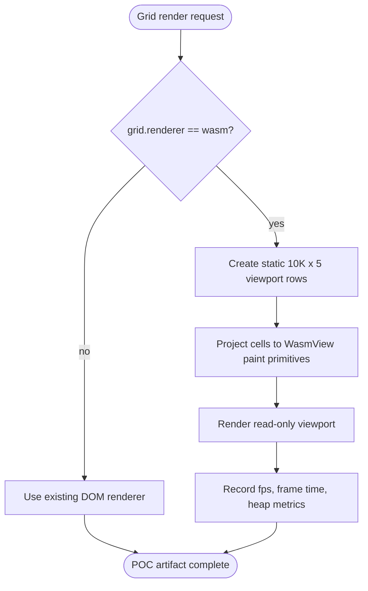

# Jet WasmView Grid POC Read-Only 10K Viewport

## Config
<!-- type: config lang: yaml -->

```yaml
$schema: https://json-schema.org/draft/2020-12/schema
$id: jet-grid-poc-config
title: JetGridPocConfig
type: object
additionalProperties: false
required:
  - grid
  - fixture
  - benchmark
properties:
  grid:
    type: object
    additionalProperties: false
    required: [renderer]
    properties:
      renderer:
        type: string
        enum: [dom, wasm]
        default: dom
        description: Explicit renderer selection. The DOM renderer remains the default; wasm enables only the POC path.
  fixture:
    type: object
    additionalProperties: false
    required: [rows, columns, mode]
    properties:
      rows:
        type: integer
        const: 10000
      columns:
        type: integer
        const: 5
      mode:
        type: string
        const: read-only
  benchmark:
    type: object
    additionalProperties: false
    required: [collectFrameTime, collectFps, collectHeap]
    properties:
      collectFrameTime: { type: boolean, const: true }
      collectFps: { type: boolean, const: true }
      collectHeap: { type: boolean, const: true }
```
## Logic
<!-- type: logic lang: mermaid -->


## CLI
<!-- type: cli lang: yaml -->

```yaml
$schema: https://json-schema.org/draft/2020-12/schema
$id: jet-grid-poc-cli
title: JetGridPocBenchCli
type: object
additionalProperties: false
required: [command, args, outputs]
properties:
  command:
    type: string
    const: jet-grid-poc-bench
  args:
    type: object
    additionalProperties: false
    required: [renderer, rows, columns]
    properties:
      renderer:
        type: string
        enum: [dom, wasm]
      rows:
        type: integer
        default: 10000
      columns:
        type: integer
        default: 5
  outputs:
    type: array
    minItems: 2
    items:
      type: string
      enum:
        - projects/jet/parity/docs/grid-poc-10k-bench.json
        - projects/jet/parity/docs/grid-poc-10k-bench.md
```
## Test Plan
<!-- type: test-plan lang: mermaid -->

```mermaid
---
id: jet-wasmview-grid-poc-test-plan
title: Jet WasmView Grid POC Test Plan
requirements:
  R1: { id: R1, text: "Render static 10K x 5 read-only viewport through WasmView primitives.", kind: functional, risk: high, verify: fixture }
  R2: { id: R2, text: "Keep DOM renderer as default and gate WasmView behind grid.renderer = wasm.", kind: functional, risk: high, verify: unit }
  R3: { id: R3, text: "Reuse existing Jet renderer primitives without forking renderer or grid data plane.", kind: architecture, risk: high, verify: review }
  R4: { id: R4, text: "Capture DOM and WasmView frame-time, fps, and heap benchmark artifacts.", kind: observability, risk: medium, verify: artifact }
  R5: { id: R5, text: "Exclude Phase A-D surfaces from this POC.", kind: scope, risk: medium, verify: review }
tests:
  dom_default:
    verifies: [R2]
    method: "config unit test"
  wasm_fixture:
    verifies: [R1, R3]
    method: "read-only grid fixture render"
  bench_artifacts:
    verifies: [R4]
    method: "benchmark artifact check"
  scope_guard:
    verifies: [R5]
    method: "review checklist"
---
requirementDiagram

requirement R1 {
  id: R1
  text: "Render static 10K x 5 read-only viewport through WasmView primitives."
  risk: High
  verifymethod: Test
}

requirement R2 {
  id: R2
  text: "Keep DOM renderer as default and gate WasmView behind grid.renderer = wasm."
  risk: High
  verifymethod: Test
}

requirement R3 {
  id: R3
  text: "Reuse existing Jet renderer primitives without forking renderer or grid data plane."
  risk: High
  verifymethod: Inspection
}

requirement R4 {
  id: R4
  text: "Capture DOM and WasmView frame-time, fps, and heap benchmark artifacts."
  risk: Medium
  verifymethod: Test
}

requirement R5 {
  id: R5
  text: "Exclude Phase A-D surfaces from this POC."
  risk: Medium
  verifymethod: Review
}
```
## Changes
<!-- type: changes lang: yaml -->

```yaml
changes:
  - path: projects/jet/parity/docs/grid-poc-10k-bench.md
    action: add
    section: config
    impl_mode: hand-written
    description: Publish DOM and WasmView read-only 10K viewport benchmark notes and acceptance evidence.
  - path: projects/jet/parity/docs/grid-poc-10k-bench.json
    action: add
    section: config
    impl_mode: hand-written
    description: Store machine-readable frame timing, fps, and heap metrics for the DOM and WasmView POC paths.
  - path: projects/jet/examples/grid-poc/
    action: add
    section: config
    impl_mode: hand-written
    description: Add a narrow read-only 10K x 5 grid fixture that can run through DOM and WasmView renderer modes.
  - path: projects/jet/examples/grid-poc/jet.toml
    action: add
    section: config
    impl_mode: hand-written
    description: Define the example fixture renderer flag with DOM default and explicit WasmView mode for the POC.
  - path: ".aw/tech-design/projects/jet/specs/2302.md"
    action: verify
    section: cli
    impl_mode: hand-written
    description: |
      Traceability repair: hand-written TD section retained as the implementation edge during AW standardization.

  - path: ".aw/tech-design/projects/jet/specs/2302.md"
    action: verify
    section: logic
    impl_mode: hand-written
    description: |
      Traceability repair: hand-written TD section retained as the implementation edge during AW standardization.

  - path: ".aw/tech-design/projects/jet/specs/2302.md"
    action: verify
    section: unit-test
    impl_mode: hand-written
    description: |
      Traceability repair: hand-written TD section retained as the implementation edge during AW standardization.

```

# Reviews

## Review 1

**Verdict:** approved

- The spec is correctly bounded to #2302: a read-only 10K x 5 grid POC, explicit `grid.renderer = wasm` selection, DOM default preservation, and benchmark artifact capture.
- The spec uses current AUTHORING section types (`config`, `logic`, `cli`, `test-plan`, `changes`) and passes `aw td check` with zero findings.
- The changes section avoids Phase A-D scope creep. Selection, editing, formula bar, merged cells, frozen headers, zoom, resize, IME, accessibility, context menu, and copy-paste remain outside this issue.
