## Schema
<!-- type: schema lang: yaml -->

```yaml
$schema: https://json-schema.org/draft/2020-12/schema
$id: jet-grid-phase-a-read-only-parity-corpus
title: JetGridPhaseAReadOnlyParityCorpus
type: object
required:
  - rendererModes
  - dimensions
  - cellTypes
  - layoutFeatures
  - parityArtifacts
properties:
  rendererModes:
    type: array
    minItems: 2
    items:
      type: string
      enum: [dom, wasm]
  dimensions:
    type: object
    required: [minimumRows, minimumColumns]
    properties:
      minimumRows:
        type: integer
        minimum: 10000
      minimumColumns:
        type: integer
        minimum: 5
  cellTypes:
    type: array
    minItems: 5
    items:
      type: string
      enum: [text, number, date, boolean, currency, percent, custom_number_format, styled_text_run]
  layoutFeatures:
    type: object
    required: [mergedCells, frozenRows, frozenColumns, zoomRatios, resizeGestures]
    properties:
      mergedCells:
        type: boolean
        const: true
      frozenRows:
        type: boolean
        const: true
      frozenColumns:
        type: boolean
        const: true
      zoomRatios:
        type: array
        items:
          type: number
          enum: [0.75, 1.0, 1.25, 1.5]
      resizeGestures:
        type: array
        items:
          type: string
          enum: [column, row]
  parityArtifacts:
    type: object
    required: [pixelDiffReport, readOnlySuiteResult, switchStateTrace]
    properties:
      pixelDiffReport:
        type: string
        const: projects/jet/parity/docs/grid-phase-a-read-only-parity.json
      readOnlySuiteResult:
        type: string
        const: projects/jet/parity/docs/grid-phase-a-read-only-suite.md
      switchStateTrace:
        type: string
        const: projects/jet/parity/docs/grid-phase-a-renderer-toggle-trace.json
```

## Logic
<!-- type: logic lang: mermaid -->

```mermaid
---
id: jet-grid-phase-a-read-only-render-flow
entry: start
nodes:
  start:
    kind: start
    label: "Open read-only grid corpus"
  select_renderer:
    kind: decision
    label: "grid.renderer"
  dom_render:
    kind: process
    label: "Render DOM baseline"
  wasm_render:
    kind: process
    label: "Render WasmView canvas path"
  compare_visual:
    kind: process
    label: "Run pixel diff tolerance ladder"
  compare_layout:
    kind: process
    label: "Verify frozen panes, merged cells, resize handles, zoom ratios"
  compare_scroll:
    kind: process
    label: "Scroll past 10K rows with viewport recycling"
  toggle_renderer:
    kind: process
    label: "Switch DOM to Wasm and Wasm to DOM on live data plane"
  done:
    kind: terminal
    label: "Read-only parity accepted"
edges:
  - from: start
    to: select_renderer
  - from: select_renderer
    to: dom_render
    label: "dom"
  - from: select_renderer
    to: wasm_render
    label: "wasm"
  - from: dom_render
    to: compare_visual
  - from: wasm_render
    to: compare_visual
  - from: compare_visual
    to: compare_layout
  - from: compare_layout
    to: compare_scroll
  - from: compare_scroll
    to: toggle_renderer
  - from: toggle_renderer
    to: done
```

## Interaction
<!-- type: interaction lang: mermaid -->

```mermaid
---
id: jet-grid-phase-a-layout-interactions
actors:
  - id: user
    kind: actor
  - id: grid
    kind: system
  - id: renderer
    kind: system
  - id: harness
    kind: system
messages:
  - from: user
    to: grid
    name: "Open mixed read-only corpus"
  - from: grid
    to: renderer
    name: "Render selected mode"
    returns: "DOM or WasmView frame"
  - from: user
    to: grid
    name: "Resize row or column handle"
  - from: grid
    to: renderer
    name: "Recompute layout without cell mutation"
    returns: "Updated frame"
  - from: user
    to: grid
    name: "Change zoom ratio"
  - from: grid
    to: renderer
    name: "Render frozen panes and merged cells at zoom"
    returns: "Updated frame"
  - from: harness
    to: renderer
    name: "Capture DOM and Wasm frames"
    returns: "Pixel diff artifacts"
```

## Test Plan

```mermaid
---
id: jet-grid-phase-a-read-only-test-plan
---
requirementDiagram
requirement R1 {
  id: R1
  text: "Mixed text, number, date, boolean, currency, percent, custom number format, and styled text run cells match DOM parity."
  risk: High
  verifymethod: Test
}

requirement R2 {
  id: R2
  text: "Merged cells, frozen headers, and supported zoom ratios match the DOM tolerance ladder."
  risk: High
  verifymethod: Test
}

requirement R3 {
  id: R3
  text: "Column and row resize gestures use canvas hit testing with DOM-equivalent affordances."
  risk: Medium
  verifymethod: Test
}

requirement R4 {
  id: R4
  text: "Virtual scroll remains correct past 10K rows without viewport recycling artifacts."
  risk: High
  verifymethod: Test
}

requirement R5 {
  id: R5
  text: "Read-only cclab-grid tests pass unchanged against grid.renderer = wasm."
  risk: High
  verifymethod: Test
}

requirement R6 {
  id: R6
  text: "Live DOM/Wasm renderer toggle preserves data-plane state."
  risk: Medium
  verifymethod: Test
}
```

<!-- type: test-plan lang: mermaid -->



## Changes
<!-- type: changes lang: yaml -->

```yaml
changes:
  - path: projects/jet/parity/docs/grid-phase-a-read-only-parity.md
    action: add
    section: schema
    impl_mode: hand-written
    description: Publish the read-only DOM versus WasmView parity evidence, including tolerance-ladder decisions and known exclusions.
  - path: projects/jet/parity/docs/grid-phase-a-read-only-parity.json
    action: add
    section: schema
    impl_mode: hand-written
    description: Store machine-readable pixel-diff, scroll, zoom, and resize parity outcomes for Phase A.
  - path: projects/jet/parity/docs/grid-phase-a-renderer-toggle-trace.json
    action: add
    section: schema
    impl_mode: hand-written
    description: Capture state-preservation evidence for live DOM/Wasm renderer switching.
  - path: projects/jet/parity/fixtures/grid-phase-a-read-only/
    action: add
    section: schema
    impl_mode: hand-written
    description: Add the mixed-cell read-only fixture corpus for DOM and WasmView comparison.
  - path: crates/cclab-grid/tests/read_only_wasm_renderer_parity.rs
    action: add
    section: unit-test
    impl_mode: hand-written
    description: Add the read-only suite adapter that runs existing read-path expectations under grid.renderer = wasm.
  - path: ".aw/tech-design/projects/jet/specs/2303.md"
    action: verify
    section: interaction
    impl_mode: hand-written
    description: |
      Traceability repair: hand-written TD section retained as the implementation edge during AW standardization.

  - path: ".aw/tech-design/projects/jet/specs/2303.md"
    action: verify
    section: logic
    impl_mode: hand-written
    description: |
      Traceability repair: hand-written TD section retained as the implementation edge during AW standardization.

```

# Reviews

### Review 1
**Verdict:** approved

- [schema] The corpus contract covers the Phase A mixed-cell, layout, renderer-mode, and artifact surfaces required by the issue.
- [logic] The flow preserves the required DOM baseline versus WasmView comparison and includes visual, layout, scroll, and live renderer toggle gates.
- [interaction] The resize, zoom, frozen-pane, and harness capture interactions are scoped to read-only layout behavior and do not pull in Phase B-D edit or selection work.
- [test-plan] Requirements R1-R6 map directly to the issue acceptance criteria and use test verification for the high-risk parity surfaces.
- [changes] The change list is bounded to new parity artifacts, fixture corpus, and read-only suite adapter files; it avoids broad source-tree ownership claims.
