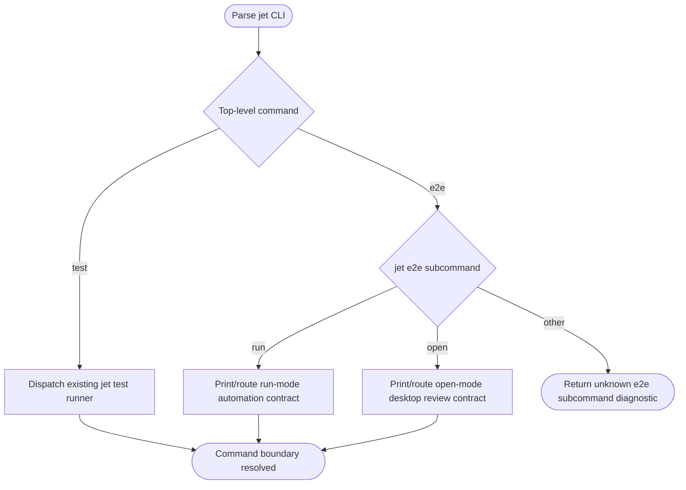
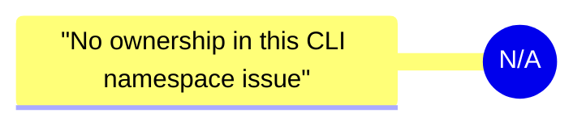
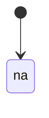
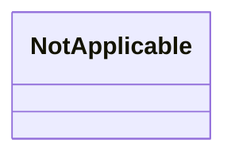
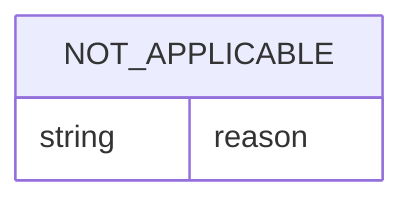

# Jet E2E Command Namespace Mode Contract

## Scenarios
<!-- type: scenarios lang: yaml -->

```yaml
scenarios:
  - id: e2e_namespace_visible
    given: "A developer runs `jet --help`."
    when: "They scan the top-level command list."
    then: "`e2e` is visible as the product-flow E2E namespace."
  - id: test_boundary_preserved
    given: "A developer runs `jet test --help`."
    when: "They inspect frontend-test options."
    then: "`jet test` remains scoped to frontend unit, component, and integration-style tests."
  - id: run_mode_contract
    given: "A CI agent runs `jet e2e run --help`."
    when: "It inspects mode semantics."
    then: "`run` is described as Playwright-like automation for CI, agents, and release gates."
  - id: open_mode_contract
    given: "A human reviewer runs `jet e2e open --help`."
    when: "They inspect mode semantics."
    then: "`open` is described as Cypress-like desktop review that launches a Jet-owned app."
  - id: no_cypress_runtime
    given: "A user reads the `jet e2e open` help."
    when: "They look for external runtime expectations."
    then: "The command says Cypress-like is UX only and does not depend on Cypress runtime or Cypress Cloud."
```
## Logic
<!-- type: logic lang: mermaid -->


## CLI
<!-- type: cli lang: yaml -->

```yaml
command:
  name: jet
  subcommands:
    e2e:
      about: "Run or review product-flow E2E cases"
      purpose: "Product-flow E2E namespace; not a frontend unit/component test runner"
      subcommands:
        run:
          about: "Run product-flow E2E cases in Playwright-like automation mode"
          mode: "agent-ci"
          status: "planned"
          behavior:
            - "No desktop review app launch in this issue"
            - "Later issue #2386 implements the execution engine"
            - "Help text defines CI, agent, and release-gate semantics"
        open:
          about: "Open the Cypress-like desktop review app for product-flow E2E cases"
          mode: "human-desktop-review"
          status: "planned"
          behavior:
            - "No Cypress runtime dependency"
            - "No Cypress Cloud dependency"
            - "Later issues #2390, #2391, and #2392 implement launch, live control, and UI"
    test:
      about: "Run frontend tests via the native jet test runner"
      unchanged: true
      owns:
        - "unit"
        - "component"
        - "frontend integration-style tests"
```
## Test Plan

```mermaid
---
id: jet-e2e-command-namespace-test-plan
requirements:
  R1:
    text: "`jet --help` lists `e2e` as product-flow E2E."
    risk: medium
    verify: unit
  R2:
    text: "`jet e2e run --help` describes Playwright-like agent/CI automation mode."
    risk: high
    verify: unit
  R3:
    text: "`jet e2e open --help` describes Cypress-like desktop human review mode without Cypress runtime."
    risk: high
    verify: unit
  R4:
    text: "`jet test --help` remains scoped to frontend tests and keeps existing options."
    risk: medium
    verify: unit
  R5:
    text: "Unknown `jet e2e` subcommands fail with an e2e-specific diagnostic."
    risk: low
    verify: unit
---
requirementDiagram
requirement R1 {
  id: R1
  text: "`jet --help` lists `e2e` as product-flow E2E."
  risk: Medium
  verifymethod: Test
}
requirement R2 {
  id: R2
  text: "`jet e2e run --help` describes Playwright-like agent/CI automation mode."
  risk: High
  verifymethod: Test
}
requirement R3 {
  id: R3
  text: "`jet e2e open --help` describes Cypress-like desktop human review mode without Cypress runtime."
  risk: High
  verifymethod: Test
}
requirement R4 {
  id: R4
  text: "`jet test --help` remains scoped to frontend tests and keeps existing options."
  risk: Medium
  verifymethod: Test
}
requirement R5 {
  id: R5
  text: "Unknown `jet e2e` subcommands fail with an e2e-specific diagnostic."
  risk: Low
  verifymethod: Test
}
```

<!-- type: test-plan lang: mermaid -->


## Changes
<!-- type: changes lang: yaml -->

```yaml
changes:
  - path: projects/jet/src/cli.rs
    action: modify
    section: cli
    impl_mode: hand-written
    description: "Add the `jet e2e` command namespace with `run` and `open` subcommands, planned-mode diagnostics, and parser tests that preserve the `jet test` boundary."
  - path: ".aw/tech-design/projects/jet/specs/2385.md"
    action: verify
    section: async-api
    impl_mode: hand-written
    description: |
      Traceability repair: hand-written TD section retained as the implementation edge during AW standardization.

  - path: ".aw/tech-design/projects/jet/specs/2385.md"
    action: verify
    section: component
    impl_mode: hand-written
    description: |
      Traceability repair: hand-written TD section retained as the implementation edge during AW standardization.

  - path: ".aw/tech-design/projects/jet/specs/2385.md"
    action: verify
    section: config
    impl_mode: hand-written
    description: |
      Traceability repair: hand-written TD section retained as the implementation edge during AW standardization.

  - path: ".aw/tech-design/projects/jet/specs/2385.md"
    action: verify
    section: db-model
    impl_mode: hand-written
    description: |
      Traceability repair: hand-written TD section retained as the implementation edge during AW standardization.

  - path: ".aw/tech-design/projects/jet/specs/2385.md"
    action: verify
    section: dependency
    impl_mode: hand-written
    description: |
      Traceability repair: hand-written TD section retained as the implementation edge during AW standardization.

  - path: ".aw/tech-design/projects/jet/specs/2385.md"
    action: verify
    section: design-token
    impl_mode: hand-written
    description: |
      Traceability repair: hand-written TD section retained as the implementation edge during AW standardization.

  - path: ".aw/tech-design/projects/jet/specs/2385.md"
    action: verify
    section: interaction
    impl_mode: hand-written
    description: |
      Traceability repair: hand-written TD section retained as the implementation edge during AW standardization.

  - path: ".aw/tech-design/projects/jet/specs/2385.md"
    action: verify
    section: logic
    impl_mode: hand-written
    description: |
      Traceability repair: hand-written TD section retained as the implementation edge during AW standardization.

  - path: ".aw/tech-design/projects/jet/specs/2385.md"
    action: verify
    section: manifest
    impl_mode: hand-written
    description: |
      Traceability repair: hand-written TD section retained as the implementation edge during AW standardization.

  - path: ".aw/tech-design/projects/jet/specs/2385.md"
    action: verify
    section: mindmap
    impl_mode: hand-written
    description: |
      Traceability repair: hand-written TD section retained as the implementation edge during AW standardization.

  - path: ".aw/tech-design/projects/jet/specs/2385.md"
    action: verify
    section: rest-api
    impl_mode: hand-written
    description: |
      Traceability repair: hand-written TD section retained as the implementation edge during AW standardization.

  - path: ".aw/tech-design/projects/jet/specs/2385.md"
    action: verify
    section: rpc-api
    impl_mode: hand-written
    description: |
      Traceability repair: hand-written TD section retained as the implementation edge during AW standardization.

  - path: ".aw/tech-design/projects/jet/specs/2385.md"
    action: verify
    section: scenarios
    impl_mode: hand-written
    description: |
      Traceability repair: hand-written TD section retained as the implementation edge during AW standardization.

  - path: ".aw/tech-design/projects/jet/specs/2385.md"
    action: verify
    section: schema
    impl_mode: hand-written
    description: |
      Traceability repair: hand-written TD section retained as the implementation edge during AW standardization.

  - path: ".aw/tech-design/projects/jet/specs/2385.md"
    action: verify
    section: state-machine
    impl_mode: hand-written
    description: |
      Traceability repair: hand-written TD section retained as the implementation edge during AW standardization.

  - path: ".aw/tech-design/projects/jet/specs/2385.md"
    action: verify
    section: unit-test
    impl_mode: hand-written
    description: |
      Traceability repair: hand-written TD section retained as the implementation edge during AW standardization.

  - path: ".aw/tech-design/projects/jet/specs/2385.md"
    action: verify
    section: wireframe
    impl_mode: hand-written
    description: |
      Traceability repair: hand-written TD section retained as the implementation edge during AW standardization.

```
## Mindmap
<!-- type: mindmap lang: mermaid -->



## State Machine
<!-- type: state-machine lang: mermaid -->



## Interaction
<!-- type: interaction lang: mermaid -->

```mermaid
---
id: jet-e2e-command-namespace-na-interaction
actors: []
messages: []
---
sequenceDiagram
```

## Dependency
<!-- type: dependency lang: mermaid -->



## Data Model
<!-- type: db-model lang: mermaid -->



## Schema
<!-- type: schema lang: yaml -->

```yaml
not_applicable:
  reason: "No schema contract is introduced by this CLI namespace issue."
```

## REST API
<!-- type: rest-api lang: yaml -->

```yaml
not_applicable:
  reason: "No REST API contract is introduced by this CLI namespace issue."
```

## RPC API
<!-- type: rpc-api lang: yaml -->

```yaml
not_applicable:
  reason: "No RPC API contract is introduced by this CLI namespace issue."
```

## Async API
<!-- type: async-api lang: yaml -->

```yaml
not_applicable:
  reason: "No async API contract is introduced by this CLI namespace issue."
```

## Wireframe
<!-- type: wireframe lang: yaml -->

```yaml
not_applicable:
  reason: "No UI wireframe is introduced by this CLI namespace issue."
```

## Component
<!-- type: component lang: yaml -->

```yaml
not_applicable:
  reason: "No UI component contract is introduced by this CLI namespace issue."
```

## Design Token
<!-- type: design-token lang: yaml -->

```yaml
not_applicable:
  reason: "No design token contract is introduced by this CLI namespace issue."
```

## Config
<!-- type: config lang: yaml -->

```yaml
not_applicable:
  reason: "No config contract is introduced by this CLI namespace issue."
```

## Manifest
<!-- type: manifest lang: yaml -->

```yaml
not_applicable:
  reason: "No manifest contract is introduced by this CLI namespace issue."
```

## Tests
<!-- type: tests lang: yaml -->

```yaml
tests:
  - id: not_applicable
    reason: "Executable coverage is specified in Test Plan for this CLI namespace issue."
```

# Reviews

### Review 1
**Verdict:** approved

- [scenarios] The acceptance cases distinguish top-level namespace visibility, `jet test` preservation, `run` agent mode, `open` human desktop mode, and the no-Cypress-runtime boundary.
- [logic] The dispatch flow keeps existing `jet test` routing separate from `jet e2e` mode routing and gives unknown e2e subcommands a bounded diagnostic path.
- [cli] The command tree is narrow and defers run/open implementation to the child issues without claiming runner or desktop behavior in this issue.
- [test-plan] The parser/help coverage directly verifies the public contract and guards against accidental scope drift.
- [changes] The implementation scope is correctly limited to `projects/jet/src/cli.rs`.
