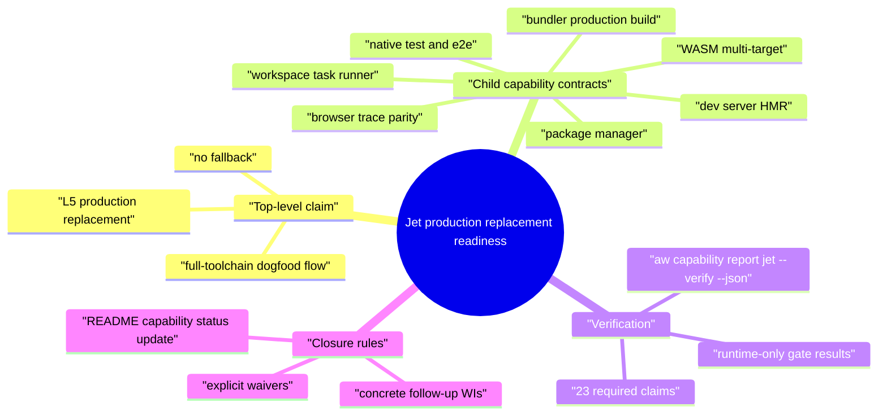
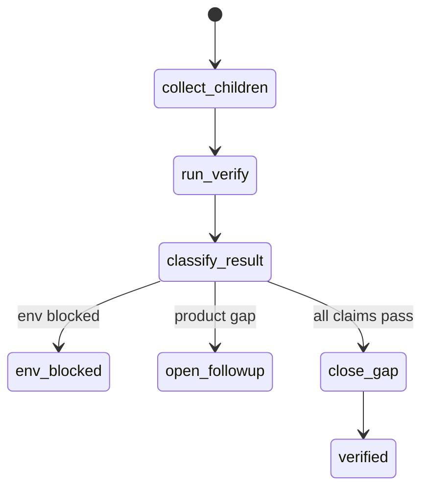
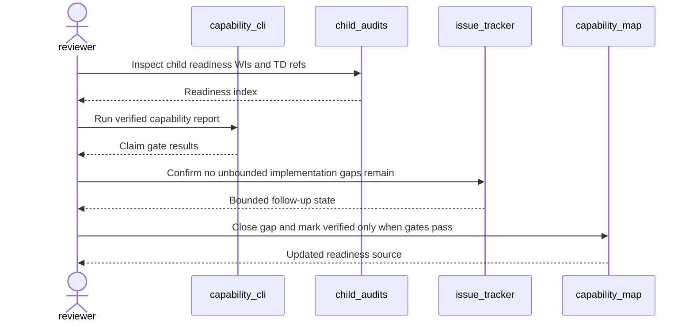
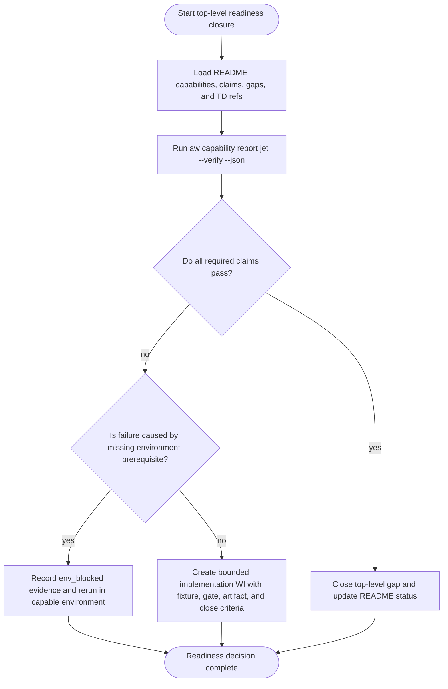
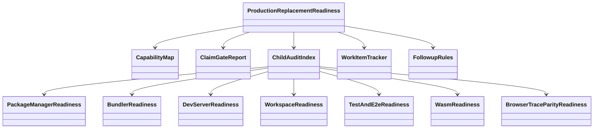
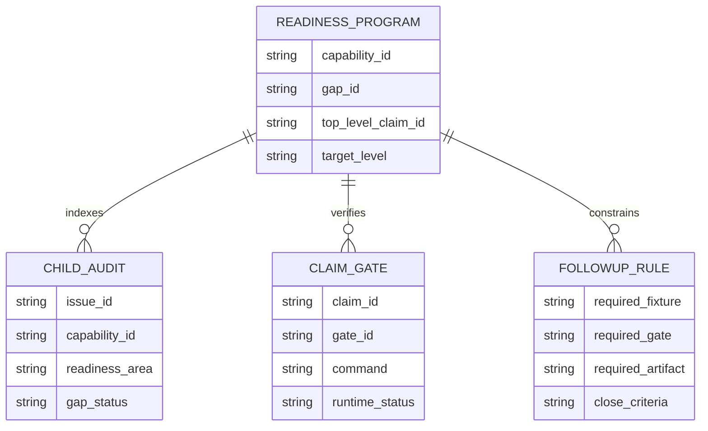
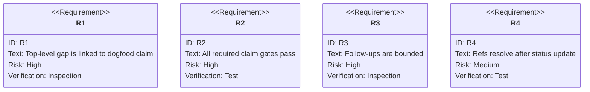

# Jet Production Replacement Readiness

## Scenarios
<!-- type: scenarios lang: yaml -->

```yaml
scenarios:
  - id: aggregate_claim_gate_passes
    given: "The Jet README capability map defines the rust-native-frontend-toolchain dogfood claim and child capability contracts."
    when: "aw capability report jet --verify --json runs in an environment with GitHub, loopback, browser, wasm, and cargo dependency access."
    then: "All required child and aggregate claim gates pass before the top-level production replacement gap can close."
  - id: child_audit_program_complete
    given: "Child audit WIs #3779, #3780, #3781, #3782, #3783, #3784, #3785, and #3786 describe capability-specific readiness evidence."
    when: "The top-level TD reviews package manager, bundler, dev server, workspace, test, e2e, WASM, browser, trace, and parity evidence."
    then: "The TD treats the child audit set as the readiness index instead of reopening vague implementation work."
  - id: no_unbounded_followup
    given: "The readiness program may still discover a future incompatibility."
    when: "A new gap is found."
    then: "A follow-up WI is only valid when it names a concrete fixture, gate, diagnostic expectation, artifact, and close criteria."
  - id: verification_environment_distinction
    given: "Some Jet gates require loopback, GitHub, browser, wasm, or crate index access."
    when: "A verify run fails because a prerequisite is unavailable."
    then: "The failure is reported as env_blocked instead of counting as product readiness."
```
## Mindmap
<!-- type: mindmap lang: mermaid -->


## State Machine
<!-- type: state-machine lang: mermaid -->


## Interaction
<!-- type: interaction lang: mermaid -->


## Logic
<!-- type: logic lang: mermaid -->


## Dependency
<!-- type: dependency lang: mermaid -->


## Data Model
<!-- type: db-model lang: mermaid -->


## Schema
<!-- type: schema lang: yaml -->

```yaml
readiness_program:
  capability_id: rust-native-frontend-toolchain
  gap_id: production-replacement-readiness
  claim_id: full-toolchain-dogfood-flow
  target_level: L5
  required_inputs:
    child_audit_wis:
      - "#3779"
      - "#3780"
      - "#3781"
      - "#3782"
      - "#3783"
      - "#3784"
      - "#3785"
      - "#3786"
    verified_report:
      command: "aw capability report jet --verify --json"
      required_claim_percent: 100
      required_blockers: []
  closure_decision:
    allowed_outcomes:
      - close_top_level_gap
      - env_blocked
      - open_bounded_followup
    followup_required_fields:
      - concrete_gap
      - fixture_or_real_project
      - ci_or_release_gate
      - failure_artifact_or_diagnostic
      - close_criteria
```
## REST API
<!-- type: rest-api lang: yaml -->

```yaml
not_applicable:
  reason: "The Jet production replacement readiness TD does not introduce an HTTP REST API."
```
## RPC API
<!-- type: rpc-api lang: yaml -->

```yaml
not_applicable:
  reason: "The Jet production replacement readiness TD does not introduce a JSON-RPC or OpenRPC surface."
```
## Async API
<!-- type: async-api lang: yaml -->

```yaml
not_applicable:
  reason: "The Jet production replacement readiness TD does not introduce WebSocket, pub-sub, or AsyncAPI contracts."
```
## CLI
<!-- type: cli lang: yaml -->

```yaml
readiness_commands:
  - id: capability-verify
    command: "aw capability report jet --verify --json"
    proves: "All Jet README verification_contract claim gates pass in the active environment."
  - id: capability-check
    command: "aw capability check jet --json"
    proves: "README capability sections and TD capability_refs resolve."
  - id: capability-next
    command: "aw capability next jet --json"
    proves: "The remaining top-level readiness action is deterministic."
  - id: wi-plan
    command: "aw wi plan --project jet --json"
    proves: "Any remaining required claim without evidence becomes a bounded WI candidate."
closure_commands:
  - "aw td check .aw/tech-design/projects/jet/specs/3778.md"
  - "aw capability report jet --verify --json"
```
## Wireframe
<!-- type: wireframe lang: yaml -->

```yaml
not_applicable:
  reason: "The Jet production replacement readiness TD does not introduce a UI layout."
```
## Component
<!-- type: component lang: yaml -->

```yaml
not_applicable:
  reason: "The Jet production replacement readiness TD does not introduce UI component contracts."
```
## Design Token
<!-- type: design-token lang: yaml -->

```yaml
not_applicable:
  reason: "The Jet production replacement readiness TD does not introduce design tokens."
```
## Config
<!-- type: config lang: yaml -->

```yaml
configuration_inputs:
  - path: ".aw/config.toml"
    section: scenarios
    impl_mode: hand-written
    role: "Project routing and issue backend used by aw capability and aw wi."
  - path: "projects/jet/README.md"
    section: scenarios
    impl_mode: hand-written
    role: "Canonical capability map and verification_contract source."
  - path: ".aw/tech-design/projects/jet/specs/*.md"
    section: scenarios
    impl_mode: hand-written
    role: "Capability-linked TD evidence for child audits and aggregate readiness."
runtime_prerequisites:
  - "GitHub issue inventory access for WI refs."
  - "Loopback bind access for dev server, trace viewer, and e2e gates."
  - "Cargo dependency access for wasm-pack mediated gates when cache is cold."
```
## Manifest
<!-- type: manifest lang: yaml -->

```yaml
manifest_inputs:
  - path: "Cargo.toml"
    section: cli
    impl_mode: hand-written
    role: "Workspace package graph for agentic-workflow and Jet verification commands."
  - path: "projects/jet/Cargo.toml"
    section: cli
    impl_mode: hand-written
    package: "jet"
    role: "Primary Jet crate under verification."
  - path: "projects/jet/wasm/Cargo.toml"
    section: cli
    impl_mode: hand-written
    package: "jet-wasm"
    role: "WASM runtime subset and renderer verification target."
package_verification:
  - "cargo test -p jet"
  - "cargo test -p jet-wasm -- --nocapture"
```
## Runtime Image
<!-- type: runtime-image lang: yaml -->

```yaml
not_applicable:
  reason: "The Jet production replacement readiness TD does not introduce a container runtime image."
verification_environment:
  requires:
    - "Rust toolchain and cargo test access."
    - "Loopback networking for local server gates."
    - "Browser and WASM prerequisites for end-to-end gates."
```
## Deployment
<!-- type: deployment lang: yaml -->

```yaml
not_applicable:
  reason: "The Jet production replacement readiness TD does not introduce Kubernetes, Kustomize, or deployment manifests."
release_gate:
  readiness_decision: "Do not publish verified readiness until aw capability report jet --verify --json passes and top-level gap is closed."
```
## Test Plan
<!-- type: test-plan lang: mermaid -->


## Changes
<!-- type: changes lang: yaml -->

```yaml
changes:
  - path: ".aw/tech-design/projects/jet/specs/3778.md"
    action: create
    section: doc
    impl_mode: hand-written
    description: "Add the top-level Jet production replacement readiness TD with capability claim linkage and closure rules."
  - path: "projects/jet/README.md"
    action: modify
    section: doc
    impl_mode: hand-written
    description: "After verified review, close the production-replacement-readiness gap and update Jet capability statuses."
  - path: ".aw/issues/open/3778.md"
    action: update
    section: doc
    impl_mode: hand-written
    description: "Advance the top-level readiness WI through TD lifecycle phases."
  - path: ".aw/tech-design/projects/jet/specs/3778.md"
    action: verify
    section: async-api
    impl_mode: hand-written
    description: |
      Traceability repair: hand-written TD section retained as the implementation edge during AW standardization.

  - path: ".aw/tech-design/projects/jet/specs/3778.md"
    action: verify
    section: cli
    impl_mode: hand-written
    description: |
      Traceability repair: hand-written TD section retained as the implementation edge during AW standardization.

  - path: ".aw/tech-design/projects/jet/specs/3778.md"
    action: verify
    section: component
    impl_mode: hand-written
    description: |
      Traceability repair: hand-written TD section retained as the implementation edge during AW standardization.

  - path: ".aw/tech-design/projects/jet/specs/3778.md"
    action: verify
    section: config
    impl_mode: hand-written
    description: |
      Traceability repair: hand-written TD section retained as the implementation edge during AW standardization.

  - path: ".aw/tech-design/projects/jet/specs/3778.md"
    action: verify
    section: db-model
    impl_mode: hand-written
    description: |
      Traceability repair: hand-written TD section retained as the implementation edge during AW standardization.

  - path: ".aw/tech-design/projects/jet/specs/3778.md"
    action: verify
    section: dependency
    impl_mode: hand-written
    description: |
      Traceability repair: hand-written TD section retained as the implementation edge during AW standardization.

  - path: ".aw/tech-design/projects/jet/specs/3778.md"
    action: verify
    section: deployment
    impl_mode: hand-written
    description: |
      Traceability repair: hand-written TD section retained as the implementation edge during AW standardization.

  - path: ".aw/tech-design/projects/jet/specs/3778.md"
    action: verify
    section: design-token
    impl_mode: hand-written
    description: |
      Traceability repair: hand-written TD section retained as the implementation edge during AW standardization.

  - path: ".aw/tech-design/projects/jet/specs/3778.md"
    action: verify
    section: interaction
    impl_mode: hand-written
    description: |
      Traceability repair: hand-written TD section retained as the implementation edge during AW standardization.

  - path: ".aw/tech-design/projects/jet/specs/3778.md"
    action: verify
    section: logic
    impl_mode: hand-written
    description: |
      Traceability repair: hand-written TD section retained as the implementation edge during AW standardization.

  - path: ".aw/tech-design/projects/jet/specs/3778.md"
    action: verify
    section: manifest
    impl_mode: hand-written
    description: |
      Traceability repair: hand-written TD section retained as the implementation edge during AW standardization.

  - path: ".aw/tech-design/projects/jet/specs/3778.md"
    action: verify
    section: mindmap
    impl_mode: hand-written
    description: |
      Traceability repair: hand-written TD section retained as the implementation edge during AW standardization.

  - path: ".aw/tech-design/projects/jet/specs/3778.md"
    action: verify
    section: rest-api
    impl_mode: hand-written
    description: |
      Traceability repair: hand-written TD section retained as the implementation edge during AW standardization.

  - path: ".aw/tech-design/projects/jet/specs/3778.md"
    action: verify
    section: rpc-api
    impl_mode: hand-written
    description: |
      Traceability repair: hand-written TD section retained as the implementation edge during AW standardization.

  - path: ".aw/tech-design/projects/jet/specs/3778.md"
    action: verify
    section: runtime-image
    impl_mode: hand-written
    description: |
      Traceability repair: hand-written TD section retained as the implementation edge during AW standardization.

  - path: ".aw/tech-design/projects/jet/specs/3778.md"
    action: verify
    section: scenarios
    impl_mode: hand-written
    description: |
      Traceability repair: hand-written TD section retained as the implementation edge during AW standardization.

  - path: ".aw/tech-design/projects/jet/specs/3778.md"
    action: verify
    section: schema
    impl_mode: hand-written
    description: |
      Traceability repair: hand-written TD section retained as the implementation edge during AW standardization.

  - path: ".aw/tech-design/projects/jet/specs/3778.md"
    action: verify
    section: state-machine
    impl_mode: hand-written
    description: |
      Traceability repair: hand-written TD section retained as the implementation edge during AW standardization.

  - path: ".aw/tech-design/projects/jet/specs/3778.md"
    action: verify
    section: unit-test
    impl_mode: hand-written
    description: |
      Traceability repair: hand-written TD section retained as the implementation edge during AW standardization.

  - path: ".aw/tech-design/projects/jet/specs/3778.md"
    action: verify
    section: wireframe
    impl_mode: hand-written
    description: |
      Traceability repair: hand-written TD section retained as the implementation edge during AW standardization.

```
## E2E Test
<!-- type: e2e-test lang: yaml -->

```yaml
e2e_tests:
  - id: production_replacement_readiness
    capability_id: rust-native-frontend-toolchain
    claim_id: production-replacement-readiness
    name: "Basic production replacement gate"
    command: "projects/jet/scripts/verify-basic-dom-gates.sh --all"
    proves: "The Basic frontend replacement gate is green end to end."
  - id: full_toolchain_dogfood_flow
    capability_id: rust-native-frontend-toolchain
    claim_id: full-toolchain-dogfood-flow
    name: "Full toolchain dogfood flow"
    command: "projects/jet/scripts/verify-basic-dom-gates.sh --all"
    proves: "Package manager, Browser Bridge, build, serve, workspace, test, e2e, and trace gates pass together."
```

# Reviews

### Review 1
**Verdict:** approved

- [scenarios] The final contract states exactly when the aggregate Jet readiness claim can close and how environment blockers differ from product gaps.
- [logic] The flow is implementable because every non-pass path either records env_blocked evidence or creates a bounded follow-up WI with concrete required fields.
- [schema] The readiness program schema binds the top-level capability, gap, claim, child audit WIs, required verified report, and allowed closure outcomes.
- [cli] The command contract is sufficient to reproduce the current 23/23 claim verification result and detect any future missing claim evidence.
- [tests] The tests cover TD validity, capability ref integrity, verified claim gates, and future WI planning for uncovered claims.
