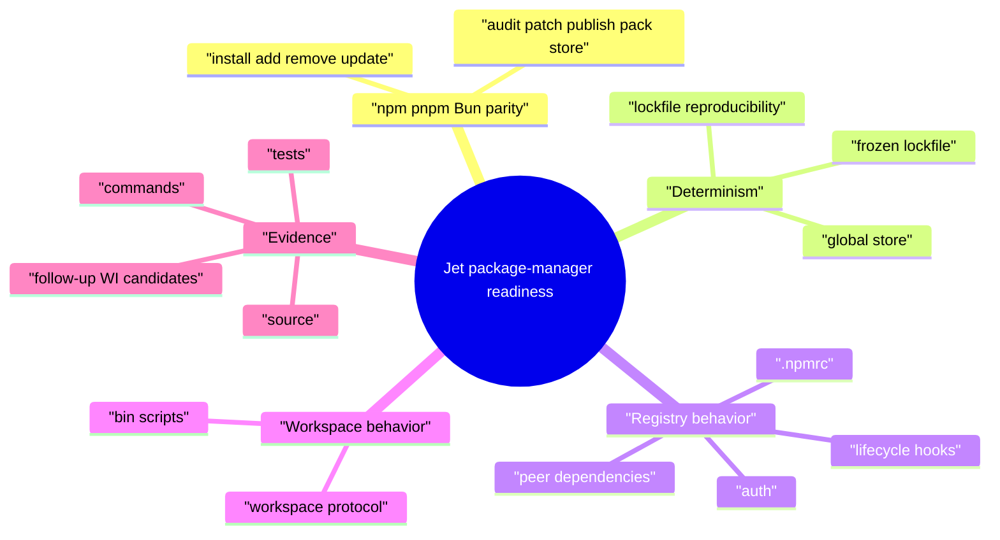
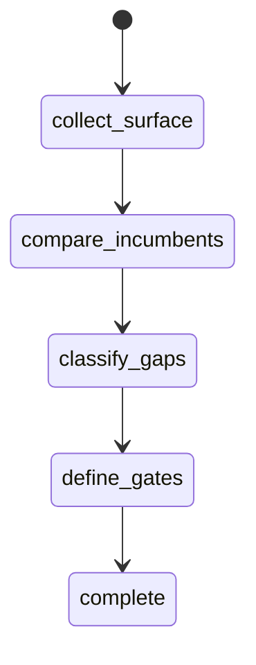
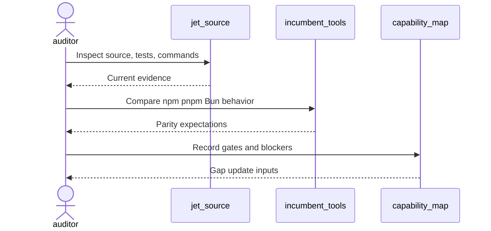
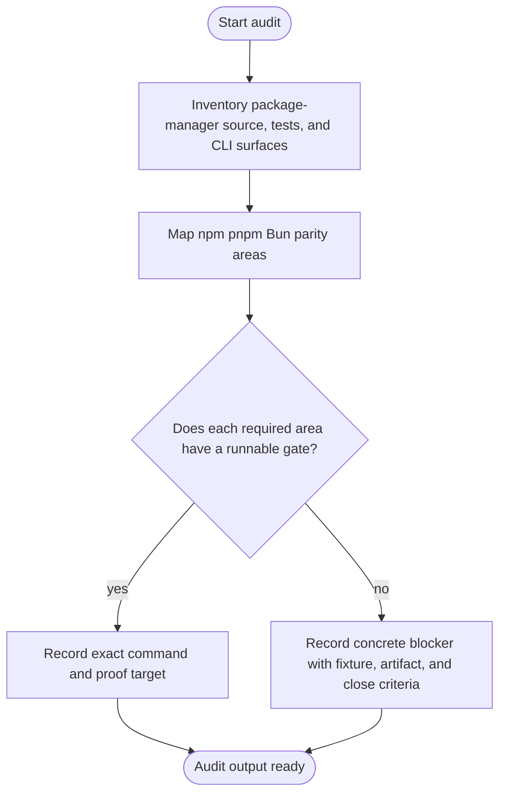
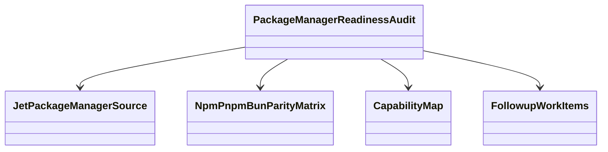
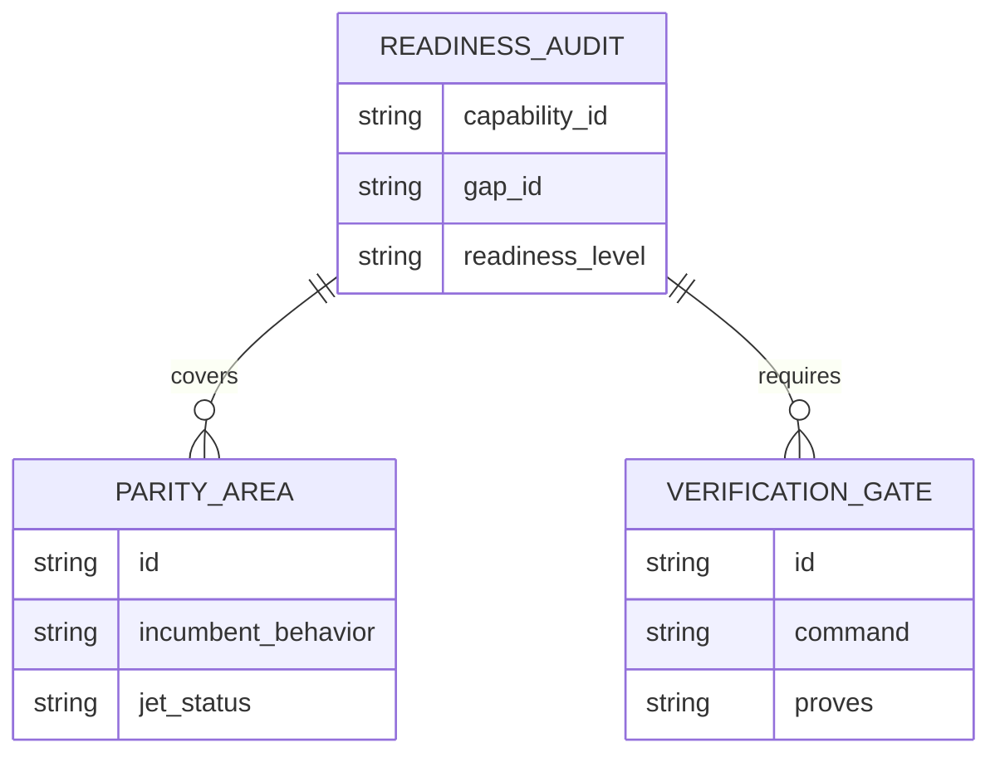
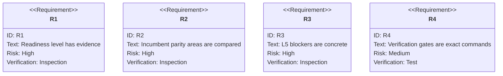

# Jet Package Manager Readiness Audit

## Scenarios
<!-- type: scenarios lang: yaml -->

```yaml
scenarios:
  - id: package_manager_baseline
    given: "Jet package-manager source and tests exist under projects/jet/src/pkg_manager."
    when: "The audit inspects install, lockfile, registry, workspace, publish, patch, and audit behavior."
    then: "The TD records the current readiness level with source and test evidence."
  - id: incumbent_parity_matrix
    given: "npm, pnpm, and Bun are the replacement targets."
    when: "The audit compares Jet behavior against install/add/remove/update/audit/patch/publish/pack/store expectations."
    then: "Every unsupported or divergent behavior is recorded as a concrete L5 blocker or accepted out of scope."
  - id: verification_gate_inventory
    given: "README capability verification commands are required gates."
    when: "The audit evaluates current runnable commands and missing commands."
    then: "The capability map can list exact verification gates instead of transient pass/fail timestamps."
  - id: followup_candidate_filter
    given: "The audit finds an implementation gap."
    when: "The gap lacks a fixture, gate, diagnostic expectation, or close criteria."
    then: "No implementation WI is opened until those fields are explicit."
```
## Mindmap
<!-- type: mindmap lang: mermaid -->


## State Machine
<!-- type: state-machine lang: mermaid -->


## Interaction
<!-- type: interaction lang: mermaid -->


## Logic
<!-- type: logic lang: mermaid -->


## Dependency
<!-- type: dependency lang: mermaid -->


## Data Model
<!-- type: db-model lang: mermaid -->


## Schema
<!-- type: schema lang: yaml -->

```yaml
readiness_audit:
  capability_id: package-manager
  gap_id: package-manager-readiness
  fields:
    readiness_level: "L0|L1|L2|L3|L4|L5"
    evidence:
      source: "list of source paths"
      tests: "list of test files or commands"
      commands: "list of verification commands"
    parity_areas:
      - id: "install-add-remove-update"
        incumbent: "npm/pnpm/Bun behavior"
        jet_status: "supported|partial|missing|out_of_scope"
    blockers:
      - id: "stable blocker id"
        fixture_or_project: "fixture or real project"
        required_gate: "exact command or missing command"
        artifact_expectation: "diagnostic or artifact"
        close_criteria: "bounded done condition"
```
## REST API
<!-- type: rest-api lang: yaml -->

```yaml
not_applicable:
  reason: "The package-manager readiness audit does not introduce an HTTP REST API."
```
## RPC API
<!-- type: rpc-api lang: yaml -->

```yaml
not_applicable:
  reason: "The package-manager readiness audit does not introduce an RPC API."
```
## Async API
<!-- type: async-api lang: yaml -->

```yaml
not_applicable:
  reason: "The package-manager readiness audit does not introduce pub-sub or WebSocket contracts."
```
## CLI
<!-- type: cli lang: yaml -->

```yaml
commands_to_audit:
  - "jet install"
  - "jet add"
  - "jet remove"
  - "jet update"
  - "jet audit"
  - "jet patch"
  - "jet publish"
  - "jet pack"
  - "jet store"
verification_candidates:
  - id: package-manager-lockfile
    command: "cargo test -p jet pkg_manager::lockfile -- --nocapture"
    proves: "lockfile reproducibility and integrity behavior"
  - id: package-manager-workspace
    command: "cargo test -p jet pkg_manager::workspace -- --nocapture"
    proves: "workspace protocol and package graph behavior"
```
## Wireframe
<!-- type: wireframe lang: yaml -->

```yaml
not_applicable:
  reason: "The package-manager readiness audit is CLI and evidence oriented; it does not introduce a UI layout."
```
## Component
<!-- type: component lang: yaml -->

```yaml
not_applicable:
  reason: "The package-manager readiness audit does not introduce UI components."
```
## Design Token
<!-- type: design-token lang: yaml -->

```yaml
not_applicable:
  reason: "The package-manager readiness audit does not introduce design tokens."
```
## Config
<!-- type: config lang: yaml -->

```yaml
config_surfaces_to_audit:
  - ".npmrc parsing and auth"
  - "registry URL selection"
  - "frozen lockfile settings"
  - "workspace package resolution settings"
```
## Manifest
<!-- type: manifest lang: yaml -->

```yaml
manifest_surfaces_to_audit:
  - "package.json dependencies"
  - "package.json scripts and bin entries"
  - "workspace protocol dependencies"
  - "publish and pack metadata"
```
## Runtime Image
<!-- type: runtime-image lang: yaml -->

```yaml
not_applicable:
  reason: "The package-manager readiness audit does not introduce a container runtime image."
```
## Deployment
<!-- type: deployment lang: yaml -->

```yaml
not_applicable:
  reason: "The package-manager readiness audit does not introduce deployment manifests."
```
## Test Plan
<!-- type: test-plan lang: mermaid -->


## Changes
<!-- type: changes lang: yaml -->

```yaml
changes:
  - path: .aw/tech-design/projects/jet/specs/3779.md
    action: create
    section: scenarios
    impl_mode: hand-written
    description: "Add the package-manager readiness audit TD with capability refs for package-manager and the broader Jet toolchain promise."
  - path: projects/jet/README.md
    action: modify
    section: scenarios
    impl_mode: hand-written
    description: "Update the package-manager capability evidence and gap status after the audit produces gates and blockers."
  - path: ".aw/tech-design/projects/jet/specs/3779.md"
    action: verify
    section: async-api
    impl_mode: hand-written
    description: |
      Traceability repair: hand-written TD section retained as the implementation edge during AW standardization.

  - path: ".aw/tech-design/projects/jet/specs/3779.md"
    action: verify
    section: cli
    impl_mode: hand-written
    description: |
      Traceability repair: hand-written TD section retained as the implementation edge during AW standardization.

  - path: ".aw/tech-design/projects/jet/specs/3779.md"
    action: verify
    section: component
    impl_mode: hand-written
    description: |
      Traceability repair: hand-written TD section retained as the implementation edge during AW standardization.

  - path: ".aw/tech-design/projects/jet/specs/3779.md"
    action: verify
    section: config
    impl_mode: hand-written
    description: |
      Traceability repair: hand-written TD section retained as the implementation edge during AW standardization.

  - path: ".aw/tech-design/projects/jet/specs/3779.md"
    action: verify
    section: db-model
    impl_mode: hand-written
    description: |
      Traceability repair: hand-written TD section retained as the implementation edge during AW standardization.

  - path: ".aw/tech-design/projects/jet/specs/3779.md"
    action: verify
    section: dependency
    impl_mode: hand-written
    description: |
      Traceability repair: hand-written TD section retained as the implementation edge during AW standardization.

  - path: ".aw/tech-design/projects/jet/specs/3779.md"
    action: verify
    section: deployment
    impl_mode: hand-written
    description: |
      Traceability repair: hand-written TD section retained as the implementation edge during AW standardization.

  - path: ".aw/tech-design/projects/jet/specs/3779.md"
    action: verify
    section: design-token
    impl_mode: hand-written
    description: |
      Traceability repair: hand-written TD section retained as the implementation edge during AW standardization.

  - path: ".aw/tech-design/projects/jet/specs/3779.md"
    action: verify
    section: interaction
    impl_mode: hand-written
    description: |
      Traceability repair: hand-written TD section retained as the implementation edge during AW standardization.

  - path: ".aw/tech-design/projects/jet/specs/3779.md"
    action: verify
    section: logic
    impl_mode: hand-written
    description: |
      Traceability repair: hand-written TD section retained as the implementation edge during AW standardization.

  - path: ".aw/tech-design/projects/jet/specs/3779.md"
    action: verify
    section: manifest
    impl_mode: hand-written
    description: |
      Traceability repair: hand-written TD section retained as the implementation edge during AW standardization.

  - path: ".aw/tech-design/projects/jet/specs/3779.md"
    action: verify
    section: mindmap
    impl_mode: hand-written
    description: |
      Traceability repair: hand-written TD section retained as the implementation edge during AW standardization.

  - path: ".aw/tech-design/projects/jet/specs/3779.md"
    action: verify
    section: rest-api
    impl_mode: hand-written
    description: |
      Traceability repair: hand-written TD section retained as the implementation edge during AW standardization.

  - path: ".aw/tech-design/projects/jet/specs/3779.md"
    action: verify
    section: rpc-api
    impl_mode: hand-written
    description: |
      Traceability repair: hand-written TD section retained as the implementation edge during AW standardization.

  - path: ".aw/tech-design/projects/jet/specs/3779.md"
    action: verify
    section: runtime-image
    impl_mode: hand-written
    description: |
      Traceability repair: hand-written TD section retained as the implementation edge during AW standardization.

  - path: ".aw/tech-design/projects/jet/specs/3779.md"
    action: verify
    section: schema
    impl_mode: hand-written
    description: |
      Traceability repair: hand-written TD section retained as the implementation edge during AW standardization.

  - path: ".aw/tech-design/projects/jet/specs/3779.md"
    action: verify
    section: state-machine
    impl_mode: hand-written
    description: |
      Traceability repair: hand-written TD section retained as the implementation edge during AW standardization.

  - path: ".aw/tech-design/projects/jet/specs/3779.md"
    action: verify
    section: unit-test
    impl_mode: hand-written
    description: |
      Traceability repair: hand-written TD section retained as the implementation edge during AW standardization.

  - path: ".aw/tech-design/projects/jet/specs/3779.md"
    action: verify
    section: wireframe
    impl_mode: hand-written
    description: |
      Traceability repair: hand-written TD section retained as the implementation edge during AW standardization.

```
## Tests
<!-- type: tests lang: yaml -->

```yaml
tests:
  - id: capability-check
    command: "aw capability check jet --json"
    proves: "README capability refs and TD capability refs resolve."
  - id: package-manager-lockfile
    command: "cargo test -p jet pkg_manager::lockfile -- --nocapture"
    proves: "Lockfile behavior has a focused verification gate."
  - id: package-manager-workspace
    command: "cargo test -p jet pkg_manager::workspace -- --nocapture"
    proves: "Workspace behavior has a focused verification gate."
```

# Reviews

### Review 1
**Verdict:** approved

- [scenarios] The contract covers all package-manager audit outcomes needed by the WI: readiness baseline, incumbent parity, verification gates, and bounded follow-up filtering.
- [logic] The decision flow prevents premature L5 claims by forcing blocker and gate classification before capability-map updates.
- [schema] The audit record shape is sufficient for current readiness, parity areas, gates, blockers, and close criteria.
- [changes] The implementation mode is correctly hand-written because this is an audit and capability-map update, not source generation.
- [tests] The listed checks tie the TD back to capability validation and focused package-manager gates.
