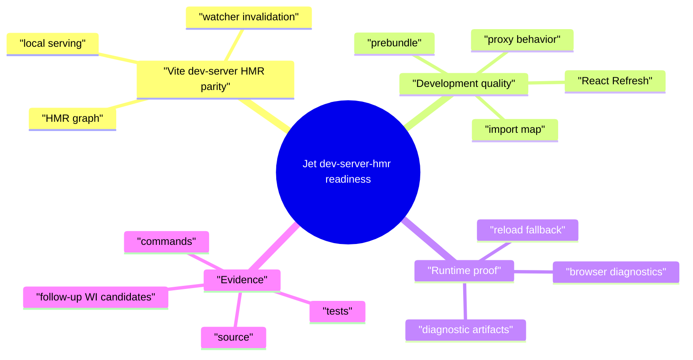
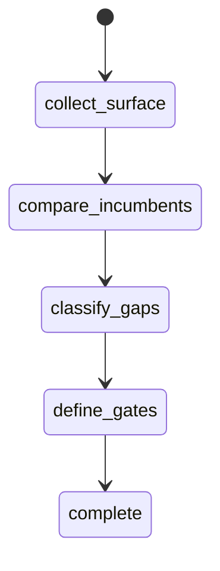
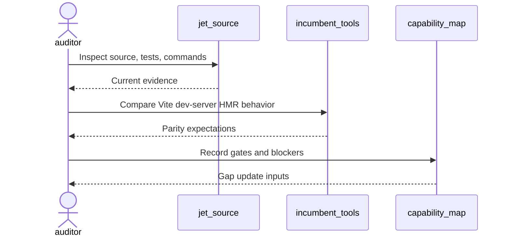
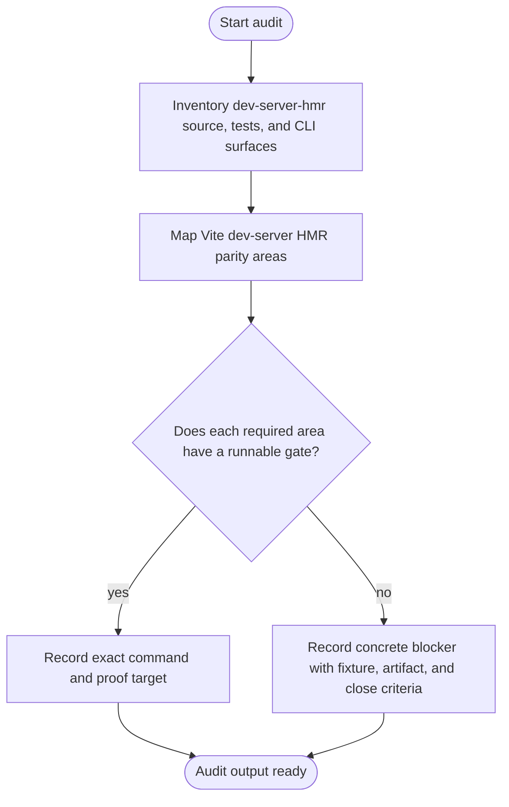
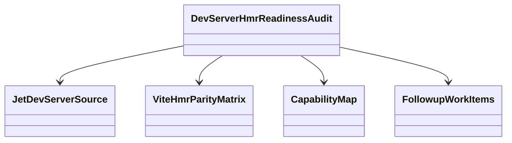
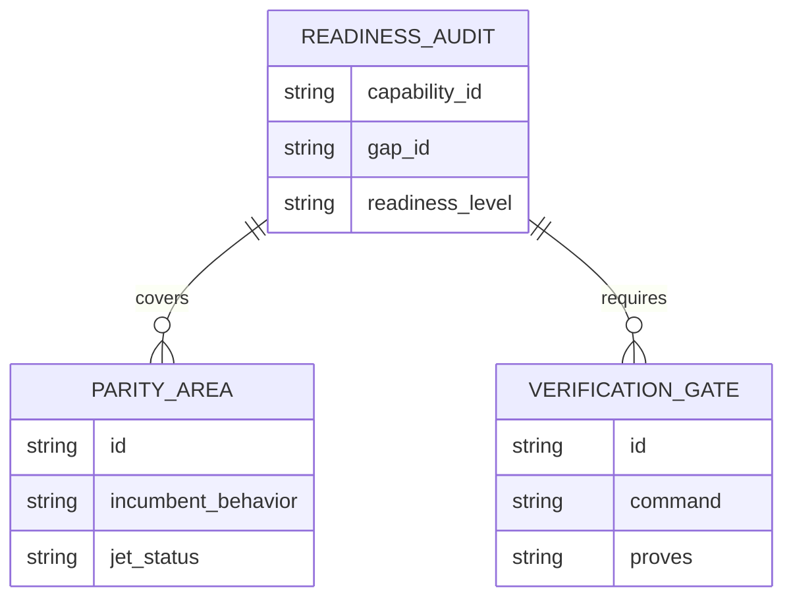
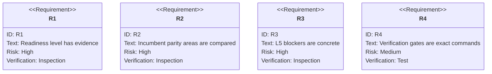

# Jet Dev Server And HMR Readiness Audit

## Scenarios
<!-- type: scenarios lang: yaml -->

```yaml
scenarios:
  - id: dev_server_hmr_baseline
    given: "Jet dev server and HMR source and tests exist under projects/jet/src/dev_server."
    when: "The audit inspects local serving, watcher, HMR graph, proxy, prebundle, import map, React Refresh, browser diagnostics behavior."
    then: "The TD records the current readiness level with source and test evidence."
  - id: incumbent_parity_matrix
    given: "Vite dev server and HMR are the replacement targets."
    when: "The audit compares Jet behavior against local-serving/watcher/hmr-graph/proxy/prebundle/importmap/react-refresh/browser-diagnostics expectations."
    then: "Every unsupported or divergent behavior is recorded as a concrete L5 blocker or accepted out of scope."
  - id: verification_gate_inventory
    given: "README capability verification commands are required gates."
    when: "The audit evaluates current runnable commands and missing commands."
    then: "The capability map can list exact verification gates instead of transient pass/fail timestamps."
  - id: followup_candidate_filter
    given: "The audit finds an implementation gap."
    when: "The gap lacks a fixture, gate, diagnostic expectation, or close criteria."
    then: "No implementation WI is opened until those fields are explicit."
```
## Mindmap
<!-- type: mindmap lang: mermaid -->


## State Machine
<!-- type: state-machine lang: mermaid -->


## Interaction
<!-- type: interaction lang: mermaid -->


## Logic
<!-- type: logic lang: mermaid -->


## Dependency
<!-- type: dependency lang: mermaid -->


## Data Model
<!-- type: db-model lang: mermaid -->


## Schema
<!-- type: schema lang: yaml -->

```yaml
readiness_audit:
  capability_id: dev-server-hmr
  gap_id: dev-server-replacement-readiness
  fields:
    readiness_level: "L0|L1|L2|L3|L4|L5"
    evidence:
      source: "list of source paths"
      tests: "list of test files or commands"
      commands: "list of verification commands"
    parity_areas:
      - id: "dev-server-hmr-loop"
        incumbent: "Vite dev-server/HMR behavior"
        jet_status: "supported|partial|missing|out_of_scope"
    blockers:
      - id: "stable blocker id"
        fixture_or_project: "fixture or real project"
        required_gate: "exact command or missing command"
        artifact_expectation: "diagnostic or artifact"
        close_criteria: "bounded done condition"
```
## REST API
<!-- type: rest-api lang: yaml -->

```yaml
not_applicable:
  reason: "The dev-server-hmr readiness audit does not introduce an HTTP REST API."
```
## RPC API
<!-- type: rpc-api lang: yaml -->

```yaml
not_applicable:
  reason: "The dev-server-hmr readiness audit does not introduce an RPC API."
```
## Async API
<!-- type: async-api lang: yaml -->

```yaml
not_applicable:
  reason: "The dev-server-hmr readiness audit does not introduce pub-sub or WebSocket contracts."
```
## CLI
<!-- type: cli lang: yaml -->

```yaml
commands_to_audit:
  - "jet dev"
  - "jet dev --host"
  - "jet dev --proxy"
  - "jet dev --hmr"
verification_candidates:
  - id: dev-server-hmr-loop
    command: "cargo test -p jet dev_server -- --nocapture"
    proves: "local serving, watcher, and HMR behavior"
  - id: dev-server-hmr-prebundle
    command: "cargo test -p jet dev_server::prebundle -- --nocapture"
    proves: "prebundle and import-map behavior"
```
## Wireframe
<!-- type: wireframe lang: yaml -->

```yaml
not_applicable:
  reason: "The dev-server-hmr readiness audit is CLI and evidence oriented; it does not introduce a UI layout."
```
## Component
<!-- type: component lang: yaml -->

```yaml
not_applicable:
  reason: "The dev-server-hmr readiness audit does not introduce UI components."
```
## Design Token
<!-- type: design-token lang: yaml -->

```yaml
not_applicable:
  reason: "The dev-server-hmr readiness audit does not introduce design tokens."
```
## Config
<!-- type: config lang: yaml -->

```yaml
config_surfaces_to_audit:
  - "host and port settings"
  - "proxy settings"
  - "HMR client settings"
  - "prebundle settings"
```
## Manifest
<!-- type: manifest lang: yaml -->

```yaml
manifest_surfaces_to_audit:
  - "package.json dependencies"
  - "dev entrypoints"
  - "CSS and asset imports during dev"
  - "workspace package entrypoints"
```
## Runtime Image
<!-- type: runtime-image lang: yaml -->

```yaml
not_applicable:
  reason: "The dev-server-hmr readiness audit does not introduce a container runtime image."
```
## Deployment
<!-- type: deployment lang: yaml -->

```yaml
not_applicable:
  reason: "The dev-server-hmr readiness audit does not introduce deployment manifests."
```
## Test Plan
<!-- type: test-plan lang: mermaid -->


## Changes
<!-- type: changes lang: yaml -->

```yaml
changes:
  - path: .aw/tech-design/projects/jet/specs/3780.md
    action: create
    section: scenarios
    impl_mode: hand-written
    description: "Add the dev-server-hmr readiness audit TD with capability refs for dev-server-hmr and the broader Jet toolchain promise."
  - path: projects/jet/README.md
    action: modify
    section: scenarios
    impl_mode: hand-written
    description: "Update the dev-server-hmr capability evidence and gap status after the audit produces gates and blockers."
  - path: ".aw/tech-design/projects/jet/specs/3780.md"
    action: verify
    section: async-api
    impl_mode: hand-written
    description: |
      Traceability repair: hand-written TD section retained as the implementation edge during AW standardization.

  - path: ".aw/tech-design/projects/jet/specs/3780.md"
    action: verify
    section: cli
    impl_mode: hand-written
    description: |
      Traceability repair: hand-written TD section retained as the implementation edge during AW standardization.

  - path: ".aw/tech-design/projects/jet/specs/3780.md"
    action: verify
    section: component
    impl_mode: hand-written
    description: |
      Traceability repair: hand-written TD section retained as the implementation edge during AW standardization.

  - path: ".aw/tech-design/projects/jet/specs/3780.md"
    action: verify
    section: config
    impl_mode: hand-written
    description: |
      Traceability repair: hand-written TD section retained as the implementation edge during AW standardization.

  - path: ".aw/tech-design/projects/jet/specs/3780.md"
    action: verify
    section: db-model
    impl_mode: hand-written
    description: |
      Traceability repair: hand-written TD section retained as the implementation edge during AW standardization.

  - path: ".aw/tech-design/projects/jet/specs/3780.md"
    action: verify
    section: dependency
    impl_mode: hand-written
    description: |
      Traceability repair: hand-written TD section retained as the implementation edge during AW standardization.

  - path: ".aw/tech-design/projects/jet/specs/3780.md"
    action: verify
    section: deployment
    impl_mode: hand-written
    description: |
      Traceability repair: hand-written TD section retained as the implementation edge during AW standardization.

  - path: ".aw/tech-design/projects/jet/specs/3780.md"
    action: verify
    section: design-token
    impl_mode: hand-written
    description: |
      Traceability repair: hand-written TD section retained as the implementation edge during AW standardization.

  - path: ".aw/tech-design/projects/jet/specs/3780.md"
    action: verify
    section: interaction
    impl_mode: hand-written
    description: |
      Traceability repair: hand-written TD section retained as the implementation edge during AW standardization.

  - path: ".aw/tech-design/projects/jet/specs/3780.md"
    action: verify
    section: logic
    impl_mode: hand-written
    description: |
      Traceability repair: hand-written TD section retained as the implementation edge during AW standardization.

  - path: ".aw/tech-design/projects/jet/specs/3780.md"
    action: verify
    section: manifest
    impl_mode: hand-written
    description: |
      Traceability repair: hand-written TD section retained as the implementation edge during AW standardization.

  - path: ".aw/tech-design/projects/jet/specs/3780.md"
    action: verify
    section: mindmap
    impl_mode: hand-written
    description: |
      Traceability repair: hand-written TD section retained as the implementation edge during AW standardization.

  - path: ".aw/tech-design/projects/jet/specs/3780.md"
    action: verify
    section: rest-api
    impl_mode: hand-written
    description: |
      Traceability repair: hand-written TD section retained as the implementation edge during AW standardization.

  - path: ".aw/tech-design/projects/jet/specs/3780.md"
    action: verify
    section: rpc-api
    impl_mode: hand-written
    description: |
      Traceability repair: hand-written TD section retained as the implementation edge during AW standardization.

  - path: ".aw/tech-design/projects/jet/specs/3780.md"
    action: verify
    section: runtime-image
    impl_mode: hand-written
    description: |
      Traceability repair: hand-written TD section retained as the implementation edge during AW standardization.

  - path: ".aw/tech-design/projects/jet/specs/3780.md"
    action: verify
    section: schema
    impl_mode: hand-written
    description: |
      Traceability repair: hand-written TD section retained as the implementation edge during AW standardization.

  - path: ".aw/tech-design/projects/jet/specs/3780.md"
    action: verify
    section: state-machine
    impl_mode: hand-written
    description: |
      Traceability repair: hand-written TD section retained as the implementation edge during AW standardization.

  - path: ".aw/tech-design/projects/jet/specs/3780.md"
    action: verify
    section: unit-test
    impl_mode: hand-written
    description: |
      Traceability repair: hand-written TD section retained as the implementation edge during AW standardization.

  - path: ".aw/tech-design/projects/jet/specs/3780.md"
    action: verify
    section: wireframe
    impl_mode: hand-written
    description: |
      Traceability repair: hand-written TD section retained as the implementation edge during AW standardization.

```
## E2E Test
<!-- type: e2e-test lang: yaml -->

```yaml
e2e_tests:
  - id: dev_server_replacement_readiness
    capability_id: dev-server-hmr
    claim_id: dev-server-replacement-readiness
    name: "Dev server replacement readiness"
    command: "cargo test -p jet --lib dev_server -- --nocapture"
    proves: "Dev-server/HMR behavior has a focused verification gate."
  - id: dev_server_local_serving_hmr
    capability_id: dev-server-hmr
    claim_id: dev-server-local-serving-hmr
    name: "Dev server local serving HMR"
    command: "cargo test -p jet --lib dev_server -- --nocapture"
    proves: "Local serving and HMR behavior have focused verification."
  - id: dev_server_proxy_contract
    capability_id: dev-server-hmr
    claim_id: dev-server-proxy-contract
    name: "Dev server proxy contract"
    command: "cargo test -p jet --lib dev_server::proxy -- --nocapture"
    proves: "Proxy behavior has focused verification."
  - id: dev_server_cli_contract
    capability_id: dev-server-hmr
    claim_id: dev-server-cli-contract
    name: "Dev server CLI contract"
    command: "cargo test -p jet --lib cli::e2e_command_contract_tests -- --nocapture"
    proves: "Dev-server CLI command contract has focused verification."
  - id: react_refresh_state_preserved
    capability_id: dev-server-hmr
    claim_id: react-refresh-state-preserved
    name: "React Refresh state preserved"
    command: "cargo test -p jet --lib dev_server::hmr -- --nocapture"
    proves: "React Refresh state preservation has focused verification."
  - id: prebundle_importmap_parity
    capability_id: dev-server-hmr
    claim_id: prebundle-importmap-parity
    name: "Prebundle importmap parity"
    command: "cargo test -p jet --lib dev_server::prebundle -- --nocapture"
    proves: "Prebundle and import-map behavior have focused verification."
```

# Reviews

### Review 1
**Verdict:** approved

- [scenarios] The scenarios align with the WI requirements and keep audit output bounded to evidence, parity, gates, and follow-up candidate criteria.
- [schema] The audit data model captures readiness level, evidence, parity areas, blockers, and exact gates with stable IDs.
- [cli] The command inventory is specific to dev-server/HMR and includes focused candidate gates for local serving, HMR, prebundle, and import-map behavior.
- [test-plan] Requirements map cleanly to inspection and command verification without storing transient runtime results in README.
- [changes] The implementation scope stays hand-written and limited to TD evidence plus README capability linkage.
