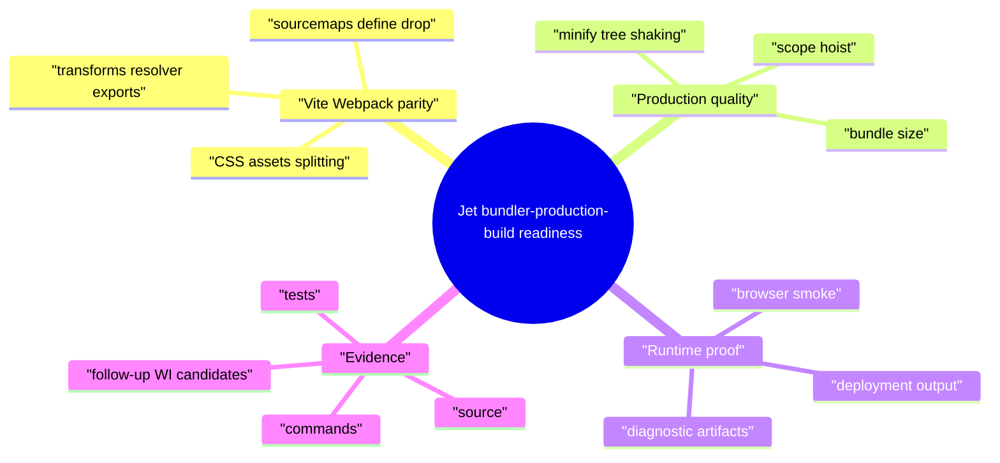
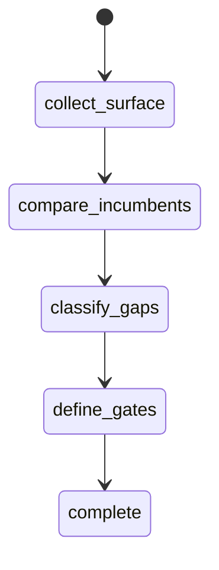
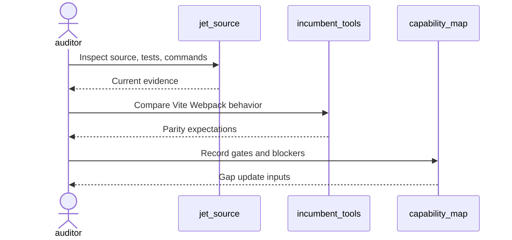
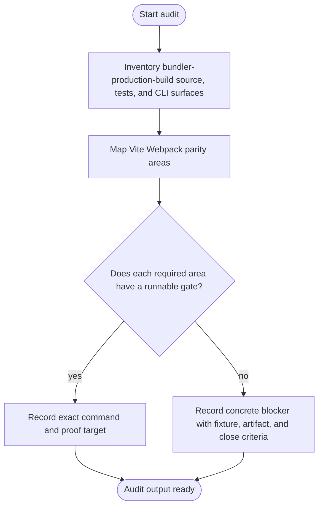
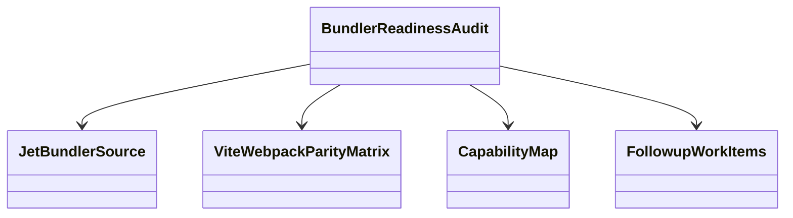
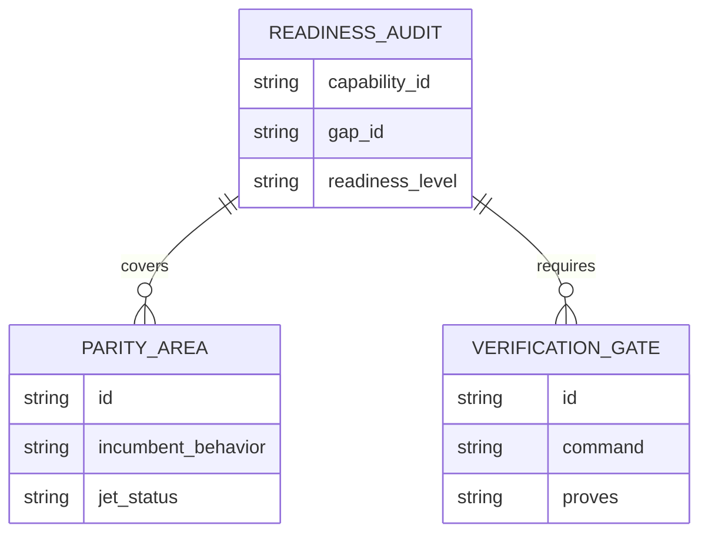
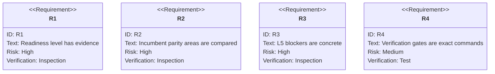

# Jet Bundler Production Build Readiness Audit

## Scenarios
<!-- type: scenarios lang: yaml -->

```yaml
scenarios:
  - id: bundler_production_baseline
    given: "Jet bundler and production build source and tests exist under projects/jet/src/bundler, transform, resolver, and asset."
    when: "The audit inspects build output, transforms, resolver, assets, minification, sourcemaps, browser smoke, and deployment output behavior."
    then: "The TD records the current readiness level with source and test evidence."
  - id: incumbent_parity_matrix
    given: "Vite and Webpack are the replacement targets."
    when: "The audit compares Jet behavior against transforms/resolver/css-assets/splitting/sourcemaps/define-drop/minify/tree-shaking/browser-smoke expectations."
    then: "Every unsupported or divergent behavior is recorded as a concrete L5 blocker or accepted out of scope."
  - id: verification_gate_inventory
    given: "README capability verification commands are required gates."
    when: "The audit evaluates current runnable commands and missing commands."
    then: "The capability map can list exact verification gates instead of transient pass/fail timestamps."
  - id: followup_candidate_filter
    given: "The audit finds an implementation gap."
    when: "The gap lacks a fixture, gate, diagnostic expectation, or close criteria."
    then: "No implementation WI is opened until those fields are explicit."
```
## Mindmap
<!-- type: mindmap lang: mermaid -->


## State Machine
<!-- type: state-machine lang: mermaid -->


## Interaction
<!-- type: interaction lang: mermaid -->


## Logic
<!-- type: logic lang: mermaid -->


## Dependency
<!-- type: dependency lang: mermaid -->


## Data Model
<!-- type: db-model lang: mermaid -->


## Schema
<!-- type: schema lang: yaml -->

```yaml
readiness_audit:
  capability_id: bundler-production-build
  gap_id: bundler-production-readiness
  fields:
    readiness_level: "L0|L1|L2|L3|L4|L5"
    evidence:
      source: "list of source paths"
      tests: "list of test files or commands"
      commands: "list of verification commands"
    parity_areas:
      - id: "production-build-output"
        incumbent: "Vite/Webpack behavior"
        jet_status: "supported|partial|missing|out_of_scope"
    blockers:
      - id: "stable blocker id"
        fixture_or_project: "fixture or real project"
        required_gate: "exact command or missing command"
        artifact_expectation: "diagnostic or artifact"
        close_criteria: "bounded done condition"
```
## REST API
<!-- type: rest-api lang: yaml -->

```yaml
not_applicable:
  reason: "The bundler-production-build readiness audit does not introduce an HTTP REST API."
```
## RPC API
<!-- type: rpc-api lang: yaml -->

```yaml
not_applicable:
  reason: "The bundler-production-build readiness audit does not introduce an RPC API."
```
## Async API
<!-- type: async-api lang: yaml -->

```yaml
not_applicable:
  reason: "The bundler-production-build readiness audit does not introduce pub-sub or WebSocket contracts."
```
## CLI
<!-- type: cli lang: yaml -->

```yaml
commands_to_audit:
  - "jet build"
  - "jet build --production"
  - "jet build --sourcemap"
  - "jet build --analyze"
verification_candidates:
  - id: bundler-production-build-output
    command: "cargo test -p jet bundler -- --nocapture"
    proves: "build output correctness and artifact behavior"
  - id: bundler-production-build-transform
    command: "cargo test -p jet transform -- --nocapture"
    proves: "transform and resolver behavior"
```
## Wireframe
<!-- type: wireframe lang: yaml -->

```yaml
not_applicable:
  reason: "The bundler-production-build readiness audit is CLI and evidence oriented; it does not introduce a UI layout."
```
## Component
<!-- type: component lang: yaml -->

```yaml
not_applicable:
  reason: "The bundler-production-build readiness audit does not introduce UI components."
```
## Design Token
<!-- type: design-token lang: yaml -->

```yaml
not_applicable:
  reason: "The bundler-production-build readiness audit does not introduce design tokens."
```
## Config
<!-- type: config lang: yaml -->

```yaml
config_surfaces_to_audit:
  - "build mode flags"
  - "sourcemap settings"
  - "define/drop configuration"
  - "asset output configuration"
```
## Manifest
<!-- type: manifest lang: yaml -->

```yaml
manifest_surfaces_to_audit:
  - "package.json dependencies"
  - "package.json exports and browser fields"
  - "CSS and asset imports"
  - "workspace package entrypoints"
```
## Runtime Image
<!-- type: runtime-image lang: yaml -->

```yaml
not_applicable:
  reason: "The bundler-production-build readiness audit does not introduce a container runtime image."
```
## Deployment
<!-- type: deployment lang: yaml -->

```yaml
not_applicable:
  reason: "The bundler-production-build readiness audit does not introduce deployment manifests."
```
## Test Plan
<!-- type: test-plan lang: mermaid -->


## Changes
<!-- type: changes lang: yaml -->

```yaml
changes:
  - path: .aw/tech-design/projects/jet/specs/3782.md
    action: create
    section: scenarios
    impl_mode: hand-written
    description: "Add the bundler-production-build readiness audit TD with capability refs for bundler-production-build and the broader Jet toolchain promise."
  - path: projects/jet/README.md
    action: modify
    section: scenarios
    impl_mode: hand-written
    description: "Update the bundler-production-build capability evidence and gap status after the audit produces gates and blockers."
  - path: ".aw/tech-design/projects/jet/specs/3782.md"
    action: verify
    section: async-api
    impl_mode: hand-written
    description: |
      Traceability repair: hand-written TD section retained as the implementation edge during AW standardization.

  - path: ".aw/tech-design/projects/jet/specs/3782.md"
    action: verify
    section: cli
    impl_mode: hand-written
    description: |
      Traceability repair: hand-written TD section retained as the implementation edge during AW standardization.

  - path: ".aw/tech-design/projects/jet/specs/3782.md"
    action: verify
    section: component
    impl_mode: hand-written
    description: |
      Traceability repair: hand-written TD section retained as the implementation edge during AW standardization.

  - path: ".aw/tech-design/projects/jet/specs/3782.md"
    action: verify
    section: config
    impl_mode: hand-written
    description: |
      Traceability repair: hand-written TD section retained as the implementation edge during AW standardization.

  - path: ".aw/tech-design/projects/jet/specs/3782.md"
    action: verify
    section: db-model
    impl_mode: hand-written
    description: |
      Traceability repair: hand-written TD section retained as the implementation edge during AW standardization.

  - path: ".aw/tech-design/projects/jet/specs/3782.md"
    action: verify
    section: dependency
    impl_mode: hand-written
    description: |
      Traceability repair: hand-written TD section retained as the implementation edge during AW standardization.

  - path: ".aw/tech-design/projects/jet/specs/3782.md"
    action: verify
    section: deployment
    impl_mode: hand-written
    description: |
      Traceability repair: hand-written TD section retained as the implementation edge during AW standardization.

  - path: ".aw/tech-design/projects/jet/specs/3782.md"
    action: verify
    section: design-token
    impl_mode: hand-written
    description: |
      Traceability repair: hand-written TD section retained as the implementation edge during AW standardization.

  - path: ".aw/tech-design/projects/jet/specs/3782.md"
    action: verify
    section: interaction
    impl_mode: hand-written
    description: |
      Traceability repair: hand-written TD section retained as the implementation edge during AW standardization.

  - path: ".aw/tech-design/projects/jet/specs/3782.md"
    action: verify
    section: logic
    impl_mode: hand-written
    description: |
      Traceability repair: hand-written TD section retained as the implementation edge during AW standardization.

  - path: ".aw/tech-design/projects/jet/specs/3782.md"
    action: verify
    section: manifest
    impl_mode: hand-written
    description: |
      Traceability repair: hand-written TD section retained as the implementation edge during AW standardization.

  - path: ".aw/tech-design/projects/jet/specs/3782.md"
    action: verify
    section: mindmap
    impl_mode: hand-written
    description: |
      Traceability repair: hand-written TD section retained as the implementation edge during AW standardization.

  - path: ".aw/tech-design/projects/jet/specs/3782.md"
    action: verify
    section: rest-api
    impl_mode: hand-written
    description: |
      Traceability repair: hand-written TD section retained as the implementation edge during AW standardization.

  - path: ".aw/tech-design/projects/jet/specs/3782.md"
    action: verify
    section: rpc-api
    impl_mode: hand-written
    description: |
      Traceability repair: hand-written TD section retained as the implementation edge during AW standardization.

  - path: ".aw/tech-design/projects/jet/specs/3782.md"
    action: verify
    section: runtime-image
    impl_mode: hand-written
    description: |
      Traceability repair: hand-written TD section retained as the implementation edge during AW standardization.

  - path: ".aw/tech-design/projects/jet/specs/3782.md"
    action: verify
    section: schema
    impl_mode: hand-written
    description: |
      Traceability repair: hand-written TD section retained as the implementation edge during AW standardization.

  - path: ".aw/tech-design/projects/jet/specs/3782.md"
    action: verify
    section: state-machine
    impl_mode: hand-written
    description: |
      Traceability repair: hand-written TD section retained as the implementation edge during AW standardization.

  - path: ".aw/tech-design/projects/jet/specs/3782.md"
    action: verify
    section: unit-test
    impl_mode: hand-written
    description: |
      Traceability repair: hand-written TD section retained as the implementation edge during AW standardization.

  - path: ".aw/tech-design/projects/jet/specs/3782.md"
    action: verify
    section: wireframe
    impl_mode: hand-written
    description: |
      Traceability repair: hand-written TD section retained as the implementation edge during AW standardization.

```
## Tests
<!-- type: tests lang: yaml -->

```yaml
tests:
  - id: capability-check
    command: "aw capability check jet --json"
    proves: "README capability refs and TD capability refs resolve."
  - id: bundler-production-build-output
    command: "cargo test -p jet bundler -- --nocapture"
    proves: "Production build behavior has a focused verification gate."
  - id: bundler-production-build-transform
    command: "cargo test -p jet transform -- --nocapture"
    proves: "Transform and resolver behavior have focused verification gates."
```

# Reviews

### Review 1
**Verdict:** approved

- [scenarios] The contract captures bundler/build readiness evidence, Vite/Webpack parity, verification gates, and bounded follow-up filtering.
- [mindmap] The section centers production build concerns: transforms, resolver exports, CSS/assets, sourcemaps, optimization, browser smoke, and deployment output.
- [logic] The audit path is bounded and keeps gate/blocker classification ahead of capability status updates.
- [cli] The candidate commands and gates are build-oriented and align with the README capability.
- [changes] The hand-written audit TD and README evidence update are the correct implementation surface for this WI.
