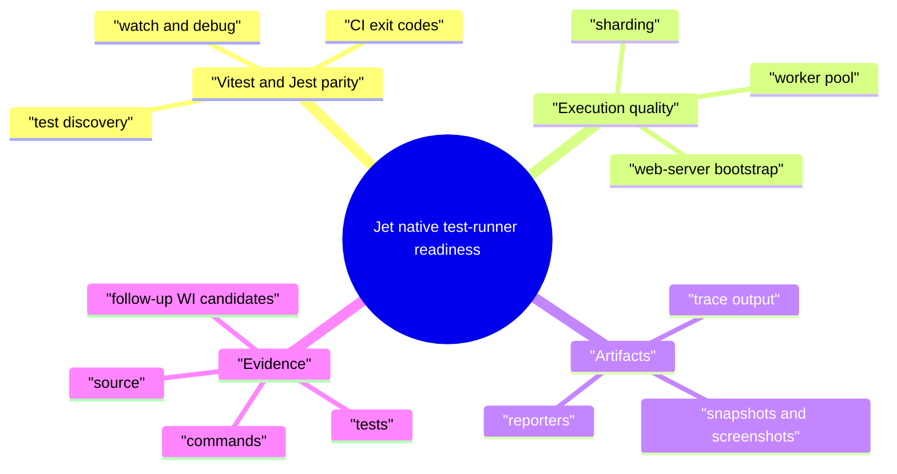
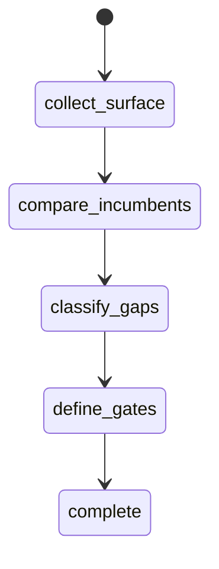
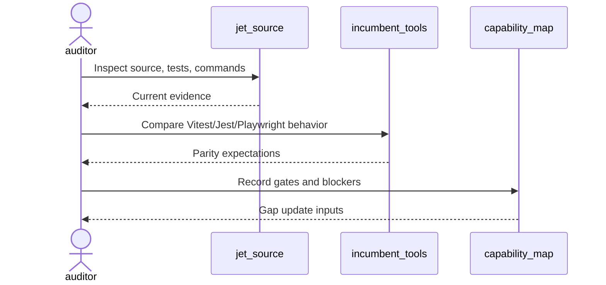
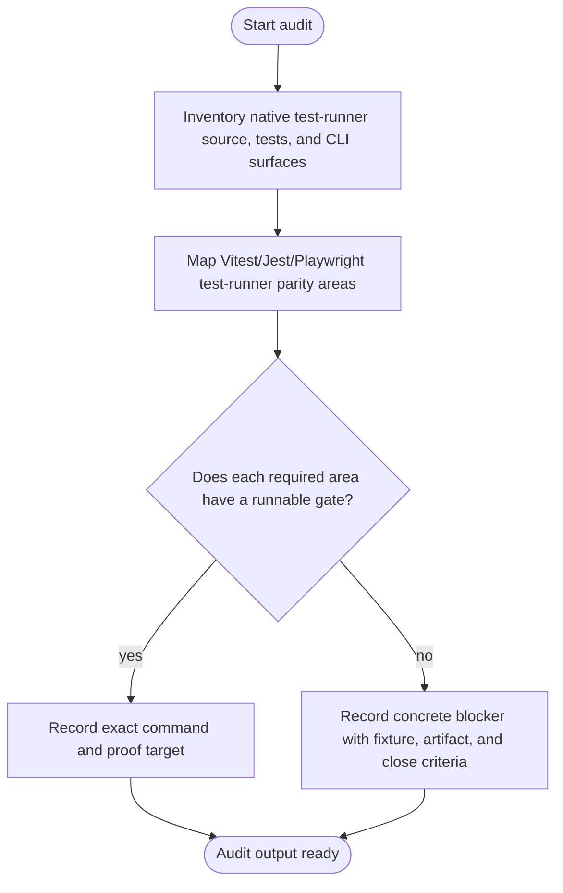
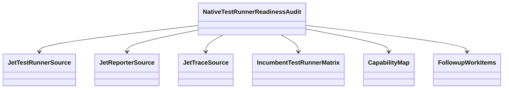
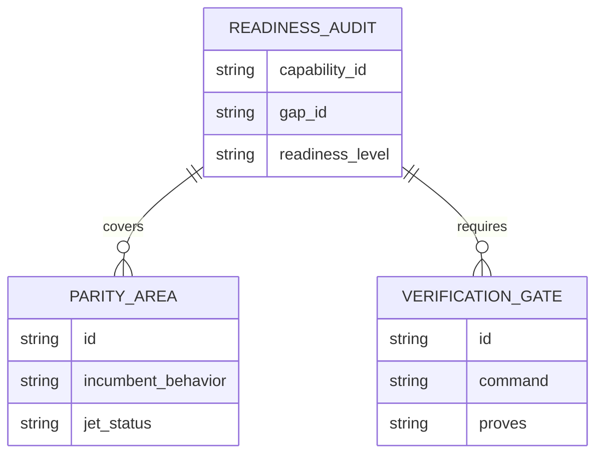
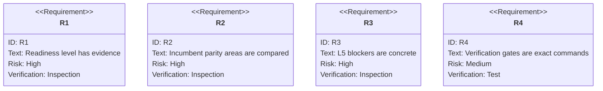

# Jet Native Test Runner Readiness Audit

## Scenarios
<!-- type: scenarios lang: yaml -->

```yaml
scenarios:
  - id: native_test_runner_baseline
    given: "Jet native test-runner source and tests exist under projects/jet/src/test_runner and adjacent reporter/trace surfaces."
    when: "The audit inspects discovery, reporters, snapshots, traces, worker pool, sharding, watch/debug behavior, web-server bootstrap, shim compatibility, and CI exit codes."
    then: "The TD records the current readiness level with source and test evidence."
  - id: incumbent_parity_matrix
    given: "Vitest, Jest, and Playwright test-runner expectations are the replacement targets."
    when: "The audit compares Jet behavior against frontend unit, component, and integration-style test expectations."
    then: "Every unsupported or divergent behavior is recorded as a concrete L5 blocker or accepted out of scope."
  - id: verification_gate_inventory
    given: "README capability verification commands are required gates."
    when: "The audit evaluates current runnable commands and missing commands."
    then: "The capability map can list exact verification gates instead of transient pass/fail timestamps."
  - id: followup_candidate_filter
    given: "The audit finds an implementation gap."
    when: "The gap lacks a fixture, gate, diagnostic expectation, or close criteria."
    then: "No implementation WI is opened until those fields are explicit."
```
## Mindmap
<!-- type: mindmap lang: mermaid -->


## State Machine
<!-- type: state-machine lang: mermaid -->


## Interaction
<!-- type: interaction lang: mermaid -->


## Logic
<!-- type: logic lang: mermaid -->


## Dependency
<!-- type: dependency lang: mermaid -->


## Data Model
<!-- type: db-model lang: mermaid -->


## Schema
<!-- type: schema lang: yaml -->

```yaml
readiness_audit:
  capability_id: native-test-product-flow-e2e
  gap_id: native-test-runner-readiness
  fields:
    readiness_level: "L0|L1|L2|L3|L4|L5"
    evidence:
      source: "list of source paths"
      tests: "list of test files or commands"
      commands: "list of verification commands"
    parity_areas:
      - id: "native-test-runner-core"
        incumbent: "Vitest/Jest/Playwright runner behavior"
        jet_status: "supported|partial|missing|out_of_scope"
    blockers:
      - id: "stable blocker id"
        fixture_or_project: "fixture or real project"
        required_gate: "exact command or missing command"
        artifact_expectation: "diagnostic or artifact"
        close_criteria: "bounded done condition"
```
## REST API
<!-- type: rest-api lang: yaml -->

```yaml
not_applicable:
  reason: "The native test-runner readiness audit does not introduce an HTTP REST API."
```
## RPC API
<!-- type: rpc-api lang: yaml -->

```yaml
not_applicable:
  reason: "The native test-runner readiness audit does not introduce an RPC API."
```
## Async API
<!-- type: async-api lang: yaml -->

```yaml
not_applicable:
  reason: "The native test-runner readiness audit does not introduce pub-sub or WebSocket contracts."
```
## CLI
<!-- type: cli lang: yaml -->

```yaml
commands_to_audit:
  - "jet test"
  - "jet test --reporter json"
  - "jet test --shard"
  - "jet test --watch"
  - "jet test --trace"
verification_candidates:
  - id: native-test-runner-tests
    command: "cargo test -p jet test_runner -- --nocapture"
    proves: "native test discovery, scheduling, reporting, sharding, and worker behavior"
  - id: native-test-reporter-tests
    command: "cargo test -p jet reporter -- --nocapture"
    proves: "JSON/HTML reporter and artifact behavior"
  - id: native-test-trace-tests
    command: "cargo test -p jet trace -- --nocapture"
    proves: "trace artifact behavior used by test failures"
```
## Wireframe
<!-- type: wireframe lang: yaml -->

```yaml
not_applicable:
  reason: "The native test-runner readiness audit is CLI and evidence oriented; it does not introduce a UI layout."
```
## Component
<!-- type: component lang: yaml -->

```yaml
not_applicable:
  reason: "The native test-runner readiness audit does not introduce UI components."
```
## Design Token
<!-- type: design-token lang: yaml -->

```yaml
not_applicable:
  reason: "The native test-runner readiness audit does not introduce design tokens."
```
## Config
<!-- type: config lang: yaml -->

```yaml
config_surfaces_to_audit:
  - "test file globs"
  - "reporter configuration"
  - "worker and shard settings"
  - "watch/debug settings"
  - "web-server bootstrap configuration"
```
## Manifest
<!-- type: manifest lang: yaml -->

```yaml
manifest_surfaces_to_audit:
  - "package.json test scripts"
  - "test config files"
  - "snapshot and trace output paths"
  - "browser/component test dependencies"
```
## Runtime Image
<!-- type: runtime-image lang: yaml -->

```yaml
not_applicable:
  reason: "The native test-runner readiness audit does not introduce a container runtime image."
```
## Deployment
<!-- type: deployment lang: yaml -->

```yaml
not_applicable:
  reason: "The native test-runner readiness audit does not introduce deployment manifests."
```
## Test Plan
<!-- type: test-plan lang: mermaid -->


## Changes
<!-- type: changes lang: yaml -->

```yaml
changes:
  - path: .aw/tech-design/projects/jet/specs/3785.md
    action: create
    section: scenarios
    impl_mode: hand-written
    description: "Add the native test-runner readiness audit TD with capability refs for native-test-product-flow-e2e and the broader Jet toolchain promise."
  - path: projects/jet/README.md
    action: modify
    section: scenarios
    impl_mode: hand-written
    description: "Update the native test-runner capability evidence and gap status after the audit produces gates and blockers."
  - path: ".aw/tech-design/projects/jet/specs/3785.md"
    action: verify
    section: async-api
    impl_mode: hand-written
    description: |
      Traceability repair: hand-written TD section retained as the implementation edge during AW standardization.

  - path: ".aw/tech-design/projects/jet/specs/3785.md"
    action: verify
    section: cli
    impl_mode: hand-written
    description: |
      Traceability repair: hand-written TD section retained as the implementation edge during AW standardization.

  - path: ".aw/tech-design/projects/jet/specs/3785.md"
    action: verify
    section: component
    impl_mode: hand-written
    description: |
      Traceability repair: hand-written TD section retained as the implementation edge during AW standardization.

  - path: ".aw/tech-design/projects/jet/specs/3785.md"
    action: verify
    section: config
    impl_mode: hand-written
    description: |
      Traceability repair: hand-written TD section retained as the implementation edge during AW standardization.

  - path: ".aw/tech-design/projects/jet/specs/3785.md"
    action: verify
    section: db-model
    impl_mode: hand-written
    description: |
      Traceability repair: hand-written TD section retained as the implementation edge during AW standardization.

  - path: ".aw/tech-design/projects/jet/specs/3785.md"
    action: verify
    section: dependency
    impl_mode: hand-written
    description: |
      Traceability repair: hand-written TD section retained as the implementation edge during AW standardization.

  - path: ".aw/tech-design/projects/jet/specs/3785.md"
    action: verify
    section: deployment
    impl_mode: hand-written
    description: |
      Traceability repair: hand-written TD section retained as the implementation edge during AW standardization.

  - path: ".aw/tech-design/projects/jet/specs/3785.md"
    action: verify
    section: design-token
    impl_mode: hand-written
    description: |
      Traceability repair: hand-written TD section retained as the implementation edge during AW standardization.

  - path: ".aw/tech-design/projects/jet/specs/3785.md"
    action: verify
    section: interaction
    impl_mode: hand-written
    description: |
      Traceability repair: hand-written TD section retained as the implementation edge during AW standardization.

  - path: ".aw/tech-design/projects/jet/specs/3785.md"
    action: verify
    section: logic
    impl_mode: hand-written
    description: |
      Traceability repair: hand-written TD section retained as the implementation edge during AW standardization.

  - path: ".aw/tech-design/projects/jet/specs/3785.md"
    action: verify
    section: manifest
    impl_mode: hand-written
    description: |
      Traceability repair: hand-written TD section retained as the implementation edge during AW standardization.

  - path: ".aw/tech-design/projects/jet/specs/3785.md"
    action: verify
    section: mindmap
    impl_mode: hand-written
    description: |
      Traceability repair: hand-written TD section retained as the implementation edge during AW standardization.

  - path: ".aw/tech-design/projects/jet/specs/3785.md"
    action: verify
    section: rest-api
    impl_mode: hand-written
    description: |
      Traceability repair: hand-written TD section retained as the implementation edge during AW standardization.

  - path: ".aw/tech-design/projects/jet/specs/3785.md"
    action: verify
    section: rpc-api
    impl_mode: hand-written
    description: |
      Traceability repair: hand-written TD section retained as the implementation edge during AW standardization.

  - path: ".aw/tech-design/projects/jet/specs/3785.md"
    action: verify
    section: runtime-image
    impl_mode: hand-written
    description: |
      Traceability repair: hand-written TD section retained as the implementation edge during AW standardization.

  - path: ".aw/tech-design/projects/jet/specs/3785.md"
    action: verify
    section: schema
    impl_mode: hand-written
    description: |
      Traceability repair: hand-written TD section retained as the implementation edge during AW standardization.

  - path: ".aw/tech-design/projects/jet/specs/3785.md"
    action: verify
    section: state-machine
    impl_mode: hand-written
    description: |
      Traceability repair: hand-written TD section retained as the implementation edge during AW standardization.

  - path: ".aw/tech-design/projects/jet/specs/3785.md"
    action: verify
    section: unit-test
    impl_mode: hand-written
    description: |
      Traceability repair: hand-written TD section retained as the implementation edge during AW standardization.

  - path: ".aw/tech-design/projects/jet/specs/3785.md"
    action: verify
    section: wireframe
    impl_mode: hand-written
    description: |
      Traceability repair: hand-written TD section retained as the implementation edge during AW standardization.

```
## Tests
<!-- type: tests lang: yaml -->

```yaml
tests:
  - id: capability-check
    command: "aw capability check jet --json"
    proves: "README capability refs and TD capability refs resolve."
  - id: native-test-runner-tests
    command: "cargo test -p jet test_runner -- --nocapture"
    proves: "Native test discovery, reporting, sharding, and worker behavior have a focused verification gate."
  - id: native-test-reporter-tests
    command: "cargo test -p jet reporter -- --nocapture"
    proves: "Reporter artifact behavior has a focused verification gate."
  - id: native-test-trace-tests
    command: "cargo test -p jet trace -- --nocapture"
    proves: "Trace artifact behavior has a focused verification gate."
```

# Reviews

### Review 1
**Verdict:** approved

- [scenarios] The scenarios align with the WI requirements and keep audit output bounded to evidence, parity, gates, and follow-up candidate criteria.
- [schema] The audit data model captures readiness level, evidence, parity areas, blockers, and exact gates with stable IDs.
- [cli] The command inventory covers `jet test`, reporters, sharding, watch, and trace-oriented candidate gates.
- [test-plan] Requirements map cleanly to inspection and command verification without storing transient runtime results in README.
- [changes] The implementation scope stays hand-written and limited to TD evidence plus README capability linkage.
