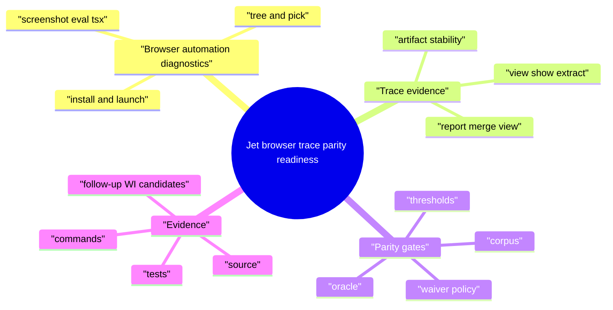
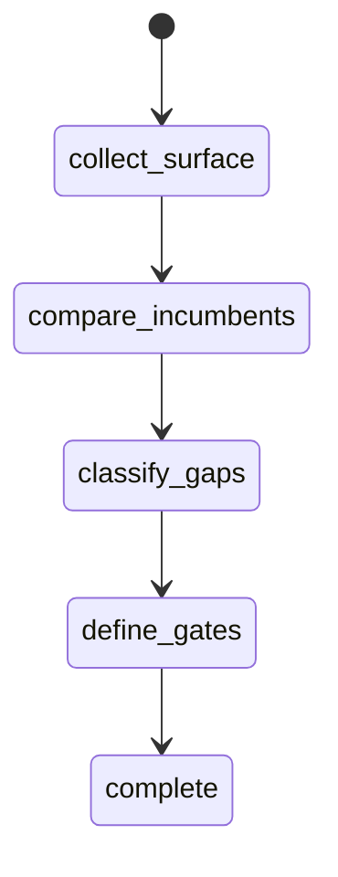
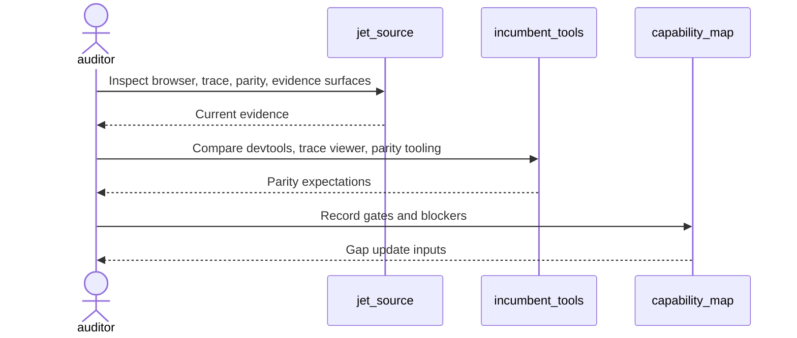
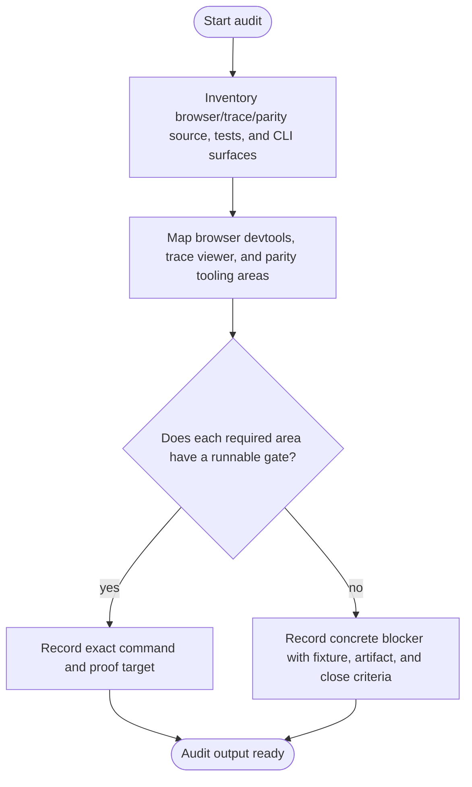
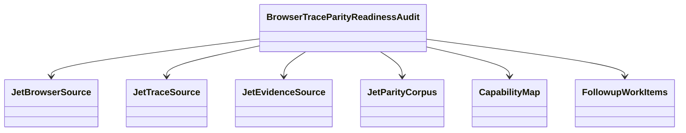
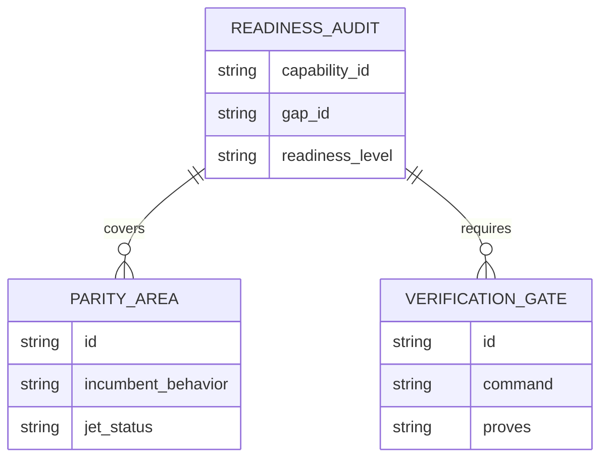
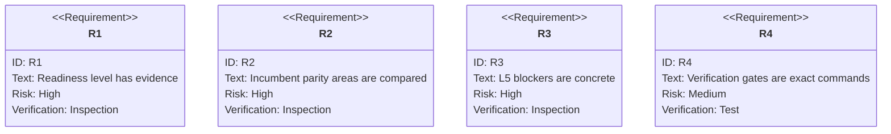

# Jet Browser Trace And Parity Readiness Audit

## Scenarios
<!-- type: scenarios lang: yaml -->

```yaml
scenarios:
  - id: browser_trace_parity_baseline
    given: "Jet browser CLI, trace, parity, and evidence surfaces exist under projects/jet/src/browser, browser_cli, trace, evidence, and parity paths."
    when: "The audit inspects artifact stability, release-gate thresholds, waiver policy, browser automation diagnostics, and parity corpus/oracle behavior."
    then: "The TD records the current readiness level with source and test evidence."
  - id: incumbent_parity_matrix
    given: "Browser devtools, Playwright trace viewer, and accessibility/pointer/focus/IME/pixel parity tooling are the replacement targets."
    when: "The audit compares Jet behavior against install/launch/tree/pick/hooks/highlight/frame/screenshot/eval/tsx, trace view/show/extract, report merge/view, and parity gate expectations."
    then: "Every unsupported or divergent behavior is recorded as a concrete L5 blocker or accepted out of scope."
  - id: verification_gate_inventory
    given: "README capability verification commands are required gates."
    when: "The audit evaluates current runnable commands and missing commands."
    then: "The capability map can list exact verification gates instead of transient pass/fail timestamps."
  - id: followup_candidate_filter
    given: "The audit finds an implementation gap."
    when: "The gap lacks a fixture, gate, diagnostic expectation, or close criteria."
    then: "No implementation WI is opened until those fields are explicit."
```
## Mindmap
<!-- type: mindmap lang: mermaid -->


## State Machine
<!-- type: state-machine lang: mermaid -->


## Interaction
<!-- type: interaction lang: mermaid -->


## Logic
<!-- type: logic lang: mermaid -->


## Dependency
<!-- type: dependency lang: mermaid -->


## Data Model
<!-- type: db-model lang: mermaid -->


## Schema
<!-- type: schema lang: yaml -->

```yaml
readiness_audit:
  capability_id: browser-trace-parity
  gap_id: browser-trace-parity-readiness
  fields:
    readiness_level: "L0|L1|L2|L3|L4|L5"
    evidence:
      source: "list of source paths"
      tests: "list of test files or commands"
      commands: "list of verification commands"
    parity_areas:
      - id: "browser-trace-parity-gate"
        incumbent: "Browser devtools, Playwright trace viewer, and accessibility/pointer/focus/IME/pixel parity tooling"
        jet_status: "supported|partial|missing|out_of_scope"
    blockers:
      - id: "stable blocker id"
        fixture_or_project: "fixture or real project"
        required_gate: "exact command or missing command"
        artifact_expectation: "browser, trace, evidence, parity, or waiver artifact"
        close_criteria: "bounded done condition"
```
## REST API
<!-- type: rest-api lang: yaml -->

```yaml
not_applicable:
  reason: "The browser/trace/parity readiness audit does not introduce an HTTP REST API."
```
## RPC API
<!-- type: rpc-api lang: yaml -->

```yaml
not_applicable:
  reason: "The browser/trace/parity readiness audit does not introduce an RPC API."
```
## Async API
<!-- type: async-api lang: yaml -->

```yaml
not_applicable:
  reason: "The browser/trace/parity readiness audit does not introduce pub-sub or WebSocket contracts."
```
## CLI
<!-- type: cli lang: yaml -->

```yaml
commands_to_audit:
  - "jet browser install"
  - "jet browser launch"
  - "jet browser tree"
  - "jet browser screenshot"
  - "jet trace view"
  - "jet trace show"
  - "jet trace extract"
  - "jet parity gate"
verification_candidates:
  - id: browser-trace-parity-tests
    command: "cargo test -p jet trace -- --nocapture"
    proves: "trace and browser evidence behavior"
  - id: browser-cli-tests
    command: "cargo test -p jet browser -- --nocapture"
    proves: "browser install/launch/inspect/evaluate behavior"
  - id: parity-gate-tests
    command: "cargo test -p jet parity -- --nocapture"
    proves: "parity corpus, oracle, gate threshold, and waiver behavior"
```
## Wireframe
<!-- type: wireframe lang: yaml -->

```yaml
not_applicable:
  reason: "The browser/trace/parity readiness audit records artifact UX requirements but does not introduce a new UI layout."
```
## Component
<!-- type: component lang: yaml -->

```yaml
not_applicable:
  reason: "The browser/trace/parity readiness audit does not introduce UI components."
```
## Design Token
<!-- type: design-token lang: yaml -->

```yaml
not_applicable:
  reason: "The browser/trace/parity readiness audit does not introduce design tokens."
```
## Config
<!-- type: config lang: yaml -->

```yaml
config_surfaces_to_audit:
  - "browser install and launch settings"
  - "trace artifact paths"
  - "report merge/view settings"
  - "parity threshold settings"
  - "waiver policy declarations"
```
## Manifest
<!-- type: manifest lang: yaml -->

```yaml
manifest_surfaces_to_audit:
  - "browser binary metadata"
  - "trace artifact manifests"
  - "parity corpus metadata"
  - "oracle and waiver files"
```
## Runtime Image
<!-- type: runtime-image lang: yaml -->

```yaml
not_applicable:
  reason: "The browser/trace/parity readiness audit does not introduce a container runtime image."
```
## Deployment
<!-- type: deployment lang: yaml -->

```yaml
not_applicable:
  reason: "The browser/trace/parity readiness audit does not introduce deployment manifests."
```
## Test Plan
<!-- type: test-plan lang: mermaid -->


## Changes
<!-- type: changes lang: yaml -->

```yaml
changes:
  - path: .aw/tech-design/projects/jet/specs/3786.md
    action: create
    section: scenarios
    impl_mode: hand-written
    description: "Add the browser/trace/parity readiness audit TD with capability refs for browser-trace-parity and the broader Jet toolchain promise."
  - path: projects/jet/README.md
    action: modify
    section: scenarios
    impl_mode: hand-written
    description: "Update the browser/trace/parity capability evidence and gap status after the audit produces gates and blockers."
  - path: ".aw/tech-design/projects/jet/specs/3786.md"
    action: verify
    section: async-api
    impl_mode: hand-written
    description: |
      Traceability repair: hand-written TD section retained as the implementation edge during AW standardization.

  - path: ".aw/tech-design/projects/jet/specs/3786.md"
    action: verify
    section: cli
    impl_mode: hand-written
    description: |
      Traceability repair: hand-written TD section retained as the implementation edge during AW standardization.

  - path: ".aw/tech-design/projects/jet/specs/3786.md"
    action: verify
    section: component
    impl_mode: hand-written
    description: |
      Traceability repair: hand-written TD section retained as the implementation edge during AW standardization.

  - path: ".aw/tech-design/projects/jet/specs/3786.md"
    action: verify
    section: config
    impl_mode: hand-written
    description: |
      Traceability repair: hand-written TD section retained as the implementation edge during AW standardization.

  - path: ".aw/tech-design/projects/jet/specs/3786.md"
    action: verify
    section: db-model
    impl_mode: hand-written
    description: |
      Traceability repair: hand-written TD section retained as the implementation edge during AW standardization.

  - path: ".aw/tech-design/projects/jet/specs/3786.md"
    action: verify
    section: dependency
    impl_mode: hand-written
    description: |
      Traceability repair: hand-written TD section retained as the implementation edge during AW standardization.

  - path: ".aw/tech-design/projects/jet/specs/3786.md"
    action: verify
    section: deployment
    impl_mode: hand-written
    description: |
      Traceability repair: hand-written TD section retained as the implementation edge during AW standardization.

  - path: ".aw/tech-design/projects/jet/specs/3786.md"
    action: verify
    section: design-token
    impl_mode: hand-written
    description: |
      Traceability repair: hand-written TD section retained as the implementation edge during AW standardization.

  - path: ".aw/tech-design/projects/jet/specs/3786.md"
    action: verify
    section: interaction
    impl_mode: hand-written
    description: |
      Traceability repair: hand-written TD section retained as the implementation edge during AW standardization.

  - path: ".aw/tech-design/projects/jet/specs/3786.md"
    action: verify
    section: logic
    impl_mode: hand-written
    description: |
      Traceability repair: hand-written TD section retained as the implementation edge during AW standardization.

  - path: ".aw/tech-design/projects/jet/specs/3786.md"
    action: verify
    section: manifest
    impl_mode: hand-written
    description: |
      Traceability repair: hand-written TD section retained as the implementation edge during AW standardization.

  - path: ".aw/tech-design/projects/jet/specs/3786.md"
    action: verify
    section: mindmap
    impl_mode: hand-written
    description: |
      Traceability repair: hand-written TD section retained as the implementation edge during AW standardization.

  - path: ".aw/tech-design/projects/jet/specs/3786.md"
    action: verify
    section: rest-api
    impl_mode: hand-written
    description: |
      Traceability repair: hand-written TD section retained as the implementation edge during AW standardization.

  - path: ".aw/tech-design/projects/jet/specs/3786.md"
    action: verify
    section: rpc-api
    impl_mode: hand-written
    description: |
      Traceability repair: hand-written TD section retained as the implementation edge during AW standardization.

  - path: ".aw/tech-design/projects/jet/specs/3786.md"
    action: verify
    section: runtime-image
    impl_mode: hand-written
    description: |
      Traceability repair: hand-written TD section retained as the implementation edge during AW standardization.

  - path: ".aw/tech-design/projects/jet/specs/3786.md"
    action: verify
    section: schema
    impl_mode: hand-written
    description: |
      Traceability repair: hand-written TD section retained as the implementation edge during AW standardization.

  - path: ".aw/tech-design/projects/jet/specs/3786.md"
    action: verify
    section: state-machine
    impl_mode: hand-written
    description: |
      Traceability repair: hand-written TD section retained as the implementation edge during AW standardization.

  - path: ".aw/tech-design/projects/jet/specs/3786.md"
    action: verify
    section: unit-test
    impl_mode: hand-written
    description: |
      Traceability repair: hand-written TD section retained as the implementation edge during AW standardization.

  - path: ".aw/tech-design/projects/jet/specs/3786.md"
    action: verify
    section: wireframe
    impl_mode: hand-written
    description: |
      Traceability repair: hand-written TD section retained as the implementation edge during AW standardization.

```
## Tests
<!-- type: tests lang: yaml -->

```yaml
tests:
  - id: capability-check
    command: "aw capability check jet --json"
    proves: "README capability refs and TD capability refs resolve."
  - id: browser-trace-parity-tests
    command: "cargo test -p jet trace -- --nocapture"
    proves: "Trace and browser evidence behavior have a focused verification gate."
  - id: browser-cli-tests
    command: "cargo test -p jet browser -- --nocapture"
    proves: "Browser automation diagnostics have a focused verification gate."
  - id: parity-gate-tests
    command: "cargo test -p jet parity -- --nocapture"
    proves: "Parity corpus, oracle, threshold, and waiver behavior have a focused verification gate."
```

# Reviews

### Review 1
**Verdict:** approved

- [scenarios] The scenarios align with the WI requirements and keep audit output bounded to evidence, parity, gates, and follow-up candidate criteria.
- [schema] The audit data model captures readiness level, evidence, parity areas, blockers, exact gates, and browser/trace/parity artifact expectations with stable IDs.
- [cli] The command inventory covers browser install/launch/inspect, trace view/show/extract, parity gates, and candidate verification gates.
- [test-plan] Requirements map cleanly to inspection and command verification without storing transient runtime results in README.
- [changes] The implementation scope stays hand-written and limited to TD evidence plus README capability linkage.
