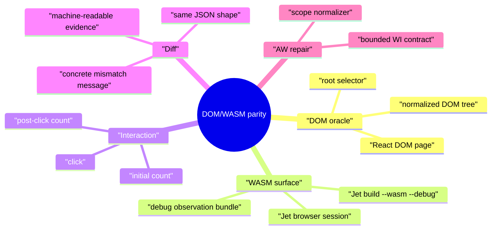
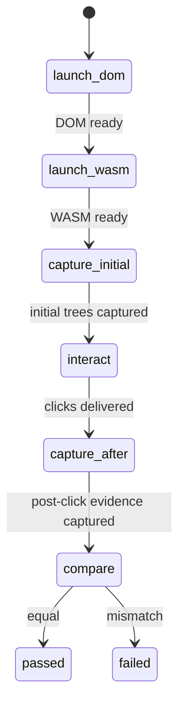
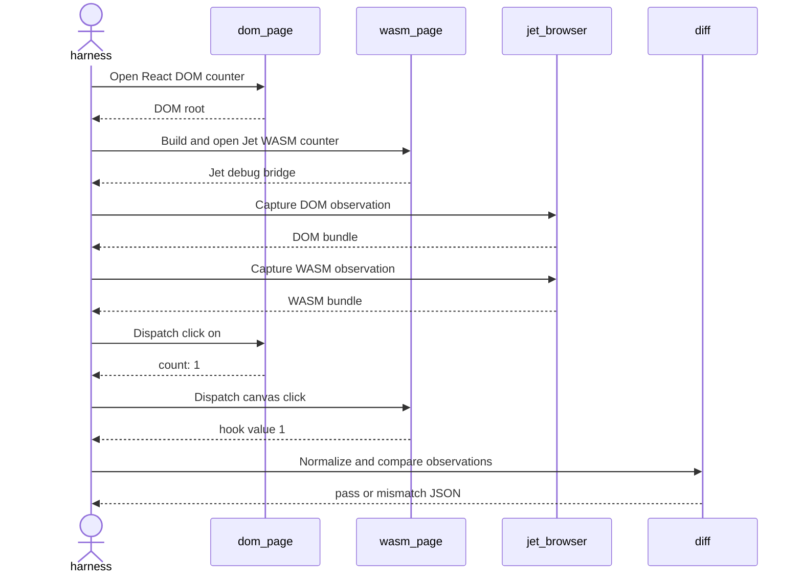
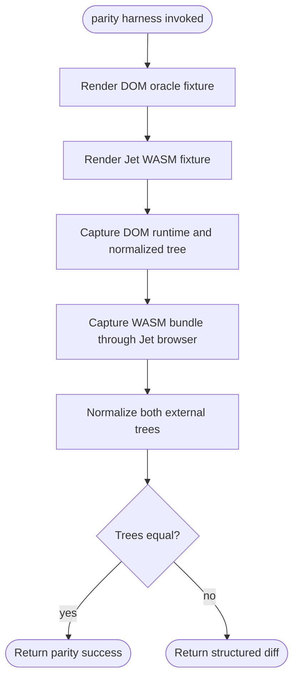
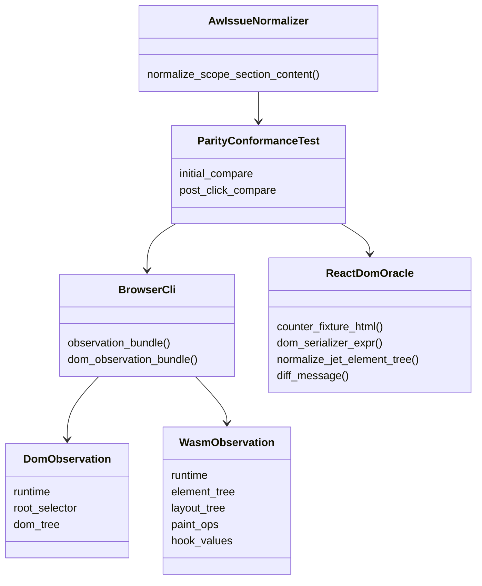
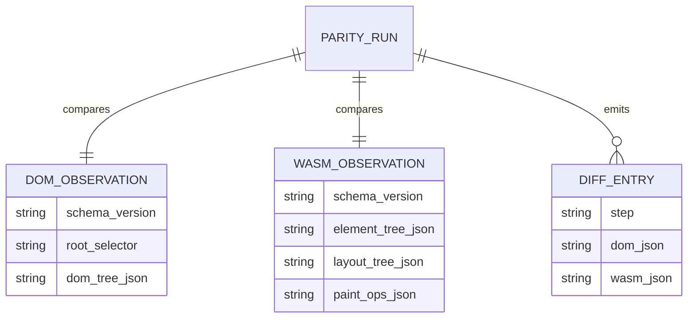
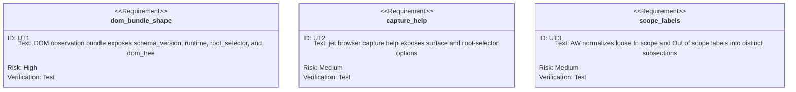

# Live DOM/WASM Browser Parity

## Scenarios
<!-- type: scenarios lang: yaml -->

```yaml
scenarios:
  - id: capture_live_dom_observation
    given: "A React DOM oracle page has rendered the counter fixture in Chromium."
    when: "Jet browser captures a DOM observation for the root selector."
    then: "The bundle records runtime metadata and a normalized DOM tree without requiring `window.__jet_debug`."
  - id: capture_live_wasm_observation
    given: "The same counter fixture is built by `jet build --wasm --debug` and served by Jet's WASM dev server."
    when: "Jet browser captures the WASM observation bundle after a click."
    then: "The bundle records debug element/layout/fiber/paint evidence and the updated hook value."
  - id: diff_same_fixture_after_interaction
    given: "The DOM oracle button and the WASM canvas button both start at `count: 0`."
    when: "The harness clicks both surfaces and captures observations."
    then: "The normalized external tree comparison passes or fails with a concrete DOM-vs-WASM JSON diff."
  - id: reject_manual_only_parity
    given: "An operator wants to claim frontend parity by looking at screenshots or manual browser state."
    when: "No observation bundle or diff output exists."
    then: "The workflow remains incomplete because parity evidence must be machine-readable."
  - id: preserve_wi_scope_boundaries
    given: "An AW work-item body uses loose `In scope:` and `Out of scope:` labels."
    when: "AW normalizes the body for GitHub publication."
    then: "Out-of-scope bullets stay under `### Out of Scope` instead of being merged into `### In Scope`."
```
## Mindmap
<!-- type: mindmap lang: mermaid -->


## State Machine
<!-- type: state-machine lang: mermaid -->


## Interaction
<!-- type: interaction lang: mermaid -->


## Logic
<!-- type: logic lang: mermaid -->


## Dependency
<!-- type: dependency lang: mermaid -->


## DB Model
<!-- type: db-model lang: mermaid -->


## Schema
<!-- type: schema lang: yaml -->

```yaml
$schema: "https://json-schema.org/draft/2020-12/schema"
title: "JetBrowserDomObservationBundle"
type: object
required: [schema_version, runtime, root_selector, dom_tree]
properties:
  schema_version:
    type: string
    const: "jet.browser.dom_observation.v1"
  runtime:
    type: object
    required: [url, title, viewport]
    properties:
      url: { type: string }
      title: { type: string }
      viewport:
        type: object
        required: [width, height, device_pixel_ratio]
        properties:
          width: { type: number }
          height: { type: number }
          device_pixel_ratio: { type: number }
  root_selector:
    type: string
  dom_tree: {}
```
## REST API
<!-- type: rest-api lang: yaml -->

```yaml
openapi: "3.1.0"
info:
  title: "Live DOM/WASM browser parity"
  version: "0.0.0"
paths: {}
x-contract:
  public_http_api: false
  rationale: "Parity is verified by local browser automation and test harness code, not a network API."
```
## RPC API
<!-- type: rpc-api lang: yaml -->

```yaml
openrpc: "1.3.2"
info:
  title: "Live DOM/WASM browser parity RPC"
  version: "0.0.0"
methods: []
x-contract:
  public_rpc_api: false
  internal_calls:
    - "Runtime.evaluate DOM serializer"
    - "window.__jet_debug.elementTree"
    - "window.__jet_debug.layoutTree"
    - "window.__jet_debug.paintOps"
```
## Async API
<!-- type: async-api lang: yaml -->

```yaml
asyncapi: "2.6.0"
info:
  title: "Live DOM/WASM browser parity async API"
  version: "0.0.0"
channels: {}
x-contract:
  public_async_api: false
  rationale: "The covered fixture uses deterministic synchronous capture after explicit waits."
```
## CLI
<!-- type: cli lang: yaml -->

```yaml
command:
  name: jet
  subcommands:
    browser:
      subcommands:
        capture:
          args:
            - name: surface
              long: "--surface"
              values: ["wasm", "dom"]
              default: "wasm"
              behavior: "Select Jet WASM debug capture or generic DOM capture."
            - name: root-selector
              long: "--root-selector"
              default: "body"
              behavior: "DOM root selector used when surface=dom."
            - name: out
              long: "--out"
              value: "path"
            - name: pretty
              long: "--pretty"
            - name: hook
              long: "--hook"
              repeatable: true
```
## Wireframe
<!-- type: wireframe lang: yaml -->

```yaml
screens: []
x-contract:
  user_interface: false
  evidence_surfaces:
    - "CLI JSON for `jet browser capture --surface dom`"
    - "CLI JSON for `jet browser capture --surface wasm`"
    - "Rust integration-test diff output"
```
## Component
<!-- type: component lang: yaml -->

```yaml
schemaVersion: "1.0.0"
modules: []
x-contract:
  browser_components: false
  test_components:
    - name: "React DOM counter oracle"
      state: "count"
      action: "click"
    - name: "Jet WASM counter surface"
      state: "hook value and element tree"
      action: "canvas click"
```
## Design Token
<!-- type: design-token lang: yaml -->

```yaml
$schema: "https://design-tokens.github.io/community-group/format/"
tokens: {}
x-contract:
  visual_design_tokens: false
  rationale: "The work adds observation and parity evidence, not a styled product UI."
```
## Config
<!-- type: config lang: yaml -->

```yaml
$schema: "https://json-schema.org/draft/2020-12/schema"
title: "Jet browser capture parity options"
type: object
properties:
  surface:
    type: string
    enum: ["wasm", "dom"]
    default: "wasm"
  root_selector:
    type: string
    default: "body"
  hooks:
    type: array
    items: { type: integer }
  pretty:
    type: boolean
additionalProperties: false
```
## Manifest
<!-- type: manifest lang: yaml -->

```yaml
manifests:
  - path: "projects/jet/Cargo.toml"
    action: "unchanged"
    rationale: "Jet already depends on browser, serde_json, reqwest, and test-only React oracle dependencies."
  - path: "projects/agentic-workflow/Cargo.toml"
    action: "unchanged"
    rationale: "AW scope-normalizer coverage uses existing unit-test dependencies."
```
## Runtime Image
<!-- type: runtime-image lang: yaml -->

```yaml
images: []
x-contract:
  container_changes: false
  runtime_requirements:
    - "Chromium available through CHROME_PATH or Jet/Playwright cache"
    - "wasm-pack available for Jet WASM build"
    - "React/ReactDOM node_modules under examples/react-bench for DOM oracle"
```
## Deployment
<!-- type: deployment lang: yaml -->

```yaml
deployments: []
x-contract:
  deployment_changes: false
  release_surface:
    - "Jet browser CLI"
    - "Jet live parity integration tests"
    - "AW work-item normalization"
```
## Unit Test
<!-- type: unit-test lang: mermaid -->


## E2E Test
<!-- type: e2e-test lang: yaml -->

```yaml
e2e_tests:
  - id: counter_dom_wasm_parity_after_click
    name: "Counter DOM/WASM parity after click"
    command: "cargo test -p jet --test react_dom_oracle_conformance counter_demo_matches_react_dom_oracle_initial_and_after_click -- --nocapture"
    fixture: "examples/counter-demo/src/Counter.tsx"
    steps:
      - "Render React DOM oracle page in Chromium"
      - "Build and serve Jet WASM debug counter through Jet tooling"
      - "Capture DOM and WASM observations before interaction"
      - "Click DOM button and WASM canvas button"
      - "Capture DOM and WASM observations after interaction"
      - "Normalize and compare external trees"
    assertions:
      - "initial DOM tree equals normalized Jet WASM element tree"
      - "post-click DOM tree equals normalized Jet WASM element tree"
      - "WASM observation includes hook value 1 after click"
      - "mismatch output includes concrete DOM and WASM JSON"
```
## Changes
<!-- type: changes lang: yaml -->

```yaml
changes:
  - path: "projects/jet/src/cli.rs"
    action: "modify"
    section: "cli"
    impl_mode: "hand-written"
    rationale: "Add `jet browser capture --surface dom|wasm` and `--root-selector` dispatch."
  - path: "projects/jet/src/browser_cli/mod.rs"
    action: "modify"
    section: "logic"
    impl_mode: "hand-written"
    rationale: "Add DOM observation bundle capture alongside the existing WASM debug observation bundle."
  - path: "projects/jet/tests/react_dom_oracle_conformance.rs"
    action: "modify"
    section: "e2e-test"
    impl_mode: "hand-written"
    rationale: "Drive the same counter fixture through DOM and WASM browser sessions and compare post-interaction observations."
  - path: "projects/jet/tests/common/react_oracle.rs"
    action: "modify"
    section: "unit-test"
    impl_mode: "hand-written"
    rationale: "Expose reusable normalization/diff helpers for observation-bundle based parity assertions."
  - path: "projects/agentic-workflow/src/cli/issues.rs"
    action: "modify"
    section: "logic"
    impl_mode: "hand-written"
    rationale: "Preserve loose out-of-scope labels during AW WI body normalization."
  - path: ".aw/tech-design/projects/jet/specs/3941.md"
    action: "verify"
    section: "async-api"
    impl_mode: "hand-written"
    rationale: "Traceability repair: hand-written TD applicability section retained as the implementation edge during AW standardization."
  - path: ".aw/tech-design/projects/jet/specs/3941.md"
    action: "verify"
    section: "component"
    impl_mode: "hand-written"
    rationale: "Traceability repair: hand-written TD applicability section retained as the implementation edge during AW standardization."
  - path: ".aw/tech-design/projects/jet/specs/3941.md"
    action: "verify"
    section: "config"
    impl_mode: "hand-written"
    rationale: "Traceability repair: hand-written TD applicability section retained as the implementation edge during AW standardization."
  - path: ".aw/tech-design/projects/jet/specs/3941.md"
    action: "verify"
    section: "db-model"
    impl_mode: "hand-written"
    rationale: "Traceability repair: hand-written TD applicability section retained as the implementation edge during AW standardization."
  - path: ".aw/tech-design/projects/jet/specs/3941.md"
    action: "verify"
    section: "dependency"
    impl_mode: "hand-written"
    rationale: "Traceability repair: hand-written TD applicability section retained as the implementation edge during AW standardization."
  - path: ".aw/tech-design/projects/jet/specs/3941.md"
    action: "verify"
    section: "deployment"
    impl_mode: "hand-written"
    rationale: "Traceability repair: hand-written TD applicability section retained as the implementation edge during AW standardization."
  - path: ".aw/tech-design/projects/jet/specs/3941.md"
    action: "verify"
    section: "design-token"
    impl_mode: "hand-written"
    rationale: "Traceability repair: hand-written TD applicability section retained as the implementation edge during AW standardization."
  - path: ".aw/tech-design/projects/jet/specs/3941.md"
    action: "verify"
    section: "interaction"
    impl_mode: "hand-written"
    rationale: "Traceability repair: hand-written TD applicability section retained as the implementation edge during AW standardization."
  - path: ".aw/tech-design/projects/jet/specs/3941.md"
    action: "verify"
    section: "manifest"
    impl_mode: "hand-written"
    rationale: "Traceability repair: hand-written TD applicability section retained as the implementation edge during AW standardization."
  - path: ".aw/tech-design/projects/jet/specs/3941.md"
    action: "verify"
    section: "mindmap"
    impl_mode: "hand-written"
    rationale: "Traceability repair: hand-written TD applicability section retained as the implementation edge during AW standardization."
  - path: ".aw/tech-design/projects/jet/specs/3941.md"
    action: "verify"
    section: "rest-api"
    impl_mode: "hand-written"
    rationale: "Traceability repair: hand-written TD applicability section retained as the implementation edge during AW standardization."
  - path: ".aw/tech-design/projects/jet/specs/3941.md"
    action: "verify"
    section: "rpc-api"
    impl_mode: "hand-written"
    rationale: "Traceability repair: hand-written TD applicability section retained as the implementation edge during AW standardization."
  - path: ".aw/tech-design/projects/jet/specs/3941.md"
    action: "verify"
    section: "runtime-image"
    impl_mode: "hand-written"
    rationale: "Traceability repair: hand-written TD applicability section retained as the implementation edge during AW standardization."
  - path: ".aw/tech-design/projects/jet/specs/3941.md"
    action: "verify"
    section: "scenarios"
    impl_mode: "hand-written"
    rationale: "Traceability repair: hand-written TD applicability section retained as the implementation edge during AW standardization."
  - path: ".aw/tech-design/projects/jet/specs/3941.md"
    action: "verify"
    section: "schema"
    impl_mode: "hand-written"
    rationale: "Traceability repair: hand-written TD applicability section retained as the implementation edge during AW standardization."
  - path: ".aw/tech-design/projects/jet/specs/3941.md"
    action: "verify"
    section: "state-machine"
    impl_mode: "hand-written"
    rationale: "Traceability repair: hand-written TD applicability section retained as the implementation edge during AW standardization."
  - path: ".aw/tech-design/projects/jet/specs/3941.md"
    action: "verify"
    section: "wireframe"
    impl_mode: "hand-written"
    rationale: "Traceability repair: hand-written TD applicability section retained as the implementation edge during AW standardization."
```

# Reviews

### Review 1
**Verdict:** approved

- [scenarios] Applicability covers live DOM observation, live WASM observation, post-interaction same-fixture diffing, manual-only parity rejection, and the AW scope-normalizer defect encountered during WI setup.
- [logic] The capture and comparison flow is implementable: render both browser surfaces, capture DOM/WASM bundles, normalize external trees, and return success or structured diff.
- [cli] The `jet browser capture --surface dom|wasm` extension is bounded and reuses the existing browser session/capture surface.
- [e2e-test] The counter fixture exercises the actual user concern: initial and post-click DOM behavior must match the WASM surface in Chromium.
- [changes] File list is scoped to Jet browser capture/parity tests plus the AW WI normalization repair discovered while driving the workflow.

# Reviews

### Review 1
**Verdict:** approved

- [logic] Contract defines a deterministic parity loop: DOM render, WASM render, observation capture, normalization, and structured diff.
- [schema] DOM bundle schema is small and stable enough to pair with the existing WASM observation bundle.
- [cli] The `surface` and `root-selector` options make DOM observation available through Jet browser without weakening the existing WASM debug bridge contract.
- [unit-test] Unit coverage targets the new bundle shape, CLI discoverability, and the AW scope-normalization regression observed during WI creation.
- [e2e-test] Live Chromium test proves initial and post-click external behavior rather than relying on architecture claims.
- [changes] Implementation surface is bounded to Jet browser/parity test helpers plus the directly encountered AW lifecycle bug.
