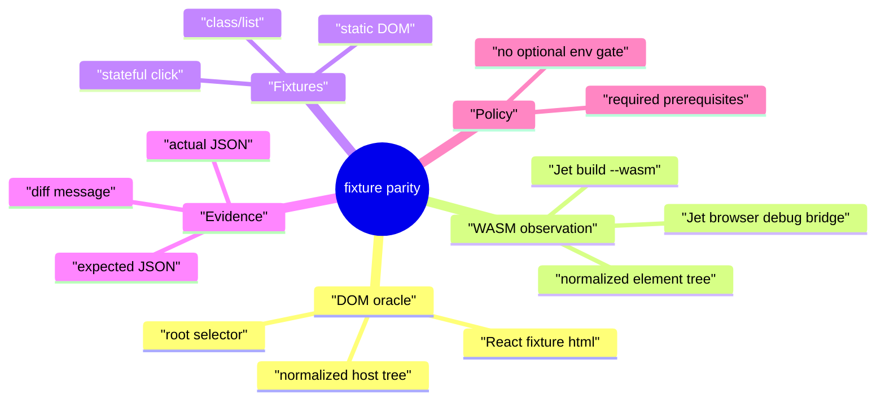
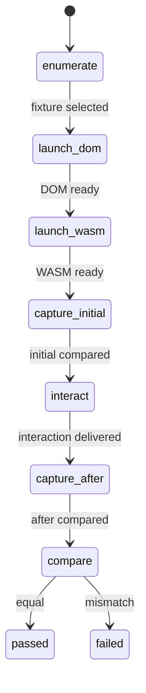
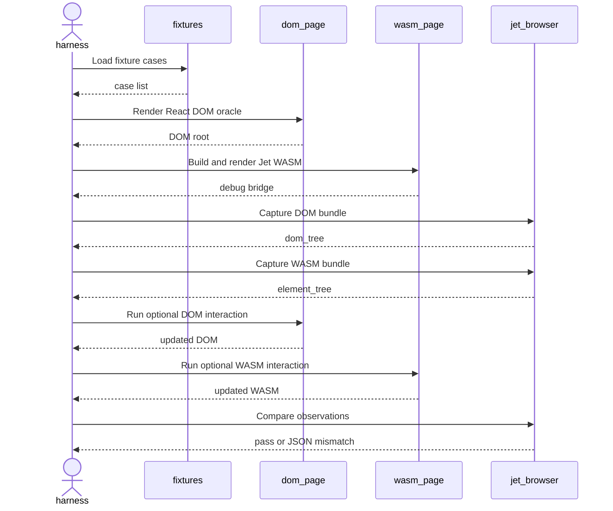
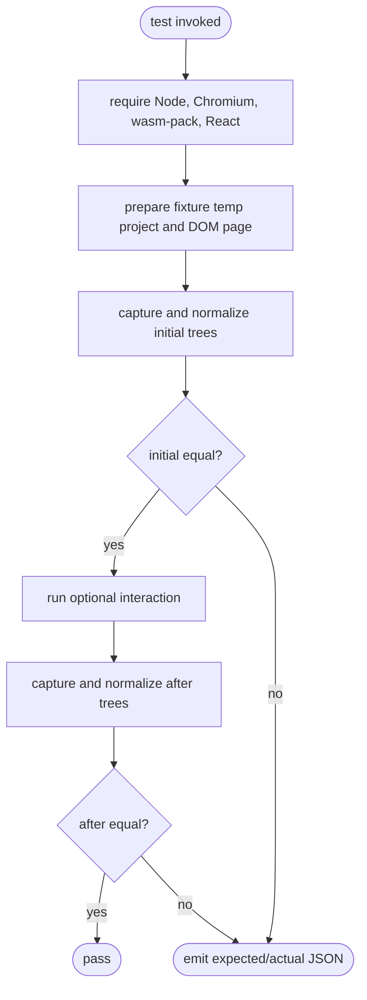
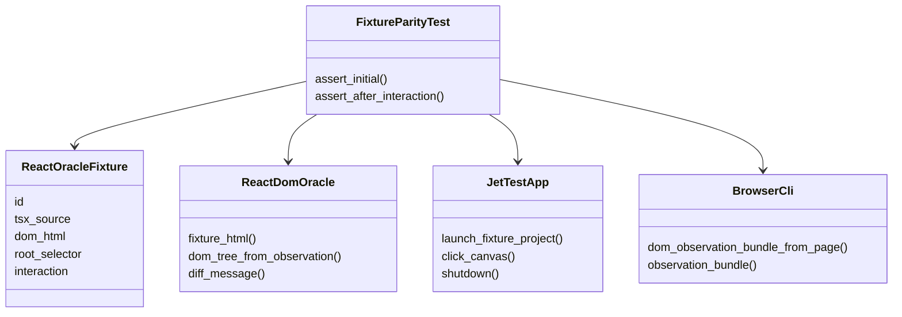
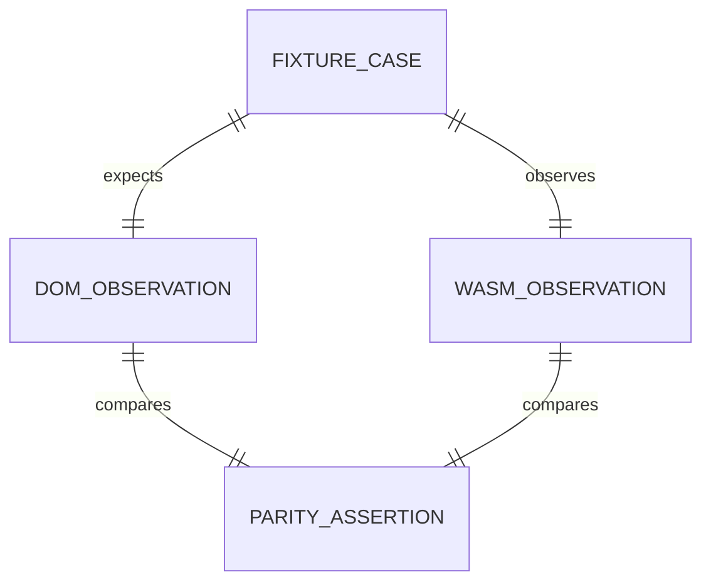
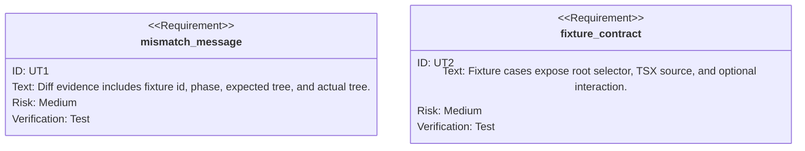

# Live DOM/WASM Fixture Parity

## Scenarios
<!-- type: scenarios lang: yaml -->

```yaml
scenarios:
  - id: compare_static_fixture
    given: "A React DOM oracle page and a Jet WASM app render the same static fixture."
    when: "The live browser harness captures normalized DOM and WASM observations."
    then: "The external host tree comparison succeeds or emits expected/actual JSON."
  - id: compare_class_list_fixture
    given: "A fixture renders nested elements with id, className, and repeated text children."
    when: "The DOM oracle and WASM debug tree are normalized."
    then: "The comparison preserves id/class/text structure without relying on internal fiber details."
  - id: compare_stateful_click_fixture
    given: "A fixture starts with a clickable count visible on DOM and WASM surfaces."
    when: "The harness clicks the DOM element and the corresponding WASM canvas point."
    then: "The post-click observations show the same external count and the WASM hook evidence records the state update."
  - id: require_live_e2e_prerequisites
    given: "Node, Chromium, wasm-pack, or local React dependencies are missing."
    when: "The fixture parity test starts."
    then: "The test fails with an explicit prerequisite error instead of skipping."
  - id: reject_optional_env_gate
    given: "A maintainer inspects Jet/AW metadata after the change."
    when: "They search for the legacy optional WASM E2E env gate."
    then: "No test, spec, issue, or health gate path references that optional gate."
```
## Mindmap
<!-- type: mindmap lang: mermaid -->


## State Machine
<!-- type: state-machine lang: mermaid -->


## Interaction
<!-- type: interaction lang: mermaid -->


## Logic
<!-- type: logic lang: mermaid -->


## Dependency
<!-- type: dependency lang: mermaid -->


## DB Model
<!-- type: db-model lang: mermaid -->


## Schema
<!-- type: schema lang: yaml -->

```yaml
schemas:
  FixtureCase:
    type: object
    required: [id, root_selector, tsx_source]
    properties:
      id: { type: string }
      root_selector: { type: string }
      tsx_source: { type: string }
      root_props: { type: array }
      interaction:
        type: object
        required: [dom_script, wasm_click]
        properties:
          dom_script: { type: string }
          wasm_click:
            type: object
            required: [x, y]
            properties:
              x: { type: number }
              y: { type: number }
  ObservationMismatch:
    type: object
    required: [fixture_id, phase, expected, actual]
    properties:
      fixture_id: { type: string }
      phase: { enum: [initial, after] }
      expected: { type: object }
      actual: { type: object }
```
## REST API
<!-- type: rest-api lang: yaml -->

```yaml
not_applicable:
  reason: "No REST API is added or changed by this test contract."
```
## RPC API
<!-- type: rpc-api lang: yaml -->

```yaml
not_applicable:
  reason: "No JSON-RPC API is added or changed by this test contract."
```
## Async API
<!-- type: async-api lang: yaml -->

```yaml
not_applicable:
  reason: "No pub-sub or WebSocket API is added or changed by this test contract."
```
## CLI
<!-- type: cli lang: yaml -->

```yaml
commands:
  - name: cargo test -p jet --test react_dom_oracle_conformance multi_fixture_dom_wasm_parity
    purpose: "Run the targeted live DOM/WASM fixture parity proof."
  - name: repository search for the legacy optional WASM E2E env gate
    purpose: "Prove the optional E2E env gate was not reintroduced."
```
## Wireframe
<!-- type: wireframe lang: yaml -->

```yaml
not_applicable:
  reason: "No user-facing UI layout is added; the browser surface is test evidence only."
```
## Component
<!-- type: component lang: yaml -->

```yaml
components:
  - name: FixtureParityHarness
    kind: test-helper
    inputs: [FixtureCase]
    outputs: [ObservationMismatch]
    responsibility: "Render matching DOM/WASM surfaces and compare normalized host trees."
```
## Design Token
<!-- type: design-token lang: yaml -->

```yaml
not_applicable:
  reason: "No visual design tokens are added or changed."
```
## Config
<!-- type: config lang: yaml -->

```yaml
config:
  required_env:
    - CHROME_PATH
  forbidden_env:
    - legacy optional WASM E2E gate
  behavior:
    missing_prerequisite: fail
```
## Manifest
<!-- type: manifest lang: yaml -->

```yaml
manifests:
  - path: projects/jet/Cargo.toml
    action: unchanged
    reason: "The test uses existing Jet test dependencies."
```
## Runtime Image
<!-- type: runtime-image lang: yaml -->

```yaml
not_applicable:
  reason: "No container or runtime image is added."
```
## Deployment
<!-- type: deployment lang: yaml -->

```yaml
not_applicable:
  reason: "No deployment manifest is added or changed."
```
## Unit Test
<!-- type: unit-test lang: mermaid -->


## E2E Test
<!-- type: e2e-test lang: yaml -->

```yaml
e2e_tests:
  - id: multi_fixture_dom_wasm_parity
    name: multi fixture DOM/WASM parity
    command: "cargo test -p jet --test react_dom_oracle_conformance multi_fixture_dom_wasm_parity -- --nocapture"
    prerequisites:
      missing_behavior: "fail"
      requires: [node, chromium, wasm-pack, react-dom-node-modules]
    assertions:
      - "static fixture initial DOM/WASM host trees match"
      - "class/list fixture initial DOM/WASM host trees match"
      - "stateful fixture initial and after-click DOM/WASM host trees match"
      - "stateful WASM bundle includes the updated hook value"
```
## Changes
<!-- type: changes lang: yaml -->

```yaml
changes:
  - path: projects/jet/tests/common/react_oracle.rs
    action: update
    section: unit-test
    impl_mode: hand-written
    reason: "Add reusable fixture HTML and mismatch evidence helpers."
  - path: projects/jet/tests/common/mod.rs
    action: update
    section: logic
    impl_mode: hand-written
    reason: "Allow live tests to launch temporary fixture projects through Jet WASM."
  - path: projects/jet/tests/react_dom_oracle_conformance.rs
    action: update
    section: e2e-test
    impl_mode: hand-written
    reason: "Add multi-fixture DOM/WASM parity coverage."
  - path: .aw/tech-design/projects/jet/specs/3943.md
    action: add
    section: scenarios
    impl_mode: hand-written
    reason: "Record the TD contract for WI 3943."
  - path: .aw/tech-design/projects/jet/specs/3943.md
    action: add
    section: mindmap
    impl_mode: hand-written
    reason: "Record the TD contract for WI 3943."
  - path: .aw/tech-design/projects/jet/specs/3943.md
    action: add
    section: state-machine
    impl_mode: hand-written
    reason: "Record the TD contract for WI 3943."
  - path: .aw/tech-design/projects/jet/specs/3943.md
    action: add
    section: interaction
    impl_mode: hand-written
    reason: "Record the TD contract for WI 3943."
  - path: .aw/tech-design/projects/jet/specs/3943.md
    action: add
    section: dependency
    impl_mode: hand-written
    reason: "Record the TD contract for WI 3943."
  - path: .aw/tech-design/projects/jet/specs/3943.md
    action: add
    section: db-model
    impl_mode: hand-written
    reason: "Record the TD contract for WI 3943."
  - path: .aw/tech-design/projects/jet/specs/3943.md
    action: add
    section: schema
    impl_mode: hand-written
    reason: "Record the TD contract for WI 3943."
  - path: .aw/tech-design/projects/jet/specs/3943.md
    action: add
    section: rest-api
    impl_mode: hand-written
    reason: "Record the TD contract for WI 3943."
  - path: .aw/tech-design/projects/jet/specs/3943.md
    action: add
    section: rpc-api
    impl_mode: hand-written
    reason: "Record the TD contract for WI 3943."
  - path: .aw/tech-design/projects/jet/specs/3943.md
    action: add
    section: async-api
    impl_mode: hand-written
    reason: "Record the TD contract for WI 3943."
  - path: .aw/tech-design/projects/jet/specs/3943.md
    action: add
    section: cli
    impl_mode: hand-written
    reason: "Record the TD contract for WI 3943."
  - path: .aw/tech-design/projects/jet/specs/3943.md
    action: add
    section: wireframe
    impl_mode: hand-written
    reason: "Record the TD contract for WI 3943."
  - path: .aw/tech-design/projects/jet/specs/3943.md
    action: add
    section: component
    impl_mode: hand-written
    reason: "Record the TD contract for WI 3943."
  - path: .aw/tech-design/projects/jet/specs/3943.md
    action: add
    section: design-token
    impl_mode: hand-written
    reason: "Record the TD contract for WI 3943."
  - path: .aw/tech-design/projects/jet/specs/3943.md
    action: add
    section: config
    impl_mode: hand-written
    reason: "Record the TD contract for WI 3943."
  - path: .aw/tech-design/projects/jet/specs/3943.md
    action: add
    section: manifest
    impl_mode: hand-written
    reason: "Record the TD contract for WI 3943."
  - path: .aw/tech-design/projects/jet/specs/3943.md
    action: add
    section: runtime-image
    impl_mode: hand-written
    reason: "Record the TD contract for WI 3943."
  - path: .aw/tech-design/projects/jet/specs/3943.md
    action: add
    section: deployment
    impl_mode: hand-written
    reason: "Record the TD contract for WI 3943."
```

# Reviews

### Review 1
**Verdict:** approved

- [schema] The fixture and mismatch schemas are sufficient for implementation and structured failure output.
- [e2e-test] The live browser contract is concrete and covers static, class/list, and stateful click behavior with required prerequisites.
- [changes] The implementation scope is bounded to the helper and conformance test files plus the TD.
