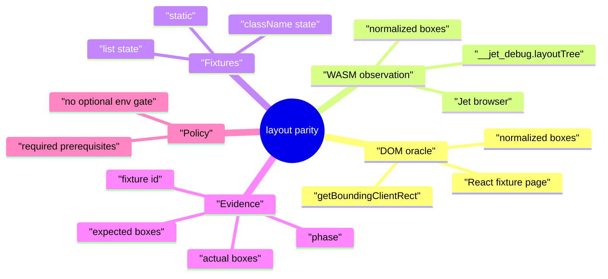
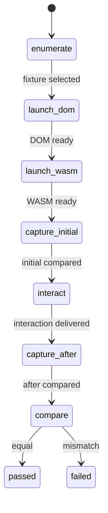
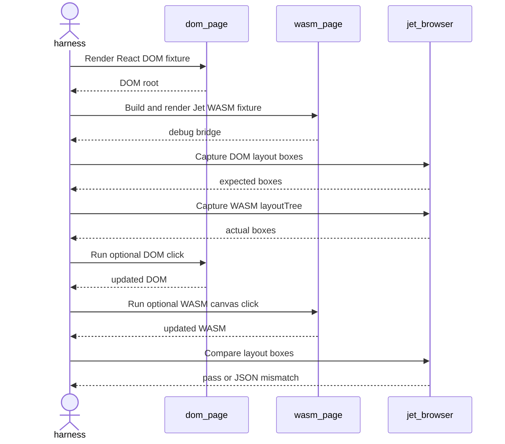
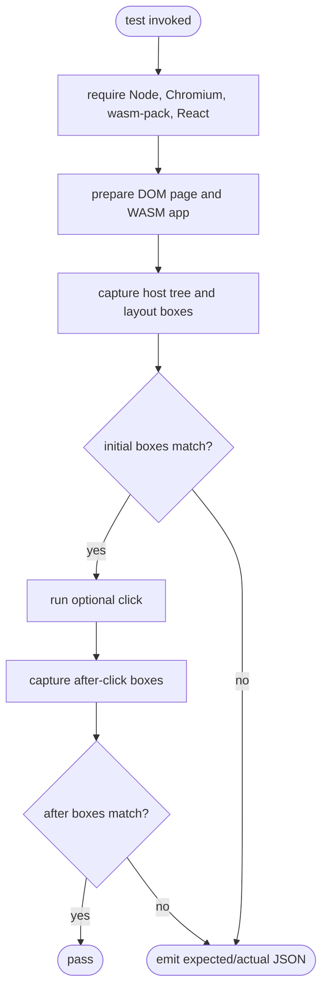
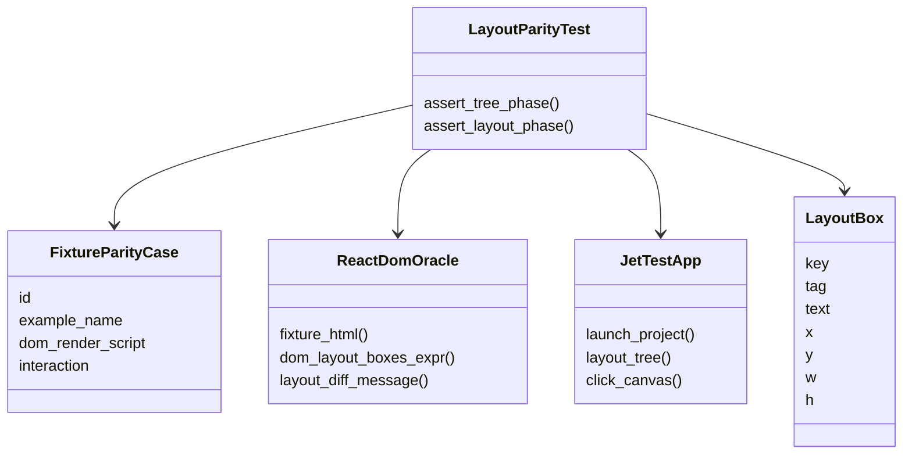
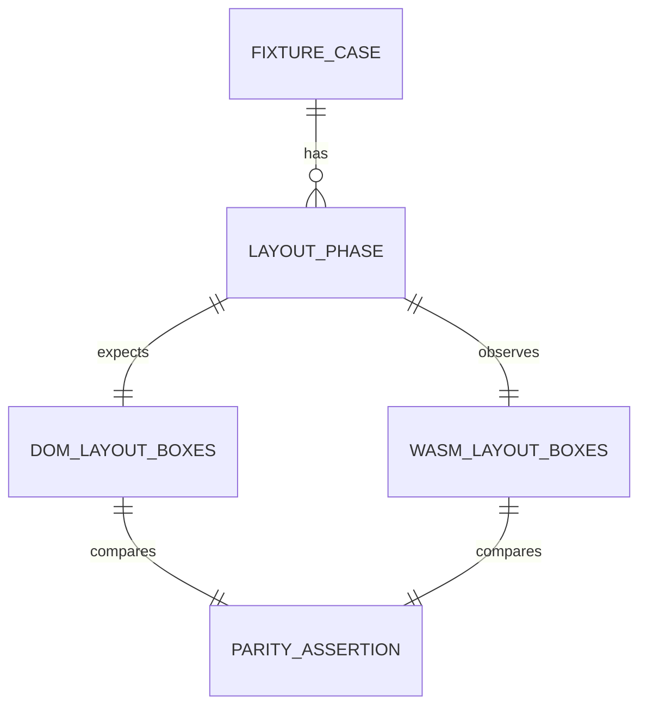
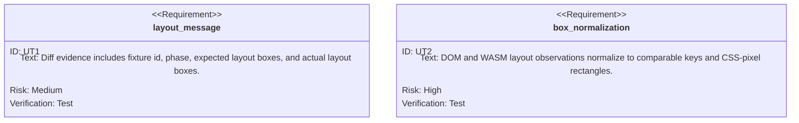

# Live DOM/WASM Layout Parity

## Scenarios
<!-- type: scenarios lang: yaml -->

```yaml
scenarios:
  - id: compare_static_layout
    given: "A React DOM oracle page and a Jet WASM app render the same static fixture."
    when: "The harness captures DOM getBoundingClientRect data and Jet WASM debug layoutTree data."
    then: "The normalized layout-box sequences match within the configured CSS-pixel tolerance."
  - id: compare_stateful_layout_after_click
    given: "A stateful fixture mutates visible children after a click."
    when: "The harness clicks the DOM element and the matching WASM canvas point."
    then: "Both initial and post-click layout-box sequences match."
  - id: emit_structured_layout_mismatch
    given: "A DOM/WASM layout difference is detected."
    when: "The parity assertion fails."
    then: "The failure message includes fixture id, phase, expected boxes, and actual boxes as JSON."
  - id: require_live_e2e_prerequisites
    given: "Node, Chromium, wasm-pack, or local React dependencies are missing."
    when: "The layout parity test starts."
    then: "The test fails with an explicit prerequisite error instead of skipping."
  - id: reject_optional_env_gate
    given: "A maintainer searches Jet and AW metadata after the change."
    when: "They search for the legacy optional WASM E2E env gate."
    then: "No test, spec, issue, or health gate path references that optional gate."
```
## Mindmap
<!-- type: mindmap lang: mermaid -->


## State Machine
<!-- type: state-machine lang: mermaid -->


## Interaction
<!-- type: interaction lang: mermaid -->


## Logic
<!-- type: logic lang: mermaid -->


## Dependency
<!-- type: dependency lang: mermaid -->


## DB Model
<!-- type: db-model lang: mermaid -->


## Schema
<!-- type: schema lang: yaml -->

```yaml
schemas:
  LayoutBox:
    type: object
    required: [key, kind, x, y, w, h]
    properties:
      key: { type: string }
      kind: { enum: [element, text] }
      tag: { type: string }
      id: { type: string }
      text: { type: string }
      x: { type: number }
      y: { type: number }
      w: { type: number }
      h: { type: number }
  LayoutMismatch:
    type: object
    required: [fixture_id, phase, expected, actual]
    properties:
      fixture_id: { type: string }
      phase: { type: string }
      expected:
        type: array
        items: { $ref: "#/schemas/LayoutBox" }
      actual:
        type: array
        items: { $ref: "#/schemas/LayoutBox" }
```
## REST API
<!-- type: rest-api lang: yaml -->

```yaml
not_applicable:
  reason: "No REST API is added or changed by this test contract."
```
## RPC API
<!-- type: rpc-api lang: yaml -->

```yaml
not_applicable:
  reason: "No JSON-RPC API is added or changed by this test contract."
```
## Async API
<!-- type: async-api lang: yaml -->

```yaml
not_applicable:
  reason: "No pub-sub or WebSocket API is added or changed by this test contract."
```
## CLI
<!-- type: cli lang: yaml -->

```yaml
commands:
  - name: cargo test -p jet --test react_dom_oracle_conformance multi_fixture_dom_wasm_layout_parity
    purpose: "Run the targeted live DOM/WASM layout-box parity proof."
  - name: repository search for the legacy optional WASM E2E env gate
    purpose: "Prove the optional E2E env gate was not reintroduced."
```
## Wireframe
<!-- type: wireframe lang: yaml -->

```yaml
not_applicable:
  reason: "No user-facing UI layout is added; the browser surface is test evidence only."
```
## Component
<!-- type: component lang: yaml -->

```yaml
components:
  - name: LayoutParityHarness
    kind: test-helper
    inputs: [FixtureParityCase]
    outputs: [LayoutMismatch]
    responsibility: "Render matching DOM/WASM surfaces and compare normalized layout boxes."
```
## Design Token
<!-- type: design-token lang: yaml -->

```yaml
not_applicable:
  reason: "No visual design tokens are added or changed."
```
## Config
<!-- type: config lang: yaml -->

```yaml
config:
  required_env:
    - CHROME_PATH
  forbidden_env:
    - legacy optional WASM E2E gate
  layout_tolerance_css_px: 1.0
  behavior:
    missing_prerequisite: fail
```
## Manifest
<!-- type: manifest lang: yaml -->

```yaml
manifests:
  - path: projects/jet/Cargo.toml
    action: unchanged
    reason: "The test uses existing Jet test dependencies."
```
## Runtime Image
<!-- type: runtime-image lang: yaml -->

```yaml
not_applicable:
  reason: "No container or runtime image is added."
```
## Deployment
<!-- type: deployment lang: yaml -->

```yaml
not_applicable:
  reason: "No deployment manifest is added or changed."
```
## Unit Test
<!-- type: unit-test lang: mermaid -->


## E2E Test
<!-- type: e2e-test lang: yaml -->

```yaml
e2e_tests:
  - id: multi_fixture_dom_wasm_layout_parity
    name: multi fixture DOM/WASM layout parity
    command: "cargo test -p jet --test react_dom_oracle_conformance multi_fixture_dom_wasm_layout_parity -- --nocapture"
    prerequisites:
      missing_behavior: "fail"
      requires: [node, chromium, wasm-pack, react-dom-node-modules]
    assertions:
      - "static fixture initial DOM/WASM layout boxes match"
      - "class/state fixture initial and after-click DOM/WASM layout boxes match"
      - "list/state fixture initial and after-click DOM/WASM layout boxes match"
      - "layout mismatches include fixture id, phase, expected, and actual JSON"
```
## Changes
<!-- type: changes lang: yaml -->

```yaml
changes:
  - path: projects/jet/tests/common/react_oracle.rs
    action: update
    section: unit-test
    impl_mode: hand-written
    reason: "Add DOM layout-box capture, WASM layout normalization, and mismatch evidence helpers."
  - path: projects/jet/tests/react_dom_oracle_conformance.rs
    action: update
    section: e2e-test
    impl_mode: hand-written
    reason: "Add multi-fixture DOM/WASM layout parity coverage."
  - path: projects/jet/wasm/src/renderer/mod.rs
    action: update
    section: logic
    impl_mode: hand-written
    reason: "Make simple span/button/block layout boxes match the live DOM oracle for the parity fixtures."
  - path: .aw/tech-design/projects/jet/specs/3944.md
    action: add
    section: scenarios
    impl_mode: hand-written
    reason: "Record the TD contract for WI 3944."
  - path: .aw/tech-design/projects/jet/specs/3944.md
    action: add
    section: mindmap
    impl_mode: hand-written
    reason: "Record the TD contract for WI 3944."
  - path: .aw/tech-design/projects/jet/specs/3944.md
    action: add
    section: state-machine
    impl_mode: hand-written
    reason: "Record the TD contract for WI 3944."
  - path: .aw/tech-design/projects/jet/specs/3944.md
    action: add
    section: interaction
    impl_mode: hand-written
    reason: "Record the TD contract for WI 3944."
  - path: .aw/tech-design/projects/jet/specs/3944.md
    action: add
    section: logic
    impl_mode: hand-written
    reason: "Record the TD contract for WI 3944."
  - path: .aw/tech-design/projects/jet/specs/3944.md
    action: add
    section: dependency
    impl_mode: hand-written
    reason: "Record the TD contract for WI 3944."
  - path: .aw/tech-design/projects/jet/specs/3944.md
    action: add
    section: db-model
    impl_mode: hand-written
    reason: "Record the TD contract for WI 3944."
  - path: .aw/tech-design/projects/jet/specs/3944.md
    action: add
    section: schema
    impl_mode: hand-written
    reason: "Record the TD contract for WI 3944."
  - path: .aw/tech-design/projects/jet/specs/3944.md
    action: add
    section: rest-api
    impl_mode: hand-written
    reason: "Record the TD contract for WI 3944."
  - path: .aw/tech-design/projects/jet/specs/3944.md
    action: add
    section: rpc-api
    impl_mode: hand-written
    reason: "Record the TD contract for WI 3944."
  - path: .aw/tech-design/projects/jet/specs/3944.md
    action: add
    section: async-api
    impl_mode: hand-written
    reason: "Record the TD contract for WI 3944."
  - path: .aw/tech-design/projects/jet/specs/3944.md
    action: add
    section: cli
    impl_mode: hand-written
    reason: "Record the TD contract for WI 3944."
  - path: .aw/tech-design/projects/jet/specs/3944.md
    action: add
    section: wireframe
    impl_mode: hand-written
    reason: "Record the TD contract for WI 3944."
  - path: .aw/tech-design/projects/jet/specs/3944.md
    action: add
    section: component
    impl_mode: hand-written
    reason: "Record the TD contract for WI 3944."
  - path: .aw/tech-design/projects/jet/specs/3944.md
    action: add
    section: design-token
    impl_mode: hand-written
    reason: "Record the TD contract for WI 3944."
  - path: .aw/tech-design/projects/jet/specs/3944.md
    action: add
    section: config
    impl_mode: hand-written
    reason: "Record the TD contract for WI 3944."
  - path: .aw/tech-design/projects/jet/specs/3944.md
    action: add
    section: manifest
    impl_mode: hand-written
    reason: "Record the TD contract for WI 3944."
  - path: .aw/tech-design/projects/jet/specs/3944.md
    action: add
    section: runtime-image
    impl_mode: hand-written
    reason: "Record the TD contract for WI 3944."
  - path: .aw/tech-design/projects/jet/specs/3944.md
    action: add
    section: deployment
    impl_mode: hand-written
    reason: "Record the TD contract for WI 3944."
```

# Reviews

### Review 1
**Verdict:** approved

- [schema] The LayoutBox and LayoutMismatch shapes provide a clear machine-readable contract for implementation and failure output.
- [logic] The control flow preserves the existing fixture parity loop while adding layout-box assertions before and after stateful interactions.
- [e2e-test] The live browser command and assertions are specific enough to verify DOM/WASM external geometry without broadening into full pixel/a11y/focus parity.
- [changes] The implementation surface is narrowly scoped to the React oracle helper, conformance test, and TD artifact.
