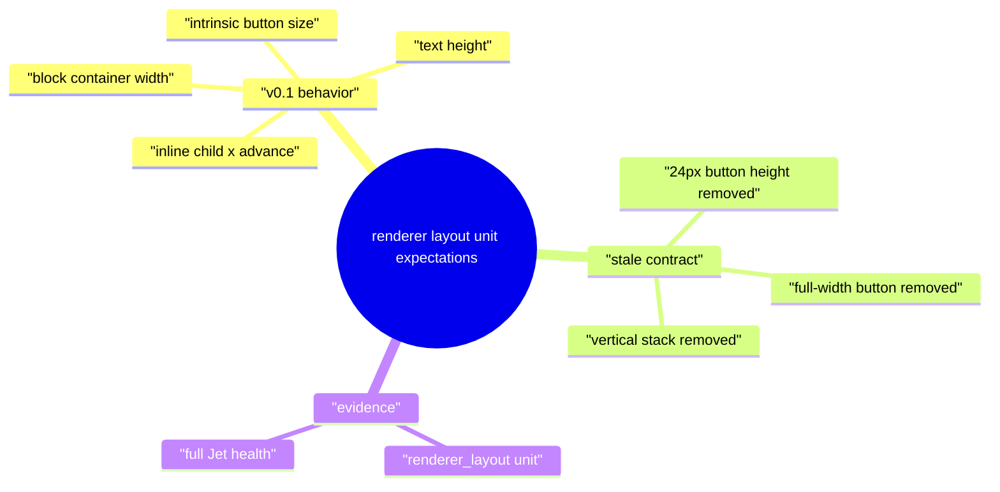
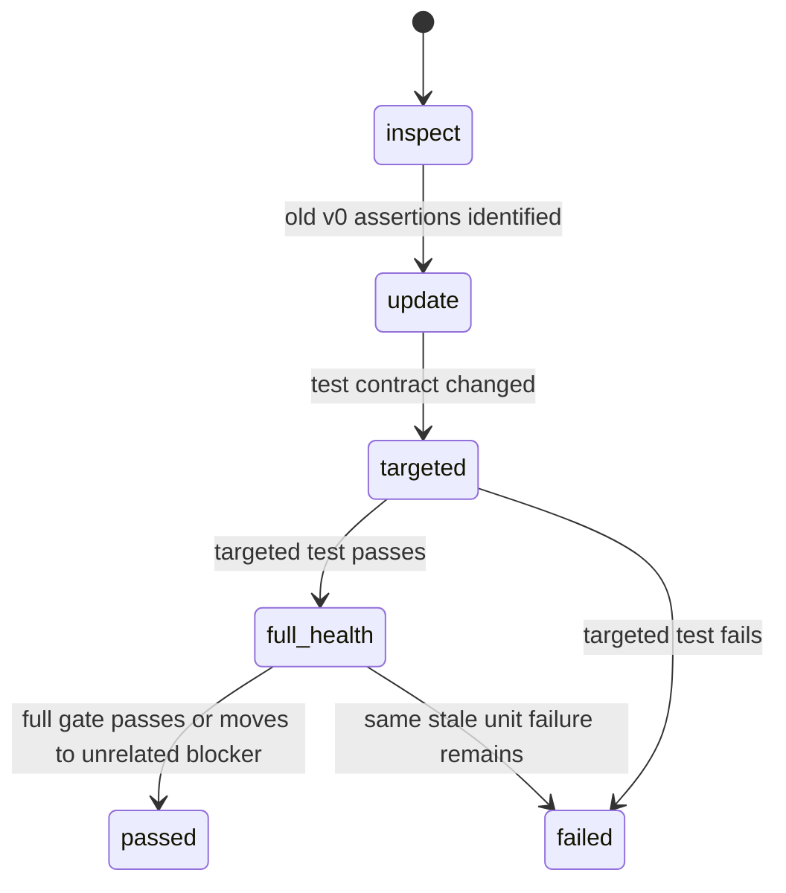
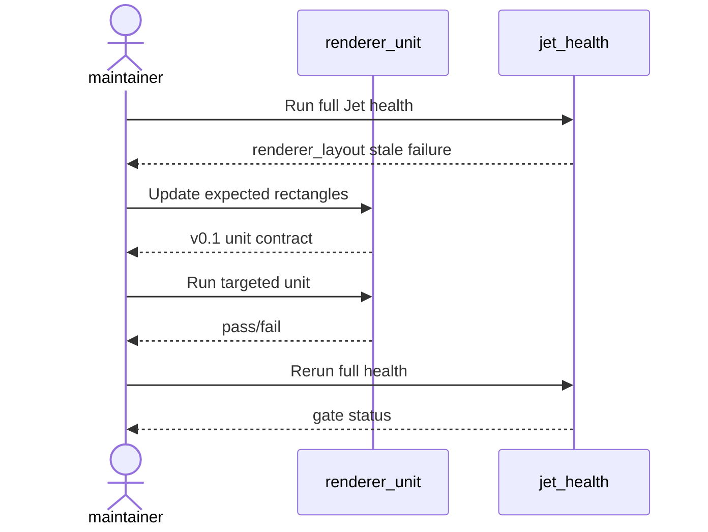
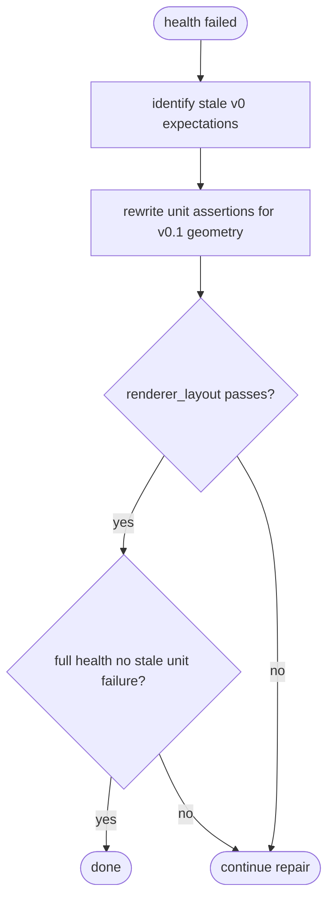
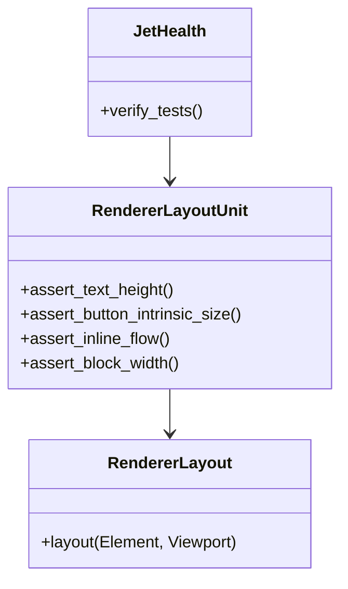
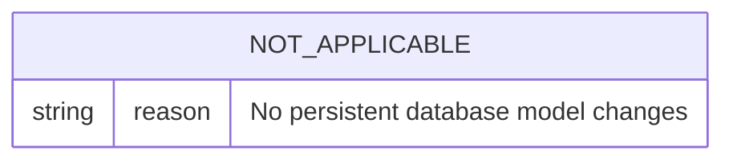

# Align Renderer Layout Unit Expectations

## Scenarios
<!-- type: scenarios lang: yaml -->

```yaml
scenarios:
  - id: block_container_keeps_viewport_width
    given: "A div host element is laid out by the v0.1 renderer."
    when: "The renderer computes its layout box."
    then: "The div width follows the containing viewport and its height follows the max inline child height."
  - id: inline_children_flow_horizontally
    given: "A div contains simple button children."
    when: "The renderer computes child boxes."
    then: "The buttons share the same y position and advance by intrinsic width along x."
  - id: intrinsic_leaf_dimensions_match_v01
    given: "Text and button host nodes are laid out."
    when: "The renderer computes their rectangles."
    then: "Text height is 18px and button height is 21px with intrinsic width."
  - id: full_health_contract
    given: "Full Jet health runs required test gates."
    when: "The stale renderer layout tests are rerun."
    then: "The gate no longer fails on v0 vertical-stack expectations."
```

## Mindmap
<!-- type: mindmap lang: mermaid -->



## State Machine
<!-- type: state-machine lang: mermaid -->



## Interaction
<!-- type: interaction lang: mermaid -->



## Logic
<!-- type: logic lang: mermaid -->



## Dependency
<!-- type: dependency lang: mermaid -->



## DB Model
<!-- type: db-model lang: mermaid -->



## Schema
<!-- type: schema lang: yaml -->

```yaml
not_applicable:
  reason: "No data schema changes."
```

## REST API
<!-- type: rest-api lang: yaml -->

```yaml
openapi: 3.1.0
info:
  title: not-applicable
  version: 0.0.0
paths: {}
```

## RPC API
<!-- type: rpc-api lang: yaml -->

```yaml
openrpc: 1.3.2
info:
  title: not-applicable
  version: 0.0.0
methods: []
```

## Async API
<!-- type: async-api lang: yaml -->

```yaml
asyncapi: 2.6.0
info:
  title: not-applicable
  version: 0.0.0
channels: {}
```

## CLI
<!-- type: cli lang: yaml -->

```yaml
commands:
  - name: cargo test -p jet-wasm --test renderer_layout -- --nocapture
    purpose: "Targeted renderer layout unit validation."
```

## Wireframe
<!-- type: wireframe lang: yaml -->

```yaml
not_applicable:
  reason: "No UI layout artifact changes."
```

## Component
<!-- type: component lang: yaml -->

```yaml
not_applicable:
  reason: "No component API changes."
```

## Design Token
<!-- type: design-token lang: yaml -->

```yaml
not_applicable:
  reason: "No design-token changes."
```

## Config
<!-- type: config lang: yaml -->

```yaml
not_applicable:
  reason: "No configuration changes."
```

## Manifest
<!-- type: manifest lang: yaml -->

```yaml
not_applicable:
  reason: "No package manifest changes."
```

## Runtime Image
<!-- type: runtime-image lang: yaml -->

```yaml
not_applicable:
  reason: "No runtime image changes."
```

## Deployment
<!-- type: deployment lang: yaml -->

```yaml
not_applicable:
  reason: "No deployment changes."
```

## Unit Test
<!-- type: unit-test lang: mermaid -->

```mermaid
---
id: align-renderer-layout-unit-expectations-unit-test
---
requirementDiagram
    requirement v01_renderer_unit_contract {
        id: UT1
        text: renderer_layout asserts v0.1 block-inline geometry
        risk: medium
        verifymethod: test
    }
    test_case renderer_layout {
        id: T1
        name: cargo test -p jet-wasm --test renderer_layout -- --nocapture
    }
    v01_renderer_unit_contract - verifies -> renderer_layout
```

## E2E Test
<!-- type: e2e-test lang: yaml -->

```yaml
e2e_tests:
  - id: full_jet_health_after_unit_repair
    capability_id: browser-trace-parity
    claim_id: parity-corpus-gates
    name: "DOM/WASM parity gate no longer fails on stale renderer layout units"
    command: "cargo test -p jet-wasm --test renderer_layout -- --nocapture"
    assertions:
      - "test gate no longer fails on projects/jet/wasm/tests/renderer_layout.rs stale v0 expectations"
      - "renderer_layout remains a required test gate with zero ignored cases"
```

## Changes
<!-- type: changes lang: yaml -->

```yaml
changes:
  - path: projects/jet/wasm/tests/renderer_layout.rs
    action: update
    section: unit-test
    impl_mode: hand-written
    reason: "Align renderer layout unit expectations with v0.1 DOM/WASM parity geometry."
  - path: .aw/tech-design/projects/jet/specs/3945.md
    action: add
    section: scenarios
    impl_mode: hand-written
    reason: "Track this health repair in AW lifecycle."
  - path: .aw/tech-design/projects/jet/specs/3945.md
    action: add
    section: mindmap
    impl_mode: hand-written
    reason: "Track this health repair in AW lifecycle."
  - path: .aw/tech-design/projects/jet/specs/3945.md
    action: add
    section: state-machine
    impl_mode: hand-written
    reason: "Track this health repair in AW lifecycle."
  - path: .aw/tech-design/projects/jet/specs/3945.md
    action: add
    section: interaction
    impl_mode: hand-written
    reason: "Track this health repair in AW lifecycle."
  - path: .aw/tech-design/projects/jet/specs/3945.md
    action: add
    section: logic
    impl_mode: hand-written
    reason: "Track this health repair in AW lifecycle."
  - path: .aw/tech-design/projects/jet/specs/3945.md
    action: add
    section: dependency
    impl_mode: hand-written
    reason: "Track this health repair in AW lifecycle."
  - path: .aw/tech-design/projects/jet/specs/3945.md
    action: add
    section: db-model
    impl_mode: hand-written
    reason: "Track this health repair in AW lifecycle."
  - path: .aw/tech-design/projects/jet/specs/3945.md
    action: add
    section: schema
    impl_mode: hand-written
    reason: "Track this health repair in AW lifecycle."
  - path: .aw/tech-design/projects/jet/specs/3945.md
    action: add
    section: rest-api
    impl_mode: hand-written
    reason: "Track this health repair in AW lifecycle."
  - path: .aw/tech-design/projects/jet/specs/3945.md
    action: add
    section: rpc-api
    impl_mode: hand-written
    reason: "Track this health repair in AW lifecycle."
  - path: .aw/tech-design/projects/jet/specs/3945.md
    action: add
    section: async-api
    impl_mode: hand-written
    reason: "Track this health repair in AW lifecycle."
  - path: .aw/tech-design/projects/jet/specs/3945.md
    action: add
    section: cli
    impl_mode: hand-written
    reason: "Track this health repair in AW lifecycle."
  - path: .aw/tech-design/projects/jet/specs/3945.md
    action: add
    section: wireframe
    impl_mode: hand-written
    reason: "Track this health repair in AW lifecycle."
  - path: .aw/tech-design/projects/jet/specs/3945.md
    action: add
    section: component
    impl_mode: hand-written
    reason: "Track this health repair in AW lifecycle."
  - path: .aw/tech-design/projects/jet/specs/3945.md
    action: add
    section: design-token
    impl_mode: hand-written
    reason: "Track this health repair in AW lifecycle."
  - path: .aw/tech-design/projects/jet/specs/3945.md
    action: add
    section: config
    impl_mode: hand-written
    reason: "Track this health repair in AW lifecycle."
  - path: .aw/tech-design/projects/jet/specs/3945.md
    action: add
    section: manifest
    impl_mode: hand-written
    reason: "Track this health repair in AW lifecycle."
  - path: .aw/tech-design/projects/jet/specs/3945.md
    action: add
    section: runtime-image
    impl_mode: hand-written
    reason: "Track this health repair in AW lifecycle."
  - path: .aw/tech-design/projects/jet/specs/3945.md
    action: add
    section: deployment
    impl_mode: hand-written
    reason: "Track this health repair in AW lifecycle."
  - path: .aw/tech-design/projects/jet/specs/3945.md
    action: add
    section: unit-test
    impl_mode: hand-written
    reason: "Track this health repair in AW lifecycle."
  - path: .aw/tech-design/projects/jet/specs/3945.md
    action: add
    section: e2e-test
    impl_mode: hand-written
    reason: "Track this health repair in AW lifecycle."
```

# Reviews

### Review 2
**Verdict:** approved

- [scenarios] The scenarios directly cover the v0.1 block/inline contract and the full-health stale-unit failure mode.
- [unit-test] The targeted renderer_layout command is specific and sufficient for the unit contract repair.
- [e2e-test] The full Jet health assertion preserves the required test-gate behavior, including skipped_count remaining zero.
- [changes] The implementation surface is narrowly scoped to the renderer layout unit and this TD artifact.
