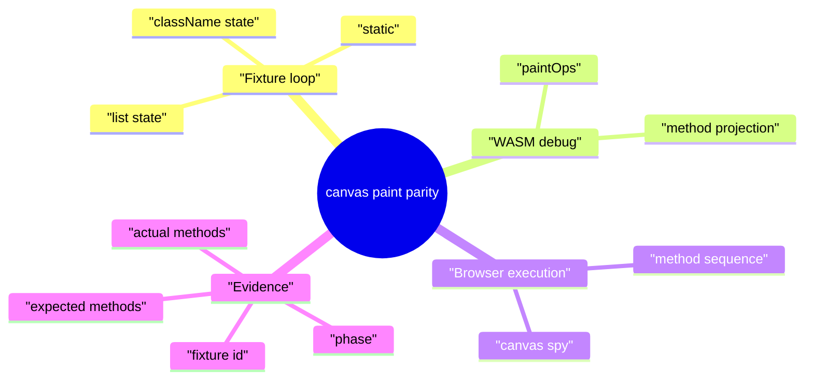
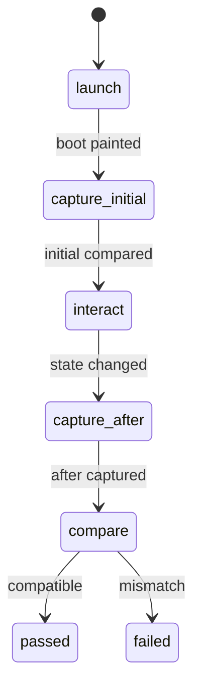
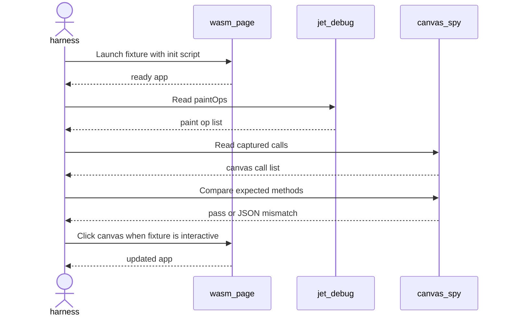
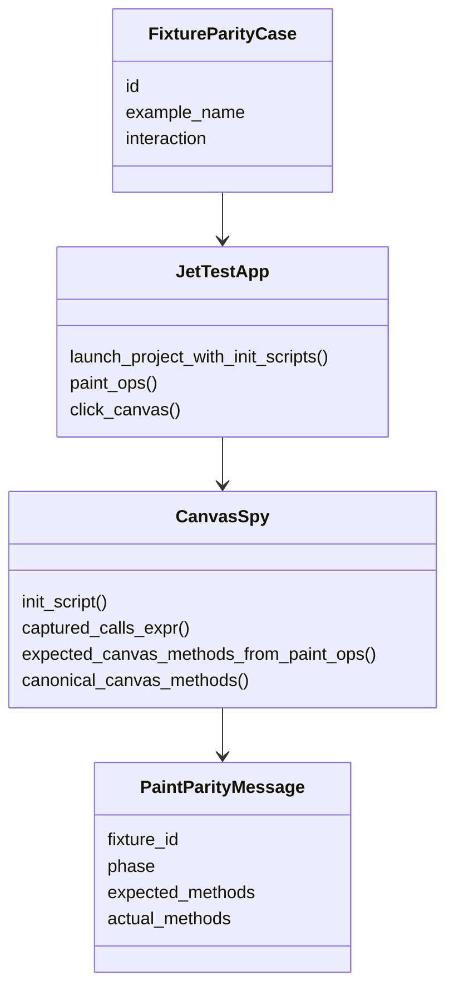
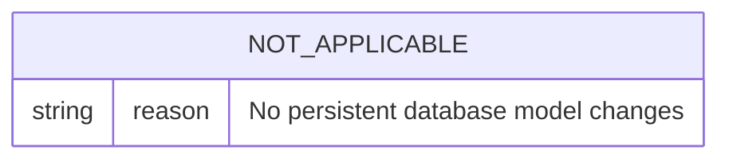
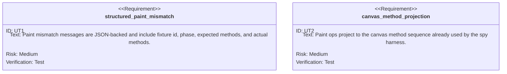

# Live WASM Canvas Paint Parity

## Scenarios
<!-- type: scenarios lang: yaml -->

```yaml
scenarios:
  - id: compare_initial_canvas_methods
    given: "A Jet WASM parity fixture is launched with the canvas spy installed before boot."
    when: "The harness reads window.__jet_debug.paintOps() and the captured canvas calls."
    then: "The expected method sequence derived from paint ops is a subsequence of the actual canvas method sequence."
  - id: compare_after_interaction_canvas_methods
    given: "A stateful fixture changes visible output after a matching DOM/WASM click."
    when: "The harness captures the next paintOps snapshot and canvas spy calls."
    then: "The after-click method sequence still matches paint intent."
  - id: emit_structured_paint_mismatch
    given: "Paint ops and browser canvas calls diverge."
    when: "The assertion fails."
    then: "The failure message includes fixture id, phase, expected methods, and actual methods as JSON."
  - id: reuse_live_e2e_prerequisites
    given: "WASM browser E2E prerequisites are missing."
    when: "The canvas paint parity test starts."
    then: "The test fails through the required live E2E prerequisite gate."
```
## Mindmap
<!-- type: mindmap lang: mermaid -->


## State Machine
<!-- type: state-machine lang: mermaid -->


## Interaction
<!-- type: interaction lang: mermaid -->


## Logic
<!-- type: logic lang: mermaid -->

```mermaid
---
id: live-wasm-canvas-paint-parity-logic
entry: start
nodes:
  start: { kind: start, label: "test invoked" }
  require: { kind: process, label: "require WASM browser E2E prerequisites" }
  launch: { kind: process, label: "launch fixture with canvas spy init script" }
  project: { kind: process, label: "project paint ops to expected canvas methods" }
  compare_initial: { kind: decision, label: "initial methods compatible?" }
  click: { kind: process, label: "run optional click and collect next paint" }
  compare_after: { kind: decision, label: "after methods compatible?" }
  pass: { kind: terminal, label: "pass" }
  fail: { kind: terminal, label: "emit structured paint mismatch" }
edges:
  - { from: start, to: require }
  - { from: require, to: launch }
  - { from: launch, to: project }
  - { from: project, to: compare_initial }
  - { from: compare_initial, to: click, label: "yes" }
  - { from: compare_initial, to: fail, label: "no" }
  - { from: click, to: compare_after }
  - { from: compare_after, to: pass, label: "yes" }
  - { from: compare_after, to: fail, label: "no" }
---
flowchart TD
    start([test invoked]) --> require[require WASM browser E2E prerequisites]
    require --> launch[launch fixture with canvas spy init script]
    launch --> project[project paint ops to expected canvas methods]
    project --> compare_initial{initial methods compatible?}
    compare_initial -->|yes| click[run optional click and collect next paint]
    compare_initial -->|no| fail([emit structured paint mismatch])
    click --> compare_after{after methods compatible?}
    compare_after -->|yes| pass([pass])
    compare_after -->|no| fail
```
## Dependency
<!-- type: dependency lang: mermaid -->


## DB Model
<!-- type: db-model lang: mermaid -->


## Schema
<!-- type: schema lang: yaml -->

```yaml
schemas:
  PaintParityMismatch:
    type: object
    required: [fixture_id, phase, expected_methods, actual_methods]
    properties:
      fixture_id:
        type: string
      phase:
        type: string
      expected_methods:
        type: array
        items: { type: string }
      actual_methods:
        type: array
        items: { type: string }
```
## REST API
<!-- type: rest-api lang: yaml -->

```yaml
openapi: 3.1.0
info:
  title: live-wasm-canvas-paint-parity-not-applicable
  version: 0.0.0
paths: {}
x-aw-not-applicable: "No REST API changes"
```
## RPC API
<!-- type: rpc-api lang: yaml -->

```yaml
openrpc: 1.3.2
info:
  title: live-wasm-canvas-paint-parity-not-applicable
  version: 0.0.0
methods: []
x-aw-not-applicable: "No RPC API changes"
```
## Async API
<!-- type: async-api lang: yaml -->

```yaml
asyncapi: 2.6.0
info:
  title: live-wasm-canvas-paint-parity-not-applicable
  version: 0.0.0
channels: {}
x-aw-not-applicable: "No async API changes"
```
## CLI
<!-- type: cli lang: yaml -->

```yaml
commands: []
x-aw-not-applicable: "No CLI surface changes"
```
## Wireframe
<!-- type: wireframe lang: yaml -->

```yaml
layout: null
x-aw-not-applicable: "No user-facing UI layout changes"
```
## Component
<!-- type: component lang: yaml -->

```yaml
modules: []
x-aw-not-applicable: "No component contract changes"
```
## Design Token
<!-- type: design-token lang: yaml -->

```yaml
tokens: {}
x-aw-not-applicable: "No design token changes"
```
## Config
<!-- type: config lang: yaml -->

```yaml
schema:
  type: object
  properties: {}
x-aw-not-applicable: "No configuration changes"
```
## Manifest
<!-- type: manifest lang: yaml -->

```yaml
packages:
  - path: projects/jet/Cargo.toml
    changes: []
x-aw-not-applicable: "No dependency or package manifest changes"
```
## Runtime Image
<!-- type: runtime-image lang: yaml -->

```yaml
images: []
x-aw-not-applicable: "No runtime image changes"
```
## Deployment
<!-- type: deployment lang: yaml -->

```yaml
resources: []
x-aw-not-applicable: "No deployment changes"
```
## Unit Test
<!-- type: unit-test lang: mermaid -->


## E2E Test
<!-- type: e2e-test lang: yaml -->

```yaml
e2e_tests:
  - id: multi_fixture_dom_wasm_canvas_paint_parity
    name: "Multi-fixture DOM/WASM canvas paint parity"
    command: "cargo test -p jet --test react_dom_oracle_conformance multi_fixture_dom_wasm_canvas_paint_parity -- --nocapture"
    fixtures:
      - static-no-state
      - class-name-state
      - list-render-state
    assertions:
      - "initial paintOps-derived method sequence is observed in browser canvas calls"
      - "after-click paintOps-derived method sequence is observed in browser canvas calls for interactive fixtures"
      - "mismatch output is machine-readable JSON"
```
## Changes
<!-- type: changes lang: yaml -->

```yaml
changes:
  - path: projects/jet/tests/react_dom_oracle_conformance.rs
    action: modify
    section: e2e-test
    impl_mode: hand-written
    refs:
      - ".aw/tech-design/projects/jet/specs/3958.md#e2e-test"
      - ".aw/tech-design/projects/jet/specs/3958.md#changes"
    summary: "Add a live multi-fixture WASM canvas paint parity test."
  - path: projects/jet/tests/common/react_oracle.rs
    action: modify
    section: unit-test
    impl_mode: hand-written
    refs:
      - ".aw/tech-design/projects/jet/specs/3958.md#unit-test"
      - ".aw/tech-design/projects/jet/specs/3958.md#changes"
    summary: "Add structured paint parity mismatch formatting."
  - path: .aw/tech-design/projects/jet/specs/3958.md
    action: add
    section: scenarios
    impl_mode: hand-written
    summary: "Record the TD scenarios for WI 3958."
  - path: .aw/tech-design/projects/jet/specs/3958.md
    action: add
    section: mindmap
    impl_mode: hand-written
    summary: "Record the TD mindmap for WI 3958."
  - path: .aw/tech-design/projects/jet/specs/3958.md
    action: add
    section: state-machine
    impl_mode: hand-written
    summary: "Record the TD state machine for WI 3958."
  - path: .aw/tech-design/projects/jet/specs/3958.md
    action: add
    section: interaction
    impl_mode: hand-written
    summary: "Record the TD interaction for WI 3958."
  - path: .aw/tech-design/projects/jet/specs/3958.md
    action: add
    section: logic
    impl_mode: hand-written
    summary: "Record the TD logic for WI 3958."
  - path: .aw/tech-design/projects/jet/specs/3958.md
    action: add
    section: dependency
    impl_mode: hand-written
    summary: "Record the TD dependency model for WI 3958."
  - path: .aw/tech-design/projects/jet/specs/3958.md
    action: add
    section: db-model
    impl_mode: hand-written
    summary: "Record the not-applicable DB model for WI 3958."
  - path: .aw/tech-design/projects/jet/specs/3958.md
    action: add
    section: schema
    impl_mode: hand-written
    summary: "Record the mismatch payload schema for WI 3958."
  - path: .aw/tech-design/projects/jet/specs/3958.md
    action: add
    section: rest-api
    impl_mode: hand-written
    summary: "Record the not-applicable REST API section for WI 3958."
  - path: .aw/tech-design/projects/jet/specs/3958.md
    action: add
    section: rpc-api
    impl_mode: hand-written
    summary: "Record the not-applicable RPC API section for WI 3958."
  - path: .aw/tech-design/projects/jet/specs/3958.md
    action: add
    section: async-api
    impl_mode: hand-written
    summary: "Record the not-applicable async API section for WI 3958."
  - path: .aw/tech-design/projects/jet/specs/3958.md
    action: add
    section: cli
    impl_mode: hand-written
    summary: "Record the not-applicable CLI section for WI 3958."
  - path: .aw/tech-design/projects/jet/specs/3958.md
    action: add
    section: wireframe
    impl_mode: hand-written
    summary: "Record the not-applicable wireframe section for WI 3958."
  - path: .aw/tech-design/projects/jet/specs/3958.md
    action: add
    section: component
    impl_mode: hand-written
    summary: "Record the not-applicable component section for WI 3958."
  - path: .aw/tech-design/projects/jet/specs/3958.md
    action: add
    section: design-token
    impl_mode: hand-written
    summary: "Record the not-applicable design-token section for WI 3958."
  - path: .aw/tech-design/projects/jet/specs/3958.md
    action: add
    section: config
    impl_mode: hand-written
    summary: "Record the not-applicable config section for WI 3958."
  - path: .aw/tech-design/projects/jet/specs/3958.md
    action: add
    section: manifest
    impl_mode: hand-written
    summary: "Record the not-applicable manifest section for WI 3958."
  - path: .aw/tech-design/projects/jet/specs/3958.md
    action: add
    section: runtime-image
    impl_mode: hand-written
    summary: "Record the not-applicable runtime image section for WI 3958."
  - path: .aw/tech-design/projects/jet/specs/3958.md
    action: add
    section: deployment
    impl_mode: hand-written
    summary: "Record the not-applicable deployment section for WI 3958."
  - path: .aw/tech-design/projects/jet/specs/3958.md
    action: add
    section: changes
    impl_mode: hand-written
    summary: "Record the TD changes list for WI 3958."
```

# Reviews

### Review 1
**Verdict:** approved

- [logic] The contract defines a concrete capture/compare/fail path for the canvas paint observation gap.
- [unit-test] Structured mismatch and method projection coverage are explicit.
- [e2e-test] The targeted live browser command and fixture set match the WI acceptance criteria.
- [changes] The implementation surface is bounded to the existing conformance harness and helper.
