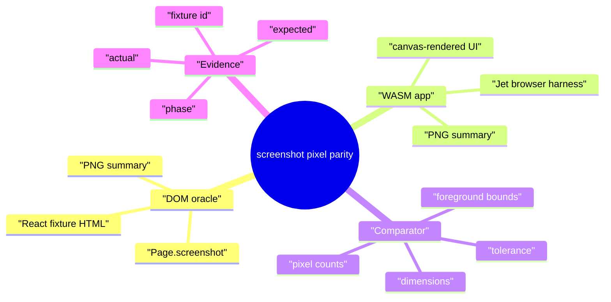
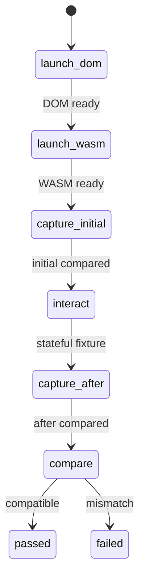
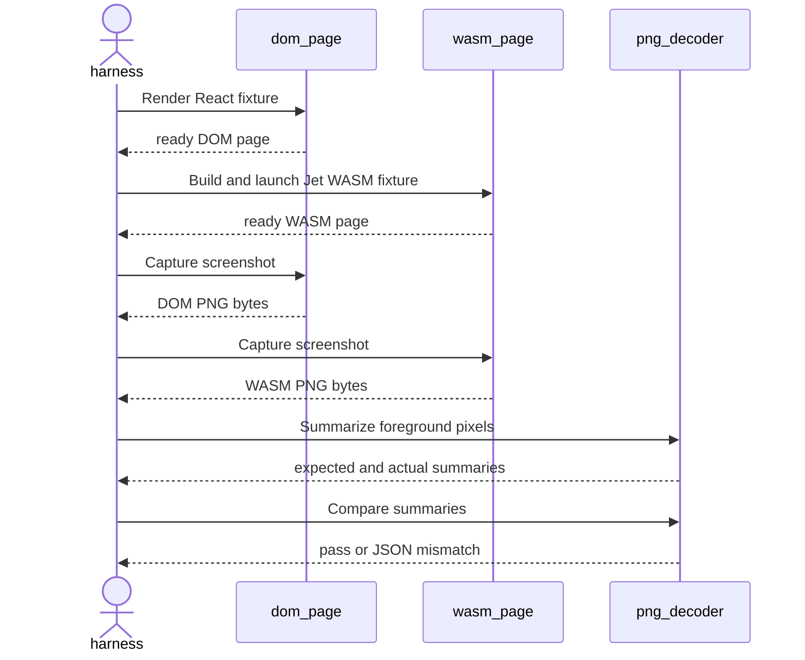
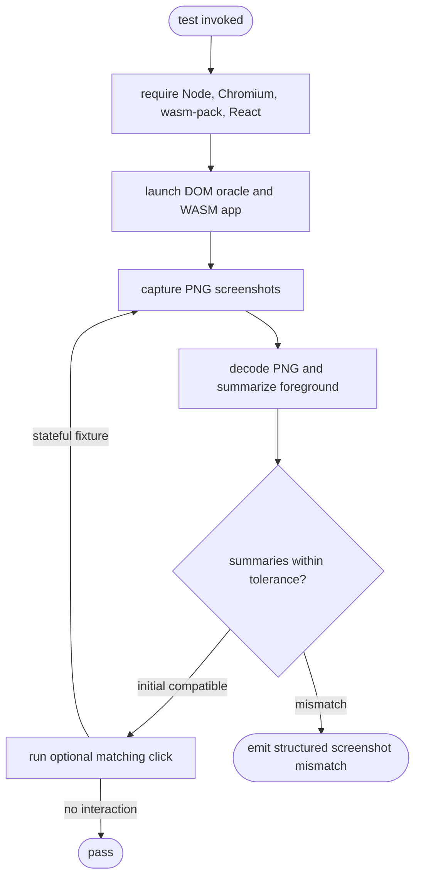
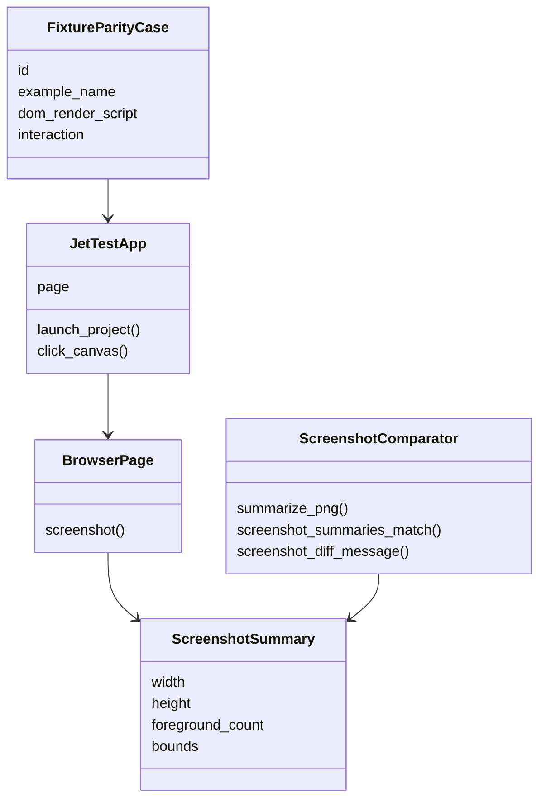
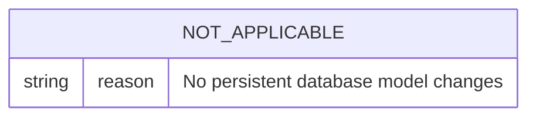
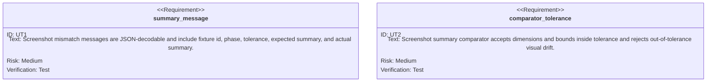

# Live DOM/WASM Screenshot Pixel Parity

## Scenarios
<!-- type: scenarios lang: yaml -->

```yaml
scenarios:
  - id: compare_initial_screenshot_summary
    given: "A React DOM oracle page and a Jet WASM app render the same fixture in Chromium."
    when: "The harness captures screenshot bytes from both pages."
    then: "Decoded PNG dimensions and foreground bounds match within declared tolerances."
  - id: compare_after_interaction_screenshot_summary
    given: "A stateful fixture mutates visible text after matching DOM and WASM clicks."
    when: "The harness captures the after-click screenshots."
    then: "The post-interaction pixel summaries still match within tolerances."
  - id: emit_structured_pixel_mismatch
    given: "A screenshot summary difference exceeds tolerance."
    when: "The parity assertion fails."
    then: "The failure message includes fixture id, phase, expected DOM summary, actual WASM summary, and tolerance."
  - id: require_live_e2e_prerequisites
    given: "WASM browser E2E prerequisites are missing."
    when: "The screenshot parity test starts."
    then: "The test fails through the required live E2E prerequisite gate."
```
## Mindmap
<!-- type: mindmap lang: mermaid -->


## State Machine
<!-- type: state-machine lang: mermaid -->


## Interaction
<!-- type: interaction lang: mermaid -->


## Logic
<!-- type: logic lang: mermaid -->


## Dependency
<!-- type: dependency lang: mermaid -->


## DB Model
<!-- type: db-model lang: mermaid -->


## Schema
<!-- type: schema lang: yaml -->

```yaml
schemas:
  ScreenshotSummary:
    type: object
    required: [schema_version, width, height, foreground_count, bounds]
    properties:
      schema_version: { const: jet.screenshot_summary.v1 }
      width: { type: integer }
      height: { type: integer }
      foreground_count: { type: integer }
      bounds:
        type: object
        required: [x, y, w, h]
        properties:
          x: { type: integer }
          y: { type: integer }
          w: { type: integer }
          h: { type: integer }
  ScreenshotParityMismatch:
    type: object
    required: [fixture_id, phase, tolerance, expected, actual]
    properties:
      fixture_id: { type: string }
      phase: { type: string }
      tolerance: { type: object }
      expected: { $ref: "#/schemas/ScreenshotSummary" }
      actual: { $ref: "#/schemas/ScreenshotSummary" }
```
## REST API
<!-- type: rest-api lang: yaml -->

```yaml
openapi: 3.1.0
info: { title: "not-applicable", version: "0.0.0" }
paths: {}
x-jet-scope:
  reason: "No REST API changes"
```
## RPC API
<!-- type: rpc-api lang: yaml -->

```yaml
openrpc: 1.3.2
info: { title: "not-applicable", version: "0.0.0" }
methods: []
x-jet-scope:
  reason: "No RPC API changes"
```
## Async API
<!-- type: async-api lang: yaml -->

```yaml
asyncapi: 2.6.0
info: { title: "not-applicable", version: "0.0.0" }
channels: {}
x-jet-scope:
  reason: "No async API changes"
```
## CLI
<!-- type: cli lang: yaml -->

```yaml
commands: []
observed_commands:
  - name: "cargo test -p jet --test react_dom_oracle_conformance multi_fixture_dom_wasm_screenshot_pixel_parity -- --nocapture"
    purpose: "Run the live DOM/WASM screenshot pixel parity test."
no_cli_surface_change: true
```
## Wireframe
<!-- type: wireframe lang: yaml -->

```yaml
wireframes: []
x-jet-scope:
  reason: "No product UI layout is introduced; screenshots observe existing fixture UI."
```
## Component
<!-- type: component lang: yaml -->

```yaml
components: []
x-jet-scope:
  reason: "No reusable UI component contract changes"
```
## Design Token
<!-- type: design-token lang: yaml -->

```yaml
tokens: {}
x-jet-scope:
  reason: "No design token changes"
```
## Config
<!-- type: config lang: yaml -->

```yaml
config:
  required_environment:
    - node
    - chromium
    - wasm-pack
    - local-react-dom-node-modules
  optional_environment_gates: []
  tolerance:
    bounds_css_px: 8
    foreground_count_ratio: 0.5
```
## Manifest
<!-- type: manifest lang: yaml -->

```yaml
manifests:
  - path: projects/jet/Cargo.toml
    changes:
      - dependency: image
        action: reuse-workspace-dependency
        reason: "Decode screenshot PNG bytes in the Rust test harness."
```
## Runtime Image
<!-- type: runtime-image lang: yaml -->

```yaml
runtime_images: []
x-jet-scope:
  reason: "No container or runtime image changes"
```
## Deployment
<!-- type: deployment lang: yaml -->

```yaml
deployments: []
x-jet-scope:
  reason: "No deployment changes"
```
## Unit Test
<!-- type: unit-test lang: mermaid -->


## E2E Test
<!-- type: e2e-test lang: yaml -->

```yaml
e2e_tests:
  - id: multi_fixture_dom_wasm_screenshot_pixel_parity
    name: "Multi-fixture DOM/WASM screenshot pixel parity"
    command: "cargo test -p jet --test react_dom_oracle_conformance multi_fixture_dom_wasm_screenshot_pixel_parity -- --nocapture"
    prerequisites:
      - node
      - chromium
      - wasm-pack
      - local-react-dom-node-modules
    fixtures:
      - static-no-state
      - class-name-state
      - list-render-state
    phases:
      - initial
      - after
    assertions:
      - "React DOM and Jet WASM screenshots decode as PNG."
      - "Viewport dimensions match."
      - "Foreground bounds match within bounds_css_px."
      - "Foreground pixel counts match within foreground_count_ratio."
    failure_payload:
      schema: ScreenshotParityMismatch
```
## Changes
<!-- type: changes lang: yaml -->

```yaml
changes:
  - path: .aw/tech-design/projects/jet/specs/3972.md
    action: add
    section: scenarios
    impl_mode: hand-written
    summary: "Record the fixture screenshot parity scenarios for WI 3972."
  - path: .aw/tech-design/projects/jet/specs/3972.md
    action: add
    section: mindmap
    impl_mode: hand-written
    summary: "Record the screenshot parity concept map for WI 3972."
  - path: .aw/tech-design/projects/jet/specs/3972.md
    action: add
    section: state-machine
    impl_mode: hand-written
    summary: "Record the screenshot parity execution states for WI 3972."
  - path: .aw/tech-design/projects/jet/specs/3972.md
    action: add
    section: interaction
    impl_mode: hand-written
    summary: "Record the DOM/WASM screenshot capture interaction for WI 3972."
  - path: .aw/tech-design/projects/jet/specs/3972.md
    action: add
    section: logic
    impl_mode: hand-written
    summary: "Record the screenshot parity comparison logic for WI 3972."
  - path: .aw/tech-design/projects/jet/specs/3972.md
    action: add
    section: dependency
    impl_mode: hand-written
    summary: "Record the screenshot parity dependency model for WI 3972."
  - path: .aw/tech-design/projects/jet/specs/3972.md
    action: add
    section: db-model
    impl_mode: hand-written
    summary: "Record the not-applicable database model for WI 3972."
  - path: .aw/tech-design/projects/jet/specs/3972.md
    action: add
    section: schema
    impl_mode: hand-written
    summary: "Record the screenshot summary and mismatch schemas for WI 3972."
  - path: .aw/tech-design/projects/jet/specs/3972.md
    action: add
    section: rest-api
    impl_mode: hand-written
    summary: "Record the not-applicable REST API contract for WI 3972."
  - path: .aw/tech-design/projects/jet/specs/3972.md
    action: add
    section: rpc-api
    impl_mode: hand-written
    summary: "Record the not-applicable RPC API contract for WI 3972."
  - path: .aw/tech-design/projects/jet/specs/3972.md
    action: add
    section: async-api
    impl_mode: hand-written
    summary: "Record the not-applicable async API contract for WI 3972."
  - path: .aw/tech-design/projects/jet/specs/3972.md
    action: add
    section: cli
    impl_mode: hand-written
    summary: "Record the observed screenshot parity command for WI 3972."
  - path: .aw/tech-design/projects/jet/specs/3972.md
    action: add
    section: wireframe
    impl_mode: hand-written
    summary: "Record the not-applicable wireframe contract for WI 3972."
  - path: .aw/tech-design/projects/jet/specs/3972.md
    action: add
    section: component
    impl_mode: hand-written
    summary: "Record the not-applicable component contract for WI 3972."
  - path: .aw/tech-design/projects/jet/specs/3972.md
    action: add
    section: design-token
    impl_mode: hand-written
    summary: "Record the not-applicable design token contract for WI 3972."
  - path: .aw/tech-design/projects/jet/specs/3972.md
    action: add
    section: config
    impl_mode: hand-written
    summary: "Record the required E2E prerequisites and screenshot tolerance for WI 3972."
  - path: .aw/tech-design/projects/jet/specs/3972.md
    action: add
    section: manifest
    impl_mode: hand-written
    summary: "Record the image dependency reuse note for WI 3972."
  - path: .aw/tech-design/projects/jet/specs/3972.md
    action: add
    section: runtime-image
    impl_mode: hand-written
    summary: "Record the not-applicable runtime image contract for WI 3972."
  - path: .aw/tech-design/projects/jet/specs/3972.md
    action: add
    section: deployment
    impl_mode: hand-written
    summary: "Record the not-applicable deployment contract for WI 3972."
  - path: projects/jet/tests/wasm/react_dom_oracle_conformance.rs
    action: modify
    section: e2e-test
    impl_mode: hand-written
    refs:
      - ".aw/tech-design/projects/jet/specs/3972.md#e2e-test"
      - ".aw/tech-design/projects/jet/specs/3972.md#unit-test"
      - ".aw/tech-design/projects/jet/specs/3972.md#changes"
    summary: "Add live multi-fixture DOM/WASM screenshot pixel parity assertions."
  - path: projects/jet/tests/common/react_oracle.rs
    action: modify
    section: unit-test
    impl_mode: hand-written
    refs:
      - ".aw/tech-design/projects/jet/specs/3972.md#schema"
      - ".aw/tech-design/projects/jet/specs/3972.md#unit-test"
      - ".aw/tech-design/projects/jet/specs/3972.md#changes"
    summary: "Add screenshot summary comparison and structured mismatch helpers."
```

# Reviews

### Review 1
**Verdict:** approved

- [schema] The screenshot summary contract names the fields needed for deterministic comparison and structured failure output.
- [config] The prerequisite and tolerance policy is explicit, including that there is no optional environment gate.
- [unit-test] The required in-process comparator/message tests cover the risky helper behavior before the live E2E runs.
- [e2e-test] The live command, fixture corpus, phases, and visual assertions are implementable with the existing browser and WASM harness.
- [changes] The implementation scope is bounded to the existing conformance test and shared React oracle helpers.
