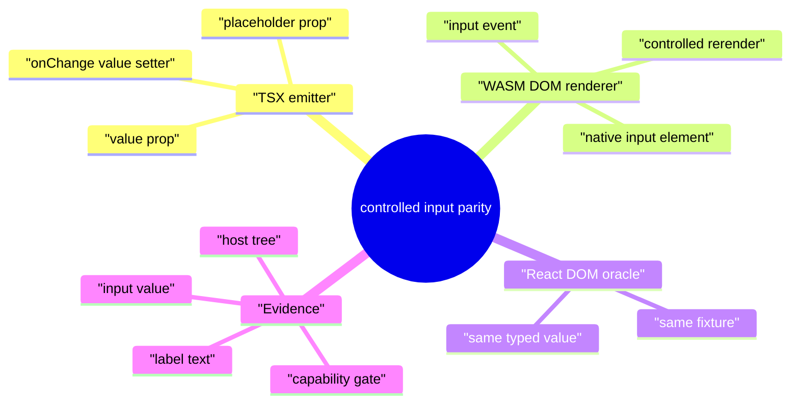
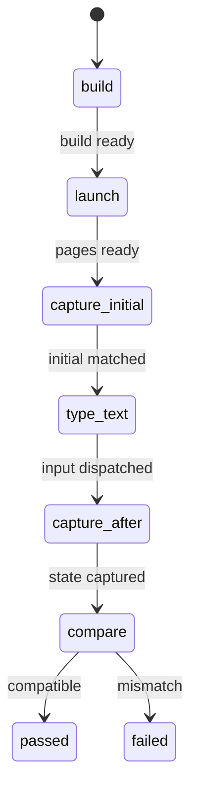
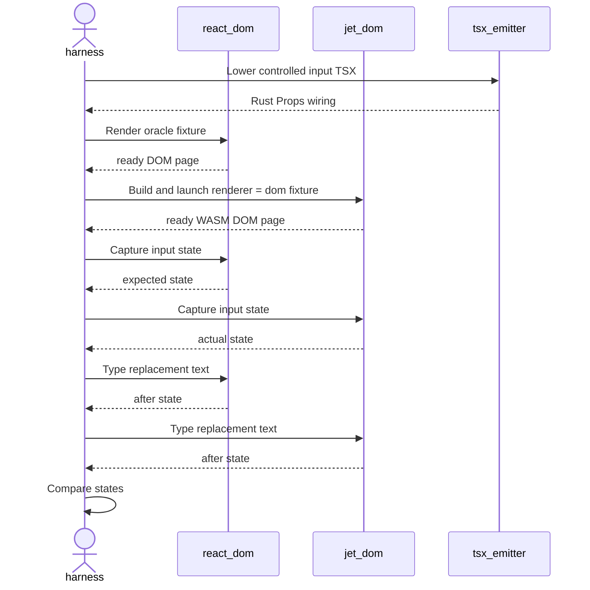
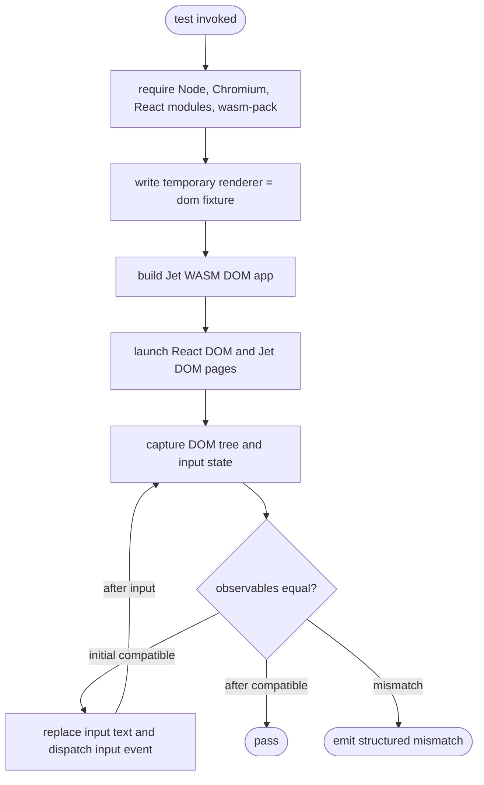
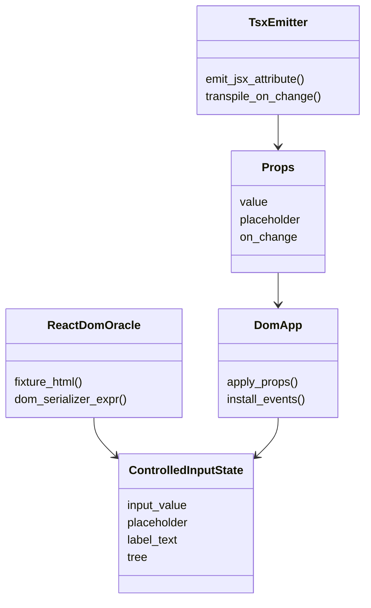
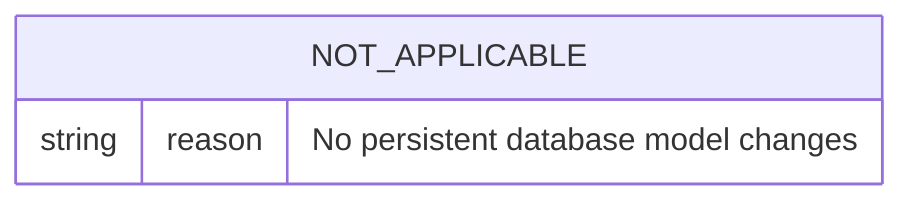
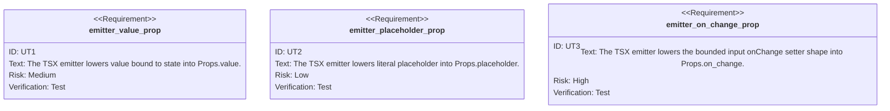

# DOM Renderer Controlled Input Parity

## Scenarios
<!-- type: scenarios lang: yaml -->

```yaml
scenarios:
  - id: initial_controlled_input_matches
    given: "A React DOM oracle page and a Jet WASM DOM renderer app render the same controlled input fixture."
    when: "The harness captures DOM state from both browser pages."
    then: "Input value, placeholder, rendered label text, and serialized host tree match."
  - id: typed_controlled_input_matches
    given: "Both pages start with the same controlled input value."
    when: "The harness types the same replacement text into each input."
    then: "Both pages expose the same input value and derived label text."
  - id: emitter_lowers_controlled_input_props
    given: "A TSX input uses value, placeholder, and onChange to update state."
    when: "The TSX emitter lowers the fixture."
    then: "The generated Props include value, placeholder, and on_change callback fields."
  - id: no_canvas_text_input_claim
    given: "The canvas renderer has no browser-native text editing surface."
    when: "This parity gate is evaluated."
    then: "The gate is scoped to renderer = dom and does not claim canvas input support."
```

## Mindmap
<!-- type: mindmap lang: mermaid -->



## State Machine
<!-- type: state-machine lang: mermaid -->



## Interaction
<!-- type: interaction lang: mermaid -->



## Logic
<!-- type: logic lang: mermaid -->



## Dependency
<!-- type: dependency lang: mermaid -->



## DB Model
<!-- type: db-model lang: mermaid -->



## Schema
<!-- type: schema lang: yaml -->

```yaml
schemas:
  ControlledInputDomState:
    type: object
    required: [schema_version, tree, input_value, placeholder, label_text]
    properties:
      schema_version: { const: jet.controlled_input_dom_state.v1 }
      tree: { type: object }
      input_value: { type: string }
      placeholder: { type: string }
      label_text: { type: string }
  ControlledInputMismatch:
    type: object
    required: [phase, expected, actual]
    properties:
      phase: { type: string }
      expected: { $ref: "#/schemas/ControlledInputDomState" }
      actual: { $ref: "#/schemas/ControlledInputDomState" }
```

## REST API
<!-- type: rest-api lang: yaml -->

```yaml
openapi: 3.1.0
info: { title: "not-applicable", version: "0.0.0" }
paths: {}
x-jet-scope:
  reason: "No REST API changes"
```

## RPC API
<!-- type: rpc-api lang: yaml -->

```yaml
openrpc: 1.3.2
info: { title: "not-applicable", version: "0.0.0" }
methods: []
x-jet-scope:
  reason: "No RPC API changes"
```

## Async API
<!-- type: async-api lang: yaml -->

```yaml
asyncapi: 2.6.0
info: { title: "not-applicable", version: "0.0.0" }
channels: {}
x-jet-scope:
  reason: "No async API changes"
```

## CLI
<!-- type: cli lang: yaml -->

```yaml
commands: []
observed_commands:
  - name: "cargo test -p jet --test tsx_to_rust_controlled_input -- --nocapture"
    purpose: "Run controlled input TSX lowering tests."
  - name: "cargo test -p jet --test react_dom_oracle_conformance dom_renderer_controlled_input_parity -- --nocapture"
    purpose: "Run live React DOM versus Jet WASM DOM renderer input parity."
no_cli_surface_change: true
```

## Wireframe
<!-- type: wireframe lang: yaml -->

```yaml
wireframes:
  - id: controlled-input-fixture
    root: form
    children:
      - input:
          id: name
          placeholder: Name
      - span:
          id: echo
          text: "hello <value>"
x-jet-scope:
  reason: "Only the test fixture UI is introduced."
```

## Component
<!-- type: component lang: yaml -->

```yaml
components:
  - tag: ControlledInput
    props:
      initial: string
    emits:
      - input
    state:
      value: string
    rendered_elements:
      - input#name
      - span#echo
```

## Design Token
<!-- type: design-token lang: yaml -->

```yaml
tokens: {}
x-jet-scope:
  reason: "No design token changes"
```

## Config
<!-- type: config lang: yaml -->

```yaml
config:
  jet_config:
    wasm:
      renderer: dom
      entry: src/ControlledInput.tsx
      root_component: ControlledInput
      root_props: ["Ada"]
  required_environment:
    - node
    - chromium
    - wasm-pack
    - local-react-dom-node-modules
```

## Manifest
<!-- type: manifest lang: yaml -->

```yaml
manifests:
  - path: projects/jet/Cargo.toml
    changes: []
  - path: projects/jet/wasm/Cargo.toml
    changes: []
```

## Runtime Image
<!-- type: runtime-image lang: yaml -->

```yaml
runtime_images: []
x-jet-scope:
  reason: "No container or runtime image changes"
```

## Deployment
<!-- type: deployment lang: yaml -->

```yaml
deployments: []
x-jet-scope:
  reason: "No deployment changes"
```

## Unit Test
<!-- type: unit-test lang: mermaid -->



## E2E Test
<!-- type: e2e-test lang: yaml -->

```yaml
e2e_tests:
  - id: dom_renderer_controlled_input_parity
    name: "DOM renderer controlled input parity"
    command: "cargo test -p jet --test react_dom_oracle_conformance dom_renderer_controlled_input_parity -- --nocapture"
    prerequisites:
      - node
      - chromium
      - wasm-pack
      - local-react-dom-node-modules
    fixture:
      renderer: dom
      component: ControlledInput
      initial_value: Ada
      replacement_value: Grace
    assertions:
      - "React DOM and Jet WASM DOM renderer initial host trees match."
      - "React DOM and Jet WASM DOM renderer initial input states match."
      - "After replacing text, input values match."
      - "After replacing text, derived label text matches."
    failure_payload:
      schema: ControlledInputMismatch
```

## Changes
<!-- type: changes lang: yaml -->

```yaml
changes:
  - path: projects/jet/README.md
    action: modify
    section: doc
    impl_mode: hand-written
    summary: "Record the controlled input DOM renderer parity gate in Jet capability evidence."
  - path: projects/jet/src/tsx_to_rust/emit.rs
    action: modify
    section: logic
    impl_mode: hand-written
    summary: "Lower the bounded controlled input JSX attribute subset."
  - path: projects/jet/tests/tsx_to_rust_controlled_input.rs
    action: add
    section: unit-test
    impl_mode: hand-written
    summary: "Prove controlled input JSX lowers to Props value, placeholder, and on_change."
  - path: projects/jet/tests/react_dom_oracle_conformance.rs
    action: modify
    section: e2e-test
    impl_mode: hand-written
    summary: "Add live React DOM versus Jet WASM DOM renderer controlled input parity."
  - path: projects/jet/tests/common/react_oracle.rs
    action: modify
    section: schema
    impl_mode: hand-written
    summary: "Add controlled input DOM state capture and mismatch helpers."
  - path: .aw/tech-design/projects/jet/specs/4004.md
    action: add
    section: scenarios
    impl_mode: hand-written
    summary: "Record controlled input parity scenarios for WI 4004."
  - path: .aw/tech-design/projects/jet/specs/4004.md
    action: add
    section: mindmap
    impl_mode: hand-written
    summary: "Record controlled input parity concept map for WI 4004."
  - path: .aw/tech-design/projects/jet/specs/4004.md
    action: add
    section: state-machine
    impl_mode: hand-written
    summary: "Record controlled input parity state machine for WI 4004."
  - path: .aw/tech-design/projects/jet/specs/4004.md
    action: add
    section: interaction
    impl_mode: hand-written
    summary: "Record controlled input parity browser interactions for WI 4004."
  - path: .aw/tech-design/projects/jet/specs/4004.md
    action: add
    section: dependency
    impl_mode: hand-written
    summary: "Record controlled input parity dependency model for WI 4004."
  - path: .aw/tech-design/projects/jet/specs/4004.md
    action: add
    section: db-model
    impl_mode: hand-written
    summary: "Record not-applicable database contract for WI 4004."
  - path: .aw/tech-design/projects/jet/specs/4004.md
    action: add
    section: rest-api
    impl_mode: hand-written
    summary: "Record not-applicable REST API contract for WI 4004."
  - path: .aw/tech-design/projects/jet/specs/4004.md
    action: add
    section: rpc-api
    impl_mode: hand-written
    summary: "Record not-applicable RPC API contract for WI 4004."
  - path: .aw/tech-design/projects/jet/specs/4004.md
    action: add
    section: async-api
    impl_mode: hand-written
    summary: "Record not-applicable async API contract for WI 4004."
  - path: .aw/tech-design/projects/jet/specs/4004.md
    action: add
    section: cli
    impl_mode: hand-written
    summary: "Record observed verification commands for WI 4004."
  - path: .aw/tech-design/projects/jet/specs/4004.md
    action: add
    section: wireframe
    impl_mode: hand-written
    summary: "Record the controlled input fixture layout for WI 4004."
  - path: .aw/tech-design/projects/jet/specs/4004.md
    action: add
    section: component
    impl_mode: hand-written
    summary: "Record the controlled input fixture component contract for WI 4004."
  - path: .aw/tech-design/projects/jet/specs/4004.md
    action: add
    section: design-token
    impl_mode: hand-written
    summary: "Record not-applicable design token contract for WI 4004."
  - path: .aw/tech-design/projects/jet/specs/4004.md
    action: add
    section: config
    impl_mode: hand-written
    summary: "Record renderer = dom test fixture config for WI 4004."
  - path: .aw/tech-design/projects/jet/specs/4004.md
    action: add
    section: manifest
    impl_mode: hand-written
    summary: "Record unchanged manifest contract for WI 4004."
  - path: .aw/tech-design/projects/jet/specs/4004.md
    action: add
    section: runtime-image
    impl_mode: hand-written
    summary: "Record not-applicable runtime image contract for WI 4004."
  - path: .aw/tech-design/projects/jet/specs/4004.md
    action: add
    section: deployment
    impl_mode: hand-written
    summary: "Record not-applicable deployment contract for WI 4004."
```

# Reviews
