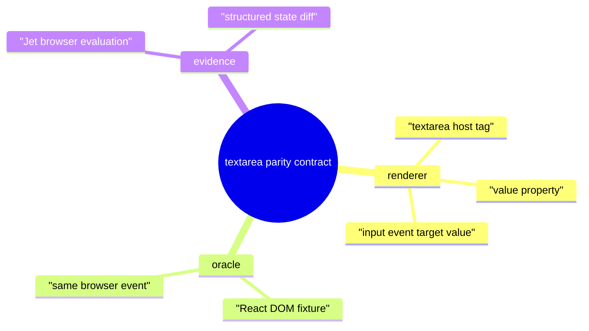
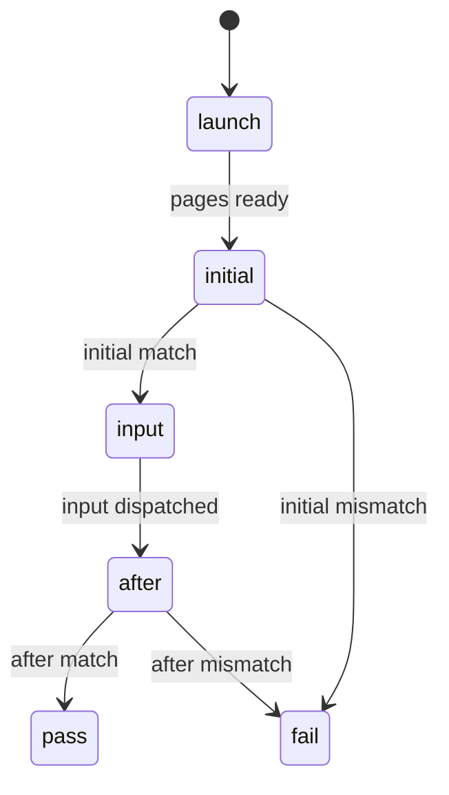
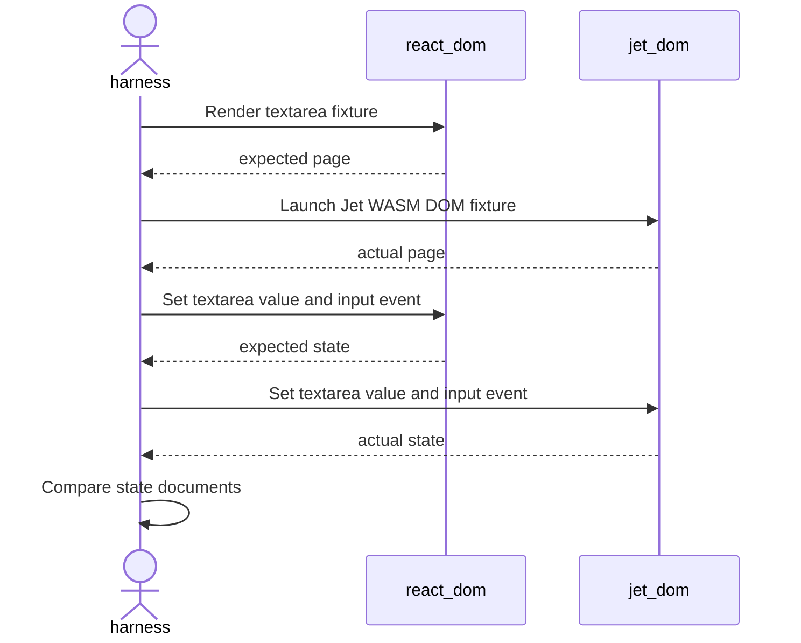
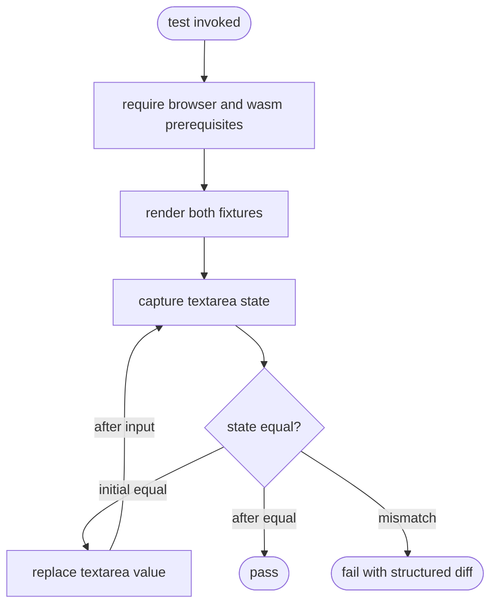
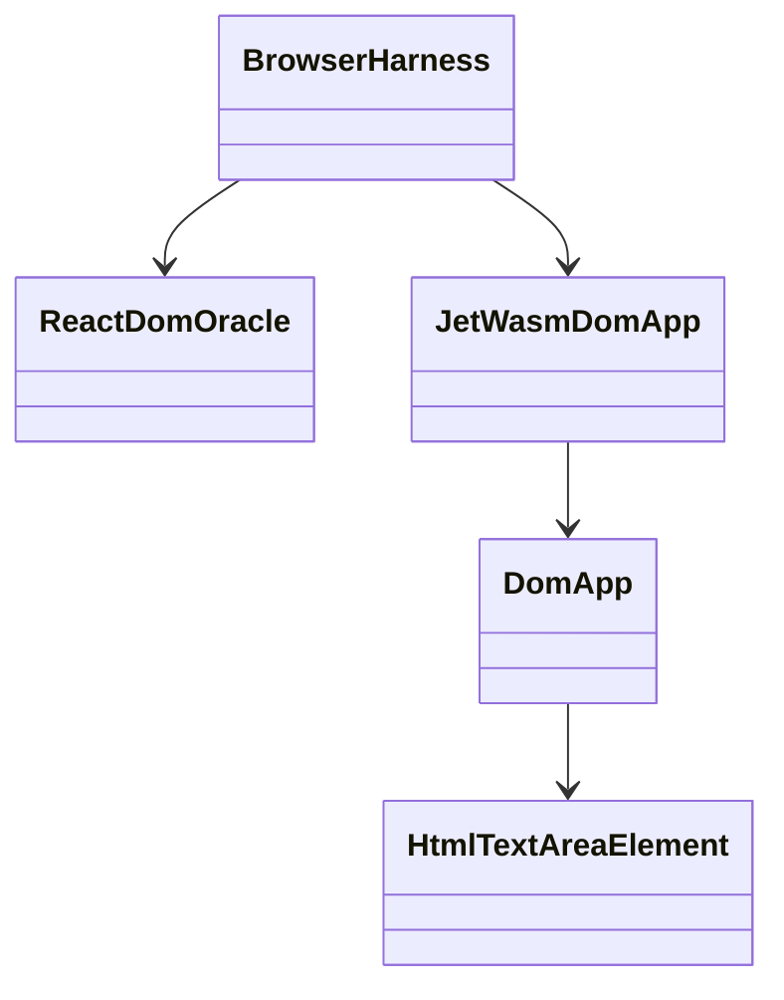
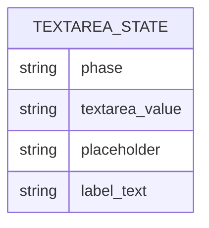

# DOM Renderer Controlled Textarea Parity

## Scenarios
<!-- type: scenarios lang: yaml -->

```yaml
scenarios:
  - id: initial_controlled_textarea_matches
    given: "React DOM and Jet WASM DOM renderer render the same controlled textarea fixture."
    when: "The harness captures both DOM states."
    then: "Textarea value, placeholder, label text, and host tree match."
  - id: typed_controlled_textarea_matches
    given: "Both pages start with identical controlled textarea state."
    when: "The harness replaces the textarea value and dispatches input on both pages."
    then: "Both pages expose the same controlled value and derived label text."
  - id: input_regression_guard
    given: "The existing controlled input parity test remains present."
    when: "The textarea slice lands."
    then: "Controlled input parity still passes."
```
## Mindmap
<!-- type: mindmap lang: mermaid -->


## State Machine
<!-- type: state-machine lang: mermaid -->


## Interaction
<!-- type: interaction lang: mermaid -->


## Logic
<!-- type: logic lang: mermaid -->


## Dependency
<!-- type: dependency lang: mermaid -->


## DB Model
<!-- type: db-model lang: mermaid -->


## Schema
<!-- type: schema lang: yaml -->

```yaml
$schema: "https://json-schema.org/draft/2020-12/schema"
title: JetControlledTextareaDomState
type: object
required: [schema_version, tree, textarea_value, placeholder, label_text]
properties:
  schema_version: { const: jet.controlled_textarea_dom_state.v1 }
  tree: { type: object }
  textarea_value: { type: string }
  placeholder: { type: string }
  label_text: { type: string }
additionalProperties: false
```
## REST API
<!-- type: rest-api lang: yaml -->

```yaml
openapi: 3.1.0
info: { title: Controlled textarea parity REST surface, version: 0.0.0 }
x-jet-not-applicable: true
paths: {}
```
## RPC API
<!-- type: rpc-api lang: yaml -->

```yaml
openrpc: 1.3.2
info: { title: Controlled textarea parity RPC surface, version: 0.0.0 }
x-jet-not-applicable: true
methods: []
```
## Async API
<!-- type: async-api lang: yaml -->

```yaml
asyncapi: 2.6.0
info: { title: Controlled textarea parity async surface, version: 0.0.0 }
x-jet-not-applicable: true
channels: {}
```
## CLI
<!-- type: cli lang: yaml -->

```yaml
commands:
  - name: cargo test -p jet --test react_dom_oracle_conformance dom_renderer_controlled_textarea_parity -- --nocapture
    purpose: "Run targeted live controlled textarea parity."
  - name: cargo test -p jet --test react_dom_oracle_conformance dom_renderer_controlled_input_parity -- --nocapture
    purpose: "Preserve the existing controlled input parity regression gate."
```
## Wireframe
<!-- type: wireframe lang: yaml -->

```yaml
layout:
  root: { type: form, id: form }
  controls:
    - { type: textarea, id: bio, placeholder: Bio, value_source: state.bio }
    - { type: span, id: echo, text_source: state.bio }
```
## Component
<!-- type: component lang: yaml -->

```yaml
schemaVersion: "1.0.0"
modules:
  - kind: javascript-module
    path: controlled-textarea-fixture
    declarations:
      - kind: function
        name: ControlledTextarea
```
## Design Token
<!-- type: design-token lang: yaml -->

```yaml
$type: token-set
tokens:
  textarea.placeholder: { $type: string, $value: Bio }
  textarea.initial: { $type: string, $value: Ada }
  textarea.replacement: { $type: string, $value: Grace Hopper }
```
## Config
<!-- type: config lang: yaml -->

```yaml
$schema: "https://json-schema.org/draft/2020-12/schema"
title: ControlledTextareaJetConfig
type: object
required: [wasm]
properties:
  wasm:
    type: object
    required: [entry, root_component, renderer, root_props]
    properties:
      entry: { const: src/ControlledTextarea.tsx }
      root_component: { const: ControlledTextarea }
      renderer: { const: dom }
      root_props: { type: array, items: { type: string } }
additionalProperties: true
```
## Manifest
<!-- type: manifest lang: yaml -->

```yaml
cargo:
  packages: [jet, jet-wasm]
features:
  jet-wasm: [dom-app, react, debug]
node:
  packages: [react, react-dom]
```
## Runtime Image
<!-- type: runtime-image lang: yaml -->

```yaml
image:
  not_applicable: true
  reason: "Local Rust/Node/Chromium test only."
```
## Deployment
<!-- type: deployment lang: yaml -->

```yaml
deployment:
  not_applicable: true
  reason: "No runtime service deployment."
```
## Unit Test
<!-- type: unit-test lang: mermaid -->

```mermaid
---
id: dom-renderer-controlled-textarea-contract-unit-test
---
requirementDiagram
    requirement textarea_node { id: UT1; text: "textarea renders as textarea"; risk: medium; verifymethod: test }
    requirement textarea_value { id: UT2; text: "textarea input event forwards value"; risk: high; verifymethod: test }
```
## E2E Test
<!-- type: e2e-test lang: yaml -->

```yaml
e2e_tests:
  - id: dom_renderer_controlled_textarea_parity
    capability_id: browser-trace-parity
    claim_id: dom-renderer-controlled-textarea-parity
    name: "DOM renderer controlled textarea parity"
    command: "cargo test -p jet --test react_dom_oracle_conformance dom_renderer_controlled_textarea_parity -- --nocapture"
    steps:
      - action: capture_initial
        assert: "React DOM and Jet WASM DOM state match."
      - action: replace_value
        value: "Grace Hopper"
      - action: capture_after
        assert: "React DOM and Jet WASM DOM state match after input."
    side_effects:
      - "Jet browser automation is used."
      - "Python http.server is not used."
  - id: dom_renderer_controlled_input_regression
    capability_id: browser-trace-parity
    claim_id: dom-renderer-controlled-input-parity
    name: "DOM renderer controlled input regression"
    command: "cargo test -p jet --test react_dom_oracle_conformance dom_renderer_controlled_input_parity -- --nocapture"
    steps:
      - action: run_existing_gate
        assert: "Existing controlled input parity remains green."
```
## Changes
<!-- type: changes lang: yaml -->

```yaml
changes:
  - path: projects/jet/wasm/src/react/dom_app.rs
    action: update
    section: logic
    impl_mode: hand-written
    reason: "Support textarea host nodes, value properties, and input event values."
  - path: projects/jet/tests/wasm/react_dom_oracle_conformance.rs
    action: update
    section: e2e-test
    impl_mode: hand-written
    reason: "Add live controlled textarea parity test."
  - path: projects/jet/tests/common/react_oracle.rs
    action: update
    section: schema
    impl_mode: hand-written
    reason: "Add textarea state probe and diff helper."
  - path: projects/jet/wasm/Cargo.toml
    action: update
    section: manifest
    impl_mode: hand-written
    reason: "Enable the web-sys HtmlTextAreaElement feature used by the DOM renderer."
  - path: projects/jet/README.md
    action: update
    section: doc
    impl_mode: hand-written
    reason: "Link the new verification gate."
  - path: .aw/tech-design/projects/jet/specs/4015.md
    action: update
    section: scenarios
    impl_mode: hand-written
    reason: "Record controlled textarea parity scenarios for WI 4015."
  - path: .aw/tech-design/projects/jet/specs/4015.md
    action: update
    section: mindmap
    impl_mode: hand-written
    reason: "Record controlled textarea parity concept map for WI 4015."
  - path: .aw/tech-design/projects/jet/specs/4015.md
    action: update
    section: state-machine
    impl_mode: hand-written
    reason: "Record controlled textarea parity state machine for WI 4015."
  - path: .aw/tech-design/projects/jet/specs/4015.md
    action: update
    section: interaction
    impl_mode: hand-written
    reason: "Record controlled textarea browser interactions for WI 4015."
  - path: .aw/tech-design/projects/jet/specs/4015.md
    action: update
    section: dependency
    impl_mode: hand-written
    reason: "Record controlled textarea dependency model for WI 4015."
  - path: .aw/tech-design/projects/jet/specs/4015.md
    action: update
    section: db-model
    impl_mode: hand-written
    reason: "Record not-applicable database contract for WI 4015."
  - path: .aw/tech-design/projects/jet/specs/4015.md
    action: update
    section: rest-api
    impl_mode: hand-written
    reason: "Record not-applicable REST API contract for WI 4015."
  - path: .aw/tech-design/projects/jet/specs/4015.md
    action: update
    section: rpc-api
    impl_mode: hand-written
    reason: "Record not-applicable RPC API contract for WI 4015."
  - path: .aw/tech-design/projects/jet/specs/4015.md
    action: update
    section: async-api
    impl_mode: hand-written
    reason: "Record not-applicable async API contract for WI 4015."
  - path: .aw/tech-design/projects/jet/specs/4015.md
    action: update
    section: cli
    impl_mode: hand-written
    reason: "Record observed verification commands for WI 4015."
  - path: .aw/tech-design/projects/jet/specs/4015.md
    action: update
    section: wireframe
    impl_mode: hand-written
    reason: "Record the controlled textarea fixture layout for WI 4015."
  - path: .aw/tech-design/projects/jet/specs/4015.md
    action: update
    section: component
    impl_mode: hand-written
    reason: "Record the controlled textarea fixture component contract for WI 4015."
  - path: .aw/tech-design/projects/jet/specs/4015.md
    action: update
    section: design-token
    impl_mode: hand-written
    reason: "Record controlled textarea fixture tokens for WI 4015."
  - path: .aw/tech-design/projects/jet/specs/4015.md
    action: update
    section: config
    impl_mode: hand-written
    reason: "Record renderer = dom test fixture config for WI 4015."
  - path: .aw/tech-design/projects/jet/specs/4015.md
    action: update
    section: runtime-image
    impl_mode: hand-written
    reason: "Record not-applicable runtime image contract for WI 4015."
  - path: .aw/tech-design/projects/jet/specs/4015.md
    action: update
    section: deployment
    impl_mode: hand-written
    reason: "Record not-applicable deployment contract for WI 4015."
  - path: .aw/tech-design/projects/jet/specs/4015.md
    action: update
    section: unit-test
    impl_mode: hand-written
    reason: "Record unit-test traceability for WI 4015."
```

# Reviews

### Review 1
**Verdict:** approved

- [cli] Contract includes the targeted textarea parity gate and the existing controlled input regression gate.
- [e2e-test] Browser evidence is concrete, uses Jet browser automation, and keeps Python http.server out of scope.
- [changes] Source/test/README edits are narrow and sufficient for the work-item acceptance criteria.

# Reviews

### Review 1
**Verdict:** approved

- [scenarios] Applicability is concrete and aligned with controlled textarea parity behavior.
- [cli] Required gates include textarea parity and the controlled input regression check.
- [changes] File scope is bounded to DOM renderer support, parity tests, oracle helpers, Cargo features, and README traceability.

# Reviews

### Review 1
**Verdict:** approved

- [cli] Contract commands include the textarea parity proof and input regression guard.
- [e2e-test] Live browser flow captures initial and after-input external state without Python http.server.
- [changes] Implementation scope matches the TD changes list and includes the required web-sys feature.
