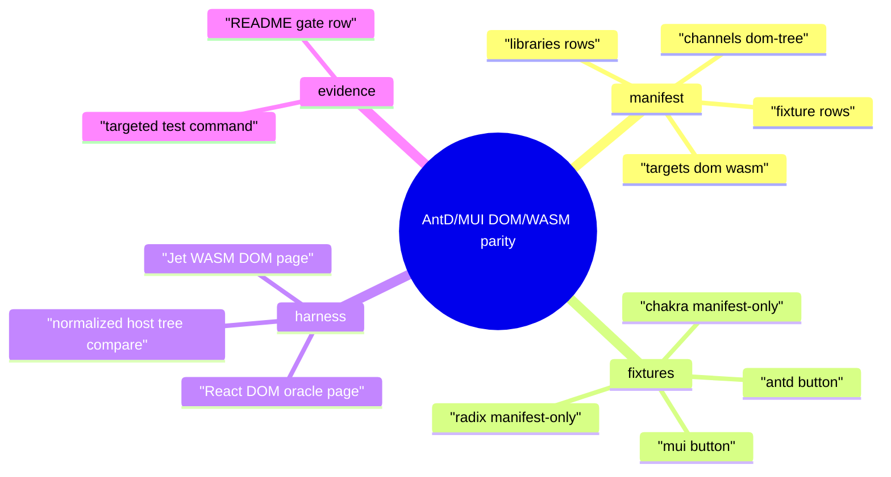
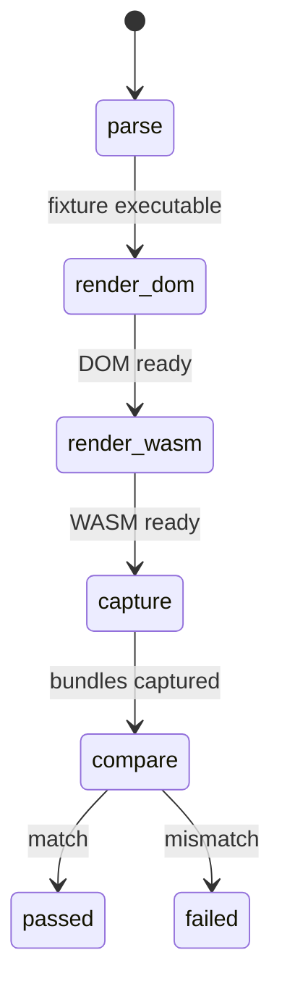
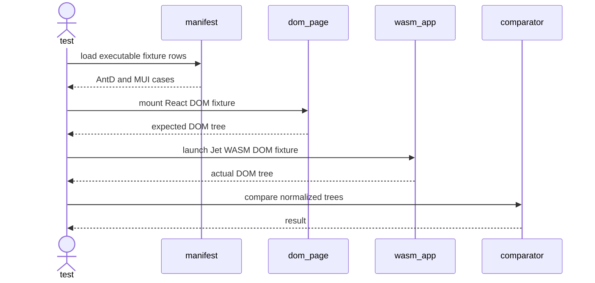
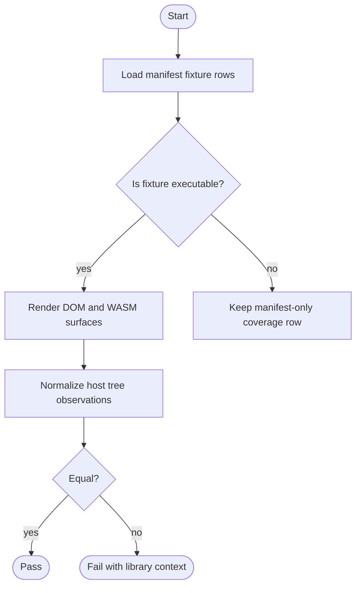
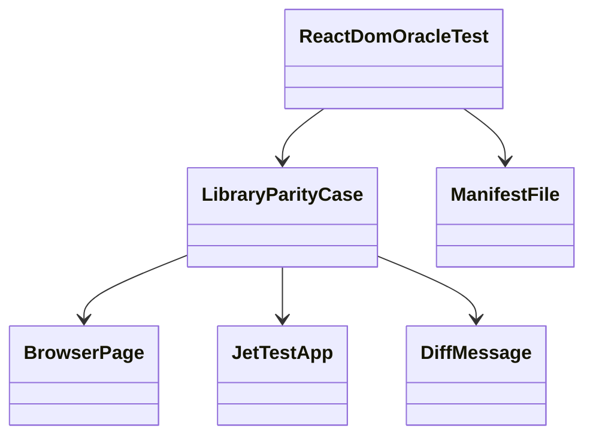
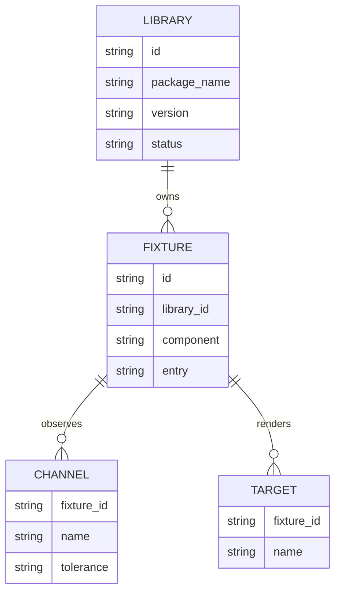

# Jet Library DOM/WASM Parity Fixtures

## Scenarios
<!-- type: scenarios lang: yaml -->

```yaml
scenarios:
  - id: manifest_records_executable_library_cases
    given: "The library fixture matrix is loaded by a Jet test."
    when: "The test enumerates fixtures."
    then: "It finds executable Material UI and Ant Design rows with DOM/WASM targets, package versions, and observation channels."
  - id: mui_button_parity
    given: "A Material UI button fixture has a React DOM oracle and an equivalent Jet WASM DOM fixture."
    when: "The live Chromium harness captures both externally observable host trees."
    then: "The normalized DOM state matches or the failure identifies the MUI fixture and channel."
  - id: antd_button_parity
    given: "An Ant Design button fixture has a React DOM oracle and an equivalent Jet WASM DOM fixture."
    when: "The live Chromium harness captures both externally observable host trees."
    then: "The normalized DOM state matches or the failure identifies the AntD fixture and channel."
  - id: no_python_server
    given: "The test launches library parity fixtures."
    when: "The browser pages are served."
    then: "They are served through Jet's browser/test helpers and not through python -m http.server."
```
## Mindmap
<!-- type: mindmap lang: mermaid -->


## State Machine
<!-- type: state-machine lang: mermaid -->


## Interaction
<!-- type: interaction lang: mermaid -->


## Logic
<!-- type: logic lang: mermaid -->


## Dependency
<!-- type: dependency lang: mermaid -->


## Db Model
<!-- type: db-model lang: mermaid -->


## Schema
<!-- type: schema lang: yaml -->

```yaml
$schema: "https://json-schema.org/draft/2020-12/schema"
title: JetLibraryParityManifest
type: object
required: [schema_version, libraries, fixtures]
properties:
  schema_version:
    type: integer
    const: 1
  libraries:
    type: array
    minItems: 4
    items:
      type: object
      required: [id, name, package_name, version, status]
      properties:
        id: { type: string }
        name: { type: string }
        package_name: { type: string }
        version: { type: string }
        status:
          type: string
          enum: [executable, manifest_only]
  fixtures:
    type: array
    minItems: 4
    items:
      type: object
      required: [id, library_id, component, status, targets, channels, tolerance]
      properties:
        id: { type: string }
        library_id: { type: string }
        component: { type: string }
        status:
          type: string
          enum: [executable, manifest_only]
        targets:
          type: array
          items: { enum: [dom, wasm] }
        channels:
          type: array
          items: { enum: [dom-tree, layout-boxes, screenshot-summary] }
        tolerance: { type: string }
```
## Rest Api
<!-- type: rest-api lang: yaml -->

```yaml
openapi: 3.1.0
info:
  title: Jet library parity fixture REST surface
  version: 0.0.0
paths: {}
x-aw-applicability:
  status: not_applicable
  reason: "The executable surface is a local Rust browser test, not an HTTP service."
```
## Rpc Api
<!-- type: rpc-api lang: yaml -->

```yaml
openrpc: 1.3.2
info:
  title: Jet library parity fixture RPC surface
  version: 0.0.0
methods: []
x-aw-applicability:
  status: not_applicable
  reason: "No JSON-RPC surface changes are required for this browser fixture gate."
```
## Async Api
<!-- type: async-api lang: yaml -->

```yaml
asyncapi: 2.6.0
info:
  title: Jet library parity fixture async surface
  version: 0.0.0
channels: {}
x-aw-applicability:
  status: not_applicable
  reason: "No WebSocket or pub-sub surface changes are required for this browser fixture gate."
```
## Cli
<!-- type: cli lang: yaml -->

```yaml
commands:
  - name: cargo
    about: "Run the library DOM/WASM browser parity gate."
    subcommands:
      - name: test
        args:
          - name: package
            flag: -p
            required: true
            value: jet
          - name: test-target
            flag: --test
            required: true
            value: react_dom_oracle_conformance
          - name: test-filter
            required: true
            value: library_dom_wasm_parity
          - name: nocapture
            flag: --nocapture
            required: false
x-aw-applicability:
  status: applicable
  reason: "The gate is delivered as a deterministic cargo test command."
```
## Wireframe
<!-- type: wireframe lang: yaml -->

```yaml
screen:
  id: library-dom-wasm-diff
  layout:
    type: vertical
    children:
      - id: title
        role: heading
        text: "{library} {fixture} {channel}"
      - id: renderer-targets
        role: text
        text: "dom vs wasm"
      - id: expected
        role: code
      - id: actual
        role: code
x-aw-applicability:
  status: diagnostic_only
  reason: "The only UI is the failure report shape emitted by tests."
```
## Component
<!-- type: component lang: yaml -->

```yaml
schemaVersion: "1.0.0"
modules:
  - kind: javascript-module
    path: projects/jet/parity/data/fixtures/libraries
    declarations:
      - kind: class
        name: LibraryParityCase
        customElement: false
        members:
          - kind: field
            name: id
            type: { text: string }
          - kind: field
            name: library
            type: { text: string }
          - kind: field
            name: component
            type: { text: string }
          - kind: field
            name: channels
            type: { text: "string[]" }
x-aw-applicability:
  status: applicable
  reason: "The contract describes React library fixture components consumed by the test harness."
```
## Design Token
<!-- type: design-token lang: yaml -->

```yaml
$schema: "https://design-tokens.github.io/community-group/format/"
libraryParity:
  domTreeTolerance:
    $type: string
    $value: exact-normalized
  layoutTolerance:
    $type: string
    $value: existing-layout-box-tolerance
  screenshotTolerance:
    $type: string
    $value: existing-summary-tolerance
x-aw-applicability:
  status: diagnostic_only
  reason: "These are observation tolerances for tests, not product visual design tokens."
```
## Config
<!-- type: config lang: yaml -->

```yaml
$schema: "https://json-schema.org/draft/2020-12/schema"
title: LibraryParityFixtureConfig
type: object
required: [fixtures]
properties:
  fixtures:
    type: array
    items:
      type: object
      required: [id, enabled, status]
      properties:
        id: { type: string }
        enabled: { type: boolean }
        status:
          type: string
          enum: [executable, manifest_only]
        channels:
          type: array
          items: { type: string }
```
## Manifest
<!-- type: manifest lang: yaml -->

```yaml
package_manifests:
  - path: projects/jet/parity/data/fixtures/libraries/fixtures.toml
    purpose: "Canonical third-party library fixture matrix."
  - path: projects/jet/parity/data/fixtures/libraries/package.json
    purpose: "Pinned dependency install root for DOM reference examples."
libraries:
  - id: mui
    package: "@mui/material"
    version: "5.16.7"
    status: executable
  - id: antd
    package: "antd"
    version: "5.20.0"
    status: executable
  - id: radix
    package: "@radix-ui/react-dialog"
    version: "1.x"
    status: manifest_only
  - id: chakra
    package: "@chakra-ui/react"
    version: "2.x"
    status: manifest_only
```
## Runtime Image
<!-- type: runtime-image lang: yaml -->

```yaml
images: []
runtime_requirements:
  - rust-toolchain
  - node
  - npm
  - chromium
  - wasm-pack
x-aw-applicability:
  status: local_runtime
  reason: "The gate runs in the existing local test environment without a container image."
```
## Deployment
<!-- type: deployment lang: yaml -->

```yaml
manifests: []
ci_gate:
  command: "cargo test -p jet --test react_dom_oracle_conformance library_dom_wasm_parity -- --nocapture"
  required_for: "Jet browser parity capability evidence"
x-aw-applicability:
  status: local_test_gate
  reason: "Deployment impact is limited to test-gate coverage, not runtime rollout."
```
## Unit Test
<!-- type: unit-test lang: mermaid -->

```mermaid
---
id: jet-library-dom-wasm-parity-contract-unit-test
---
requirementDiagram
    requirement manifest_rows {
        id: R1
        text: "Manifest rows include executable MUI and AntD fixtures and manifest-only Radix and Chakra fixtures."
        risk: medium
        verifymethod: test
    }
    requirement diff_context {
        id: R2
        text: "Library parity failures include library, fixture, channel, expected, and actual values."
        risk: medium
        verifymethod: test
    }
    requirement antd_import_lowering {
        id: R3
        text: "Ant Design runtime imports lower to intrinsic Jet DOM nodes for executable WASM fixtures."
        risk: medium
        verifymethod: test
    }
    test manifest_rows_test {
        id: T1
        name: "library manifest rows"
        type: functional
    }
    test diff_context_test {
        id: T2
        name: "library diff message context"
        type: functional
    }
    test antd_import_lowering_test {
        id: T3
        name: "Ant Design import lowering"
        type: functional
    }
    manifest_rows_test - verifies -> manifest_rows
    diff_context_test - verifies -> diff_context
    antd_import_lowering_test - verifies -> antd_import_lowering
```
## E2e Test
<!-- type: e2e-test lang: yaml -->

```yaml
e2e_tests:
  - id: library_dom_wasm_parity
    name: "Library DOM/WASM parity"
    command: "cargo test -p jet --test react_dom_oracle_conformance library_dom_wasm_parity -- --nocapture"
    browser: chromium
    prerequisites: [node, chromium, wasm-pack]
    fixtures:
      - mui-button-basic
      - antd-button-primary
    assertions:
      - "Material UI fixture renders on React DOM and Jet WASM DOM."
      - "Ant Design fixture renders on React DOM and Jet WASM DOM."
      - "The observed host-tree state matches for each executable fixture."
      - "The test uses Jet browser observation helpers and no Python test server."
      - "Failures identify library id, fixture id, observation channel, expected state, and actual state."
```
## Changes
<!-- type: changes lang: yaml -->

```yaml
changes:
  - path: .aw/tech-design/projects/jet/specs/4041.md
    action: create
    section: changes
    impl_mode: hand-written
    reason: "Define the AntD/MUI library DOM/WASM parity contract."
  - path: .aw/tech-design/projects/jet/specs/4041.md
    action: validate
    section: scenarios
    impl_mode: hand-written
    reason: "Record executable library parity scenarios and no-Python-server constraint."
  - path: .aw/tech-design/projects/jet/specs/4041.md
    action: validate
    section: mindmap
    impl_mode: hand-written
    reason: "Record fixture matrix, harness, and evidence relationships."
  - path: .aw/tech-design/projects/jet/specs/4041.md
    action: validate
    section: state-machine
    impl_mode: hand-written
    reason: "Record the manifest to DOM/WASM comparison lifecycle."
  - path: .aw/tech-design/projects/jet/specs/4041.md
    action: validate
    section: interaction
    impl_mode: hand-written
    reason: "Record the browser fixture observation interaction contract."
  - path: .aw/tech-design/projects/jet/specs/4041.md
    action: validate
    section: dependency
    impl_mode: hand-written
    reason: "Record dependency links between manifest, test harness, and browser pages."
  - path: .aw/tech-design/projects/jet/specs/4041.md
    action: validate
    section: db-model
    impl_mode: hand-written
    reason: "Record local manifest entity relationships for libraries, fixtures, channels, and targets."
  - path: .aw/tech-design/projects/jet/specs/4041.md
    action: validate
    section: schema
    impl_mode: hand-written
    reason: "Record the library fixture manifest schema validated by tests."
  - path: .aw/tech-design/projects/jet/specs/4041.md
    action: validate
    section: rest-api
    impl_mode: hand-written
    reason: "Record non-applicability because the slice adds no REST API."
  - path: .aw/tech-design/projects/jet/specs/4041.md
    action: validate
    section: rpc-api
    impl_mode: hand-written
    reason: "Record non-applicability because the slice adds no RPC API."
  - path: .aw/tech-design/projects/jet/specs/4041.md
    action: validate
    section: async-api
    impl_mode: hand-written
    reason: "Record non-applicability because the slice adds no async API."
  - path: .aw/tech-design/projects/jet/specs/4041.md
    action: validate
    section: cli
    impl_mode: hand-written
    reason: "Record the cargo test command used as the local gate."
  - path: .aw/tech-design/projects/jet/specs/4041.md
    action: validate
    section: wireframe
    impl_mode: hand-written
    reason: "Record the diagnostic failure report shape."
  - path: .aw/tech-design/projects/jet/specs/4041.md
    action: validate
    section: component
    impl_mode: hand-written
    reason: "Record the library fixture component contract consumed by the harness."
  - path: .aw/tech-design/projects/jet/specs/4041.md
    action: validate
    section: design-token
    impl_mode: hand-written
    reason: "Record parity observation tolerances as diagnostic tokens."
  - path: .aw/tech-design/projects/jet/specs/4041.md
    action: validate
    section: config
    impl_mode: hand-written
    reason: "Record the fixture enablement and channel configuration contract."
  - path: .aw/tech-design/projects/jet/specs/4041.md
    action: validate
    section: runtime-image
    impl_mode: hand-written
    reason: "Record runtime image requirements for local browser/WASM evidence."
  - path: .aw/tech-design/projects/jet/specs/4041.md
    action: validate
    section: deployment
    impl_mode: hand-written
    reason: "Record local-test-gate deployment scope."
  - path: .aw/tech-design/projects/jet/semantic/jet-parity-data-fixtures-libraries.md
    action: create
    section: manifest
    impl_mode: hand-written
    reason: "Attach the library fixture manifests to capability-owned semantic coverage."
  - path: projects/jet/tests/react_dom_oracle_conformance.rs
    action: update
    section: e2e-test
    impl_mode: hand-written
    reason: "Add live browser library fixture parity assertions and fixture enumeration."
  - path: projects/jet/tests/common/react_oracle.rs
    action: update
    section: unit-test
    impl_mode: hand-written
    reason: "Add fixture-aware diff helpers if the existing helper lacks library context."
  - path: projects/jet/src/tsx_to_rust/mod.rs
    action: update
    section: logic
    impl_mode: hand-written
    reason: "Accept and lower Ant Design runtime import aliases for executable library WASM fixtures."
  - path: projects/jet/tests/wasm_build_end_to_end.rs
    action: update
    section: unit-test
    impl_mode: hand-written
    reason: "Assert Ant Design import shapes compile into intrinsic Jet WASM elements."
  - path: projects/jet/parity/data/fixtures/libraries/fixtures.toml
    action: create
    section: manifest
    impl_mode: hand-written
    reason: "Record third-party library fixture matrix, channels, targets, and tolerances."
  - path: projects/jet/parity/data/fixtures/libraries/package.json
    action: create
    section: manifest
    impl_mode: hand-written
    reason: "Pin React, ReactDOM, Ant Design, and Material UI dependency versions for fixture references."
  - path: projects/jet/README.md
    action: update
    section: doc
    impl_mode: hand-written
    reason: "Expose the library parity gate in the browser parity capability rows."
```

# Reviews

### Review 1
**Verdict:** approved

- [scenarios] The contract gives executable AntD and MUI fixture scenarios plus an explicit no-Python-server constraint.
- [manifest] The library rows distinguish executable first-slice fixtures from Radix/Chakra manifest-only expansion rows.
- [e2e-test] The browser gate is precise enough to implement and verify through Jet's existing React DOM oracle conformance test target.
