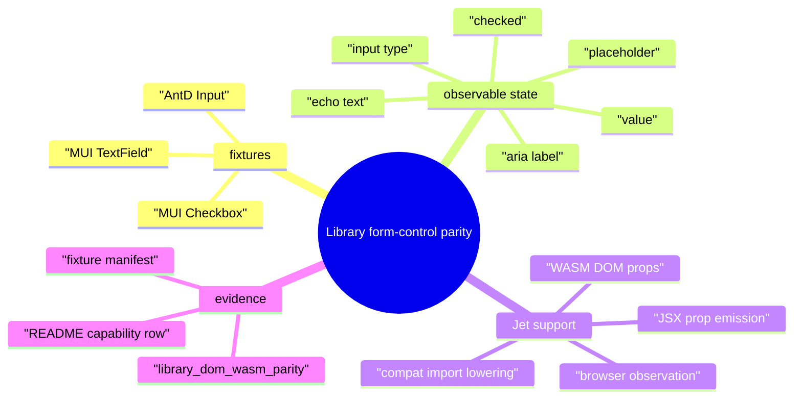
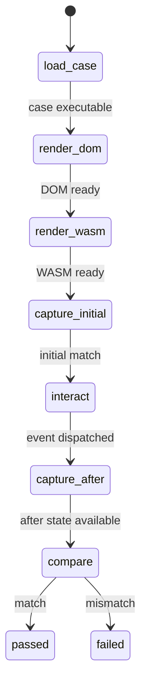
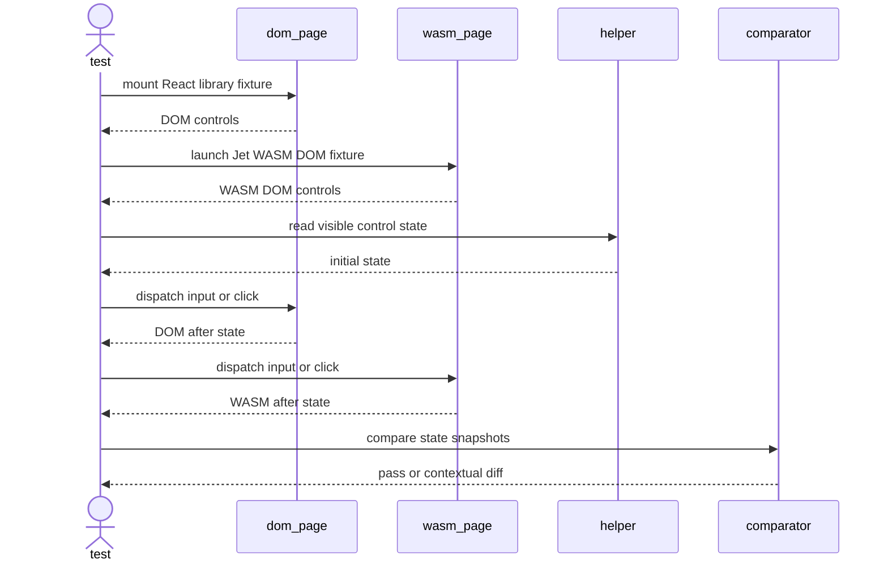
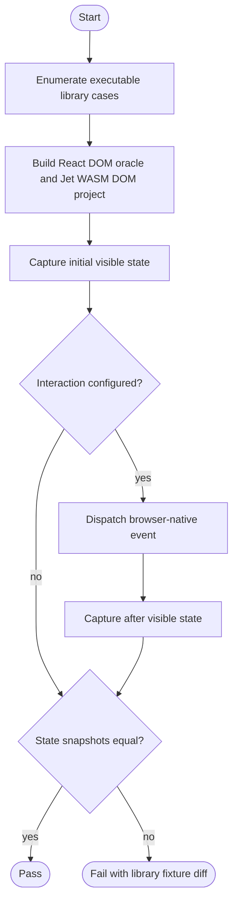
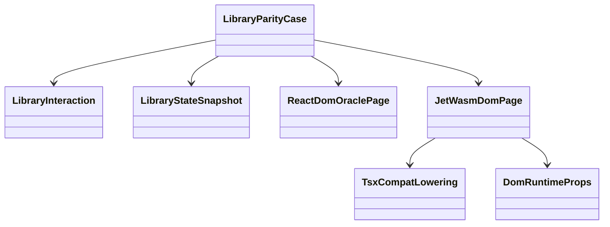
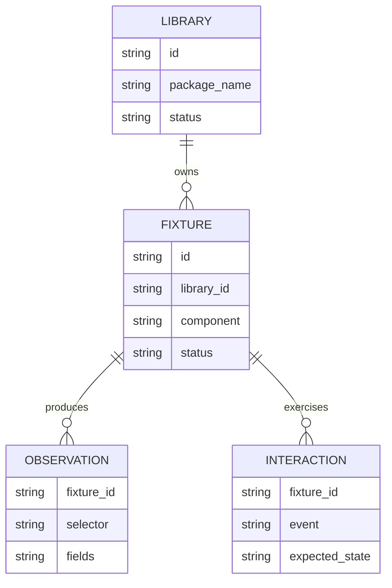

# Jet Library Form-Control DOM/WASM Parity

## Scenarios
<!-- type: scenarios lang: yaml -->

```yaml
scenarios:
  - id: mui_textfield_state_parity
    given: "A Material UI TextField fixture is rendered by React DOM and by Jet WASM DOM."
    when: "The live browser harness captures the externally visible input state."
    then: "Both renderers agree on host node, value, placeholder or label evidence, and text echo after input."
  - id: mui_checkbox_state_parity
    given: "A Material UI Checkbox fixture is rendered by React DOM and by Jet WASM DOM."
    when: "The browser harness captures initial and post-click checked state."
    then: "Both renderers agree on checkbox input type, checked state, aria label evidence, and echo state."
  - id: antd_input_state_parity
    given: "An Ant Design Input fixture is rendered by React DOM and by Jet WASM DOM."
    when: "The browser harness captures initial and post-input state."
    then: "Both renderers agree on value, placeholder, and text echo after input."
  - id: scoped_library_compat_repairs
    given: "A fixture needs library prop/lowering support missing from Jet."
    when: "The TD is implemented."
    then: "Only the compatibility lowering and DOM props needed by the added form-control fixtures are changed."
```
## Mindmap
<!-- type: mindmap lang: mermaid -->


## State Machine
<!-- type: state-machine lang: mermaid -->


## Interaction
<!-- type: interaction lang: mermaid -->


## Logic
<!-- type: logic lang: mermaid -->


## Dependency
<!-- type: dependency lang: mermaid -->


## Db Model
<!-- type: db-model lang: mermaid -->


## Schema
<!-- type: schema lang: yaml -->

```yaml
$schema: "https://json-schema.org/draft/2020-12/schema"
title: JetLibraryFormControlParityCase
type: object
required: [id, library_id, component, dom_render_script, tsx_file, tsx_source, root_component]
properties:
  id:
    type: string
  library_id:
    type: string
    enum: [mui, antd]
  component:
    type: string
  dom_render_script:
    type: string
  tsx_file:
    type: string
  tsx_source:
    type: string
  root_component:
    type: string
  state_probe:
    type: object
    required: [selector, fields]
    properties:
      selector: { type: string }
      fields:
        type: array
        items:
          enum: [tag, type, value, checked, placeholder, aria_label, text]
  interaction:
    type: object
    properties:
      kind:
        enum: [input, click]
      selector: { type: string }
      value: { type: string }
```
## Rest Api
<!-- type: rest-api lang: yaml -->

```yaml
openapi: 3.1.0
info:
  title: Jet library form-control parity REST surface
  version: 0.0.0
paths: {}
x-aw-applicability:
  status: not_applicable
  reason: "This slice adds local browser/WASM parity tests, not an HTTP API."
```
## Rpc Api
<!-- type: rpc-api lang: yaml -->

```yaml
openrpc: 1.3.2
info:
  title: Jet library form-control parity RPC surface
  version: 0.0.0
methods: []
x-aw-applicability:
  status: not_applicable
  reason: "No JSON-RPC interface changes are needed for library parity fixtures."
```
## Async Api
<!-- type: async-api lang: yaml -->

```yaml
asyncapi: 2.6.0
info:
  title: Jet library form-control parity async surface
  version: 0.0.0
channels: {}
x-aw-applicability:
  status: not_applicable
  reason: "The added tests use browser DOM events, not WebSocket or pub-sub contracts."
```
## Cli
<!-- type: cli lang: yaml -->

```yaml
commands:
  - name: cargo
    about: "Run the expanded library DOM/WASM browser parity gate."
    subcommands:
      - name: test
        args:
          - name: package
            flag: -p
            required: true
            value: jet
          - name: test-target
            flag: --test
            required: true
            value: react_dom_oracle_conformance
          - name: test-filter
            required: true
            value: library_dom_wasm_parity
          - name: nocapture
            flag: --nocapture
            required: false
x-aw-applicability:
  status: applicable
  reason: "The acceptance gate is a cargo test target using Jet browser automation."
```
## Wireframe
<!-- type: wireframe lang: yaml -->

```yaml
screen:
  id: library-form-control-diff
  layout:
    type: vertical
    children:
      - id: heading
        role: heading
        text: "{library_id} {case_id} {phase}"
      - id: expected
        role: code
        label: "React DOM"
      - id: actual
        role: code
        label: "Jet WASM DOM"
x-aw-applicability:
  status: diagnostic_only
  reason: "The only UI contract is the test failure report shape."
```
## Component
<!-- type: component lang: yaml -->

```yaml
schemaVersion: "1.0.0"
modules:
  - kind: javascript-module
    path: projects/jet/tests/react_dom_oracle_conformance.rs
    declarations:
      - kind: class
        name: LibraryParityCase
        customElement: false
        members:
          - kind: field
            name: id
            type: { text: string }
          - kind: field
            name: state_probe
            type: { text: LibraryStateProbe }
          - kind: field
            name: interaction
            type: { text: LibraryInteraction }
x-aw-applicability:
  status: applicable
  reason: "The test harness fixture struct is the local component contract for library parity cases."
```
## Design Token
<!-- type: design-token lang: yaml -->

```yaml
$schema: "https://design-tokens.github.io/community-group/format/"
libraryFormControlParity:
  stateTolerance:
    $type: string
    $value: exact-json
  textTolerance:
    $type: string
    $value: exact-normalized
x-aw-applicability:
  status: diagnostic_only
  reason: "These values describe parity comparison tolerances, not product design tokens."
```
## Config
<!-- type: config lang: yaml -->

```yaml
$schema: "https://json-schema.org/draft/2020-12/schema"
title: JetLibraryFormControlParityConfig
type: object
required: [renderer, entry, root_component]
properties:
  renderer:
    const: dom
  entry:
    type: string
  root_component:
    type: string
  root_props:
    type: array
    items: { type: string }
```
## Manifest
<!-- type: manifest lang: yaml -->

```yaml
package_manifests:
  - path: projects/jet/parity/data/fixtures/libraries/fixtures.toml
    purpose: "Record executable AntD/MUI form-control fixture rows."
  - path: projects/jet/parity/data/fixtures/libraries/package.json
    purpose: "Keep React, ReactDOM, AntD, and MUI dependencies available for fixtures."
fixture_rows:
  - id: mui-textfield-basic
    library: mui
    component: TextField
    status: executable
  - id: mui-checkbox-basic
    library: mui
    component: Checkbox
    status: executable
  - id: antd-input-basic
    library: antd
    component: Input
    status: executable
```
## Runtime Image
<!-- type: runtime-image lang: yaml -->

```yaml
images: []
runtime_requirements:
  - rust-toolchain
  - node
  - npm
  - chromium
  - wasm-pack
x-aw-applicability:
  status: local_runtime
  reason: "The gate runs in the existing Jet local browser/WASM environment."
```
## Deployment
<!-- type: deployment lang: yaml -->

```yaml
manifests: []
ci_gate:
  command: "cargo test -p jet --test react_dom_oracle_conformance library_dom_wasm_parity -- --nocapture"
  required_for: "Jet browser trace parity evidence"
x-aw-applicability:
  status: local_test_gate
  reason: "Deployment impact is limited to the configured test gate evidence."
```
## Unit Test
<!-- type: unit-test lang: mermaid -->

```mermaid
---
id: jet-library-form-control-parity-unit-test
---
requirementDiagram
    requirement manifest_rows {
        id: R1
        text: "The fixture manifest lists executable MUI TextField, MUI Checkbox, and AntD Input rows."
        risk: medium
        verifymethod: test
    }
    requirement compat_lowering {
        id: R2
        text: "TSX compatibility lowering maps the added library controls to intrinsic input nodes and accepted props."
        risk: high
        verifymethod: test
    }
    requirement dom_props {
        id: R3
        text: "The WASM DOM runtime applies value, type, checked, placeholder, and aria-label props where present."
        risk: high
        verifymethod: test
    }
    test manifest_rows_test {
        id: T1
        name: "library fixture manifest rows"
        type: functional
    }
    test wasm_build_compat_test {
        id: T2
        name: "library form-control WASM build compatibility"
        type: functional
    }
    manifest_rows_test - verifies -> manifest_rows
    wasm_build_compat_test - verifies -> compat_lowering
    wasm_build_compat_test - verifies -> dom_props
```
## E2e Test
<!-- type: e2e-test lang: yaml -->

```yaml
e2e_tests:
  - id: library_dom_wasm_parity
    name: "Library form-control DOM/WASM parity"
    command: "cargo test -p jet --test react_dom_oracle_conformance library_dom_wasm_parity -- --nocapture"
    browser: chromium
    prerequisites: [node, chromium, wasm-pack]
    fixtures:
      - mui-button-basic
      - antd-button-primary
      - mui-textfield-basic
      - mui-checkbox-basic
      - antd-input-basic
    assertions:
      - "Each fixture renders in React DOM and Jet WASM DOM."
      - "Initial visible form state matches for executable form-control fixtures."
      - "Post-input or post-click visible state matches when a fixture declares an interaction."
      - "Failures identify library id, fixture id, phase, expected state, and actual state."
      - "The test uses Jet browser observation helpers and no Python test server."
```
## Changes
<!-- type: changes lang: yaml -->

```yaml
changes:
  - path: .aw/tech-design/projects/jet/specs/4072.md
    action: create
    section: changes
    impl_mode: hand-written
    reason: "Define the library form-control DOM/WASM parity contract."
  - path: .aw/tech-design/projects/jet/specs/4072.md
    action: validate
    section: scenarios
    impl_mode: hand-written
    reason: "Record the MUI TextField, MUI Checkbox, AntD Input, and scoped compat repair scenarios."
  - path: .aw/tech-design/projects/jet/specs/4072.md
    action: validate
    section: mindmap
    impl_mode: hand-written
    reason: "Record the fixture, observable state, Jet support, and evidence relationships."
  - path: .aw/tech-design/projects/jet/specs/4072.md
    action: validate
    section: state-machine
    impl_mode: hand-written
    reason: "Record the DOM/WASM render, capture, interaction, and comparison lifecycle."
  - path: .aw/tech-design/projects/jet/specs/4072.md
    action: validate
    section: interaction
    impl_mode: hand-written
    reason: "Record the browser-page interaction contract for initial and post-event state comparison."
  - path: .aw/tech-design/projects/jet/specs/4072.md
    action: validate
    section: dependency
    impl_mode: hand-written
    reason: "Record the local dependency links between parity cases, pages, lowering, and DOM props."
  - path: .aw/tech-design/projects/jet/specs/4072.md
    action: validate
    section: db-model
    impl_mode: hand-written
    reason: "Record the local fixture, observation, and interaction entity relationships."
  - path: .aw/tech-design/projects/jet/specs/4072.md
    action: validate
    section: rest-api
    impl_mode: hand-written
    reason: "Record non-applicability because this slice adds no REST API."
  - path: .aw/tech-design/projects/jet/specs/4072.md
    action: validate
    section: rpc-api
    impl_mode: hand-written
    reason: "Record non-applicability because this slice adds no RPC API."
  - path: .aw/tech-design/projects/jet/specs/4072.md
    action: validate
    section: async-api
    impl_mode: hand-written
    reason: "Record non-applicability because this slice uses browser DOM events, not async API contracts."
  - path: .aw/tech-design/projects/jet/specs/4072.md
    action: validate
    section: cli
    impl_mode: hand-written
    reason: "Record the cargo test command used as the local browser parity gate."
  - path: .aw/tech-design/projects/jet/specs/4072.md
    action: validate
    section: wireframe
    impl_mode: hand-written
    reason: "Record the diagnostic failure report shape."
  - path: .aw/tech-design/projects/jet/specs/4072.md
    action: validate
    section: component
    impl_mode: hand-written
    reason: "Record the fixture struct and state probe component contract consumed by the harness."
  - path: .aw/tech-design/projects/jet/specs/4072.md
    action: validate
    section: design-token
    impl_mode: hand-written
    reason: "Record parity comparison tolerances as diagnostic tokens."
  - path: .aw/tech-design/projects/jet/specs/4072.md
    action: validate
    section: config
    impl_mode: hand-written
    reason: "Record the renderer, entry, and root component configuration shape."
  - path: .aw/tech-design/projects/jet/specs/4072.md
    action: validate
    section: runtime-image
    impl_mode: hand-written
    reason: "Record local browser/WASM runtime requirements."
  - path: .aw/tech-design/projects/jet/specs/4072.md
    action: validate
    section: deployment
    impl_mode: hand-written
    reason: "Record deployment impact as local test gate evidence only."
  - path: projects/jet/tests/react_dom_oracle_conformance.rs
    action: update
    section: e2e-test
    impl_mode: hand-written
    reason: "Add MUI/AntD form-control library parity cases, state probes, and interactions."
  - path: projects/jet/parity/data/fixtures/libraries/fixtures.toml
    action: update
    section: manifest
    impl_mode: hand-written
    reason: "Record executable form-control fixture rows in the library parity manifest."
  - path: projects/jet/src/tsx_to_rust/mod.rs
    action: update
    section: logic
    impl_mode: hand-written
    reason: "Map added library controls to intrinsic DOM-compatible elements."
  - path: projects/jet/src/tsx_to_rust/emit.rs
    action: update
    section: logic
    impl_mode: hand-written
    reason: "Emit the JSX props needed by library form-control fixtures."
  - path: projects/jet/wasm/src/lib.rs
    action: update
    section: schema
    impl_mode: hand-written
    reason: "Extend Element props with form-control state fields required by the fixtures."
  - path: projects/jet/wasm/src/react/dom_app.rs
    action: update
    section: logic
    impl_mode: hand-written
    reason: "Apply form-control props and read checkbox event state in the WASM DOM renderer."
  - path: projects/jet/tests/wasm_build_end_to_end.rs
    action: update
    section: unit-test
    impl_mode: hand-written
    reason: "Assert the added library form-control imports and props compile for WASM."
  - path: projects/jet/README.md
    action: update
    section: doc
    impl_mode: hand-written
    reason: "Expose the expanded library form-control parity gate in capability evidence."
```

# Reviews

### Review 1
**Verdict:** approved

- [scenarios] The scenarios correctly focus the slice on MUI TextField, MUI Checkbox, AntD Input, and scoped compat repairs.
- [logic] The flow is clear enough to implement initial and post-interaction state comparison through the existing browser harness.
- [e2e-test] The gate command and fixture list are concrete, and the assertions require visible form state rather than static host-tree shape only.
- [changes] The change list is bounded to the test harness, fixture manifest, minimal TSX lowering/runtime support, and README evidence.

# Reviews

### Review 1
**Verdict:** approved

- [manifest] The executable fixture rows are concrete and remain scoped to MUI/AntD while preserving Radix/Chakra out of scope.
- [schema] The fixture case schema captures the added state probe and interaction data needed by the browser test harness.
- [unit-test] The unit-test contract names the expected manifest and compat-lowering coverage before the live browser gate.
- [e2e-test] The e2e contract is implementable with the existing `library_dom_wasm_parity` gate and requires initial plus post-interaction visible state.
- [changes] The implementation file list is narrow and aligned with the requested library form-control parity slice.
