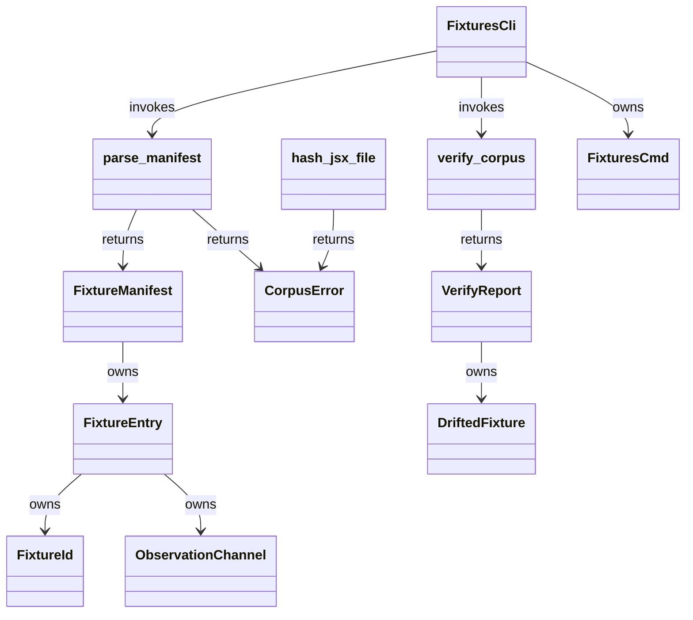
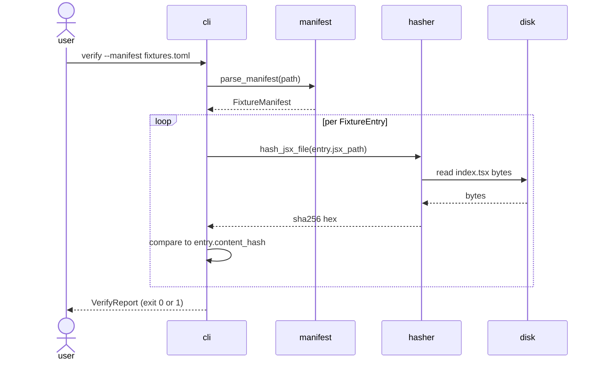
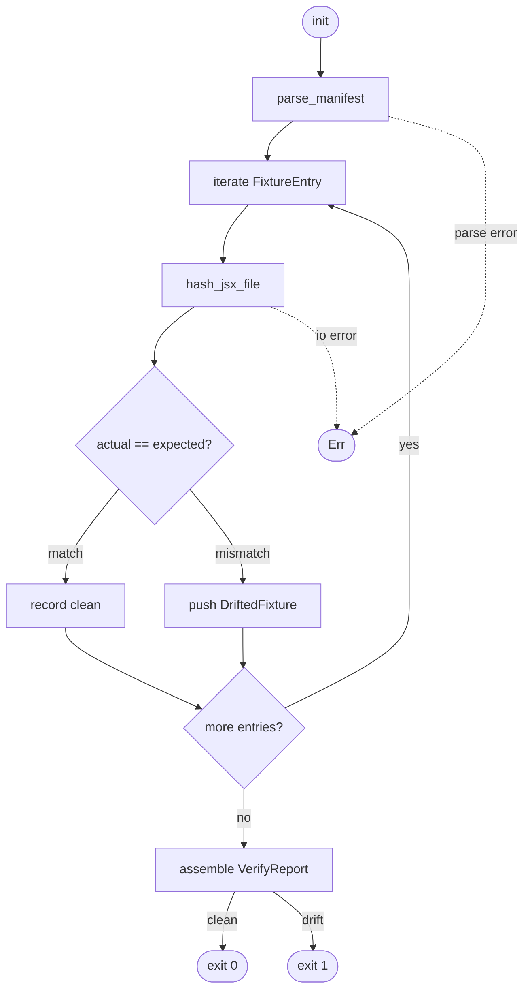

# Jet parity fixture corpus (MUI)

## Overview
<!-- type: overview lang: markdown -->

Parent epic: #2133. Issue: #2140.

The parity programme (epic #2133) measures jet's WASM renderer against a stock
React + ReactDOM + MUI DOM oracle on five externally-observable channels
(pixel, a11y, focus, pointer, IME). #2139 ships the **oracle runner** that
captures those channels into per-fixture artifact bundles. #2144 will gate CI
on diff thresholds. This slice — #2140 — fills the gap between those two: it
adopts the MUI docs demo set as the canonical **fixture corpus** the oracle
runs against and jet replays.

This is the foundation slice. It defines (a) the on-disk layout under
`projects/jet/parity/fixtures/mui/`, (b) the `fixtures.toml` manifest schema
that indexes every fixture with a content-addressable hash and an explicit
list of observation channels, (c) the `score jet parity fixtures` CLI for
listing, inspecting, and verifying the corpus, and (d) MIT-license
pass-through so MUI's docs source is attributed correctly. The hash-stable
ID scheme `mui-<component>-<variant>-v<n>` lets downstream specs reference
specific fixture revisions without ambiguity, and `score jet parity fixtures
verify` exits 1 the moment a JSX byte changes without a manifest bump.

To keep the slice mergeable in a single CRRR cycle, the initial corpus is
**three** fixtures (`mui-button-primary-v1`, `mui-textfield-outlined-v1`,
`mui-checkbox-basic-v1`). The full rollout (>=20 fixtures spanning the MUI
docs taxonomy) is tracked separately under epic #2133 — once the manifest
schema, CLI, and verifier ship here, subsequent slices only add fixture
directories + one `fixtures.toml` entry each.

Per-issue requirements:

- R1: Initial corpus has at least 3 MUI fixtures with ids `mui-button-primary-v1`, `mui-textfield-outlined-v1`, `mui-checkbox-basic-v1`; full corpus rollout (>=20) is tracked separately under the parent epic #2133.
- R2: Fixtures live under `projects/jet/parity/fixtures/mui/<fixture-id>/index.tsx`; the directory compiles in principle against stock React 18 + ReactDOM 18 + MUI v5 pinned through a single `package.json` colocated under `projects/jet/parity/fixtures/mui/`.
- R3: The `fixtures.toml` manifest indexes every fixture with exactly the fields `id`, `component`, `jsx_path`, `observation_channels`, `mui_demo_source_url`, `content_hash`; the `id` field matches the regex `^mui-[a-z0-9]+(?:-[a-z0-9]+)*-v[0-9]+$`.
- R4: The `observation_channels` array is an explicit subset of the five canonical channels `pixel`, `ax-tree`, `focus-order`, `pointer-hit-map`, `ime-trace`; unknown channel names are rejected at parse time.
- R5: The `content_hash` field is the SHA-256 digest of the UTF-8 bytes of the fixture's `index.tsx`, recomputed identically across runs and platforms with no normalisation at hash time.
- R6: A `LICENSE.upstream` file at the corpus root records the MUI MIT license verbatim with copyright line and permission notice intact.
- R7: The `score jet parity fixtures` CLI exposes three subcommands: `list` prints one fixture per line as id, component, jsx_path; `show <id>` prints the full manifest entry as TOML; `verify` recomputes every hash and exits 0 on a clean corpus or 1 on any drift.
- R8: Native Rust tests cover schema parse, channel subset validation, id regex enforcement, hash determinism, clean verify, drift detection via a tempdir mutation, and CLI smoke for all three subcommands.

## Dependency
<!-- type: dependency lang: mermaid -->



## Interaction
<!-- type: interaction lang: mermaid -->



## Logic
<!-- type: logic lang: mermaid -->



## Changes
<!-- type: changes lang: yaml -->

```yaml
changes:
  - path: projects/jet/parity/fixtures/mui/LICENSE.upstream
    kind: create
    section: overview
    impl_mode: codegen
    summary: MUI MIT license verbatim for attribution pass-through.
  - path: projects/jet/parity/fixtures/mui/fixtures.toml
    kind: create
    section: overview
    impl_mode: codegen
    summary: Index manifest of the initial three fixtures with content hashes.
  - path: projects/jet/parity/fixtures/mui/mui-button-primary-v1/index.tsx
    kind: create
    section: overview
    impl_mode: codegen
    summary: MUI Button primary variant fixture, adapted from the MUI docs Button demo.
  - path: projects/jet/parity/fixtures/mui/mui-textfield-outlined-v1/index.tsx
    kind: create
    section: overview
    impl_mode: codegen
    summary: MUI TextField outlined variant fixture, adapted from the MUI docs TextField demo.
  - path: projects/jet/parity/fixtures/mui/mui-checkbox-basic-v1/index.tsx
    kind: create
    section: overview
    impl_mode: codegen
    summary: MUI Checkbox basic fixture, adapted from the MUI docs Checkbox demo.
  - path: projects/jet/parity/fixtures/mui/package.json
    kind: create
    section: overview
    impl_mode: codegen
    summary: Pin exact React + ReactDOM + MUI versions for the fixture compile smoke test.
  - path: projects/jet/parity-corpus/Cargo.toml
    kind: create
    section: cli
    impl_mode: codegen
    summary: New crate housing the manifest parser, hasher, verifier, and CLI subcommand.
  - path: projects/jet/parity-corpus/src/lib.rs
    kind: create
    section: overview
    impl_mode: codegen
    summary: Public surface re-exports FixtureManifest, FixtureEntry, ObservationChannel, verify_corpus, parse_manifest, hash_jsx_file.
  - path: projects/jet/parity-corpus/src/manifest.rs
    kind: create
    section: overview
    impl_mode: codegen
    summary: TOML parse + schema validation for fixtures.toml; FixtureId regex; duplicate detection.
  - path: projects/jet/parity-corpus/src/hash.rs
    kind: create
    section: overview
    impl_mode: codegen
    summary: Deterministic SHA-256 of the fixture index.tsx UTF-8 bytes.
  - path: projects/jet/parity-corpus/src/verify.rs
    kind: create
    section: overview
    impl_mode: codegen
    summary: Recompute hashes and diff against manifest; emits VerifyReport.
  - path: projects/jet/parity-corpus/src/cli.rs
    kind: create
    section: cli
    impl_mode: codegen
    summary: clap FixturesCli + FixturesCmd implementing list, show, verify with exit-code contract.
  - path: projects/jet/parity-corpus/src/main.rs
    kind: create
    section: cli
    impl_mode: codegen
    summary: Binary entry point invoking cli::run.
  - path: projects/jet/parity-corpus/tests/corpus.rs
    kind: create
    section: unit-test
    impl_mode: codegen
    summary: Integration tests T1-T8 covering parse, channel subset, id regex, hash determinism, verify clean, verify drift, and CLI smoke.
  - path: Cargo.toml
    kind: update
    section: cli
    impl_mode: codegen
    summary: Add projects/jet/parity-corpus to the workspace members list.
  - path: ".aw/tech-design/projects/jet/specs/jet-parity-fixture-corpus.md"
    action: verify
    section: dependency
    impl_mode: hand-written
    description: |
      Traceability repair: hand-written TD section retained as the implementation edge during AW standardization.

  - path: ".aw/tech-design/projects/jet/specs/jet-parity-fixture-corpus.md"
    action: verify
    section: interaction
    impl_mode: hand-written
    description: |
      Traceability repair: hand-written TD section retained as the implementation edge during AW standardization.

  - path: ".aw/tech-design/projects/jet/specs/jet-parity-fixture-corpus.md"
    action: verify
    section: logic
    impl_mode: hand-written
    description: |
      Traceability repair: hand-written TD section retained as the implementation edge during AW standardization.

```

## Test plan
<!-- type: test-plan lang: mermaid -->

```mermaid
---
id: jet-parity-fixture-corpus-verification
requirements:
  manifest_parse_minimal:    { id: T1, text: "fixtures.toml with three entries parses cleanly",                        kind: functional, risk: medium, verify: test }
  reject_unknown_channel:    { id: T2, text: "manifest with unknown observation_channels value is rejected",          kind: functional, risk: medium, verify: test }
  reject_malformed_id:       { id: T3, text: "ids missing version suffix or using uppercase are rejected",            kind: functional, risk: medium, verify: test }
  hash_jsx_deterministic:    { id: T4, text: "hashing the same index.tsx twice yields the same hex digest",           kind: functional, risk: high,   verify: test }
  hash_jsx_known_vector:     { id: T5, text: "hashing a known JSX byte string produces a known sha256",               kind: functional, risk: high,   verify: test }
  verify_clean_corpus:       { id: T6, text: "verify on the checked-in corpus returns clean=true total=3",            kind: functional, risk: high,   verify: test }
  verify_detects_drift:      { id: T7, text: "mutating one byte of a fixture in a tempdir makes verify exit 1",       kind: functional, risk: high,   verify: test }
  cli_list_show_verify:      { id: T8, text: "list emits 3 lines, show emits TOML for the id, verify exits 0",         kind: interface,  risk: medium, verify: test }
elements:
  test_manifest_parse_minimal_corpus:            { kind: test, type: "rs/integration" }
  test_manifest_rejects_unknown_channel:         { kind: test, type: "rs/integration" }
  test_manifest_rejects_malformed_id:            { kind: test, type: "rs/integration" }
  test_hash_jsx_is_deterministic:                { kind: test, type: "rs/integration" }
  test_hash_jsx_matches_known_vector:            { kind: test, type: "rs/integration" }
  test_verify_clean_corpus:                      { kind: test, type: "rs/integration" }
  test_verify_detects_one_byte_jsx_edit:         { kind: test, type: "rs/integration" }
  test_cli_list_show_verify_smoke:               { kind: test, type: "rs/integration" }
relations:
  - { from: test_manifest_parse_minimal_corpus,            verifies: manifest_parse_minimal }
  - { from: test_manifest_rejects_unknown_channel,         verifies: reject_unknown_channel }
  - { from: test_manifest_rejects_malformed_id,            verifies: reject_malformed_id }
  - { from: test_hash_jsx_is_deterministic,                verifies: hash_jsx_deterministic }
  - { from: test_hash_jsx_matches_known_vector,            verifies: hash_jsx_known_vector }
  - { from: test_verify_clean_corpus,                      verifies: verify_clean_corpus }
  - { from: test_verify_detects_one_byte_jsx_edit,         verifies: verify_detects_drift }
  - { from: test_cli_list_show_verify_smoke,               verifies: cli_list_show_verify }
---
requirementDiagram
    requirement manifest_parse_minimal  { id: T1 text: parse three entry manifest         risk: medium verifymethod: test }
    requirement reject_unknown_channel  { id: T2 text: reject unknown observation channel risk: medium verifymethod: test }
    requirement reject_malformed_id     { id: T3 text: reject malformed fixture id        risk: medium verifymethod: test }
    requirement hash_jsx_deterministic  { id: T4 text: hash twice equal                   risk: high   verifymethod: test }
    requirement hash_jsx_known_vector   { id: T5 text: hash matches golden vector         risk: high   verifymethod: test }
    requirement verify_clean_corpus     { id: T6 text: clean corpus verify ok             risk: high   verifymethod: test }
    requirement verify_detects_drift    { id: T7 text: one byte edit detected             risk: high   verifymethod: test }
    requirement cli_list_show_verify    { id: T8 text: cli list show verify smoke         risk: medium verifymethod: test }
    element test_manifest_parse_minimal_corpus
    element test_manifest_rejects_unknown_channel
    element test_manifest_rejects_malformed_id
    element test_hash_jsx_is_deterministic
    element test_hash_jsx_matches_known_vector
    element test_verify_clean_corpus
    element test_verify_detects_one_byte_jsx_edit
    element test_cli_list_show_verify_smoke
    test_manifest_parse_minimal_corpus - verifies -> manifest_parse_minimal
    test_manifest_rejects_unknown_channel - verifies -> reject_unknown_channel
    test_manifest_rejects_malformed_id - verifies -> reject_malformed_id
    test_hash_jsx_is_deterministic - verifies -> hash_jsx_deterministic
    test_hash_jsx_matches_known_vector - verifies -> hash_jsx_known_vector
    test_verify_clean_corpus - verifies -> verify_clean_corpus
    test_verify_detects_one_byte_jsx_edit - verifies -> verify_detects_drift
    test_cli_list_show_verify_smoke - verifies -> cli_list_show_verify
```
