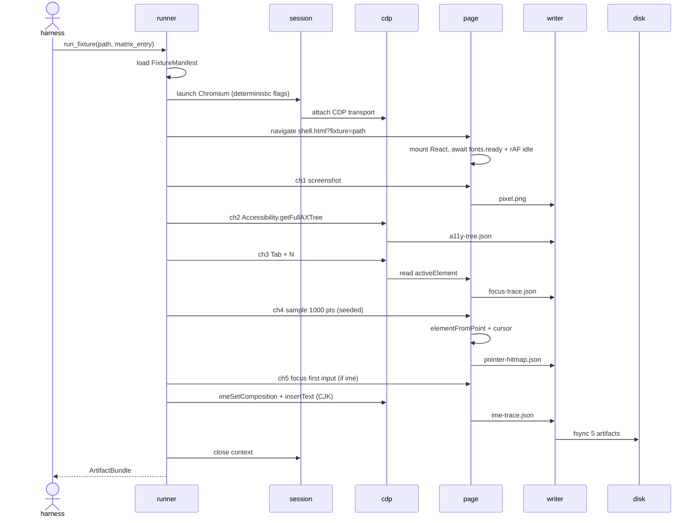
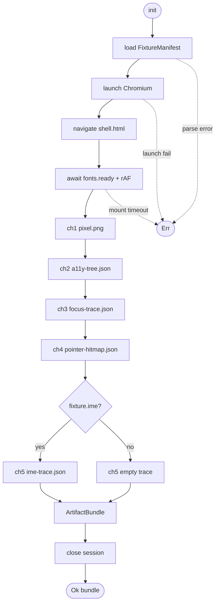

# Parity foundation — DOM reference runner

The DOM reference runner is the **oracle** every parity channel measures against.
It mounts a single React+MUI fixture in stock Chromium, captures the five
externally-observable channels (pixel / a11y / focus / pointer / IME) into a
deterministic per-fixture artifact bundle on disk, and exits. The downstream
parity channels (#2151 pixel diff, #2160 CDP AX, #2155 focus replay, #2167
pointer comparator, #2174 IME replay) consume these artifacts as ground truth.

Per-issue requirements:

- R1: Runner mounts a single JSX/TSX fixture declaring exactly one default-exported React component into a stock React 18 + ReactDOM + MUI v5 app served from a static HTML shell.
- R2: Runner drives Chromium via Playwright's CDP transport so the Accessibility, Input, and IME CDP domains are reachable directly (Playwright's high-level API alone does not expose `Accessibility.getFullAXTree`).
- R3: For each fixture × (browser, dpr) pair the runner writes exactly five artifacts to `artifacts/<fixture>/<browser>-<dpr>/`: `pixel.png`, `a11y-tree.json`, `focus-trace.json`, `pointer-hitmap.json`, `ime-trace.json`. Missing or empty artifact = failure, not skip (R1 of #2133).
- R4: Pixel artifact is a viewport screenshot, naming `<fixture>-<browser>-<dpr>.png`, taken after a deterministic settle (rAF idle + fonts.ready), with browser font hinting / antialiasing pinned via launch flags. DPR comes from the matrix; default matrix is `chromium × {1.0, 2.0}`.
- R5: A11y artifact is the verbatim `Accessibility.getFullAXTree` CDP response (root included, no filtering) serialized as deterministic JSON (sorted keys, LF endings, trailing newline).
- R6: Focus artifact is a JSON list of length `N` produced by pressing `Tab` `N` times from the document root; each entry records `{step, selector, role, name, bounds}` where `selector` is the deterministic CSS path of `document.activeElement` and `name` is the accessible name from AXNode. `N` is fixture-declared and defaults to 32; if focus wraps before `N`, remaining entries are recorded with `selector: "<body>"`.
- R7: Pointer hit map is a JSON list of 1000 entries, each `{x, y, target_selector, computed_cursor}` produced by sampling 1000 (x, y) coordinates from a seeded PRNG (seed = `fnv1a64(fixture_name)`) over the viewport, calling `document.elementFromPoint` in-page, and reading `getComputedStyle(target).cursor`. Coordinate count and seed derivation are fixed inputs to determinism (R7 of #2133).
- R8: IME trace is captured only for fixtures tagged `ime: true` in their frontmatter; the runner focuses the first `<input>`/`<textarea>` and replays a fixed CJK composition script (`["你", "好"]` two-character pinyin sequence via `Input.imeSetComposition` + `Input.insertText` CDP calls), recording every `compositionstart` / `compositionupdate` / `compositionend` / `input` event payload in arrival order. Non-IME fixtures emit an empty-but-well-formed `{events: []}` artifact (never a missing file).
- R9: Runner is deterministic: same jet SHA + same fixture file SHA + same browser version + same DPR + same matrix entry → byte-equivalent artifact bundle. Achieved by (a) pinned Chromium build via Playwright, (b) `--font-render-hinting=none --disable-skia-runtime-opts --disable-gpu-rasterization` launch flags, (c) seeded PRNG for pointer sampling, (d) fixed CJK script for IME, (e) deterministic JSON serializer.
- R10: Runner is invokable both as a standalone CLI (`cargo run -p jet-parity-oracle -- run --fixture mui-button`) and as a library from the jet test harness (`jet_parity_oracle::run_fixture(...)` returning `ArtifactBundle`). The jet test crate gains a thin re-export so existing integration tests can compare jet's WASM output against the same `ArtifactBundle`.
- R11: Per-fixture wall-clock budget is ≤ 8s on the reference CI runner (Chromium cold-start dominates; subsequent fixtures in the same process reuse the browser context). Aggregate corpus budget is ≤ 5 min for 32 fixtures (R6 of #2133's CI runtime budget).

## Dependency

```mermaid
---
id: parity-dom-reference-runner-types
types:
  Runner:                   { kind: struct }
  RunnerConfig:             { kind: struct }
  RunnerError:              { kind: enum }
  BrowserKind:              { kind: enum }
  MatrixEntry:              { kind: struct }
  FixtureManifest:          { kind: struct }
  ManifestError:            { kind: enum }
  ArtifactBundle:           { kind: struct }
  ArtifactWriter:           { kind: struct }
  ArtifactError:            { kind: enum }
  to_deterministic_json:    { kind: fn }
  BrowserSession:           { kind: trait }
  PlaywrightBrowserSession: { kind: struct, implements: [BrowserSession] }
  StubBrowserSession:       { kind: struct, implements: [BrowserSession] }
  CdpClient:                { kind: service }
  PageHost:                 { kind: struct }
  Channel:                  { kind: trait }
  ChannelArtifact:          { kind: enum }
  ChannelError:             { kind: enum }
  ChannelCtx:               { kind: struct }
  PixelChannel:             { kind: struct, implements: [Channel] }
  A11yChannel:              { kind: struct, implements: [Channel] }
  FocusChannel:             { kind: struct, implements: [Channel] }
  PointerChannel:           { kind: struct, implements: [Channel] }
  ImeChannel:               { kind: struct, implements: [Channel] }
  PointerHit:               { kind: struct }
  FocusEntry:               { kind: struct }
  DeterministicPrng:        { kind: struct }
  fnv1a64:                  { kind: fn }
  ReactMuiShell:            { kind: artifact }
edges:
  - { from: Runner,         to: RunnerConfig,    kind: owns,       label: "config" }
  - { from: Runner,         to: BrowserSession,  kind: owns,       label: "session" }
  - { from: Runner,         to: ArtifactBundle,  kind: emits,      label: "5 artifacts per fixture" }
  - { from: Runner,         to: FixtureManifest, kind: references, label: "loads fixture" }
  - { from: BrowserSession, to: CdpClient,       kind: owns,       label: "CDP transport" }
  - { from: BrowserSession, to: PageHost,        kind: owns,       label: "active page" }
  - { from: PageHost,       to: ReactMuiShell,   kind: references, label: "serves shell + fixture" }
  - { from: Runner,         to: PixelChannel,    kind: owns,       label: "channel 1" }
  - { from: Runner,         to: A11yChannel,     kind: owns,       label: "channel 2" }
  - { from: Runner,         to: FocusChannel,    kind: owns,       label: "channel 3" }
  - { from: Runner,         to: PointerChannel,  kind: owns,       label: "channel 4" }
  - { from: Runner,         to: ImeChannel,      kind: owns,       label: "channel 5" }
  - { from: PixelChannel,   to: Channel,         kind: implements }
  - { from: A11yChannel,    to: Channel,         kind: implements }
  - { from: FocusChannel,   to: Channel,         kind: implements }
  - { from: PointerChannel, to: Channel,         kind: implements }
  - { from: ImeChannel,     to: Channel,         kind: implements }
  - { from: PointerChannel, to: DeterministicPrng, kind: owns,     label: "seeded by fixture name" }
  - { from: ArtifactBundle, to: ArtifactWriter,  kind: references, label: "deterministic JSON + PNG writer" }
  - { from: PixelChannel,   to: ArtifactWriter,  kind: references, label: "pixel.png" }
  - { from: A11yChannel,    to: CdpClient,       kind: invokes,    label: "Accessibility.getFullAXTree" }
  - { from: FocusChannel,   to: CdpClient,       kind: invokes,    label: "Input.dispatchKeyEvent Tab" }
  - { from: PointerChannel, to: PageHost,        kind: invokes,    label: "in-page elementFromPoint" }
  - { from: ImeChannel,     to: CdpClient,       kind: invokes,    label: "Input.imeSetComposition / insertText" }
---
classDiagram
    class Runner
    class RunnerConfig
    class RunnerError
    class BrowserKind
    class MatrixEntry
    class FixtureManifest
    class ManifestError
    class ArtifactBundle
    class ArtifactWriter
    class ArtifactError
    class to_deterministic_json
    class BrowserSession
    class PlaywrightBrowserSession
    class StubBrowserSession
    class CdpClient
    class PageHost
    class Channel
    class ChannelArtifact
    class ChannelError
    class ChannelCtx
    class PixelChannel
    class A11yChannel
    class FocusChannel
    class PointerChannel
    class ImeChannel
    class PointerHit
    class FocusEntry
    class DeterministicPrng
    class fnv1a64
    class ReactMuiShell
    Runner --> RunnerConfig : owns
    Runner --> BrowserSession : owns
    Runner --> ArtifactBundle : emits
    Runner --> FixtureManifest : loads
    BrowserSession --> CdpClient : owns
    BrowserSession --> PageHost : owns
    PageHost --> ReactMuiShell : references
    Runner --> PixelChannel : owns ch1
    Runner --> A11yChannel : owns ch2
    Runner --> FocusChannel : owns ch3
    Runner --> PointerChannel : owns ch4
    Runner --> ImeChannel : owns ch5
    PixelChannel ..|> Channel
    A11yChannel ..|> Channel
    FocusChannel ..|> Channel
    PointerChannel ..|> Channel
    ImeChannel ..|> Channel
    PointerChannel --> DeterministicPrng : seeds
    ArtifactBundle --> ArtifactWriter : references
    A11yChannel --> CdpClient : getFullAXTree
    FocusChannel --> CdpClient : dispatchKeyEvent
    PointerChannel --> PageHost : elementFromPoint
    ImeChannel --> CdpClient : imeSetComposition
```

<!-- type: dependency lang: mermaid -->



## Interaction
<!-- type: interaction lang: mermaid -->



## Logic
<!-- type: logic lang: mermaid -->



Determinism contract (consumed by R9 above):

- Channel order is **fixed**: pixel → a11y → focus → pointer → ime. Earlier channels must not mutate page state visible to later channels (e.g. focus channel restores `document.activeElement = document.body` on exit; pointer channel uses `elementFromPoint` only — no synthetic dispatch).
- The settle step (`wait_paint`) requires (a) `document.fonts.ready` resolved, (b) two consecutive `requestAnimationFrame` callbacks fired without DOM mutation, and (c) the fixture shell setting `window.__jet_oracle_mounted = true`. Any of the three missing past 3000ms = `fail` with `MountTimeout`.
- The deterministic JSON writer sorts object keys, uses LF endings, emits a trailing newline, and elides whitespace beyond `": "` separators. The PNG writer disables image metadata chunks (no tIME / tEXt) so byte-equivalence holds across runs.
- The pointer PRNG seed is `fnv1a64(fixture_name)`; the sequence is `xoshiro256++` initialised from that seed. Replays of the same fixture name produce the same 1000 coordinates. Coordinate space is `[0, viewport_width) × [0, viewport_height)` with the matrix-supplied DPR baked into the viewport.

## Changes
<!-- type: changes lang: yaml -->

```yaml
changes:
  - path: projects/jet/parity-oracle/Cargo.toml
    action: create
    section: cli
    impl_mode: hand-written
    description: |
      New crate `jet-parity-oracle` declaring the headless DOM reference runner.
      Dependencies: tokio (multi-thread runtime), serde + serde_json (deterministic
      JSON), anyhow + thiserror (error types), playwright (Rust crate for
      CDP-capable Chromium control), image + png (deterministic PNG re-encode to
      strip metadata), rand_xoshiro (seeded PRNG), sha2 (artifact digest), clap
      (CLI). Library target plus a `parity-oracle` binary target. Listed under
      `projects/` workspace members in the root Cargo.toml (separate change).
  - path: projects/jet/parity-oracle/src/bin/parity_oracle.rs
    action: create
    section: dependency
    impl_mode: hand-written
    description: |
      CLI entry point binary (`cargo run -p jet-parity-oracle --bin parity-oracle`).
      Thin clap wrapper that parses `--fixture <name>` (+ optional matrix flags)
      and dispatches to `jet_parity_oracle::run_fixture`. Satisfies the
      standalone-CLI half of R10; the library half is the `run_fixture` symbol
      re-exported from `src/lib.rs`.
  - path: projects/jet/parity-oracle/src/lib.rs
    action: create
    section: dependency
    impl_mode: hand-written
    description: |
      Crate root. Re-exports `Runner`, `RunnerConfig`, `FixtureManifest`,
      `ArtifactBundle`, `RunnerError`, the `Channel` trait, and the five
      channel impls. Provides the high-level `run_fixture(config, fixture_path,
      matrix_entry) -> Result<ArtifactBundle, RunnerError>` entry point that the
      jet test harness calls. The lifecycle in §Logic is implemented here as a
      single async fn that drives the channel sequence in fixed order.
  - path: projects/jet/parity-oracle/src/runner.rs
    action: create
    section: dependency
    impl_mode: hand-written
    description: |
      `Runner` + `BrowserSession` + `PageHost`. Launches Chromium via the
      `playwright` crate with the deterministic flag list
      (`--font-render-hinting=none`, `--disable-skia-runtime-opts`,
      `--disable-gpu-rasterization`, `--hide-scrollbars`, `--force-device-scale-factor=<dpr>`),
      attaches the CDP session via `page.context().new_cdp_session(page)`,
      navigates to the static shell at `fixtures/__shell__/index.html`, and
      blocks on the `__jet_oracle_mounted` sentinel + `fonts.ready` + 2× rAF.
      Per-fixture wall-clock budget enforced via `tokio::time::timeout`.
  - path: projects/jet/parity-oracle/src/manifest.rs
    action: create
    section: dependency
    impl_mode: hand-written
    description: |
      `FixtureManifest` parser. A fixture is a TSX file whose first export
      block carries a leading JSDoc-style frontmatter block
      `/** @fixture { "name": "...", "ime": false, "tab_count": 32 } */`.
      Parser extracts the JSON, validates against the manifest schema
      (name kebab-case, tab_count 0..=256, ime boolean), returns a
      `FixtureManifest` with defaults filled. Missing block = `ManifestError::Missing`.
  - path: projects/jet/parity-oracle/src/artifacts.rs
    action: create
    section: dependency
    impl_mode: hand-written
    description: |
      `ArtifactBundle` + `ArtifactWriter`. Bundle is `{ root_dir, pixel_png,
      a11y_json, focus_json, pointer_json, ime_json, sha256s: HashMap<&str, [u8;32]> }`.
      Writer enforces (a) deterministic JSON (sorted keys, LF, trailing newline)
      via a custom `serde_json::ser::PrettyFormatter` replacement, (b) PNG
      re-encode through `image::ImageEncoder` configured to strip ancillary
      chunks, (c) atomic write via tempfile + `rename`. Returns sha256 for each
      file so the harness can assert byte-equivalence.
  - path: projects/jet/parity-oracle/src/channels/mod.rs
    action: create
    section: dependency
    impl_mode: hand-written
    description: |
      Defines the `Channel` trait — `async fn capture(&self, ctx: &mut
      ChannelCtx) -> Result<ChannelArtifact, ChannelError>`. `ChannelCtx`
      carries the CDP session, the page handle, the deterministic PRNG, and
      the fixture manifest. Re-exports the five channel impls below.
  - path: projects/jet/parity-oracle/src/channels/pixel.rs
    action: create
    section: dependency
    impl_mode: hand-written
    description: |
      `PixelChannel`. Calls `page.screenshot()` with `{ full_page: false,
      omit_background: false }`, re-encodes through the deterministic PNG
      writer (strip metadata chunks), returns the resulting bytes. Naming
      convention: `<fixture>-<browser>-<dpr>.png` is enforced at write time
      by the writer (filename is the channel artifact id).
  - path: projects/jet/parity-oracle/src/channels/a11y.rs
    action: create
    section: dependency
    impl_mode: hand-written
    description: |
      `A11yChannel`. Sends CDP `Accessibility.enable` then
      `Accessibility.getFullAXTree` (no node-id filter — full tree from root).
      Serializes the raw `nodes` array via the deterministic JSON writer.
      No post-processing: the artifact is the verbatim CDP response. axe-core
      and per-node analyses live downstream in #2160 / #2163.
  - path: projects/jet/parity-oracle/src/channels/focus.rs
    action: create
    section: dependency
    impl_mode: hand-written
    description: |
      `FocusChannel`. Restores activeElement to `document.body`, then loops
      `manifest.tab_count` times: dispatch CDP `Input.dispatchKeyEvent
      {type: keyDown, key: Tab}` + `keyUp`, then evaluate
      `document.activeElement` in-page, derive its deterministic CSS selector
      (id > stable data-attr > nth-of-type chain), pair with the AXNode role
      + accessible name from the previously-fetched ax tree (lookup by
      backend-node-id), and record `{step, selector, role, name, bounds}`.
      Restores activeElement to body on exit so downstream channels start
      from a known state.
  - path: projects/jet/parity-oracle/src/channels/pointer.rs
    action: create
    section: dependency
    impl_mode: hand-written
    description: |
      `PointerChannel`. Initialises `Xoshiro256PlusPlus` from
      `fnv1a64(manifest.name)`, draws 1000 `(x, y)` pairs in
      `[0, viewport_w) × [0, viewport_h)`, then runs a single in-page
      `Runtime.evaluate` script that loops over the coordinate list,
      calls `document.elementFromPoint(x, y)`, computes the deterministic
      selector + `getComputedStyle(target).cursor`, and returns the array.
      No synthetic event dispatch — read-only hit-test only.
  - path: projects/jet/parity-oracle/src/channels/ime.rs
    action: create
    section: dependency
    impl_mode: hand-written
    description: |
      `ImeChannel`. If `manifest.ime` is false, writes `{events: []}` and
      returns. Otherwise: focuses the first descendant `<input>` /
      `<textarea>` of the fixture root; installs an in-page event listener
      that captures `compositionstart` / `compositionupdate` /
      `compositionend` / `input` payloads into a JS array; dispatches the
      fixed CJK pinyin script via CDP `Input.imeSetComposition` (text "ni"
      then "nihao") and `Input.insertText` ("你"/"好"); reads the array
      back via `Runtime.evaluate`; serializes deterministically.
  - path: projects/jet/parity-oracle/fixtures/__shell__/index.html
    action: create
    section: dependency
    impl_mode: hand-written
    description: |
      Static HTML shell that loads React 18 + ReactDOM + MUI v5 from pinned
      CDN URLs (subresource integrity hashes locked), reads the
      `?fixture=<path>` query param, dynamically `import()`s the matching
      TSX module (transpiled at build time into the shell bundle), mounts
      its default export into `<div id="root">`, and sets
      `window.__jet_oracle_mounted = true` once mounted. The shell is the
      only HTML page the runner ever navigates to.
  - path: projects/jet/parity-oracle/fixtures/__shell__/build.mjs
    action: create
    section: dependency
    impl_mode: hand-written
    description: |
      Node build script (esbuild) that pre-bundles every `fixtures/*.tsx`
      into `fixtures/__shell__/dist/<fixture>.js` so the shell can lazy-load
      a fixture by name without a live TS compiler. Runs once at
      `cargo build` time via a `build.rs` shim in the parity-oracle crate.
  - path: projects/jet/parity-oracle/fixtures/mui-button.tsx
    action: create
    section: dependency
    impl_mode: hand-written
    description: |
      Starter fixture. Default-exports a single `<Button variant="contained">Click me</Button>`
      from MUI. Carries the manifest frontmatter
      `/** @fixture { "name": "mui-button", "ime": false, "tab_count": 8 } */`.
      Establishes the fixture shape for #2140 (MUI corpus expansion).
  - path: projects/jet/parity-oracle/tests/runner_smoke.rs
    action: create
    section: unit-test
    impl_mode: hand-written
    description: |
      Integration test: runs the starter `mui-button` fixture against
      Chromium and asserts that (a) all five artifacts exist on disk,
      (b) each is non-empty and well-formed (PNG signature, JSON parse),
      (c) re-running the runner twice yields byte-equivalent artifact
      sha256s (R9 determinism gate). Skipped when `JET_PARITY_ORACLE_SKIP=1`
      is set (CI hosts without Chromium); skip path emits a single
      `eprintln!` not a panic.
  - path: projects/jet/Cargo.toml
    action: modify
    section: cli
    impl_mode: hand-written
    description: |
      Add `jet-parity-oracle` as a dev-dependency so the jet test harness
      can call `jet_parity_oracle::run_fixture` from integration tests. No
      runtime dep.
  - path: projects/jet/tests/wasm/parity_oracle_reexport.rs
    action: create
    section: unit-test
    impl_mode: hand-written
    description: |
      Thin integration test that imports `jet_parity_oracle::run_fixture`
      and asserts the symbol resolves at link time. Establishes the
      re-export integration point that #2151 / #2160 / #2167 / #2174 will
      build on (each downstream parity test will load the artifact bundle
      and compare against jet's WASM output).
  - path: .aw/tech-design/projects/jet/logic/parity-dom-reference-runner.md
    action: create
    section: dependency
    impl_mode: hand-written
    description: |
      Mirror logic doc. Cites this spec, summarises the five-channel
      capture order, the determinism contract, and the artifact layout.
      Lives in the logic tree so future cross-channel specs (#2151 pixel
      tolerance, #2160 CDP AX, #2167 pointer comparator, #2174 IME replay)
      can `$ref` it without dereferencing the per-issue spec.
  - path: ".aw/tech-design/projects/jet/specs/parity-dom-reference-runner.md"
    action: verify
    section: interaction
    impl_mode: hand-written
    description: |
      Traceability repair: hand-written TD section retained as the implementation edge during AW standardization.

  - path: ".aw/tech-design/projects/jet/specs/parity-dom-reference-runner.md"
    action: verify
    section: logic
    impl_mode: hand-written
    description: |
      Traceability repair: hand-written TD section retained as the implementation edge during AW standardization.

```

## Test Plan
<!-- type: test-plan lang: mermaid -->

```mermaid
---
id: parity-dom-reference-runner-verification
requirements:
  five_artifacts_emitted:    { id: T1, text: "runner emits all 5 artifacts for a non-IME fixture",                          kind: functional,  risk: high,   verify: test }
  ime_artifact_empty_ok:     { id: T2, text: "non-IME fixture writes well-formed {events: []} ime-trace.json (never missing)", kind: functional, risk: medium, verify: test }
  ime_artifact_captured:     { id: T3, text: "IME fixture captures composition events from CDP CJK script",                 kind: functional,  risk: high,   verify: test }
  pixel_naming_convention:   { id: T4, text: "pixel artifact path matches <fixture>-<browser>-<dpr>.png",                   kind: interface,   risk: medium, verify: test }
  a11y_verbatim_axtree:      { id: T5, text: "a11y artifact is verbatim Accessibility.getFullAXTree, unmodified",           kind: functional,  risk: high,   verify: test }
  focus_trace_length:        { id: T6, text: "focus trace has exactly tab_count entries with selector + role + name",       kind: functional,  risk: high,   verify: test }
  pointer_seeded_count:      { id: T7, text: "pointer hitmap has 1000 entries, PRNG seeded by fnv1a64(fixture_name)",       kind: functional,  risk: high,   verify: test }
  deterministic_replay:      { id: T8, text: "running same fixture twice yields byte-equivalent artifact sha256s",          kind: functional,  risk: high,   verify: test }
  cdp_session_attached:      { id: T9, text: "runner attaches CDP session and can call Accessibility/Input domains",        kind: interface,   risk: medium, verify: test }
  mount_timeout_fails:       { id: T10, text: "fixture whose shell never sets __jet_oracle_mounted fails with MountTimeout", kind: functional, risk: medium, verify: test }
  per_fixture_budget:        { id: T11, text: "single-fixture wall clock stays under 8s on the reference runner",           kind: performance, risk: medium, verify: test }
  jet_harness_reexport:      { id: T12, text: "jet integration test resolves jet_parity_oracle::run_fixture at link time",  kind: interface,   risk: low,    verify: test }
elements:
  test_runner_emits_five_artifacts:           { kind: test, type: "rs/integration" }
  test_non_ime_fixture_writes_empty_ime_json: { kind: test, type: "rs/integration" }
  test_ime_fixture_captures_composition:      { kind: test, type: "rs/integration" }
  test_pixel_artifact_naming:                 { kind: test, type: "rs/#[test]" }
  test_a11y_artifact_is_verbatim_axtree:      { kind: test, type: "rs/integration" }
  test_focus_trace_length_and_shape:          { kind: test, type: "rs/integration" }
  test_pointer_hitmap_seeded_1000:            { kind: test, type: "rs/integration" }
  test_byte_equivalent_replay:                { kind: test, type: "rs/integration" }
  test_cdp_session_attached:                  { kind: test, type: "rs/integration" }
  test_mount_sentinel_timeout:                { kind: test, type: "rs/integration" }
  test_per_fixture_budget_under_8s:           { kind: test, type: "rs/integration" }
  test_jet_harness_reexport_symbol:           { kind: test, type: "rs/integration" }
relations:
  - { from: test_runner_emits_five_artifacts,           verifies: five_artifacts_emitted }
  - { from: test_non_ime_fixture_writes_empty_ime_json, verifies: ime_artifact_empty_ok }
  - { from: test_ime_fixture_captures_composition,      verifies: ime_artifact_captured }
  - { from: test_pixel_artifact_naming,                 verifies: pixel_naming_convention }
  - { from: test_a11y_artifact_is_verbatim_axtree,      verifies: a11y_verbatim_axtree }
  - { from: test_focus_trace_length_and_shape,          verifies: focus_trace_length }
  - { from: test_pointer_hitmap_seeded_1000,            verifies: pointer_seeded_count }
  - { from: test_byte_equivalent_replay,                verifies: deterministic_replay }
  - { from: test_cdp_session_attached,                  verifies: cdp_session_attached }
  - { from: test_mount_sentinel_timeout,                verifies: mount_timeout_fails }
  - { from: test_per_fixture_budget_under_8s,           verifies: per_fixture_budget }
  - { from: test_jet_harness_reexport_symbol,           verifies: jet_harness_reexport }
---
requirementDiagram
    requirement five_artifacts_emitted    { id: T1  text: emits 5 artifacts                  risk: high   verifymethod: test }
    requirement ime_artifact_empty_ok     { id: T2  text: empty ime trace for non ime        risk: medium verifymethod: test }
    requirement ime_artifact_captured     { id: T3  text: cjk composition captured           risk: high   verifymethod: test }
    requirement pixel_naming_convention   { id: T4  text: pixel naming convention            risk: medium verifymethod: test }
    requirement a11y_verbatim_axtree      { id: T5  text: a11y verbatim axtree               risk: high   verifymethod: test }
    requirement focus_trace_length        { id: T6  text: focus trace tab count entries      risk: high   verifymethod: test }
    requirement pointer_seeded_count      { id: T7  text: pointer 1000 entries seeded prng   risk: high   verifymethod: test }
    requirement deterministic_replay      { id: T8  text: byte equivalent replay             risk: high   verifymethod: test }
    requirement cdp_session_attached      { id: T9  text: cdp session domains reachable      risk: medium verifymethod: test }
    requirement mount_timeout_fails       { id: T10 text: mount sentinel timeout error       risk: medium verifymethod: test }
    requirement per_fixture_budget        { id: T11 text: under 8s per fixture               risk: medium verifymethod: test }
    requirement jet_harness_reexport      { id: T12 text: jet harness symbol resolves        risk: low    verifymethod: test }
    element test_runner_emits_five_artifacts
    element test_non_ime_fixture_writes_empty_ime_json
    element test_ime_fixture_captures_composition
    element test_pixel_artifact_naming
    element test_a11y_artifact_is_verbatim_axtree
    element test_focus_trace_length_and_shape
    element test_pointer_hitmap_seeded_1000
    element test_byte_equivalent_replay
    element test_cdp_session_attached
    element test_mount_sentinel_timeout
    element test_per_fixture_budget_under_8s
    element test_jet_harness_reexport_symbol
    test_runner_emits_five_artifacts - verifies -> five_artifacts_emitted
    test_non_ime_fixture_writes_empty_ime_json - verifies -> ime_artifact_empty_ok
    test_ime_fixture_captures_composition - verifies -> ime_artifact_captured
    test_pixel_artifact_naming - verifies -> pixel_naming_convention
    test_a11y_artifact_is_verbatim_axtree - verifies -> a11y_verbatim_axtree
    test_focus_trace_length_and_shape - verifies -> focus_trace_length
    test_pointer_hitmap_seeded_1000 - verifies -> pointer_seeded_count
    test_byte_equivalent_replay - verifies -> deterministic_replay
    test_cdp_session_attached - verifies -> cdp_session_attached
    test_mount_sentinel_timeout - verifies -> mount_timeout_fails
    test_per_fixture_budget_under_8s - verifies -> per_fixture_budget
    test_jet_harness_reexport_symbol - verifies -> jet_harness_reexport
```

# Reviews

- **2026-05-16T20:00Z · score-td-reviewer** — approved
  - **Verdict:** approved
  - Spec cleanly delivers the oracle contract: R3–R8 mandate one artifact per channel (pixel/a11y/focus/pointer/IME), R9 nails determinism (pinned Chromium flags, fnv1a64+xoshiro PRNG, fixed CJK script, sorted-key JSON), R10–R11 cover both CLI/library entry points and the ≤8s per-fixture budget, and the Test Plan's T1–T12 verify each channel and the byte-equivalent replay gate end-to-end.
