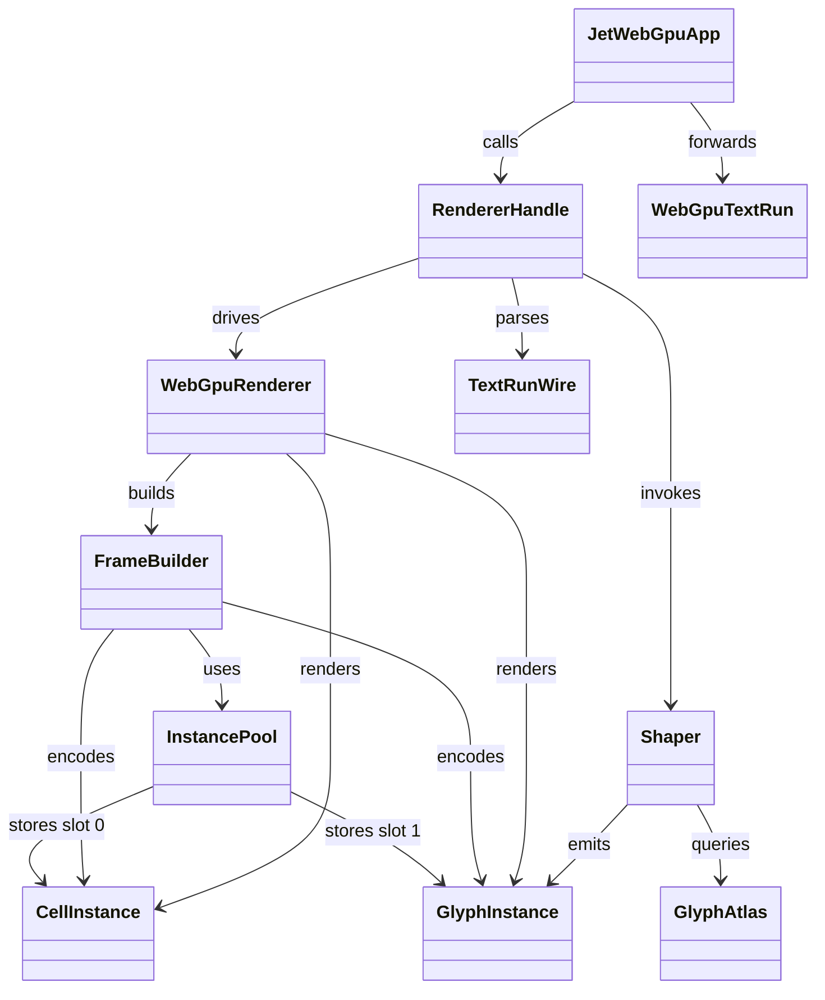
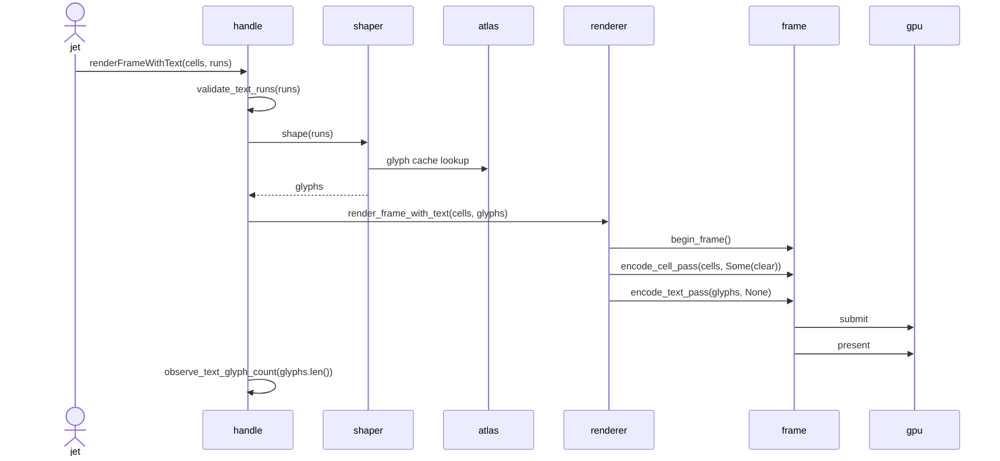
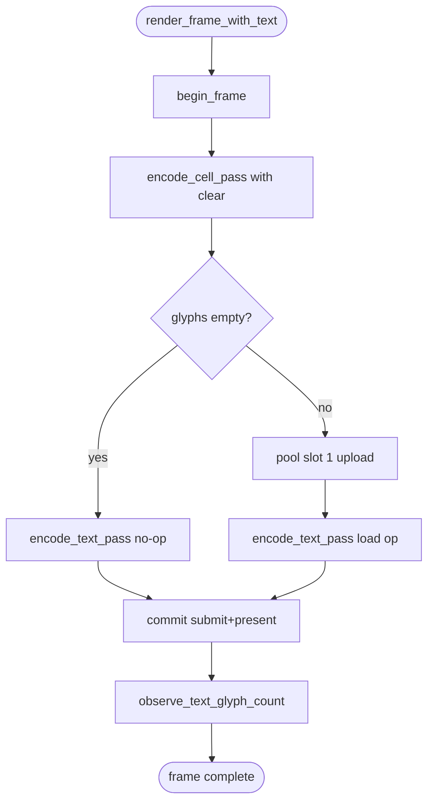

# WebGPU text pass — encode seam

## Dependency
<!-- type: dependency lang: mermaid -->



## Interaction
<!-- type: interaction lang: mermaid -->



## Logic
<!-- type: logic lang: mermaid -->



## Changes
<!-- type: changes lang: yaml -->

```yaml
changes:
  - path: crates/cclab-grid-render-webgpu/src/frame.rs
    action: modify
    section: dependency
    impl_mode: hand-written
    description: Add FrameBuilder::encode_text_pass(glyphs, clear) that reuses the text_pass bind-group layout + WGSL pipeline, uploads GlyphInstance bytes into instance-pool slot 1 when non-empty, and begins one render pass with the requested load op (Load when clear is None, Clear(c) otherwise). Mirrors encode_cell_pass empty/clear semantics and shares the same encoder under the one-submit invariant. New regression tests cover empty+None no-op and non-empty load-op draw call count.
  - path: crates/cclab-grid-render-webgpu/src/lib.rs
    action: modify
    section: dependency
    impl_mode: hand-written
    description: Add WebGpuRenderer::render_frame_with_text(cells, glyphs) that calls begin_frame once, encodes cell pass with Some(clear), encodes text pass with None, and commits exactly one submission. Leaves render_frame and render_frame_clipped byte-equivalent. Adds tracing span "frame.text_pass" nested under the existing frame span for parity with cell_pass.
  - path: crates/cclab-grid-render-webgpu/src/instance_pool.rs
    action: modify
    section: dependency
    impl_mode: hand-written
    description: Allow pool slot 1 to be reserved and grown independently of slot 0. The grow rule (min-size, returns reusable wgpu::Buffer handle) is identical to slot 0; slot 0 cell-pass uploads must not invalidate slot 1's buffer (and vice versa). Add a unit test that uploads to slot 0 then slot 1 then slot 0 again and asserts the slot 1 handle stays valid.
  - path: crates/cclab-grid-render-webgpu/src/text_pass.rs
    action: modify
    section: dependency
    impl_mode: hand-written
    description: Expose a stable pub fn that returns the text-pass render pipeline (currently constructed inline in tests). FrameBuilder::encode_text_pass calls into it. No WGSL or BGL changes.
  - path: crates/cclab-grid-wasm/src/renderer_bridge.rs
    action: modify
    section: dependency
    impl_mode: hand-written
    description: Extend RendererHandle::render_frame_with_text so it (a) parses TextRunWire as before, (b) shapes each run via the crate's shaper module against the active font_db + glyph_atlas, (c) collects GlyphInstance rows into a Vec, (d) calls renderer.render_frame_with_text(cells, glyphs) instead of the current cell-only fallback, (e) records last_text_glyph_count on BridgeState. Adds observe_text_glyph_count helper alongside observe_text_runs.
  - path: projects/jet/wasm/src/react/webgpu_app.rs
    action: modify
    section: dependency
    impl_mode: hand-written
    description: Extend window.__jet_webgpu_status with lastTextGlyphCount mirroring lastTextRunCount; do not remove or rename any existing field. bridgeMode flips from "text-runs" to "text-glyphs" once the new path is wired.
  - path: projects/jet/tests/wasm/wasm_build_end_to_end.rs
    action: modify
    section: unit-test
    impl_mode: hand-written
    description: In webgpu_renderer_reports_runtime_status_when_available, after the existing text-run assertion, add an assertion that window.__jet_webgpu_status.lastTextGlyphCount > 0 when navigator.gpu is present; keep the existing should_skip_env gate so hosts without WebGPU still skip cleanly.
  - path: .aw/tech-design/projects/jet/logic/wasm-renderer-webgpu-backend.md
    action: modify
    section: dependency
    impl_mode: hand-written
    description: Update the requirements matrix to reflect that W11 now flows glyphs into the lower renderer; add cross-references to the new spec for the encode seam. No backend-bridge contract changes.
  - path: .aw/tech-design/crates/cclab-grid-wasm/logic/renderer_bridge.md
    action: modify
    section: dependency
    impl_mode: hand-written
    description: Note that renderFrameWithText now shapes runs into GlyphInstance rows and forwards them to the lower renderer; reference the new spec for the wire-to-glyph plumbing.
  - path: ".aw/tech-design/projects/jet/specs/webgpu-text-pass-encode.md"
    action: verify
    section: interaction
    impl_mode: hand-written
    description: |
      Traceability repair: hand-written TD section retained as the implementation edge during AW standardization.

  - path: ".aw/tech-design/projects/jet/specs/webgpu-text-pass-encode.md"
    action: verify
    section: logic
    impl_mode: hand-written
    description: |
      Traceability repair: hand-written TD section retained as the implementation edge during AW standardization.

```

## Test Plan
<!-- type: test-plan lang: mermaid -->

```mermaid
---
id: webgpu-text-pass-encode-verification
requirements:
  encode_text_pass_basic:    { id: T1, text: "encode_text_pass draws a render pass with text pipeline + slot 1 upload", kind: functional, risk: high,   verify: test }
  encode_text_pass_noop:     { id: T2, text: "empty glyphs + clear None encodes nothing",                              kind: functional, risk: medium, verify: test }
  render_frame_with_text:    { id: T3, text: "render_frame_with_text composes cell then text with one submit",         kind: functional, risk: high,   verify: test }
  pool_slot_independence:    { id: T4, text: "slot 0 + slot 1 grow independently and do not clobber each other",       kind: functional, risk: high,   verify: test }
  legacy_byte_equivalence:   { id: T5, text: "render_frame and render_frame_clipped behavior unchanged",               kind: regression, risk: medium, verify: test }
  bridge_shapes_runs:        { id: T6, text: "renderer bridge produces GlyphInstance rows from TextRunWire payloads",  kind: functional, risk: high,   verify: test }
  bridge_observes_count:     { id: T7, text: "bridge state records last_text_glyph_count after shape + submit",        kind: functional, risk: medium, verify: test }
  chromium_runtime_smoke:    { id: T8, text: "wasm e2e asserts lastTextGlyphCount > 0 when navigator.gpu present",     kind: functional, risk: high,   verify: test }
  coverage_stays_managed:    { id: T9, text: "aw standardize managed next reports 100 percent for touched scopes",  kind: tooling,    risk: low,    verify: tool }
elements:
  test_encode_text_pass_draws_when_non_empty:     { kind: test, type: "rs/#[test]" }
  test_encode_text_pass_noop_on_empty_and_none:   { kind: test, type: "rs/#[test]" }
  test_render_frame_with_text_single_submit:      { kind: test, type: "rs/#[test]" }
  test_instance_pool_slot_independence:           { kind: test, type: "rs/#[test]" }
  test_render_frame_unchanged_against_baseline:   { kind: test, type: "rs/#[test]" }
  test_bridge_shapes_runs_into_glyph_instances:   { kind: test, type: "rs/#[test]" }
  test_bridge_observes_last_text_glyph_count:     { kind: test, type: "rs/#[test]" }
  test_webgpu_renderer_reports_glyph_count:       { kind: test, type: "rs/integration" }
  check_managed_coverage_after_slice:             { kind: check, type: "shell/score-standardize" }
relations:
  - { from: test_encode_text_pass_draws_when_non_empty,   verifies: encode_text_pass_basic }
  - { from: test_encode_text_pass_noop_on_empty_and_none, verifies: encode_text_pass_noop }
  - { from: test_render_frame_with_text_single_submit,    verifies: render_frame_with_text }
  - { from: test_instance_pool_slot_independence,         verifies: pool_slot_independence }
  - { from: test_render_frame_unchanged_against_baseline, verifies: legacy_byte_equivalence }
  - { from: test_bridge_shapes_runs_into_glyph_instances, verifies: bridge_shapes_runs }
  - { from: test_bridge_observes_last_text_glyph_count,   verifies: bridge_observes_count }
  - { from: test_webgpu_renderer_reports_glyph_count,     verifies: chromium_runtime_smoke }
  - { from: check_managed_coverage_after_slice,           verifies: coverage_stays_managed }
---
requirementDiagram
    requirement encode_text_pass_basic    { id: T1 text: encode_text_pass draws pass risk: high   verifymethod: test }
    requirement encode_text_pass_noop     { id: T2 text: empty glyphs no op            risk: medium verifymethod: test }
    requirement render_frame_with_text    { id: T3 text: two pass single submit         risk: high   verifymethod: test }
    requirement pool_slot_independence    { id: T4 text: slot 0 and slot 1 isolated     risk: high   verifymethod: test }
    requirement legacy_byte_equivalence   { id: T5 text: legacy paths unchanged         risk: medium verifymethod: test }
    requirement bridge_shapes_runs        { id: T6 text: bridge shapes runs to glyphs   risk: high   verifymethod: test }
    requirement bridge_observes_count     { id: T7 text: bridge records glyph count     risk: medium verifymethod: test }
    requirement chromium_runtime_smoke    { id: T8 text: e2e asserts glyph count        risk: high   verifymethod: test }
    requirement coverage_stays_managed    { id: T9 text: managed coverage 100 pct       risk: low    verifymethod: tool }
    element test_encode_text_pass_draws_when_non_empty
    element test_encode_text_pass_noop_on_empty_and_none
    element test_render_frame_with_text_single_submit
    element test_instance_pool_slot_independence
    element test_render_frame_unchanged_against_baseline
    element test_bridge_shapes_runs_into_glyph_instances
    element test_bridge_observes_last_text_glyph_count
    element test_webgpu_renderer_reports_glyph_count
    element check_managed_coverage_after_slice
    test_encode_text_pass_draws_when_non_empty - verifies -> encode_text_pass_basic
    test_encode_text_pass_noop_on_empty_and_none - verifies -> encode_text_pass_noop
    test_render_frame_with_text_single_submit - verifies -> render_frame_with_text
    test_instance_pool_slot_independence - verifies -> pool_slot_independence
    test_render_frame_unchanged_against_baseline - verifies -> legacy_byte_equivalence
    test_bridge_shapes_runs_into_glyph_instances - verifies -> bridge_shapes_runs
    test_bridge_observes_last_text_glyph_count - verifies -> bridge_observes_count
    test_webgpu_renderer_reports_glyph_count - verifies -> chromium_runtime_smoke
    check_managed_coverage_after_slice - verifies -> coverage_stays_managed
```

# Reviews

### Review 1
**Verdict:** approved

_2026-05-15T17:24Z · score-td-reviewer_

- [Dependency] classDiagram + Mermaid Plus YAML is well-formed; types/edges cleanly capture the new `FrameBuilder::encode_text_pass` and `WebGpuRenderer::render_frame_with_text` seams plus InstancePool slot 1, and the JetWebGpuApp → RendererHandle → Shaper/GlyphAtlas wiring matches the existing renderer_bridge.rs surface (verified `validate_text_runs`, `observe_text_runs`, `last_text_run_count`, `TextRunWire` all exist).
- [Interaction] sequenceDiagram correctly threads `renderFrameWithText(cells, runs)` → `validate_text_runs` → `shape` → `render_frame_with_text` → two passes → one submit → `observe_text_glyph_count`; lines up with the Logic flowchart and the issue's R3/R6/R7.
- [Logic] flowchart accurately encodes the empty-glyph no-op branch (R2) and the load-op text pass over a cleared cell pass (R1, R3); cell pass uses `Some(clear)` and text pass uses `None`, matching `frame.rs` (`encode_cell_pass` already accepts the same shape).
- [Changes] All nine file paths exist on disk; descriptions cite real, current symbol names (`FrameBuilder::encode_cell_pass` at frame.rs:80, `render_frame`/`render_frame_clipped`/`begin_frame` in lib.rs, slot-indexed `InstancePool::get_or_grow`, `RendererHandle::render_frame_with_text` shim in renderer_bridge.rs, `__jet_webgpu_status` keys in webgpu_app.rs, `webgpu_renderer_reports_runtime_status_when_available` in tests). The two TD cross-reference specs (`wasm-renderer-webgpu-backend.md`, `crates/cclab-grid-wasm/logic/renderer_bridge.md`) both exist.
- [Test Plan] requirementDiagram + YAML are well-formed; T1–T9 each trace to exactly one element via `relations:`, kinds/risk/verify are consistent, and the chromium_runtime_smoke (T8) ↔ `wasm_build_end_to_end::webgpu_renderer_reports_runtime_status_when_available` mapping is concrete and implementable.
