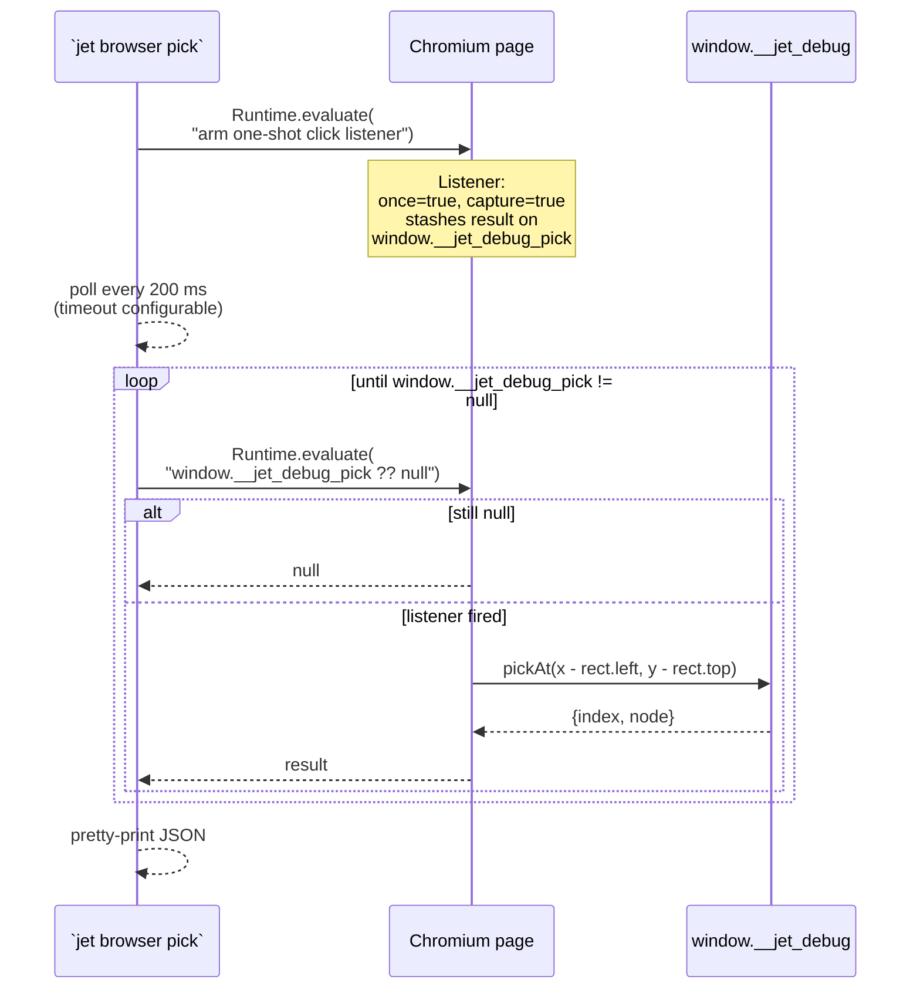

# jet — `jet browser` debugging CLI

## Changes
<!-- type: changes lang: yaml -->

```yaml
changes:
  - path: ".aw/tech-design/projects/jet/tools/wasm-renderer-browser-cli.md"
    action: modify
    section: doc
    impl_mode: hand-written
    description: |
      Legacy Jet TD content retained as notes during AW standardization.
      Rewrite this file into semantic TD sections before promoting source to CODEGEN.
```

## Legacy notes
<!-- type: doc lang: markdown -->

# jet — `jet browser` debugging CLI

### Overview

`jet browser` extends the single pre-existing `install` subcommand
into a full debugging CLI for jet-wasm apps built with `--debug`.
Every subcommand beyond `install` and `launch` reads a persisted
session file (`.jet/browser-session.json`) to reattach to the same
Chromium instance, then drives it through the `window.__jet_debug`
bridge via CDP `Runtime.evaluate`.

The CLI is a **thin wrapper** over that bridge — 15–40 lines per
command. The real interesting surface lives in
`interfaces/wasm-renderer/debug-bridge.md`; this doc is the command
tree, session-file contract, and flow.

Design axiom this reinforces: debugging is *always* available from
a terminal without a separate devtools UI — one binary per project.

### Subcommand tree

```yaml
$schema: https://json-schema.org/draft/2020-12/schema
title: jet browser
description: >
  Second-level subcommand tree under `jet browser`. `install` is
  the pre-existing Chromium downloader; everything else is the
  jet-wasm debug surface added in the same milestone as
  `debug-bridge.md`.
type: object
properties:
  install:
    description: Download and cache a pinned browser binary.
    type: object
    properties:
      target:        { type: string, default: chromium }
      revision:      { type: string, description: Snapshot revision number. }
      cache-dir:     { type: string, description: "Default: ~/.jet/browsers" }
  launch:
    description: >
      Boot Chromium, navigate to URL, write the session file, and
      hold the browser open until Ctrl-C. Other `jet browser`
      commands attach to this session from separate terminals.
    type: object
    required: [url]
    properties:
      url: { type: string, format: uri }
  debug:
    description: >
      Sugar for `launch` — identical behaviour plus a printed hint
      listing the companion commands.
    type: object
    required: [url]
    properties:
      url: { type: string, format: uri }
  tree:
    description: >
      Print the requested tree from the attached session. `element`
      walks the current Element tree; `layout` the last laid-out
      tree with rects; `fiber` the flat Fiber list with hook counts.
    type: object
    properties:
      which:
        type: string
        enum: [element, layout, fiber]
        default: element
  pick:
    description: >
      Arm a one-shot click listener. The next click on the canvas
      prints `{index, node}` for the topmost laid-out node under
      the click point.
    type: object
    properties:
      timeout: { type: integer, default: 30, description: Seconds. }
  hooks:
    description: Print hook values for a fiber.
    type: object
    required: [fiber-id]
    properties:
      fiber-id: { type: integer, minimum: 0 }
  highlight:
    description: >
      Overlay a 2-px red stroke on the given layout-node index.
      `--clear` removes the overlay. Out-of-range indices are
      silently treated as clear.
    type: object
    oneOf:
      - required: [index]
        properties:
          index: { type: integer, minimum: 0 }
      - required: [clear]
        properties:
          clear: { const: true }
  frame:
    description: Dump the last-frame PaintOps.
    type: object
  screenshot:
    description: Save a PNG of the current canvas.
    type: object
    properties:
      out: { type: string, description: Output path; stdout if omitted. }
  eval:
    description: Runtime.evaluate escape hatch. Prints the JSON result.
    type: object
    required: [expr]
    properties:
      expr: { type: string }
  tsx:
    description: >
      Print TSX source locations for each component, read from
      `dist/tsx-source-map.json` (emitted by every build). Works
      offline — no live browser session needed.
    type: object
    properties:
      filter:
        type: string
        description: Only print components whose name contains this substring.
```

### Session file contract

```yaml
$schema: https://json-schema.org/draft/2020-12/schema
title: browser-session.json
description: >
  Written at `.jet/browser-session.json` by `jet browser launch` /
  `jet browser debug`. Deleted on Ctrl-C shutdown. Read by every
  non-`launch` / non-`install` subcommand to reattach to the live
  Chromium target via CDP.
type: object
required: [ws_endpoint, target_id, url, pid, started_at]
additionalProperties: false
properties:
  ws_endpoint:
    type: string
    format: uri
    description: CDP WebSocket URL (e.g. ws://127.0.0.1:9222/devtools/browser/XXX).
  target_id:
    type: string
    description: CDP target id to attach to.
  url:
    type: string
    format: uri
    description: URL the session was launched against.
  pid:
    type: integer
    description: >
      PID of the `jet browser launch` process (not Chromium itself).
      Currently informational only — staleness is detected by the
      WS handshake, not by probing the PID. Reserved for a future
      process-aliveness check.
  started_at:
    type: integer
    description: Unix seconds when the file was written.
```

Location: per-project (`<root>/.jet/browser-session.json`). Two
projects can debug in parallel without clobbering each other.
The `.jet/` dir is already gitignored in every `examples/*-demo/`
directory.

### Command flow

```mermaid
---
id: jet-wasm-browser-command-flow
entry: User
---
sequenceDiagram
    participant User
    participant Launch as Terminal A<br/>`jet browser launch URL`
    participant FS as .jet/browser-session.json
    participant Chrome as Chromium
    participant Other as Terminal B<br/>`jet browser *`

    User->>Launch: jet browser launch http://localhost:3131/
    Launch->>Chrome: Browser::launch(LaunchOptions)
    Launch->>Chrome: new_page() + goto(url)
    Launch->>FS: write { ws_endpoint, target_id, pid, ... }
    Launch-->>User: hint printed, blocks on Ctrl-C

    Note over Other: Separate terminal, later
    User->>Other: jet browser tree fiber
    Other->>FS: read()
    Other->>Chrome: CdpClient::connect(ws_endpoint)
    Other->>Chrome: attach_to_target(target_id)
    Other->>Chrome: Page::evaluate(<br/>  "typeof window.__jet_debug")
    alt debug bridge live
      Other->>Chrome: Page::evaluate(<br/>  "window.__jet_debug.fiberTree()")
      Chrome-->>Other: JSON array
      Other-->>User: pretty-printed tree
    else bridge undefined (non-debug build)
      Other-->>User: "app is not built with --debug; rebuild with<br/>`jet build --wasm --debug`"
    end

    Note over User,Chrome: Shutdown
    User->>Launch: Ctrl-C
    Launch->>FS: clear() (delete file)
    Launch->>Chrome: close()
```

### Pick flow



Rationale for `capture: true` + `once: true`: the app's own click
listener is also attached to the canvas. The pick listener needs
to fire *first* (capture phase) so it reads the true cursor coords
before any user on_click mutates state + triggers a repaint that
shifts the layout. And `once: true` makes the subsequent user
clicks behave normally.

### Error modes

| Situation | Error surface |
|---|---|
| No session file | `no browser session at <path> — run ``jet browser launch <url>`` first`. |
| Session file present, CDP WS handshake fails | `connecting to <ws> — browser likely closed; run ``jet browser launch`` again`. Session file is left in place; next command retries. (A future enhancement is to clear the file eagerly on connect failure; see §Follow-ups.) |
| `typeof window.__jet_debug === "undefined"` | `app is not built with --debug (window.__jet_debug is undefined). Rebuild with ``jet build --wasm --debug`` or run ``jet dev --wasm --debug``.` |
| `jet browser tsx` with no `dist/tsx-source-map.json` | `reading <path> — run ``jet build --wasm [--debug]`` first`. |

### Chromium binary selection

`browser_cli::prepare_session` honours the `CHROME_PATH` env var:
if set, it overrides the default auto-detection chain in
`browser::launcher::BrowserLauncher::find_chrome()`. This matters
because:

- On macOS, the default pick is `/Applications/Google Chrome.app`.
  With `--headless=new` on recent Chrome builds, CDP startup can
  exceed the 5-second wait loop.
- Playwright's `chrome-mac-arm64/Google Chrome for Testing.app/...`
  binary starts CDP in under 100 ms, so integration tests pipe
  `CHROME_PATH` to that path.

A future `jet browser config chromium = "<path>"` subcommand would
persist the preference, but the env var is sufficient for now.

### Follow-ups

Not in scope for the initial drop, tracked for later:

- **Eager session cleanup on WS failure.** Today commands leave a
  stale session file if the Chromium process was killed
  externally. A one-shot probe + delete on connect failure would
  improve the next-command UX.
- **Multi-session.** Current design is one session per project. A
  `--session <name>` flag could support multiple concurrent
  debugging tabs (useful for comparing two TSX variants side-by-
  side).
- **Panel.** A `jet browser panel` subcommand would host an axum
  HTTP server that renders the fiber/layout trees as a live web
  UI. The bridge already exposes everything needed — the panel
  would just be a polling frontend.
- **Screenshot diff.** `jet browser diff a.png b.png` would pair
  well with the deterministic `paintOps()` dump for visual
  regression testing.

### Cross-references

- `interfaces/wasm-renderer/debug-bridge.md` — the `window.__jet_debug` surface these
  commands consume.
- `logic/wasm-renderer-wasm-dev-server.md` — typical companion (`jet dev --wasm --debug`
  + `jet browser launch http://127.0.0.1:<port>/`).
- `logic/wasm-renderer-transpiler.md` — source of `dist/tsx-source-map.json` that
  `jet browser tsx` reads.
- Code: `crates/jet/src/browser_cli/{mod,session,pretty}.rs`.
- CLI definition: `crates/jet/src/cli.rs` (under the `browser`
  subcommand block).
