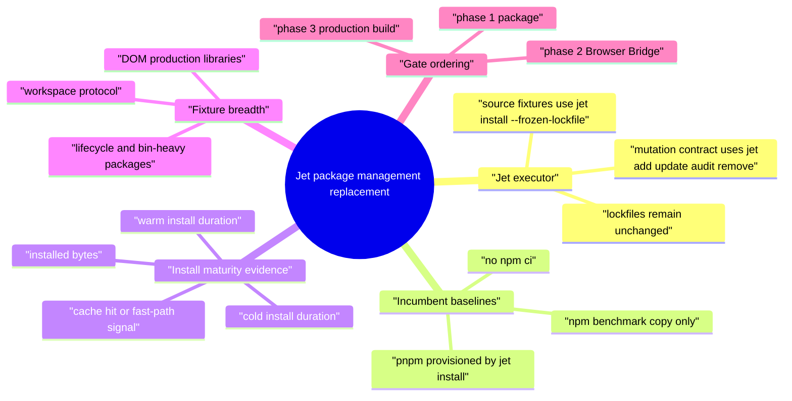
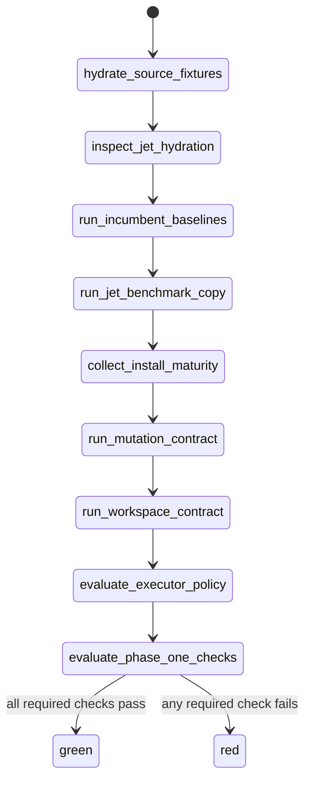
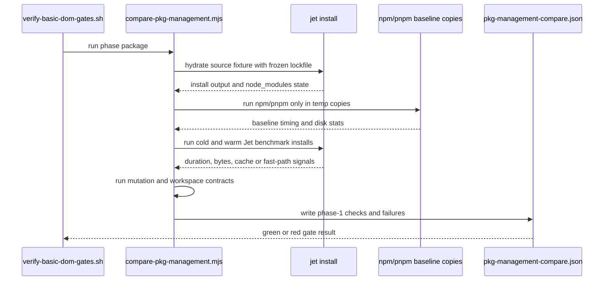
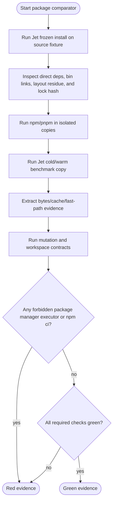
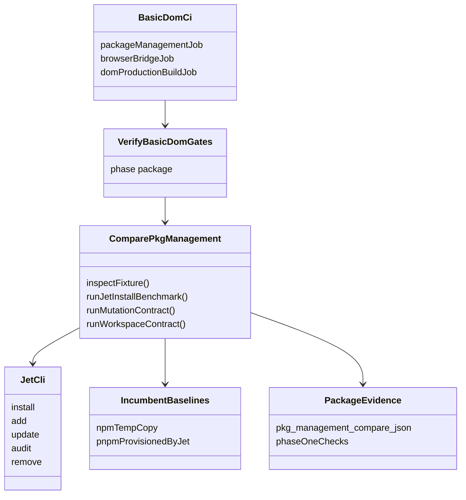
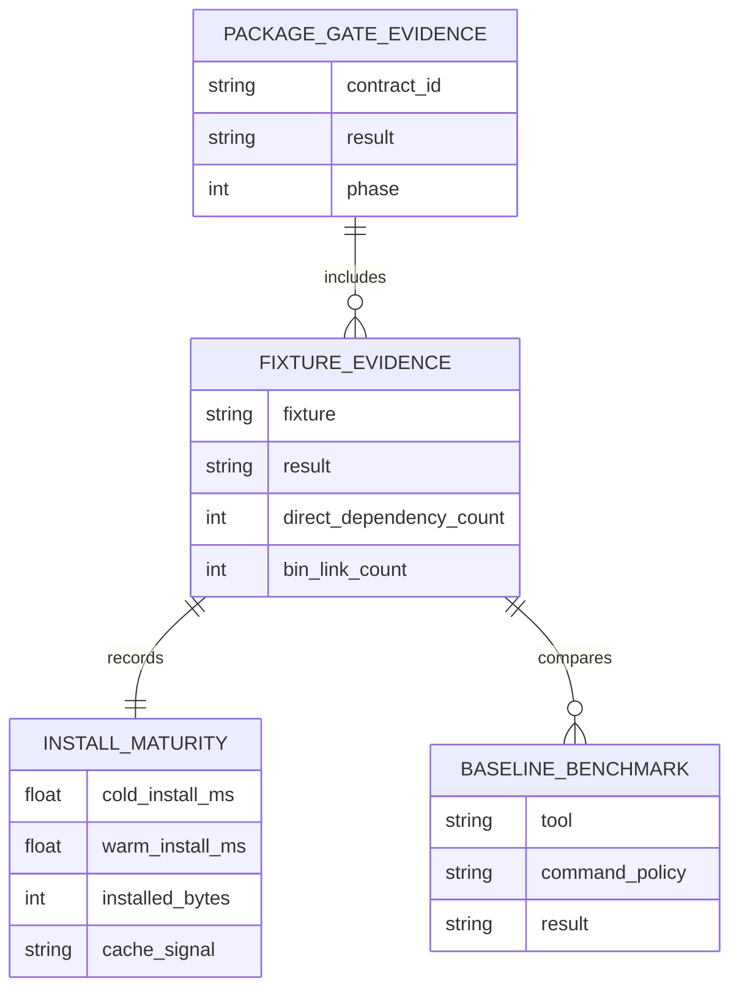
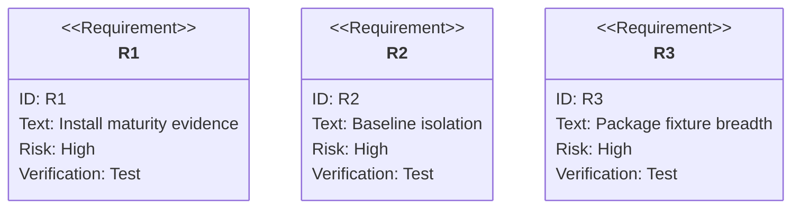

# Complete Package Management Replacement Gate Before Build

## Scenarios
<!-- type: scenarios lang: yaml -->

```yaml
scenarios:
  - id: S1
    requirement: R1
    title: Jet-only source fixture hydration
    given: DOM production fixture source trees contain package.json and jet-lock.yaml
    when: compare-pkg-management runs with hydration enabled
    then: source fixtures are hydrated only by jet install --frozen-lockfile and lockfiles remain unchanged
  - id: S2
    requirement: R2
    title: npm and pnpm are isolated baselines only
    given: npm and pnpm baselines are requested
    when: package comparator executes incumbent package managers
    then: npm and pnpm commands run only in temporary benchmark copies and are excluded from Jet executor commands
  - id: S3
    requirement: R3
    title: Jet install reports cold warm and fast-path evidence
    given: a package fixture is copied for Jet benchmarking
    when: Jet performs cold install followed by warm frozen install
    then: evidence records cold duration, warm duration, installed bytes, and cache/fast-path signals proving warm behavior is not a blind reinstall
  - id: S4
    requirement: R4
    title: Package gate covers workspace and lifecycle/bin-heavy layouts
    given: package-management contract fixtures include workspace and lifecycle/bin-heavy packages
    when: the package phase gate runs
    then: Jet proves workspace linking, frozen drift rejection, lifecycle/bin behavior, and package surface preservation
  - id: S5
    requirement: R5
    title: Basic DOM phase order remains package then browser then build
    given: CI and verify-basic-dom-gates orchestrate the Basic DOM gate
    when: the gate is inspected or run
    then: package-management remains phase 1, Browser Bridge remains phase 2, and DOM production build remains dependent phase 3
  - id: S6
    requirement: R2
    title: npm ci is never accepted as a Jet package path
    given: package scripts, fixtures, and CI are scanned
    when: package evidence is generated
    then: no npm ci command is present anywhere in package evidence or Jet executor policy
```
## Mindmap
<!-- type: mindmap lang: mermaid -->


## State Machine
<!-- type: state-machine lang: mermaid -->


## Interaction
<!-- type: interaction lang: mermaid -->


## Logic
<!-- type: logic lang: mermaid -->


## Dependency
<!-- type: dependency lang: mermaid -->


## Data Model
<!-- type: db-model lang: mermaid -->


## Schema
<!-- type: schema lang: yaml -->

```yaml
package_gate_evidence:
  contract_id: basic.install.replacement
  phase: 1
  checks:
    - no_npm_pnpm_yarn_bun_executor_commands
    - no_npm_ci_anywhere
    - required_baseline_benchmarks_green
    - required_baseline_performance_green
    - install_maturity_evidence_present
    - package_contract_fixture_breadth_present
  fixture:
    required_fields:
      - fixture
      - result
      - commands
      - jet_install_maturity
      - baseline_benchmarks
  jet_install_maturity:
    required_fields:
      - cold_install_ms
      - warm_install_ms
      - installed_bytes
      - cache_or_fast_path_signal
```
## REST API
<!-- type: rest-api lang: yaml -->

```yaml
not_applicable:
  reason: "The package-management replacement gate is a local CLI/evidence contract and does not introduce HTTP REST endpoints."
```
## RPC API
<!-- type: rpc-api lang: yaml -->

```yaml
not_applicable:
  reason: "The package-management replacement gate does not introduce RPC contracts."
```
## Async API
<!-- type: async-api lang: yaml -->

```yaml
not_applicable:
  reason: "The package-management replacement gate does not introduce pub-sub, queue, or WebSocket contracts."
```
## CLI
<!-- type: cli lang: yaml -->

```yaml
commands:
  - name: package_phase_gate
    command: "projects/jet/scripts/verify-basic-dom-gates.sh --phase package"
    verifies:
      - "Jet package-management replacement phase only"
      - "npm/pnpm remain isolated baselines"
      - "package evidence includes maturity and fixture breadth checks"
  - name: package_comparator
    command: "node projects/jet/scripts/compare-pkg-management.mjs --jet-bin target/release/jet"
    verifies:
      - "source fixture hydration"
      - "Jet benchmark installs"
      - "mutation and workspace contracts"
```
## Wireframe
<!-- type: wireframe lang: yaml -->

```yaml
not_applicable:
  reason: "The package-management replacement gate is CLI and JSON evidence only; it does not introduce UI."
```
## Component
<!-- type: component lang: yaml -->

```yaml
not_applicable:
  reason: "The package-management replacement gate does not introduce frontend components."
```
## Design Token
<!-- type: design-token lang: yaml -->

```yaml
not_applicable:
  reason: "The package-management replacement gate does not introduce design tokens."
```
## Config
<!-- type: config lang: yaml -->

```yaml
config_surfaces:
  - name: JET_BASIC_DOM_PHASES
    role: "allows selecting package phase without build"
  - name: JET_BASIC_DOM_PACKAGE_BASELINES
    role: "selects npm/pnpm isolated baseline tools"
  - name: JET_BASIC_DOM_REQUIRE_BASELINES
    role: "keeps baselines blocking when required"
  - name: JET_BASIC_DOM_COMMAND_TIMEOUT_MS
    role: "bounds install and comparator child commands"
```
## Manifest
<!-- type: manifest lang: yaml -->

```yaml
manifest_surfaces:
  - package.json
  - jet-lock.yaml
  - package-lock.json
  - pnpm-lock.yaml
  - .github/workflows/jet-basic-dom.yml
policy:
  source_fixture_manager: "jet install --frozen-lockfile"
  incumbent_managers: "read-only oracle and isolated benchmark only"
```
## Runtime Image
<!-- type: runtime-image lang: yaml -->

```yaml
not_applicable:
  reason: "The package-management replacement gate does not introduce container or runtime images."
```
## Deployment
<!-- type: deployment lang: yaml -->

```yaml
not_applicable:
  reason: "The package-management replacement gate updates local/CI verification only and does not introduce deployment manifests."
```
## Unit Test
<!-- type: unit-test lang: mermaid -->


## E2E Test
<!-- type: e2e-test lang: yaml -->

```yaml
e2e_tests:
  - id: package_phase_gate
    name: "Basic DOM package-management replacement gate"
    command: "projects/jet/scripts/verify-basic-dom-gates.sh --phase package"
    verifies:
      - "Jet source fixture hydration"
      - "npm/pnpm baseline isolation"
      - "install maturity evidence"
      - "workspace and lifecycle/bin-heavy package contract breadth"
      - "no npm ci"
```

## Changes
<!-- type: changes lang: yaml -->

```yaml
coverage_kind: semantic
changes:
  - path: "projects/jet/scripts/compare-pkg-management.mjs"
    action: modify
    section: cli
    description: |
      Add phase-1 package-management replacement evidence: cold/warm Jet
      install maturity, installed bytes, cache-or-fast-path signals,
      workspace contract, mutation contract, bin-heavy fixture breadth, and
      incumbent package-manager executor guards.
    impl_mode: hand-written
  - path: "projects/jet/src/pkg_manager/store.rs"
    action: modify
    section: logic
    description: |
      Fix package store cache validation and tarball root normalization so
      scoped packages such as @types/react hydrate root node_modules links with
      a real package.json instead of a symlink to a nested top-level directory.
      Generate fixture-local Node bin shims so package CLIs such as webpack can
      resolve sibling CLI packages from the project node_modules graph instead
      of from the global Jet store realpath. These are required for the phase-1
      fixture contract to pass from a clean dependency tree rather than relying
      on pre-existing node_modules.
    impl_mode: hand-written
  - path: "projects/jet/src/pkg_manager/mod.rs"
    action: modify
    section: logic
    description: |
      Make workspace installs honor frozen lockfile deps-hash drift checks and
      make jet remove prune its lockfile/node_modules/bin-shim surface so the
      mutation and workspace package-manager contracts can replace pnpm's
      install lifecycle guarantees.
    impl_mode: hand-written
  - path: "projects/jet/src/pkg_manager/lockfile.rs"
    action: modify
    section: unit-test
    description: |
      Align lockfile hydration test fixtures with the stricter store invariant
      that a package cache hit must include a package.json at the store root.
    impl_mode: hand-written
  - path: "projects/jet/scripts/verify-basic-dom-gates.sh"
    action: modify
    section: cli
    description: |
      Keep Basic DOM gates explicitly phased as package first, Browser Bridge
      second, and production build third. Route phase 1 through the
      package-management replacement comparator.
    impl_mode: hand-written
  - path: "projects/jet/scripts/verify-browser-bridge-replacement.mjs"
    action: create
    section: cli
    description: |
      Provide the phase-2 Browser Bridge replacement gate referenced by the
      Basic DOM phase orchestrator and CI ordering. This keeps phase 2 explicit
      without allowing Playwright to become the Jet executor.
    impl_mode: hand-written
  - path: "projects/jet/scripts/compare-dom-build-corpus.mjs"
    action: create
    section: cli
    description: |
      Provide the phase-3 DOM production build corpus comparator referenced by
      the Basic DOM phase orchestrator and CI ordering. This gate remains behind
      package-management and Browser Bridge replacement.
    impl_mode: hand-written
  - path: "projects/jet/tests/fixtures/dom-production-build"
    action: create
    section: manifest
    description: |
      Add the tests-fixture corpus used by package-management and later
      production-build gates, including React bench, MUI, AntD, Tailwind, and
      styled-components app shapes with Jet lockfiles and baseline oracle
      metadata where applicable.
    impl_mode: hand-written
  - path: ".github/workflows/jet-basic-dom.yml"
    action: modify
    section: deployment
    description: |
      Mirror the Basic DOM phase order in CI so package-management replacement
      gates run before Browser Bridge and production build comparisons.
    impl_mode: hand-written
  - path: "projects/jet/README.md"
    action: modify
    section: manifest
    description: |
      Document that Basic replacement order is package management, then Browser
      Bridge, then production build, and that npm/pnpm/Playwright are isolated
      baselines rather than Jet executors.
    impl_mode: hand-written
  - path: "projects/jet/scripts/compare-pkg-management.mjs"
    action: annotate
    section: scenarios
    description: |
      Own the Jet-only package fixture hydration, isolated baseline, install
      maturity, fixture breadth, phase-order, and npm-ci exclusion scenarios.
    impl_mode: hand-written
  - path: "projects/jet/scripts/compare-pkg-management.mjs"
    action: annotate
    section: mindmap
    description: |
      Own the package-management replacement decomposition across Jet executor,
      incumbent baselines, install evidence, fixture breadth, and gate ordering.
    impl_mode: hand-written
  - path: "projects/jet/scripts/compare-pkg-management.mjs"
    action: annotate
    section: state-machine
    description: |
      Own the package gate state progression from source fixture hydration
      through benchmark evidence, contracts, policy checks, and green/red result.
    impl_mode: hand-written
  - path: "projects/jet/scripts/compare-pkg-management.mjs"
    action: annotate
    section: interaction
    description: |
      Own the interaction between the Basic DOM gate, package comparator, Jet
      install, isolated baselines, and emitted JSON evidence.
    impl_mode: hand-written
  - path: "projects/jet/scripts/compare-pkg-management.mjs"
    action: annotate
    section: dependency
    description: |
      Own the dependency graph connecting the phase gate, comparator, Jet CLI,
      incumbent baselines, package evidence, and CI ordering.
    impl_mode: hand-written
  - path: "projects/jet/scripts/compare-pkg-management.mjs"
    action: annotate
    section: db-model
    description: |
      Own the local evidence data model for package gate results, fixture
      evidence, install maturity, and baseline benchmark records.
    impl_mode: hand-written
  - path: "projects/jet/scripts/compare-pkg-management.mjs"
    action: annotate
    section: schema
    description: |
      Own the package gate evidence schema, including required checks,
      per-fixture fields, and Jet install maturity fields.
    impl_mode: hand-written
  - path: "projects/jet/scripts/compare-pkg-management.mjs"
    action: annotate
    section: config
    description: |
      Own the package gate environment knobs for phase selection, baseline tool
      selection, required baselines, and command timeouts.
    impl_mode: hand-written
  - path: "projects/jet/README.md"
    action: annotate
    section: rest-api
    description: |
      Record that this package-management replacement gate does not introduce a
      REST API surface.
    impl_mode: hand-written
  - path: "projects/jet/README.md"
    action: annotate
    section: rpc-api
    description: |
      Record that this package-management replacement gate does not introduce an
      RPC surface.
    impl_mode: hand-written
  - path: "projects/jet/README.md"
    action: annotate
    section: async-api
    description: |
      Record that this package-management replacement gate does not introduce a
      pub-sub, queue, or WebSocket surface.
    impl_mode: hand-written
  - path: "projects/jet/README.md"
    action: annotate
    section: wireframe
    description: |
      Record that this package-management replacement gate is CLI and JSON
      evidence only, not an interactive UI flow.
    impl_mode: hand-written
  - path: "projects/jet/README.md"
    action: annotate
    section: component
    description: |
      Record that this package-management replacement gate does not introduce a
      frontend component surface.
    impl_mode: hand-written
  - path: "projects/jet/README.md"
    action: annotate
    section: design-token
    description: |
      Record that this package-management replacement gate does not introduce
      design tokens.
    impl_mode: hand-written
  - path: "projects/jet/README.md"
    action: annotate
    section: runtime-image
    description: |
      Record that this package-management replacement gate does not introduce a
      runtime image surface.
    impl_mode: hand-written
```

# Reviews

### Review 1
**Verdict:** approved

- [scenarios] Covers the phase-1 pivot explicitly: Jet owns source hydration, npm/pnpm are isolated baselines, and build remains phase 3.
- [schema/logic] Evidence requirements are machine-checkable: cold/warm duration, installed bytes, cache-or-fast-path signal, forbidden executor commands, and npm ci absence.
- [cli/e2e-test] The hard verification command is concrete: `projects/jet/scripts/verify-basic-dom-gates.sh --phase package`.
- [scope] API, UI, deployment, runtime-image, and WASM/build behavior are correctly out of scope for this phase-1 package-management change.

# Reviews

### Review 1
**Verdict:** approved

- [scenarios] Covers Jet-only fixture hydration, isolated npm/pnpm baselines, cold/warm install maturity evidence, workspace/lifecycle/bin-heavy fixture breadth, phase ordering, and npm ci exclusion.
- [schema] Defines machine-checkable JSON evidence for phase 1, including `install_maturity_evidence_present`, `package_contract_fixture_breadth_present`, and per-fixture `jet_install_maturity`.
- [cli] Keeps `verify-basic-dom-gates.sh --phase package` as the phase-1 entry point and keeps production build claims behind package and Browser Bridge gates.
- [unit-test] Requires pkg-manager unit coverage and script-level scans to reject npm/pnpm executor drift and npm ci regressions.
- [e2e-test] Requires the full package gate to produce green evidence across React bench, MUI, AntD, Tailwind, and styled-components fixtures with incumbent package managers used only as isolated baselines.
