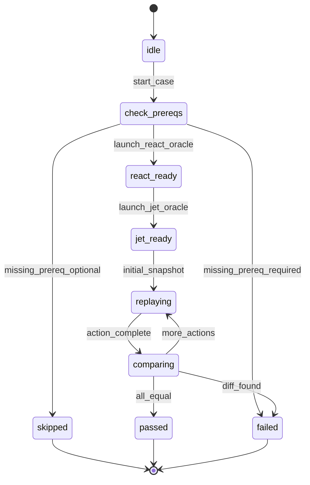
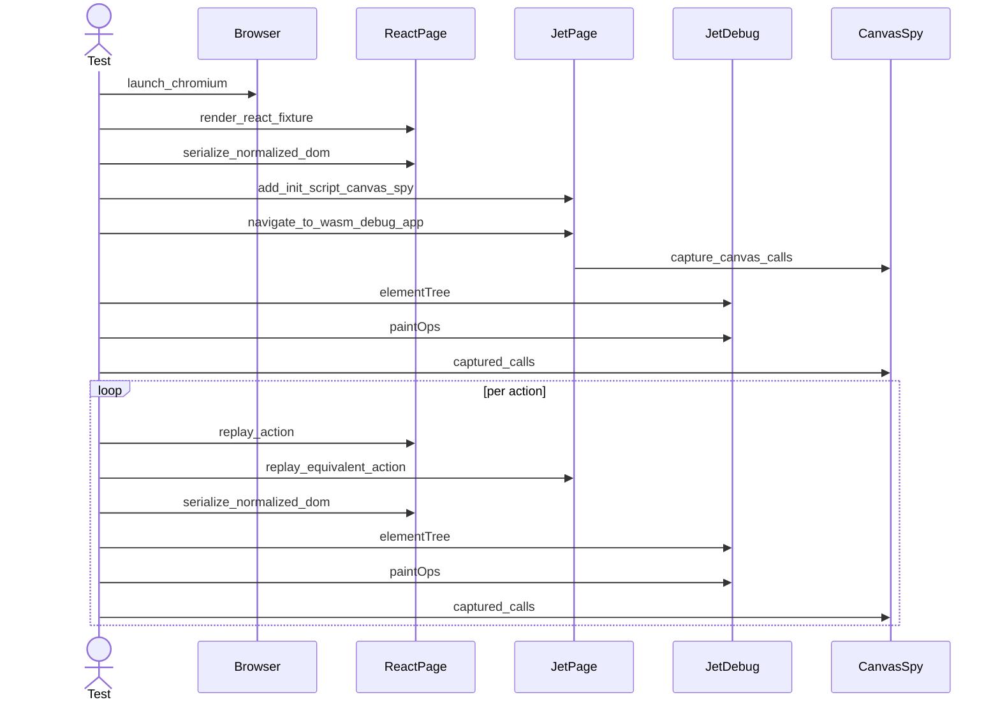
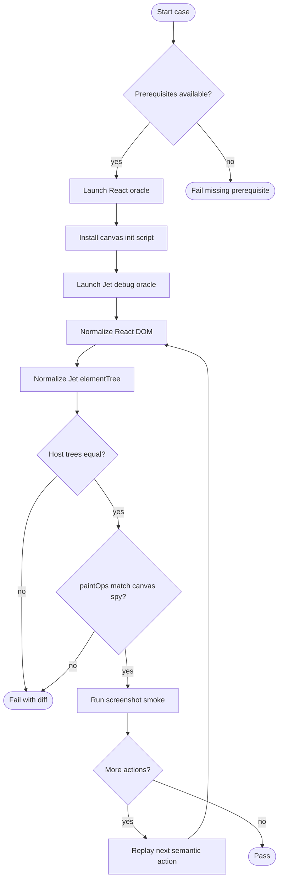

## Oracle Data Model
<!-- type: schema lang: yaml -->

```yaml
$schema: "https://json-schema.org/draft/2020-12/schema"
$id: jet-wasm-react-dom-oracle-conformance
title: ReactDomOracleConformance
type: object
required:
  - cases
properties:
  cases:
    type: array
    minItems: 1
    items:
      $ref: "#/$defs/OracleCase"
additionalProperties: false
$defs:
  OracleCase:
    $id: oracle-case
    title: OracleCase
    type: object
    required:
      - id
      - fixture
      - snapshots
    properties:
      id:
        type: string
        pattern: "^[a-z][a-z0-9-]*$"
      fixture:
        $ref: "#/$defs/FixtureRef"
      snapshots:
        type: array
        minItems: 1
        items:
          $ref: "#/$defs/OracleSnapshot"
      prerequisites:
        type: array
        items:
          type: string
          enum:
            - node
            - react-dom
            - wasm-pack
            - chromium
    additionalProperties: false
  FixtureRef:
    $id: fixture-ref
    title: FixtureRef
    type: object
    required:
      - jet_example
      - entry
      - export_name
    properties:
      jet_example:
        type: string
        description: Directory under examples/ used by JetTestApp.
      entry:
        type: string
        description: TSX fixture entry relative to the example root.
      export_name:
        type: string
        description: Component export rendered by the React oracle.
      props:
        type: object
        additionalProperties: true
    additionalProperties: false
  OracleSnapshot:
    $id: oracle-snapshot
    title: OracleSnapshot
    type: object
    required:
      - name
      - expect
    properties:
      name:
        type: string
        pattern: "^[a-z][a-z0-9-]*$"
      before:
        $ref: "#/$defs/OracleAction"
      expect:
        type: array
        items:
          type: string
          enum:
            - host-tree-equal
            - paint-ops-match-canvas-spy
            - screenshot-nonblank
            - screenshot-changed
    additionalProperties: false
  OracleAction:
    $id: oracle-action
    title: OracleAction
    oneOf:
      - $ref: "#/$defs/ClickByTestId"
      - $ref: "#/$defs/ClickByNodeId"
      - $ref: "#/$defs/NoopAction"
  ClickByTestId:
    $id: click-by-test-id
    title: ClickByTestId
    type: object
    required:
      - kind
      - test_id
    properties:
      kind:
        type: string
        const: click-by-test-id
      test_id:
        type: string
        minLength: 1
    additionalProperties: false
  ClickByNodeId:
    $id: click-by-node-id
    title: ClickByNodeId
    type: object
    required:
      - kind
      - node_id
    properties:
      kind:
        type: string
        const: click-by-node-id
      node_id:
        type: string
        minLength: 1
    additionalProperties: false
  NoopAction:
    $id: noop-action
    title: NoopAction
    type: object
    required:
      - kind
    properties:
      kind:
        type: string
        const: noop
    additionalProperties: false
  NormalizedHostNode:
    $id: normalized-host-node
    title: NormalizedHostNode
    oneOf:
      - $ref: "#/$defs/NormalizedElement"
      - $ref: "#/$defs/NormalizedText"
  NormalizedElement:
    $id: normalized-element
    title: NormalizedElement
    type: object
    required:
      - kind
      - tag
      - attrs
      - children
    properties:
      kind:
        type: string
        const: element
      tag:
        type: string
        pattern: "^[a-z][a-z0-9-]*$"
      attrs:
        type: object
        additionalProperties:
          type: string
      children:
        type: array
        items:
          $ref: "#/$defs/NormalizedHostNode"
    additionalProperties: false
  NormalizedText:
    $id: normalized-text
    title: NormalizedText
    type: object
    required:
      - kind
      - text
    properties:
      kind:
        type: string
        const: text
      text:
        type: string
    additionalProperties: false
  CanvasDrawCall:
    $id: canvas-draw-call
    title: CanvasDrawCall
    type: object
    required:
      - method
      - args
      - state
    properties:
      method:
        type: string
        enum:
          - clearRect
          - fillRect
          - strokeRect
          - fillText
          - strokeText
          - beginPath
          - moveTo
          - lineTo
          - stroke
          - fill
      args:
        type: array
        items:
          type:
            - string
            - number
            - boolean
            - "null"
      state:
        type: object
        properties:
          fillStyle:
            type: string
          strokeStyle:
            type: string
          font:
            type: string
          lineWidth:
            type: number
        additionalProperties: false
    additionalProperties: false
```

## Oracle Lifecycle
<!-- type: state-machine lang: mermaid -->



## Browser Observation Interaction
<!-- type: interaction lang: mermaid -->



## Comparison Logic
<!-- type: logic lang: mermaid -->



## Test Plan
<!-- type: test-plan lang: mermaid -->

```mermaid
---
id: react-dom-oracle-test-plan
requirements:
  R1: { text: "React DOM oracle serializes normalized host tree", risk: high }
  R2: { text: "Jet oracle serializes elementTree into same schema", risk: high }
  R3: { text: "Shared action replay compares every step", risk: high }
  R4: { text: "CDP init script installs canvas spy before WASM boot", risk: high }
  R5: { text: "paintOps match captured canvas draw calls", risk: high }
  R6: { text: "Screenshot checks remain smoke-only", risk: medium }
  R7: { text: "Prerequisite gating matches WASM e2e policy", risk: medium }
  R8: { text: "Initial fixture matrix covers core TSX subset", risk: medium }
  R9: { text: "Diffs name case and action step", risk: medium }
  R10: { text: "React oracle remains test-only", risk: high }
tests:
  page_add_init_script_runs_before_navigation:
    covers: [R4]
    kind: unit
    target: crates/jet/tests/page_api_parity.rs
  canvas_spy_records_draw_calls:
    covers: [R4, R5]
    kind: integration
    target: crates/jet/tests/react_dom_oracle_conformance.rs
  counter_oracle_matches_react_after_click:
    covers: [R1, R2, R3, R5, R6, R7, R9, R10]
    kind: integration
    target: crates/jet/tests/react_dom_oracle_conformance.rs
  fixture_matrix_oracle_smoke:
    covers: [R8]
    kind: integration
    target: crates/jet/tests/react_dom_oracle_conformance.rs
---
requirementDiagram
    requirement R1 {
      id: R1
      text: React DOM oracle serializes normalized host tree
      risk: high
    }
    requirement R2 {
      id: R2
      text: Jet oracle serializes elementTree into same schema
      risk: high
    }
    requirement R3 {
      id: R3
      text: Shared action replay compares every step
      risk: high
    }
    requirement R4 {
      id: R4
      text: CDP init script installs canvas spy before WASM boot
      risk: high
    }
    requirement R5 {
      id: R5
      text: paintOps match captured canvas draw calls
      risk: high
    }
    requirement R6 {
      id: R6
      text: Screenshot checks remain smoke-only
      risk: medium
    }
    requirement R7 {
      id: R7
      text: Prerequisite gating matches WASM e2e policy
      risk: medium
    }
    requirement R8 {
      id: R8
      text: Initial fixture matrix covers core TSX subset
      risk: medium
    }
    requirement R9 {
      id: R9
      text: Diffs name case and action step
      risk: medium
    }
    requirement R10 {
      id: R10
      text: React oracle remains test-only
      risk: high
    }
    test page_add_init_script_runs_before_navigation
    test canvas_spy_records_draw_calls
    test counter_oracle_matches_react_after_click
    test fixture_matrix_oracle_smoke
    R4 - verifies -> page_add_init_script_runs_before_navigation
    R4 - verifies -> canvas_spy_records_draw_calls
    R5 - verifies -> canvas_spy_records_draw_calls
    R1 - verifies -> counter_oracle_matches_react_after_click
    R2 - verifies -> counter_oracle_matches_react_after_click
    R3 - verifies -> counter_oracle_matches_react_after_click
    R5 - verifies -> counter_oracle_matches_react_after_click
    R6 - verifies -> counter_oracle_matches_react_after_click
    R7 - verifies -> counter_oracle_matches_react_after_click
    R9 - verifies -> counter_oracle_matches_react_after_click
    R10 - verifies -> counter_oracle_matches_react_after_click
    R8 - verifies -> fixture_matrix_oracle_smoke
```

## Changes
<!-- type: changes lang: yaml -->

```yaml
changes:
  - path: .aw/tech-design/crates/jet/validate/wasm-renderer-react-dom-oracle-conformance.md
    action: create
    section: unit-test
    impl_mode: hand-written
    description: >
      New TD spec for React DOM oracle conformance. Defines the normalized
      host-tree schema, action replay state machine, browser observation
      sequence, comparison logic, and test-plan traceability.

  - path: .aw/tech-design/crates/jet/logic/wasm-renderer-conformance.md
    action: modify
    section: unit-test
    impl_mode: hand-written
    description: >
      Link the React DOM oracle as the strongest React-specific conformance
      tier above existing framework-neutral elementTree/layoutTree/paintOps
      snapshots.

  - path: .aw/tech-design/crates/jet/tools/wasm-renderer-browser-cli.md
    action: modify
    section: cli
    impl_mode: hand-written
    description: >
      Extend the browser/CDP contract with pre-navigation init-script support
      for test harnesses and browser tooling that need to install observers
      before the application script executes.

  - path: .aw/tech-design/crates/jet/interfaces/wasm-renderer/debug-bridge.md
    action: modify
    section: unit-test
    impl_mode: hand-written
    description: >
      Specify that paintOps is cross-checkable against a test-only canvas spy
      and remains a debug-only observable, not a production API.

  - path: crates/jet/src/browser/page.rs
    action: modify
    section: unit-test
    impl_mode: hand-written
    description: >
      Add a Page-level init-script method backed by the CDP
      Page.addScriptToEvaluateOnNewDocument command. The method must run
      before navigation and remain usable by tests without exposing CDP
      internals.

  - path: crates/jet/src/browser_cli/mod.rs
    action: modify
    section: unit-test
    impl_mode: hand-written
    description: >
      Add a session preparation path that accepts init scripts before goto, so
      Jet WASM tests can install the canvas spy before boot.js imports the WASM
      glue module.

  - path: crates/jet/tests/common/mod.rs
    action: modify
    section: unit-test
    impl_mode: hand-written
    description: >
      Reuse existing JetTestApp launch, click, screenshot, and prerequisite
      gating helpers while exposing oracle-specific launch options and failure
      messages.

  - path: crates/jet/tests/common/react_oracle.rs
    action: create
    section: unit-test
    impl_mode: hand-written
    description: >
      Test-only React DOM oracle helpers: prerequisite detection, React page
      launch, normalized DOM serializer, semantic action replay, and canonical
      tree diffing.

  - path: crates/jet/tests/common/canvas_spy.rs
    action: create
    section: unit-test
    impl_mode: hand-written
    description: >
      Test-only canvas 2D spy init script and captured draw-call
      canonicalization helpers used to compare real canvas calls with Jet
      paintOps.

  - path: crates/jet/tests/react_dom_oracle_conformance.rs
    action: create
    section: unit-test
    impl_mode: hand-written
    description: >
      Chromium integration tests for the initial oracle matrix: counter click,
      toggle conditional render, list rendering, className/attributes,
      self-closing elements, nested fragments, and Unicode text.
  - path: ".aw/tech-design/projects/jet/validate/wasm-renderer-react-dom-oracle-conformance.md"
    action: verify
    section: interaction
    impl_mode: hand-written
    description: |
      Traceability repair: hand-written TD section retained as the implementation edge during AW standardization.

  - path: ".aw/tech-design/projects/jet/validate/wasm-renderer-react-dom-oracle-conformance.md"
    action: verify
    section: logic
    impl_mode: hand-written
    description: |
      Traceability repair: hand-written TD section retained as the implementation edge during AW standardization.

  - path: ".aw/tech-design/projects/jet/validate/wasm-renderer-react-dom-oracle-conformance.md"
    action: verify
    section: schema
    impl_mode: hand-written
    description: |
      Traceability repair: hand-written TD section retained as the implementation edge during AW standardization.

  - path: ".aw/tech-design/projects/jet/validate/wasm-renderer-react-dom-oracle-conformance.md"
    action: verify
    section: state-machine
    impl_mode: hand-written
    description: |
      Traceability repair: hand-written TD section retained as the implementation edge during AW standardization.

```

# Reviews

### Review 2
**Verdict:** approved

- [schema] The normalized host-tree, action, fixture, and canvas draw-call schemas are concrete enough to implement both oracle paths and produce actionable diffs.
- [logic] The comparison flow correctly makes semantic host-tree equality primary, treats screenshot checks as smoke-only, and fails missing prerequisites by default.
- [changes] The change list covers the necessary spec updates, browser/CDP API surface, test harness helpers, canvas spy, React oracle helper, and initial conformance test entrypoint without adding production React dependencies.
