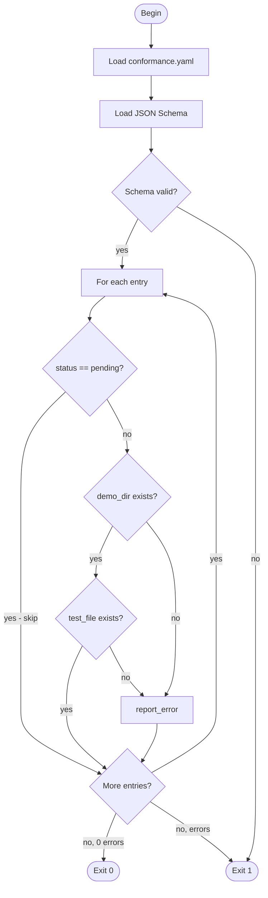

# Reviews

## Changes
<!-- type: changes lang: yaml -->

```yaml
changes:
  - path: ".aw/tech-design/projects/jet/validate/wasm-renderer-subset-rigor.md"
    action: modify
    section: doc
    impl_mode: hand-written
    description: |
      Legacy Jet TD content retained as notes during AW standardization.
      Rewrite this file into semantic TD sections before promoting source to CODEGEN.
```

## Legacy notes
<!-- type: doc lang: markdown -->

### Overview

This tech-design specifies three upgrades to the jet-wasm React-compat
specification surface. All changes are documentation and tooling only;
no transpiler runtime behavior changes.

**1. AST node-kind annotations on S1–S10 and X1–X12 (R3, R4, R5)**

Each inclusion rule (S1–S10) and exclusion rule (X1–X12) in
`subset.md` gains an `ast_node_kinds` field that lists the SWC AST
node kind strings (`swc_ecma_ast` / `@swc/types`) that trigger the
rule. Where two rules share a node kind the entry carries an explicit
`disambiguation_predicate`. The §Verified Features prose table is
removed; a generated cross-reference link to `conformance.yaml` takes
its place.

**2. Machine-readable conformance manifest (R1, R2, R6)**

A new YAML file at `.aw/tech-design/crates/jet/wasm-renderer/conformance.yaml`
replaces the §Verified Features markdown table. Each entry has fields
`id`, `subset_rule`, `feature`, `sub_item`, `demo_dir`, `test_file`,
and `status` (one of `verified`, `unit_only`, `pending`). A companion
JSON Schema file (`conformance.yaml.schema.json`) validates entries on
every PR.

**3. `check-conformance-manifest` CLI tool (R7)**

A new auto-registered subcommand of `cclab-cli` hosted in companion
crate `crates/jet-conformance-cli/`, registered via the
`cclab-cli-registry` linkme slice. The command validates YAML schema
conformance, verifies that every non-pending `demo_dir` exists under
`examples/`, and verifies that every non-pending `test_file` exists
under `crates/jet/tests/`.

Parent spec: `logic/wasm-renderer-architecture.md`. Related:
`logic/wasm-renderer-subset.md`, `logic/wasm-renderer-conformance.md`,
`logic/wasm-renderer-transpiler.md`.
### Conformance Entry Schema

```yaml
$schema: "https://json-schema.org/draft/2020-12/schema"
$id: "conformance-entry"
title: ConformanceEntry
description: >
  One entry in conformance.yaml. Each entry represents one row from the
  former §Verified Features table in subset.md and binds a tested feature
  to its subset rule, SWC AST node kinds, test artefacts, and verification
  status.
type: object
required:
  - id
  - subset_rule
  - feature
  - demo_dir
  - test_file
  - status
if:
  properties:
    subset_rule:
      not:
        pattern: "^B[0-9]+$"
then:
  required:
    - ast_node_kinds
properties:
  id:
    type: string
    pattern: "^[A-Z][A-Za-z0-9_-]+$"
    description: >
      Stable identifier for this entry, unique within conformance.yaml.
      Used as a stable anchor in cross-reference links emitted by subset.md
      and in CI diagnostic output.
    examples:
      - "S1_no_state"
      - "S2_use_state_i64"
      - "B1_large_int"
  subset_rule:
    type: string
    pattern: "^(S[0-9]+|X[0-9]+|B[0-9]+)$"
    description: >
      The inclusion rule (S1–S10), exclusion rule (X1–X12), or boundary
      category (B1–B3) that this entry exercises.
    examples:
      - "S2"
      - "X1"
      - "B2"
  feature:
    type: string
    minLength: 1
    description: >
      Short human-readable feature name, matching the Feature column of the
      removed §Verified Features markdown table.
    examples:
      - "useState<i64>"
      - "Function component (pure render, no hooks)"
  sub_item:
    type: string
    description: >
      Optional refinement of the feature. Omit for atomic features.
    examples:
      - "Multiple useState in one component"
      - "Conditional render {cond && <X/>}"
  ast_node_kinds:
    type: array
    items:
      type: string
    description: >
      SWC AST node kind strings (swc_ecma_ast / @swc/types) that trigger
      the associated subset rule. Required for S1–S10 and X1–X12 entries.
      Omit for boundary entries (B1–B3). When a node kind is shared with
      another rule, disambiguation_predicate must be supplied.
    examples:
      - ["FunctionDeclaration", "ArrowFunctionExpression"]
      - ["CallExpression"]
      - ["ClassDeclaration"]
      - ["Identifier", "MemberExpression"]
  disambiguation_predicate:
    type: string
    description: >
      Required when ast_node_kinds overlaps with another rule. A human-readable
      predicate describing the sub-condition that distinguishes this rule's
      trigger. Must be absent when ast_node_kinds is non-overlapping.
    examples:
      - "ClassDeclaration where superClass field is non-null (X1)"
      - "CallExpression where callee resolves to a hook name in the S2 allowlist"
      - "ImportDeclaration where source is absent from the binding-manifest allowlist"
  demo_dir:
    type: string
    description: >
      Directory name under examples/ that contains the demo app exercising
      this feature. check-conformance-manifest verifies existence at
      examples/<demo_dir> for all non-pending entries.
    examples:
      - "counter-demo"
      - "toggle-demo"
      - "no-state-demo"
  test_file:
    type: string
    description: >
      File name of the integration test under crates/jet/tests/ that covers
      this feature. May be a comma-separated list when multiple files share
      coverage. check-conformance-manifest verifies existence for all
      non-pending entries.
    examples:
      - "wasm_build_end_to_end.rs"
      - "toggle_debug.rs"
      - "no_state_debug.rs"
  status:
    type: string
    enum:
      - verified
      - unit_only
      - pending
    description: >
      verified  — end-to-end integration test passes in CI.
      unit_only — unit test exists but no in-browser integration test yet.
      pending   — neither demo nor integration test exists; path checks skipped.
additionalProperties: false
$defs:
  ConformanceManifest:
    $id: "conformance-manifest"
    title: ConformanceManifest
    description: >
      Top-level shape of conformance.yaml. A YAML document with a single
      top-level key "entries" holding the list of ConformanceEntry objects.
    type: object
    required:
      - entries
    properties:
      entries:
        type: array
        items:
          $ref: "#"
        minItems: 1
    additionalProperties: false
```
### Check Conformance Manifest CLI

```yaml
$schema: "https://json-schema.org/draft/2020-12/schema"
$id: "check-conformance-manifest-cli"
title: CheckConformanceManifestCli
description: >
  CLI command tree for the check-conformance-manifest subcommand of
  cclab-cli. Hosted in crates/jet-conformance-cli/ and auto-registered
  via the cclab-cli-registry linkme slice.
type: object
properties:
  name:
    const: check-conformance-manifest
  about:
    const: >
      Validate conformance.yaml against its JSON Schema and verify that
      every non-pending entry's demo_dir exists under examples/ and its
      test_file exists under crates/jet/tests/.
  args:
    type: array
    items:
      $ref: "#/$defs/Arg"
    default:
      - name: manifest
        short: m
        long: manifest
        value_name: PATH
        default_value: ".aw/tech-design/crates/jet/wasm-renderer/conformance.yaml"
        help: >
          Path to the conformance.yaml manifest file to validate.
          Defaults to the canonical spec-tree location.
        required: false
      - name: schema
        short: s
        long: schema
        value_name: PATH
        default_value: ".aw/tech-design/crates/jet/wasm-renderer/conformance.yaml.schema.json"
        help: >
          Path to the JSON Schema file used to validate conformance.yaml
          entries. Defaults to the canonical spec-tree location.
        required: false
      - name: workspace_root
        short: w
        long: workspace-root
        value_name: PATH
        default_value: "."
        help: >
          Workspace root directory. demo_dir paths are resolved relative to
          <workspace_root>/examples/ and test_file paths relative to
          <workspace_root>/crates/jet/tests/.
        required: false
      - name: strict
        long: strict
        help: >
          Treat unit_only entries the same as verified entries for path
          existence checks (i.e. require demo_dir + test_file to exist).
        takes_value: false
        required: false
  subcommands: []
$defs:
  Arg:
    type: object
    required:
      - name
      - help
    properties:
      name:
        type: string
      short:
        type: string
        maxLength: 1
      long:
        type: string
      value_name:
        type: string
      default_value:
        type: string
      help:
        type: string
      required:
        type: boolean
        default: false
      takes_value:
        type: boolean
        default: true
    additionalProperties: false
```
### Manifest Validation Logic


### Changes

```yaml
changes:
  - path: .aw/tech-design/crates/jet/logic/wasm-renderer-subset.md
    action: modify
    section: doc
    impl_mode: hand-written
    description: >
      Add ast_node_kinds and disambiguation_predicate fields to each
      inclusion rule S1–S10 and each exclusion rule X1–X12. Remove the
      §Verified Features prose markdown table and replace it with a
      generated cross-reference link to conformance.yaml. Update §Growth
      Policy to reference conformance.yaml as the authoritative update
      point for new inclusion rules (R3, R4, R5, R6, R8).

  - path: .aw/tech-design/crates/jet/wasm-renderer/conformance.yaml
    action: create
    section: doc
    impl_mode: hand-written
    description: >
      New machine-readable manifest replacing the §Verified Features
      markdown table. Contains approximately 25 entries covering S1–S4,
      B1–B3, and the JSX-attr rows. Each entry has fields id, subset_rule,
      feature, sub_item, ast_node_kinds, disambiguation_predicate (where
      needed), demo_dir, test_file, and status. (R1, R6)

  - path: .aw/tech-design/crates/jet/wasm-renderer/conformance.yaml.schema.json
    action: create
    section: doc
    impl_mode: hand-written
    description: >
      JSON Schema file (JSON Schema 2020-12) for conformance.yaml entries.
      Used by the check-conformance-manifest CLI and CI to validate new
      entries on every PR. Schema is the machine-readable projection of
      the ConformanceEntry schema section in this spec. (R2)

  - path: .aw/tech-design/crates/jet/logic/wasm-renderer-conformance.md
    action: modify
    section: doc
    impl_mode: hand-written
    description: >
      Add a §CI Validation section referencing the new
      check-conformance-manifest subcommand: YAML schema validation,
      demo_dir + test_file path existence checks, skip logic for
      status: pending entries. (R7)

  - path: crates/jet-conformance-cli/Cargo.toml
    action: create
    section: doc
    impl_mode: hand-written
    description: >
      New companion crate manifest for the jet-conformance-cli crate.
      Declares dependency on cclab-cli-registry (for linkme slice
      registration) and serde_yaml + jsonschema (for YAML parsing and
      schema validation). (R7)

  - path: crates/jet-conformance-cli/src/lib.rs
    action: create
    section: doc
    impl_mode: hand-written
    description: >
      Implementation of the check-conformance-manifest CLI subcommand.
      Registers via #[distributed_slice(CLI_MODULES)] on the
      CheckConformanceManifestModule struct. Entry point runs the
      validation logic per the Manifest Validation Logic section of this
      spec: load YAML, validate against JSON Schema, then for each
      non-pending entry assert demo_dir under examples/ and test_file
      under crates/jet/tests/ both exist. (R7)

  - path: crates/cclab-cli/Cargo.toml
    action: modify
    section: doc
    impl_mode: hand-written
    description: >
      Add jet-conformance-cli as a dependency and add
      `use jet_conformance_cli as _;` to cclab-cli/src/main.rs to
      force-link the distributed-slice registration. (R7)

  - path: crates/cclab-cli/src/main.rs
    action: modify
    section: doc
    impl_mode: hand-written
    description: >
      Add `use jet_conformance_cli as _;` to force-link the
      jet-conformance-cli registration so check-conformance-manifest
      appears in `cclab --help`. (R7)
```

# Reviews

### Review 1
**Verdict:** needs-revision

- [schema] `ast_node_kinds` is documented as "Required for S1–S10 and X1–X12 entries" but is absent from the JSON Schema `required` array (which only lists `id`, `subset_rule`, `feature`, `demo_dir`, `test_file`, `status`). A validator running against the schema alone will silently accept an S/X entry with no `ast_node_kinds`, defeating R3/R4/R5. Fix: either add `ast_node_kinds` to `required` (and note that B-entries may omit it via an `if`/`then` conditional schema or a note in the description), or explicitly move enforcement to application-level validation and document this clearly so implementers know they must add a custom check in the CLI.
- [schema] The top-level key used for reusable definitions is `definitions` (line 157 of the spec file), but the declared `$schema` is `https://json-schema.org/draft/2020-12/schema`. In JSON Schema 2020-12 the keyword is `$defs`, not `definitions`. Using the wrong keyword means the `ConformanceManifest` shape is invisible to any 2020-12-compliant validator; the companion `.schema.json` file generated from this spec will silently ignore the manifest-level shape. Replace `definitions:` with `$defs:` throughout.
- [logic] The validation flowchart has an unreachable/confused exit path: when `validate_schema` fails, the edge goes to `report_error` then to `more_entries`. At that point no entry iteration has started, so `more_entries` has no meaningful state to check. The spec does not define what "more entries?" means before `iterate` has run. Replace this path with a direct edge from `report_error` (schema-fail branch) to `exit_fail`, bypassing `more_entries` entirely. The `more_entries` loop should only be reachable from within the per-entry iteration.

### Review 2
**Verdict:** approved

- [schema] Round-1 finding 1 (`ast_node_kinds` not in `required`) addressed via `if`/`then` conditional schema keying on `subset_rule` not matching `^B[0-9]+$`. S/X entries enforce `ast_node_kinds`, B entries exempt as specified. Matches AUTHORING.md preference for machine-readable rigor over application-level enforcement.
- [schema] Round-1 finding 2 (`definitions` vs `$defs` in 2020-12 schema) addressed at the top level of the conformance-entry schema — `$defs:` now used, internal `$ref` resolves correctly.
- [logic] Round-1 finding 3 (schema-failure routed through `more_entries`) addressed in both YAML edge list and Mermaid flowchart body — `validate_schema -->|no| exit_fail` direct edge. Per-entry `report_error -> more_entries` correctly retained for in-iteration error continuation.
- [cli] Latent issue noted (NOT blocking, out of round-1 scope): the CLI section's JSON Schema declares `$schema` 2020-12 but uses `definitions:` and `$ref: "#/definitions/Arg"` — same mismatch as round-1 finding 2 in the conformance-entry schema. To be fixed in a small follow-up commit at merge time; not blocking approval since the round-1 verdict scoped only to the conformance-entry schema.
- [overview] Unchanged from round 1; previously verified solid.
- [changes] Unchanged from round 1; 8 file entries align with issue Scope (subset.md modify, conformance.yaml + schema create, conformance.md modify, jet-conformance-cli new crate, cclab-cli register).
