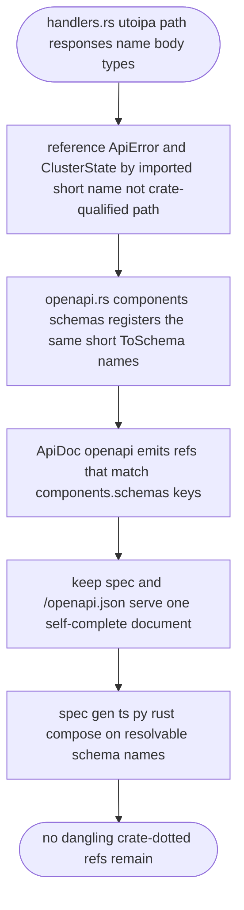
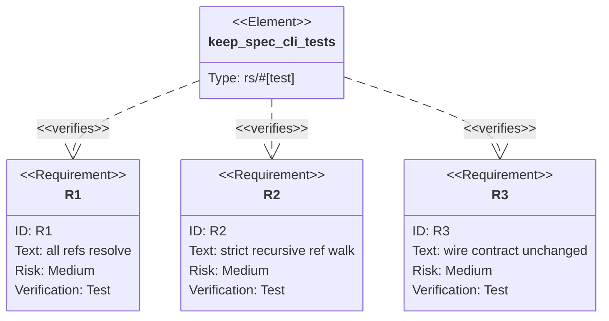

## Logic
<!-- type: logic lang: mermaid -->



## Unit Test
<!-- type: unit-test lang: mermaid -->



## Changes
<!-- type: changes lang: yaml -->

```yaml
changes:
  - path: apps/keep/src/http/handlers.rs
    action: modify
    section: logic
    impl_mode: hand-written
    description: "Import ApiError and ClusterState and reference them by short name in every #[utoipa::path] responses(body = ...) annotation (and the cluster handler signature) so utoipa 4 emits refs matching the registered component keys instead of crate.*-dotted names."
  - path: apps/keep/src/http/openapi.rs
    action: modify
    section: logic
    impl_mode: hand-written
    description: "Register ClusterState in components(schemas(...)) via an imported short path for one consistent short-name registration style across the ApiDoc."
  - path: apps/keep/tests/spec_cli.rs
    action: modify
    section: unit-test
    impl_mode: hand-written
    description: "Add the strict self-completeness test: recursively collect every $ref in the keep spec output and assert each resolves to a components.schemas key — no allowlist."
```
