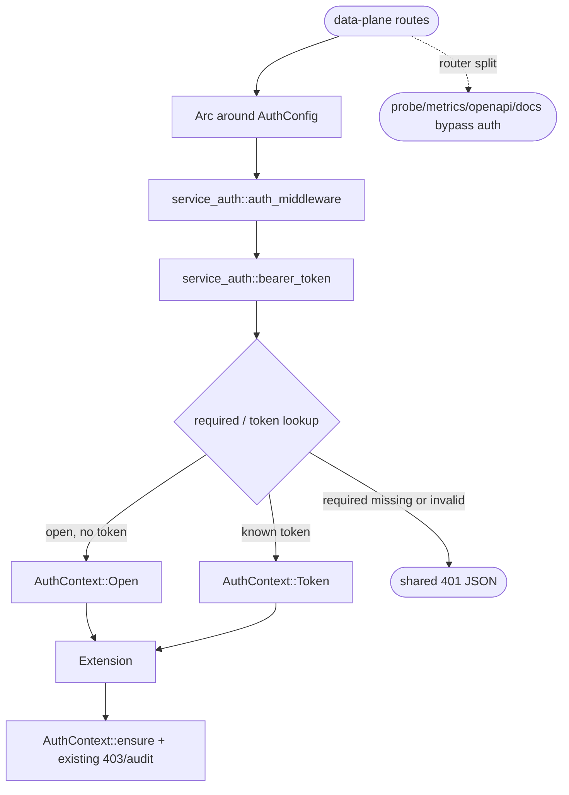
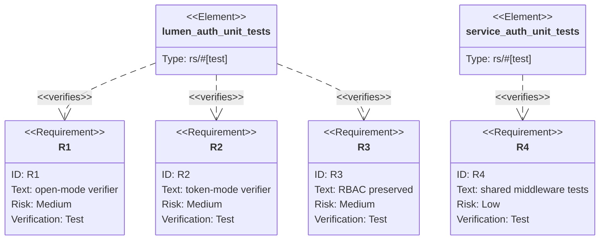

## Logic
<!-- type: logic lang: mermaid -->


## Unit Test
<!-- type: unit-test lang: mermaid -->


## E2E Test
<!-- type: e2e-test lang: yaml -->

```yaml
e2e_tests:
  - id: lumen-auth-e2e-contract
    name: "lumen auth e2e contract"
    runner: cargo
    path: projects/lumen/tests/auth_e2e.rs
    command: "cargo test -p lumen --test auth_e2e -- --nocapture"
    verifies:
      - "Required mode rejects missing and invalid Bearer tokens with the shared 401 JSON body."
      - "Valid tokens are injected as AuthContext and handlers keep existing RBAC outcomes."
      - "Metrics, health, and readiness remain outside the data-plane auth layer."
  - id: lumen-authz-matrix-contract
    name: "lumen authz matrix contract"
    runner: cargo
    path: projects/lumen/tests/authz_matrix_e2e.rs
    command: "cargo test -p lumen --test authz_matrix_e2e -- --nocapture"
    verifies:
      - "Every protected route still enforces its route-specific role minimum after middleware delegation."
  - id: lumen-package-regression
    name: "lumen package regression"
    runner: cargo
    path: projects/lumen
    command: "cargo test -p lumen"
    verifies:
      - "The package compiles and the full Lumen regression suite remains green."
```
## Changes
<!-- type: changes lang: yaml -->

```yaml
changes:
  - path: projects/lumen/Cargo.toml
    action: modify
    section: logic
    impl_mode: hand-written
    description: "Add the workspace service-auth dependency to the Lumen crate."
  - path: projects/lumen/src/auth.rs
    action: modify
    section: logic
    impl_mode: hand-written
    description: "Introduce LumenVerifier, implement service_auth::Verifier<Principal = AuthContext>, use service_auth::bearer_token/shared AuthError for authentication failures, retain AuthContext::ensure for per-collection RBAC and audit logging, and expose an auth_middleware wrapper backed by service_auth::auth_middleware."
  - path: projects/lumen/src/api.rs
    action: modify
    section: logic
    impl_mode: hand-written
    description: "Build Arc<LumenVerifier> from AppState auth and layer the shared auth middleware only over data-plane routes."
  - path: projects/lumen/tech-design/semantic/source/projects-lumen-src-auth-rs.md
    action: modify
    section: logic
    impl_mode: hand-written
    description: "Synchronize the spec-managed source capture for auth.rs so ownership annotations and source block match the implementation."
  - path: projects/lumen/tech-design/semantic/source/projects-lumen-src-api-rs.md
    action: modify
    section: logic
    impl_mode: hand-written
    description: "Synchronize the spec-managed source capture for api.rs import and middleware wiring."
```
