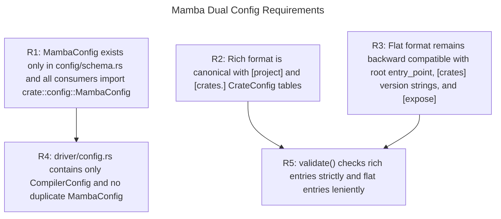
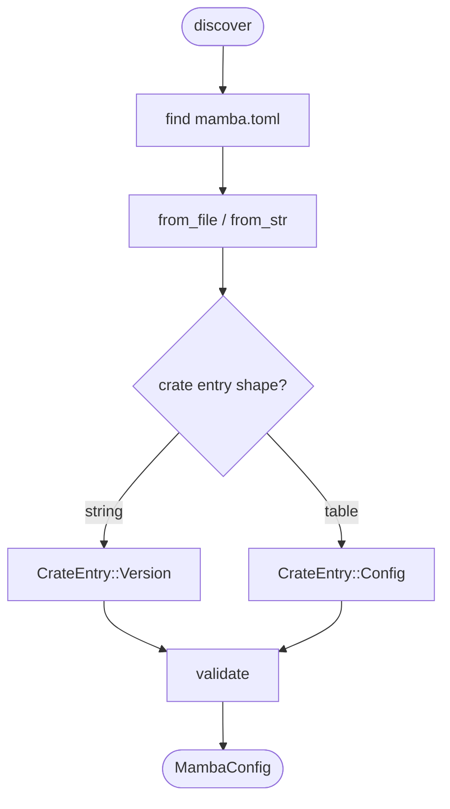
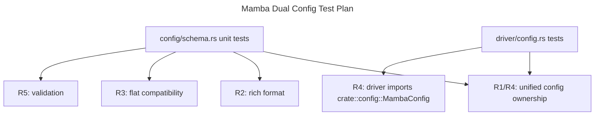

# 1134 Mamba Dual Config Spec

## Overview
<!-- type: overview lang: markdown -->

This spec unifies the two historical `MambaConfig` shapes. The canonical
definition lives in `config/schema.rs` and supports the richer `[project]` plus
`[crates.<key>]` table format, while preserving the older flat CLI format with
root `entry_point`, version-string `[crates]`, and top-level `[expose]`.

The duplicate `MambaConfig` in `driver/config.rs` is removed. Driver config keeps
only `CompilerConfig` and imports `MambaConfig` from `crate::config`.

## Requirements
<!-- type: requirements lang: mermaid -->



## Scenarios
<!-- type: scenarios lang: yaml -->

```yaml
scenarios:
  - id: rich-format-parses
    requirements: [R1, R2, R5]
    given: a mamba.toml with a project table and crates.pg sub-table
    when: MambaConfig::from_file parses it
    then: project.name is populated and crates.pg is CrateEntry::Config
  - id: flat-format-backward-compatible
    requirements: [R1, R3, R5]
    given: a mamba.toml with root entry_point and crates as version strings
    when: MambaConfig::from_file parses it
    then: entry_point returns the root value and crates entries are CrateEntry::Version
  - id: conductor-config-works
    requirements: [R2, R5]
    given: Conductor mamba.toml uses project and crates.cclab-schema-mamba sub-tables
    when: cclab mamba run discovers and parses the file
    then: no TOML parse error occurs and the rich format config is used
  - id: cli-uses-unified-config
    requirements: [R1, R4]
    given: cclab mamba run discovers mamba.toml
    when: driver config loads the project config
    then: it uses crate::config::MambaConfig, not a driver-local duplicate
  - id: entry-point-precedence
    requirements: [R2, R3]
    given: top-level entry_point and project.entry_point are both present
    when: MambaConfig::entry_point is called
    then: the top-level entry_point takes precedence
```

## Config Schema
<!-- type: schema lang: yaml -->

```yaml
$schema: "https://json-schema.org/draft/2020-12/schema"
$id: mamba-dual-config
title: MambaConfig
type: object
additionalProperties: false
properties:
  project:
    type: object
    properties:
      name: { type: string }
      version: { type: string }
      entry_point: { type: string }
  entry_point:
    type: string
    description: Flat-format entry point. Takes precedence over project.entry_point.
  crates:
    type: object
    additionalProperties:
      oneOf:
        - type: string
          description: Flat-format version string.
        - $ref: "#/$defs/CrateConfig"
  expose:
    type: object
    additionalProperties:
      type: array
      items: { type: string }
  build:
    type: object
  paths:
    type: object
$defs:
  CrateConfig:
    type: object
    additionalProperties: false
    properties:
      crate_name: { type: string }
      version: { type: string }
      path: { type: string }
      expose:
        type: array
        items: { type: string }
      module: { type: string }
```

## Loading Logic
<!-- type: logic lang: mermaid -->



## Test Plan
<!-- type: test-plan lang: mermaid -->



## Changes
<!-- type: changes lang: yaml -->

```yaml
changes:
  - path: crates/mamba/src/config/schema.rs
    action: modify
    impl_mode: hand-written
    description: >
      Unified MambaConfig with rich and flat format support, CrateEntry
      Version/Config variants, CrateConfig, ProjectConfig, BuildConfig,
      PathsConfig, and discover/from_file/from_str/entry_point/expose/validate
      helpers.
  - path: crates/mamba/src/config/mod.rs
    action: modify
    impl_mode: hand-written
    description: Re-export MambaConfig from the schema module.
  - path: crates/mamba/src/driver/config.rs
    action: modify
    impl_mode: hand-written
    description: >
      Remove duplicate MambaConfig; keep CompilerConfig with project_config:
      Option<MambaConfig> imported from crate::config.
  - path: crates/mamba/src/driver/mod.rs
    action: modify
    impl_mode: hand-written
    description: Re-export crate::config::MambaConfig for driver consumers.
```
