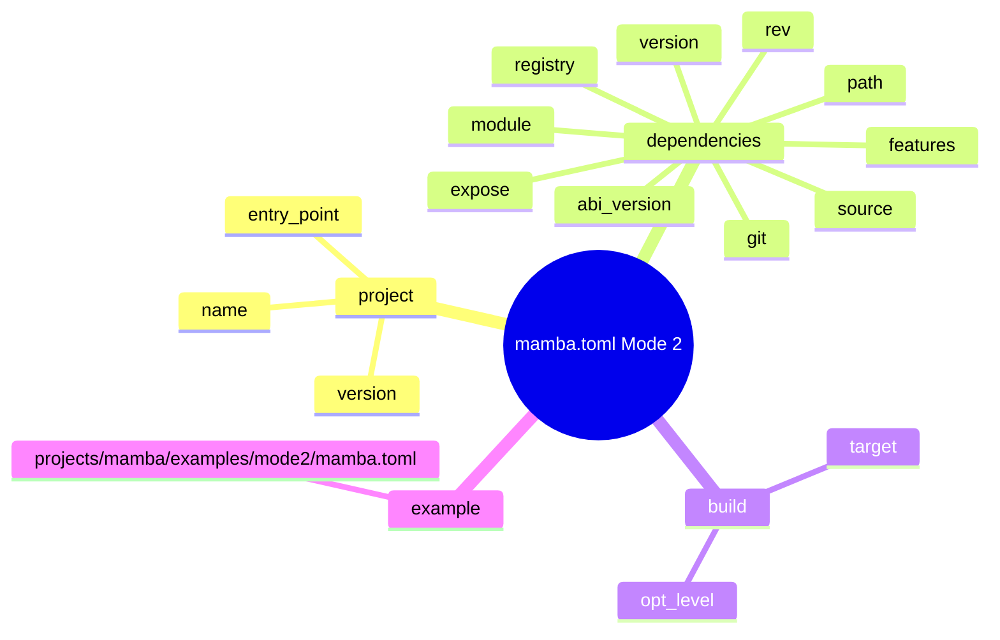
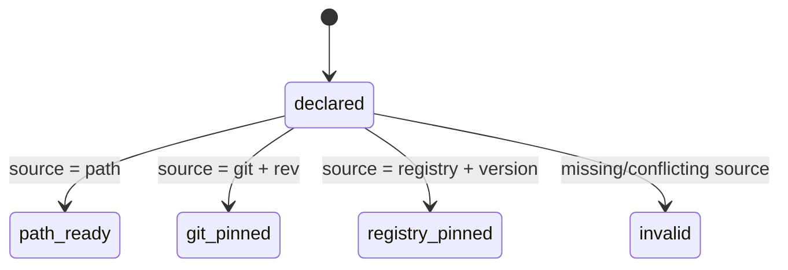
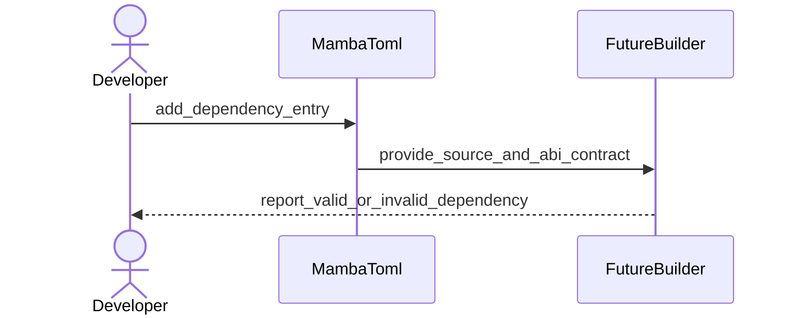
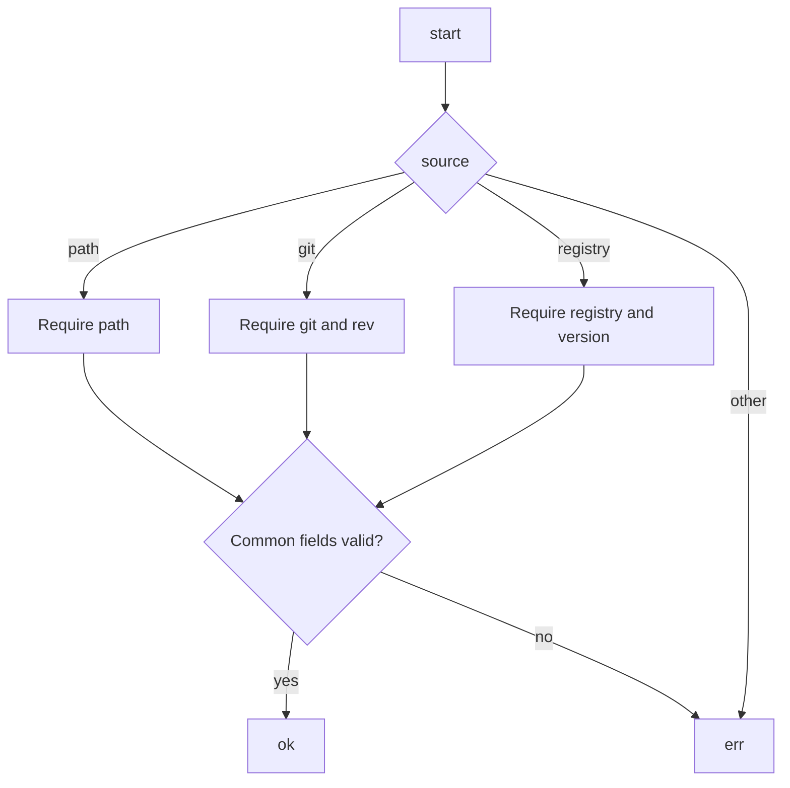
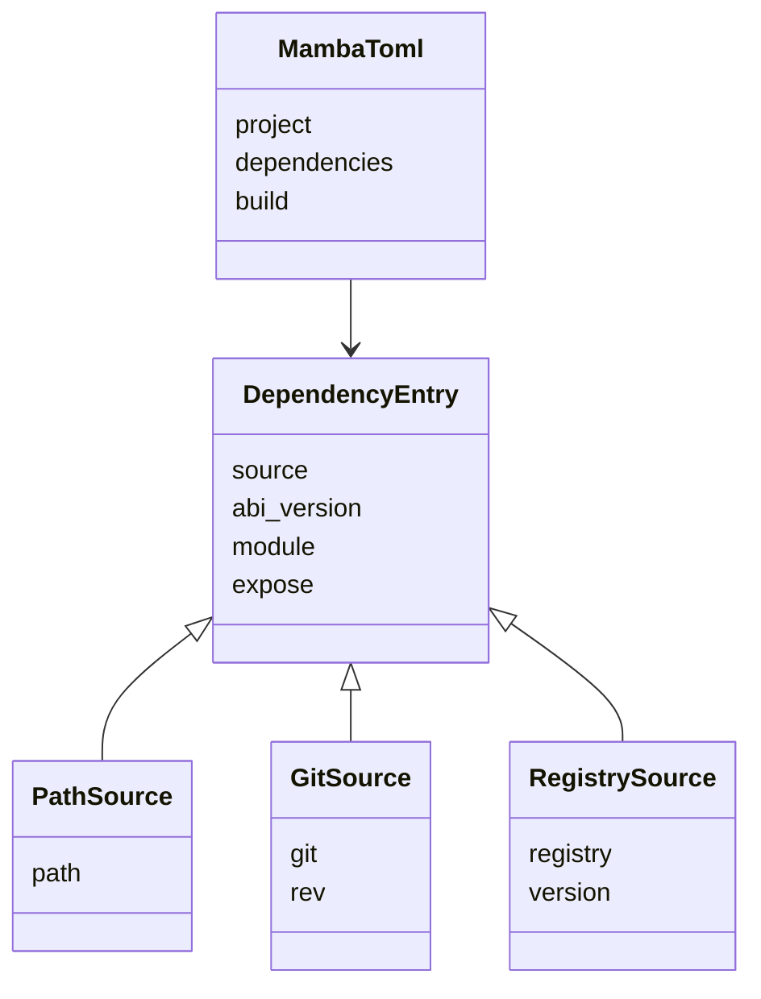
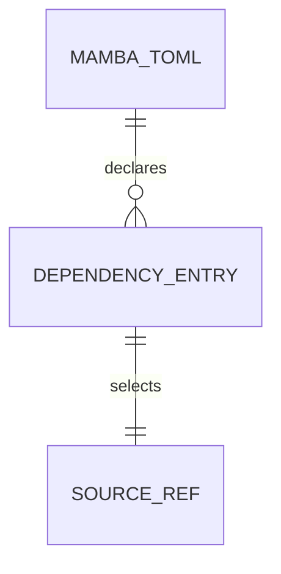

# Mambalibs Mode 2

## Mode 2 Config Scenarios
<!-- type: scenarios lang: yaml -->

```yaml
scenarios:
  - id: git-source-binding
    given: a project wants to link an external Rust binding crate
    when: mamba.toml contains a dependency with source git, git URL, rev, ABI version, module, and expose list
    then: the dependency entry is complete enough for follow-up build work to fetch and pin the crate
  - id: path-source-binding
    given: a project develops a local binding crate beside the Mamba project
    when: mamba.toml contains a dependency with source path and path value
    then: the dependency entry remains deterministic and does not require network fetch
  - id: registry-source-binding
    given: a future registry-backed binding is requested
    when: mamba.toml contains source registry, registry name, and version
    then: the schema records the deferred registry contract without requiring build support in this issue
```
## Mode 2 Config Map
<!-- type: mindmap lang: mermaid -->


## Dependency Source State Machine
<!-- type: state-machine lang: mermaid -->


## Config Authoring Interaction
<!-- type: interaction lang: mermaid -->


## Dependency Entry Validation Logic
<!-- type: logic lang: mermaid -->


## Config Dependency Types
<!-- type: dependency lang: mermaid -->


## Database Model
<!-- type: db-model lang: mermaid -->


## Mode 2 mamba.toml Schema
<!-- type: schema lang: yaml -->

```yaml
$schema: https://json-schema.org/draft/2020-12/schema
$id: mamba://schemas/mambalibs-mode-2
title: MambaTomlMode2
type: object
additionalProperties: false
properties:
  project:
    $ref: "#/$defs/Project"
  dependencies:
    type: object
    description: Native Rust binding crates linked into a project-local Mamba binary.
    additionalProperties:
      $ref: "#/$defs/DependencyEntry"
  build:
    $ref: "#/$defs/Build"
required:
  - project
  - dependencies
$defs:
  Project:
    type: object
    additionalProperties: false
    required: [name, version, entry_point]
    properties:
      name: { type: string, minLength: 1 }
      version: { type: string, pattern: "^[0-9]+\\.[0-9]+\\.[0-9]+.*$" }
      entry_point: { type: string, minLength: 1 }
  Build:
    type: object
    additionalProperties: false
    properties:
      target: { type: string, enum: [native, wasm32] }
      opt_level: { type: integer, minimum: 0, maximum: 3 }
  DependencyEntry:
    type: object
    additionalProperties: false
    required: [source, abi_version, module, expose]
    properties:
      source: { type: string, enum: [path, git, registry] }
      path: { type: string, minLength: 1 }
      git: { type: string, format: uri }
      rev: { type: string, minLength: 1 }
      version: { type: string, minLength: 1 }
      registry: { type: string, minLength: 1, default: mamba }
      crate: { type: string, minLength: 1 }
      module: { type: string, minLength: 1 }
      expose:
        type: array
        minItems: 1
        items: { type: string, minLength: 1 }
      features:
        type: array
        items: { type: string, minLength: 1 }
        default: []
      default_features: { type: boolean, default: true }
      abi_version:
        type: string
        description: cclab-mamba-registry ABI major/minor version required by the binding crate.
        pattern: "^[0-9]+\\.[0-9]+$"
    allOf:
      - if:
          properties: { source: { const: path } }
        then:
          required: [path]
          not:
            anyOf:
              - required: [git]
              - required: [version]
      - if:
          properties: { source: { const: git } }
        then:
          required: [git, rev]
          not:
            anyOf:
              - required: [path]
              - required: [version]
      - if:
          properties: { source: { const: registry } }
        then:
          required: [registry, version]
          not:
            anyOf:
              - required: [path]
              - required: [git]
```
## REST API
<!-- type: rest-api lang: yaml -->

```yaml
openapi: 3.1.0
info:
  title: Not applicable
  version: 0.0.0
paths: {}
x-score-applicability: not_applicable
```
## RPC API
<!-- type: rpc-api lang: yaml -->

```yaml
openrpc: 1.3.2
info:
  title: Not applicable
  version: 0.0.0
methods: []
x-score-applicability: not_applicable
```
## Async API
<!-- type: async-api lang: yaml -->

```yaml
asyncapi: 2.6.0
info:
  title: Not applicable
  version: 0.0.0
channels: {}
x-score-applicability: not_applicable
```
## CLI
<!-- type: cli lang: yaml -->

```yaml
commands: []
x-score-applicability: not_applicable
reason: Follow-up issues own mamba build fetch and workspace synthesis behavior.
```
## Wireframe
<!-- type: wireframe lang: yaml -->

```yaml
layout: none
x-score-applicability: not_applicable
```
## Component
<!-- type: component lang: yaml -->

```yaml
components: []
x-score-applicability: not_applicable
```
## Design Tokens
<!-- type: design-token lang: yaml -->

```yaml
tokens: {}
x-score-applicability: not_applicable
```
## Mode 2 mamba.toml Config
<!-- type: config lang: yaml -->

```yaml
format: toml
file: mamba.toml
tables:
  project:
    required: true
    keys:
      name: string
      version: semver
      entry_point: relative-path
  dependencies:
    required: true
    kind: table-map
    key: dependency-alias
    value: DependencyEntry
dependency_entry:
  common_required:
    - source
    - abi_version
    - module
    - expose
  source_variants:
    path:
      required: [path]
      forbidden: [git, version]
    git:
      required: [git, rev]
      forbidden: [path, version]
    registry:
      required: [registry, version]
      forbidden: [path, git]
  optional:
    - crate
    - features
    - default_features
defaults:
  registry: mamba
  features: []
  default_features: true
compatibility:
  legacy_crates_table: Existing [crates] support remains a compatibility surface and is not the Mode 2 contract.
```
## Test Plan
<!-- type: test-plan lang: mermaid -->

```mermaid
---
id: mambalibs-mode-2-test-plan
---
requirementDiagram
  requirement SCHEMA {
    id: SCHEMA
    text: "TD defines source, git rev, features, registry, and ABI version"
  }
  requirement EXAMPLE {
    id: EXAMPLE
    text: "Repository contains a minimal Mode 2 mamba.toml example"
  }
  requirement COMPAT {
    id: COMPAT
    text: "Existing legacy [crates] config remains outside this Mode 2 contract"
  }
  test TD_CHECK {
    id: TD_CHECK
    type: inspection
  }
  test EXAMPLE_FILE {
    id: EXAMPLE_FILE
    type: inspection
  }
  SCHEMA - verifies -> TD_CHECK
  EXAMPLE - verifies -> EXAMPLE_FILE
  COMPAT - verifies -> TD_CHECK
```
## Changes
<!-- type: changes lang: yaml -->

```yaml
changes:
  - path: .aw/tech-design/projects/mamba/config/mambalibs-mode-2.md
    action: create
    impl_mode: hand-written
    description: Normative TD contract for Mode 2 mamba.toml dependency schema.
  - path: projects/mamba/examples/mode2/mamba.toml
    action: create
    impl_mode: hand-written
    description: Minimal example showing a git-sourced external binding crate with rev, features, registry, and ABI version.
```
## Manifest
<!-- type: manifest lang: yaml -->

```yaml
manifests:
  - path: projects/mamba/examples/mode2/mamba.toml
    kind: mamba
    purpose: Mode 2 external binding crate example
    dependencies:
      acme:
        source: git
        registry: mamba
        abi_version: "0.1"
```
## Tests
<!-- type: tests lang: yaml -->

```yaml
tests:
  - id: td-check
    kind: command
    command: aw td check .aw/tech-design/projects/mamba/config/mambalibs-mode-2.md
  - id: example-file-present
    kind: file-exists
    path: projects/mamba/examples/mode2/mamba.toml
  - id: example-covers-required-fields
    kind: text-contains
    path: projects/mamba/examples/mode2/mamba.toml
    contains:
      - "[dependencies.acme]"
      - "source = \"git\""
      - "rev ="
      - "features ="
      - "registry = \"mamba\""
      - "abi_version = \"0.1\""
```

# Reviews

### Review 1
**Verdict:** approved

- [schema] Mode 2 dependency entries define the requested source, git rev, features, registry, and ABI version fields with path/git/registry source variants.
- [config] The spec explicitly separates the new [dependencies] Mode 2 contract from legacy [crates] compatibility.
- [changes] The changes section includes both the normative TD and the required minimal mamba.toml example.
