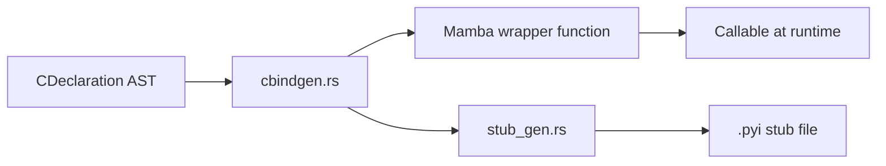

# FFI: Binding Generation and Stubs

## Overview
<!-- type: overview lang: markdown -->

This specification defines the C binding generator and the Python-style type stub
generator for the Mamba FFI subsystem.

- `ffi/cbindgen.rs` (~155 LOC): Generates Mamba-callable wrappers for C functions.
  Creates extern declarations with argument and return value marshaling code.
- `ffi/stub_gen.rs` (~330 LOC): Generates `.pyi`-style type stubs for FFI functions.
  Produces function signatures with proper type annotations for IDE support.

## Requirements
<!-- type: overview lang: markdown -->

### R1 - Generate Mamba-Callable Wrappers

```yaml
id: R1
priority: high
```

Given a `CDeclaration::Function`, generate a Mamba wrapper function that:
1. Declares an `extern` linkage to the C symbol.
2. Accepts Mamba-typed arguments matching the mapped parameter types.
3. Calls the underlying C function with converted arguments.
4. Returns the converted result.

### R2 - Argument Marshaling Code Generation

```yaml
id: R2
priority: high
```

Generate marshaling code to convert Mamba values to C-compatible representations
before the FFI call:

| Mamba Type | Marshaling Action |
|------------|-------------------|
| `str` | Encode to null-terminated `CString` |
| `i64` | Cast to C `int` / `long` as appropriate |
| `f64` | Cast to C `double` or `float` |
| `list[T]` | Allocate C array buffer, copy elements |
| `dict` | Pack fields into C struct layout |

### R3 - Return Value Marshaling

```yaml
id: R3
priority: high
```

Generate marshaling code to convert C return values back to Mamba types:

| C Return Type | Marshaling Action |
|---------------|-------------------|
| `char*` | Decode from null-terminated C string to Mamba `str` |
| `int` | Widen to Mamba `i64` |
| `struct S*` | Unpack fields into Mamba `dict` |
| `void` | Return `None` |

### R4 - Type Stub Generation for IDE Support

```yaml
id: R4
priority: medium
```

Generate `.pyi`-style stub files containing:
- Function signatures with Mamba type annotations for all parameters and return type.
- Docstrings extracted from C header comments (if present).
- Module-level `__all__` list enumerating exported symbols.

Stubs are written to `<module_name>.pyi` alongside the generated wrapper module.

### R5 - Error Handling Wrapper Generation

```yaml
id: R5
priority: high
```

Wrap each FFI call with error handling that converts C-level failures to Mamba
exceptions:
- Non-zero return codes raise `FFIError` with the return code.
- NULL pointer returns raise `FFIError("null pointer returned")`.
- Errno-based functions check `errno` after the call and raise `OSError`.

## Acceptance Criteria
<!-- type: test_plan lang: markdown -->

### Scenario: Generate wrapper for simple C function

- **GIVEN** A parsed `CDeclaration` for `double sqrt(double x);`
- **WHEN** `cbindgen` generates the wrapper.
- **THEN** The output is a Mamba function `def sqrt(x: float) -> float` that
  calls the C `sqrt` via extern linkage.

### Scenario: Stub file for math library

- **GIVEN** Wrappers generated for `sqrt`, `sin`, `cos`.
- **WHEN** `stub_gen` produces the `.pyi` file.
- **THEN** The stub contains typed signatures for all three functions and an
  `__all__` list.

### Scenario: Error wrapping for NULL return

- **GIVEN** A C function `char* get_name(int id);` that may return NULL.
- **WHEN** The generated wrapper is called and C returns NULL.
- **THEN** An `FFIError("null pointer returned")` exception is raised.

## Diagrams
<!-- type: overview lang: markdown -->

### Binding Generation Flow


